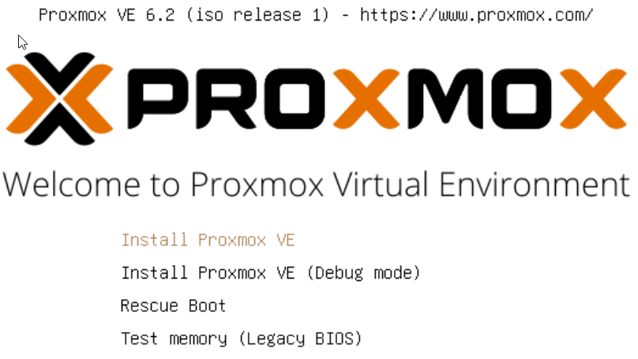
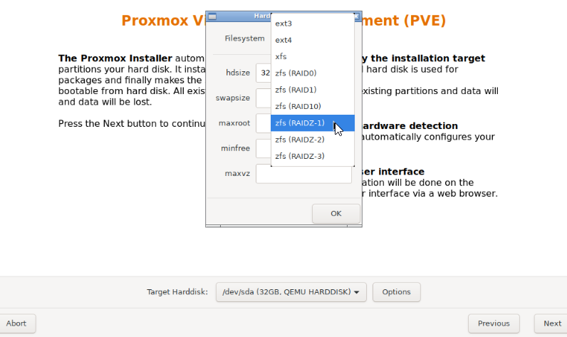
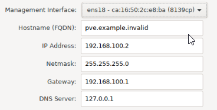
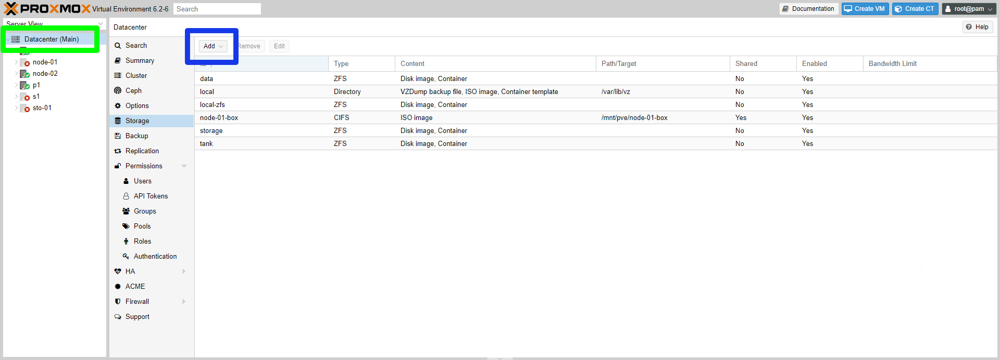

## Introduction

Proxmox VE is a Type 1 Hypervisor, that uses KVM for full VMs, and LXC for containers. It is fully open source, however, it requires a license to access the enterprise repositories. For the purpose of this tutorial, we will enable the non-subscription repositories for use by people without a license. The only downside of this is that package updates are usually slower to arrive to this repository.

**Prerequisites**

- Ideally, you will want to have bought a server with two similar drives or more. This will allow you to configure ZFS or other raid systems in a redundant fashion, so you do not lose data in the event of a drive failure.

- For VMs, you may also want them to have their own external IP addresses. For this, I recommend the purchase of a subnet, however, individual IPs will also suffice.

- You will also want to choose a server with a CPU that allows virtualization. All of Hetzner's dedicated servers support this, with the notable exception of their Athlon based auction servers.

## Step 1 - Initial Server Setup

To start the installation, we will need to be in the [Rescue System](https://docs.hetzner.com/robot/dedicated-server/troubleshooting/hetzner-rescue-system/). If you have just ordered the server, it is highly likely you are already booted into it. If not, you can enter it by navigating to the `Rescue` tab of your server in the [Hetzner Robot Panel](https://robot.your-server.de/), and selecting "Linux x64". When you confirm this selection, you will be presented with the password for the [Rescue System](https://docs.hetzner.com/robot/dedicated-server/troubleshooting/hetzner-rescue-system/). Please make a note of this. Once you have, you can navigate to the Reset tab, and execute an "Automatic Hardware Reset", which will reboot the server into the [Rescue System](https://docs.hetzner.com/robot/dedicated-server/troubleshooting/hetzner-rescue-system/). You can now open an SSH session to your server to proceed with installation.

### Step 1.1 - Setting up the VM

Now we need to set up the VM that we use as a pseudo-server to install Proxmox onto. First we need to open an SSH session to the server. You can do this by using an SSH client of your choice. Most OS's will have a client preinstalled, that you can access from the terminal. You can do that by opening CMD or Terminal, depending on the OS, and running the following command:

```bash
ssh root@<10.0.0.1> # Replace <10.0.0.1> with the main IP of your server
```

Then, we need to get the installation ISO. You can use the preinstalled tool `wget` to download the ISO. Visit the downloads page [here](http://download.proxmox.com/iso/), and copy the link to the latest download. Then run the following command:

```bash
wget <downloadURL> # Replace <downloadURL> with the URL you copied
```

The command to run the VM will be different for every server. It is mostly dependent on the amount of drives you have. To see the names of all your drives, run the `lsblk` command. For every drive in your system, you will need to add another `-drive ` flag to the command. The syntax is as follows:

```bash
-drive file=/dev/<DiskName>,format=raw,media=disk
```

An example of the completed command may look like:

```bash
qemu-system-x86_64 -enable-kvm -smp 4 -m 4096 -boot d -cdrom ./<ISOName> -drive file=/dev/sda,format=raw,media=disk -drive file=/dev/sdb,format=raw,media=disk -vnc 127.0.0.1:1
```

This would be the installation command for a server with two drives, `/dev/sda` and `/dev/sdb`. You will also have to replace `<ISOName>` with the full name of the ISO you just downloaded.

If you are using many drives, sometimes Qemu can give some errors about IDE not being supported. The error will look something like this:

```bash
qemu-system-x86_64: -drive file=/dev/sdd,format=raw,media=disk,if=mtd: machine type does not support if=mtd,bus=0,unit=0
```

To alleviate this issue, simply add `,if=virtio` to the offending drive. In this case, its `/dev/sdd`, so you would change the drive parameter in the Qemu run command to look like this:

```bash
-drive file=/dev/sdd,format=raw,media=disk,if=virtio
```

Please note, this will change the drive name within the VM to a virtual device, E.g.  `/dev/vda`. This is fine for ZFS, since the data for the pool is on the drive and ZFS will recognize where the drive is meant to go when it becomes `/dev/sdd` again after the install. If you are using other RAID software or mounting the drive by its name, please consider that the drive will be called something else after the install.

Now that the VM is running, you need to access it. For security, the VNC access port is bound locally, so you will need to use an SSH tunnel to access it. You can open one by running the following command in a local CMD/Terminal:

```bash
ssh -L 8888:127.0.0.1:5901 root@<10.0.0.1> # Replace <10.0.0.1> with the main IP of your server
```

Then, with the VNC client of your choice, connect with the host `127.0.0.1` and the port `8888`. You will be able to see your VM.

## Step 2 - Installing Proxmox

After the installer is loaded, press Enter to start the installation process.



The first thing you will want to do is to configure the storage. For this tutorial, I will be installing Proxmox onto a ZFS based storage pool. I am using RAIDZ-1 to have one drive's worth of redundancy. You may want to select mirror if you only have two drives. You can read up on ZFS Raid levels [here](http://www.zfsbuild.com/2010/05/26/zfs-raid-levels/).



After that, you can fill out other information about you and your server. Please be sure to select a sufficiently secure password. For the network configuration, your server should automatically get the correct information using DHCP, but you will want to check this against the intended Main IP in the [Hetzner Robot Panel](https://robot.your-server.de/), as sometimes DHCP can hand out an additional IP instead.



Once Proxmox is installed, just press reboot and let it boot into Proxmox.

Next, we need to configure the network for Proxmox. Open another SSH console to your server, and run `ip a`. This will show you the different network adapters you have available to you. The one you will want to use will most likely be called `eth0` but in the case you have multiple network adapters, pick the adapter name you want to use for the Proxmox management network. Then, run the following command:

```bash
udevadm info -q all -p /sys/class/net/<Adapter Name> | grep ID_NET_NAME # Replace <Adapter Name> with the chosen adapter
```

The output will look something like:

```bash
E: ID_NET_NAME_MAC=enxc8600056a410
E: ID_NET_NAME_PATH=enp4s0
```

This shows us that the network name Proxmox is meant to be using is `enp4s0`. However, because the server is being virtualized, this is being shown to Proxmox as `ens3`, and once we boot into Proxmox outside of the VM, the network will break. We can fix this by logging into Proxmox and changing the network configuration. Go back to your VNC console, and login with the username `root` and the password you used to install Proxmox with. Then, open `/etc/network/interfaces`. You can use a tool like `nano` to do this, E.g. `nano /etc/network/interfaces` It will look something like:

```bash
auto lo
iface lo inet loopback

iface ens3 inet manual

auto vmbr0
iface vmbr0 inet static
        address 10.0.0.1
        netmask 255.255.255.255
        gateway 10.0.0.255
        bridge_ports ens3
        bridge_stp off
        bridge_fd 0
```

You can see that Proxmox is trying to configure `ens3`, which doesn't exist. Simply replace all instances of `ens3` with the network adapter name you predicted earlier, like `enp4s0`. It will end up looking like:

```bash
auto lo
iface lo inet loopback

iface enp4s0 inet manual

auto vmbr0
iface vmbr0 inet static
        address 10.0.0.1
        netmask 255.255.255.255
        gateway 10.0.0.255
        bridge_ports enp4s0
        bridge_stp off
        bridge_fd 0
```

Then, you can reboot after saving the file by sending an automatic hardware reset, and then you can access Proxmox like you would normally, via SSH or from the Web GUI.

## Step 3 - Enabling Non-Subscription Sources (Optional)

If you have a Proxmox license, you can skip this step and add your license in the Proxmox panel. Otherwise, to receive updates, you will need to use the non-subscription sources. First, disable the enterprise repository by commenting out the only line in `/etc/apt/sources.list.d/pve-enterprise.list`. You can use a tool like `nano` to edit files, by running commands like `nano /etc/apt/sources.list.d/pve-enterprise.list`. The file should end up looking like:

```bash
# deb https://enterprise.proxmox.com/debian/pve buster pve-enterprise
```

Then, we need to add the new sources. Add the following lines to `/etc/apt/sources.list`:

```bash
deb http://download.proxmox.com/debian buster pve-no-subscription
```

Then, we can update sources and upgrade the server:

```bash
apt-get update
apt-get dist-upgrade -y
```

## Step 4 - Configuring the Network

Hetzner employs a Routed model in their data centres. This means that they block traffic coming from foreign or unknown MAC addresses, so that people cannot use IPs that are not assigned to them. This means that you either have to request separate MAC addresses, or route the traffic through the host. Since you cannot get custom MAC addresses for IPs in a Subnet, I will show you how to route your IPs through the host. This means that you will never have to worry about MAC addresses on any of your VMs

### Step 4.1 - Enabling forwarding

To enable forwarding of IPv4 and IPv6 addresses, you need to add the following lines to `/etc/sysctl.conf`

```bash
net.ipv4.ip_forward=1
net.ipv6.conf.all.forwarding=1
```

You can then run `sysctl -p` to make these changes take effect.

### Step 4.2 - Creating Bridges

For each IP Subnet, you will need to create a new bridge. For additional IPs, you will only need one bridge for them all. For this example, I will use the additional subnet `10.0.2.0/29`. This represents 8 IP addresses, 6 of which are usable, but one will be used by the bridge, leaving only 5 for VMs. To create the bridge, add the following configuration to `/etc/network/interfaces`. You can use a tool like `nano` to edit files, by running commands like `nano /etc/network/interfaces`.

```bash
auto vmbr0
iface vmbr0 inet static
        address 10.0.2.1
        netmask 255.255.255.248
        bridge-ports none
        bridge-stp off
        bridge-fd 0
```

The IP `10.0.2.1` is now in use by the bridge to act as the gateway. To add IPv6 networking, you will have to be somewhat more careful. If you only have one subnet, but will need to create multiple bridges for your multiple subnets, or subnets and additional IPs, you will need to split your IPv6 subnet into smaller blocks. By default, you get a /64 block. If you only have one bridge, you can use the whole block, but for this tutorial, I will assume you have multiple bridges, so I will assign smaller, but still very large, /96 blocks to each bridge. If you only have one bridge, simple replace /96 with /64.

For the following configurations, I will assume an IPv6 block of `2a01:4f8:8:8/64`. To add IPv6 to a bridge, add the following configuration:

```bash
iface vmbr0 inet6 static
        address 2a01:4f8:8:8:0:1:0:2
        netmask 96
        up ip -6 route add 2a01:4f8:8:8:0:1::/96 dev vmbr0

```

Again, an IP address is used as a gateway, that cannot be used again on a VM. For each bridge, increment the number suffixing `vmbr` by 1, like `vmbr1` and `vmbr2`.  

For additional IPs, the following bridge configuration can be used:

```bash
auto vmbr1
iface vmbr1 inet static
        address <10.0.0.1> # Replace <10.0.0.1> with the main IP
        netmask 255.255.255.255
        bridge_ports none
        bridge_stp off
        bridge_fd 0
        up ip route add <additional ip 1>/32 dev vmbr0
        up ip route add <additional ip 2>/32 dev vmbr0
```

For each additional IP, you will have to add another `up ip route add <additional ip>/32 dev vmbr0` line to the bridge. Adding IPv6 networking to this bridge is the same as with a subnet.

To apply these network configurations, you can simply reboot by typing `reboot` at the terminal.

### Step 4.3 - Network configuration inside the VM

Since we are using bridges, the network details needed to connect the IP will be different to the details in the [Hetzner Robot Panel](https://robot.your-server.de/). For IPv4 subnets, you can use the following details:

| Field   | Value                    | Description                                                  |
| ------- | ------------------------ | ------------------------------------------------------------ |
| IP      | `10.0.2.2`               | Where `10.0.0.2` is a usable IP not being used by the bridge |
| Gateway | `10.0.2.1`               | Where `10.0.2.1` is IP being used by the bridge              |
| Netmask | `255.255.255.248` or /29 | The same as your ordered subnet                              |

For additional IPs, you can use these details:

| Field   | Value                    | Description                             |
| ------- | ------------------------ | --------------------------------------- |
| IP      | ``10.0.0.27``            | Where `10.0.0.27` is a an additional IP |
| Gateway | `10.0.0.1`               | Where `10.0.0.1` is the main host IP    |
| Netmask | `255.255.255.255` or /32 |                                         |

For IPv6, irrespective of the bridge being used on additional IPs or subnets, you can use these details:

| Field   | Value                  | Description                                                  |
| ------- | ---------------------- | ------------------------------------------------------------ |
| IP      | `2a01:4f8:8:8:0:1:0:3` | Where `2a01:4f8:8:8:0:1:0:3` is an address in the subnets block, not being used by the bridge |
| Gateway | `2a01:4f8:8:8:0:1:0:2` | Where `2a01:4f8:8:8:0:1:0:2` is the address being used by the bridge |
| Netmask | `ffff:ffff::` or /96   | Or `ffff:ffff:ffff:ffff::` or /64 depending on how you have split up your block. |

## Step 5 - Adding your storage box as an ISO repository (Optional)

If you don't have access to a storage box, you can skip this step.

Since you now have your complementary storage box setup, you may as well use it for your ISOs. To do this, log into the web interface at `https://<10.0.0.1>:8006`, where `<10.0.0.1>` is your main IP, and select Datacentre on the left hand pane (green box). Then navigate to storage, and press Add CIFS (blue box).



Type in the details from the [Hetzner Robot Panel](https://robot.your-server.de/), and press Add. Once that's done, you will have a new storage visible on your server. If you navigate into the backup box, you will see a folder called `template` has been made. Another folder called `iso` is in there, and that's where you can upload your ISOs.

## Step 6 - Installing Docker

Now that Proxmox is installed, you can install [Docker](https://www.docker.com/). This will allow you to make more containers and utilise the huge repository of images available for [Docker](https://www.docker.com/).

### Step 6.1 - Installation

To install [Docker](https://www.docker.com/), run the following commands on your server:

```bash
apt install -y apt-transport-https ca-certificates curl gnupg2 software-properties-common
curl -fsSL https://download.docker.com/linux/debian/gpg | apt-key add -
apt-key fingerprint 0EBFCD88
add-apt-repository "deb [arch=amd64] https://download.docker.com/linux/debian $(lsb_release -cs) stable"
apt update
apt install docker-ce -y
```

### Step 6.2 - Configuring ZFS Storage Driver

For Docker to work properly on this ZFS server, we need to enable the ZFS storage driver for Docker. First, run the following commands:

```bash
systemctl stop docker
rm -rf /var/lib/docker
zfs create -o mountpoint=/var/lib/docker rpool/docker
mkdir /etc/systemd/system/docker.service.d
```

This will put all the docker data onto a new ZFS volume. Next, we need to create the file `/etc/systemd/system/docker.service.d/storage-driver.conf` and add the following to it:

```bash
[Service]
ExecStart=
ExecStart=/usr/bin/dockerd --storage-driver=zfs -H fd://
```

Finally, reboot docker by running the following commands:

```bash
systemctl daemon-reload
systemctl start docker
```

## Conclusion

Now that you have the power of Docker, LXC and KVM containers at your disposal, go ahead and build whatever kind of infrastructure you want.

##### License: MIT

<!--

Contributor's Certificate of Origin

By making a contribution to this project, I certify that:

(a) The contribution was created in whole or in part by me and I have
    the right to submit it under the license indicated in the file; or

(b) The contribution is based upon previous work that, to the best of my
    knowledge, is covered under an appropriate license and I have the
    right under that license to submit that work with modifications,
    whether created in whole or in part by me, under the same license
    (unless I am permitted to submit under a different license), as
    indicated in the file; or

(c) The contribution was provided directly to me by some other person
    who certified (a), (b) or (c) and I have not modified it.

(d) I understand and agree that this project and the contribution are
    public and that a record of the contribution (including all personal
    information I submit with it, including my sign-off) is maintained
    indefinitely and may be redistributed consistent with this project
    or the license(s) involved.

Signed-off-by: Kenzi Marcel - kenzi@kenzim.co.uk

-->
