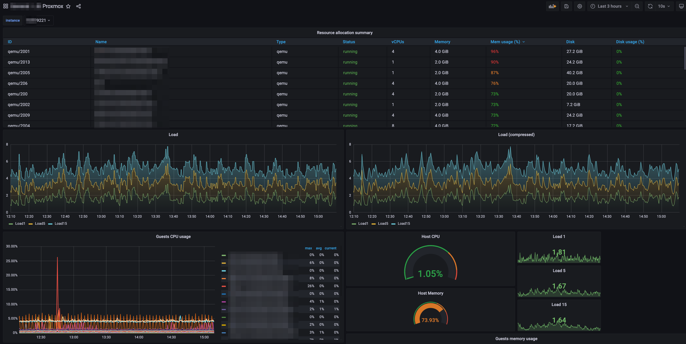

## Introduction

With the help of a specific exporter, which queries the Proxmox API in the background, an existing Prometheus (and Grafana) stack can scrape data about your Proxmox environment.

At the end of this tutorial, we will be able to gather metrics about CPU, RAM, disk and network ressources, aswell of guests (CTs or VMs) via Prometheus. With an Grafana dashboard you can view these metrics.

**Prerequisites**

This tutorial does not cover the installation of Proxmox and Prometheus itself. See this [tutorial](/tutorials/install-and-configure-prometheus-stack) for installing the Prometheus stack and [this](/tutorials/install-and-configure-proxmox_ve) for Proxmox installation.

This tutorial has been tested on Debian 10 and 11.

* Hetzner bare-metal server
* functional Proxmox installation
* functional Prometheus stack
* Running SSH session  as root

The exporter itself can wether be started at Proxmox node itself or on another machine. **For this tutorial we assume the exporter will run on the Proxmox node.** 

## Step 1 - Create Proxmox read-only API user 

We will create a dedicated Proxmox user because anonymous data collection is not permitted. This user will have read-only permissions. 

Log in on your proxmox host and ensure you´re working as root

```bash
$ pveum user add pve-exporter@pve -comment "PVE-Exporter" -password <secure passphrase or password>
$ pveum aclmod / -user pve-exporter@pve -role PVEAuditor
```

## Step 2 - Create linux user

For running the exporter as daemon / systemd unit we create an dedicated user. 

```bash
$ useradd -c "pve exporter" -m -s /bin/false pve-exporter
```

## Step 3 - Install package and python dependencies

The pve exporter is written in Python and we will install it within a so called venv (virtual environment). The use of such a venv makes python dependency handling much easier compared to regular installation with pip. 

There are a few debian packages needed to ensure a proper installation process of the venv itself and the pve exporter.

```bash
$ apt-get update && apt-get install python3-venv python3-setuptools python3-dev python3-pip libffi-dev libssl-dev build-essential -y
```


## Step 4 - Create and activate venv, install prometheus-pve-exporter

We will create the mentioned venv and install the package prometheus-pve-exporter from [PyPi](https://pypi.org/project/prometheus-pve-exporter/)


```bash
$ python3 -m venv /opt/prometheus-pve-exporter
$ source /opt/prometheus-pve-exporter/bin/activate
```

Check if `(prometheus-pve-exporter)` is present at front of your command line prompt before executing the next command.

```bash
(prometheus-pve-exporter) $ pip install prometheus-pve-exporter
```

On Debian 10 may an error message (`Failed to build proxmoxer`) is displayed. This is not an issue, verify everthing has been installed by executing the command again. It should finish in very short time and all lines should begin with "Requirement already satisfied". 

Finally leave the venv by executing `deactivate`

```bash
(prometheus-pve-exporter) $ deactivate
$ 
```

## Step 5 - Configure prometheus-pve-exporter

Place the previously created credentials for Proxmox user `pve-exporter` in a .yml file.
```bash
$ mkdir -p /etc/prometheus
$ cat <<EOF > /etc/prometheus/pve.yml
default:
    user: pve-exporter@pve
    password: <secure passphrase or password>
    # only needed when you not configured Lets Encrypt 
    # verify_ssl: false
EOF
$ chown root.pve-exporter /etc/prometheus/pve.yml
$ chmod 640 /etc/prometheus/pve.yml
```

## Step 6 - Configure systemd unit for prometheus-pve-exporter

Place service unit to /etc/systemd/system.
```bash
$ cat <<EOF> /etc/systemd/system/prometheus-pve-exporter.service
[Unit]
Description=Prometheus exporter for Proxmox VE
Documentation=https://github.com/znerol/prometheus-pve-exporter

[Service]
Restart=always
User=pve-exporter
ExecStart=/opt/prometheus-pve-exporter/bin/pve_exporter /etc/prometheus/pve.yml

[Install]
WantedBy=multi-user.target
EOF
```

Reload SystemD, start and enable the service.

```bash
$ systemctl daemon-reload 
$ systemctl start prometheus-pve-exporter.service
$ systemctl enable prometheus-pve-exporter.service
```

Verify the tcp port 9221 (which is the default) is open:
```bash
$ ss -lntp | grep 9221
LISTEN 0      128          0.0.0.0:9221      0.0.0.0:*    users:(("pve_exporter",pid=7539,fd=3))
```

In some configurations it is neccessary to note the IP address in front of :9221. You will need it in the next step. Normally pve-exporter binds to 0.0.0.0 which means that you can reach the exporter over every interface.

## Step 7 - Test functionality 

Access the endpoint which provide the metrics via cURL.

```bash
$ curl -s localhost:9221/pve
```

Check output of cURL commmand, at the end there should be a line like this

```bash
...
# HELP pve_version_info Proxmox VE version info
# TYPE pve_version_info gauge
pve_version_info{release="6.4",repoid="9f411e79",version="6.4-13"} 1.0
```

## Step 8 - Extend your Prometheus configuration

Extend the `scrape_config` area in your existing Prometheus configuration with the following lines:

```bash
your-prometheus-host $ vim /etc/prometheus/prometheus.yml

  - job_name: 'pve-exporter'
    static_configs:
      - targets:
        - your-proxmox-host:9221
    metrics_path: /pve
    params:
      module: [default]

your-prometheus-host $ systemctl restart prometheus
```

## Step 9 - Import the corresponding Grafana dashboard

Log in to your Grafana instance, navigate to `Dashboards`, press the import button, insert the ID `10347` and click load.

You can find the dashboard here:
[https://grafana.com/grafana/dashboards/10347](https://grafana.com/grafana/dashboards/10347)


## Conclusion



With the great [prometheus-pve-exporter](https://github.com/prometheus-pve/prometheus-pve-exporter) we have a simple and powerful tool which allows us to see which guests on the proxmox node take how much ressources. Besides it provides general overview of proxmox host system health (Storage usage, Space allocation, ...). 

##### License: MIT

<!--

Contributor's Certificate of Origin

By making a contribution to this project, I certify that:

(a) The contribution was created in whole or in part by me and I have
    the right to submit it under the license indicated in the file; or

(b) The contribution is based upon previous work that, to the best of my
    knowledge, is covered under an appropriate license and I have the
    right under that license to submit that work with modifications,
    whether created in whole or in part by me, under the same license
    (unless I am permitted to submit under a different license), as
    indicated in the file; or

(c) The contribution was provided directly to me by some other person
    who certified (a), (b) or (c) and I have not modified it.

(d) I understand and agree that this project and the contribution are
    public and that a record of the contribution (including all personal
    information I submit with it, including my sign-off) is maintained
    indefinitely and may be redistributed consistent with this project
    or the license(s) involved.

Signed-off-by: Jan S. jan@js94x.de

-->
