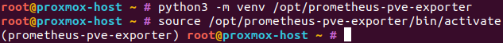
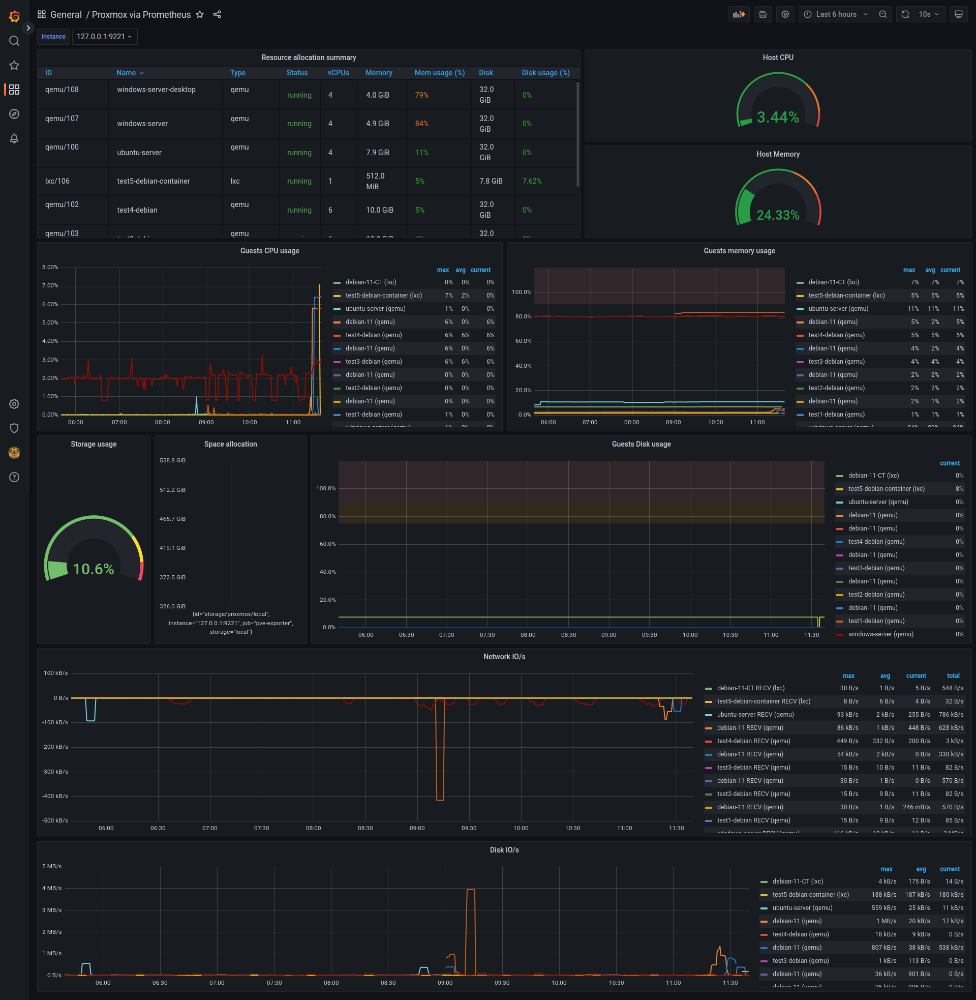

## Introduction

With the help of a specific exporter, which queries the Proxmox VE API in the background, an existing Prometheus (and Grafana) stack can scrape data about your Proxmox VE environment.

At the end of this tutorial, we will be able to gather metrics about CPU, RAM, disk and network resources of guests (containers or virtual machines) via Prometheus.
With a Grafana dashboard, you can view these metrics.

**Prerequisites**

This tutorial does not cover the installation of Proxmox VE and Prometheus itself.
See [Install and Configure Proxmox VE](/tutorials/install-and-configure-proxmox_ve)
and [Installation and configuration of the Prometheus Metrics stack](/tutorials/install-and-configure-prometheus-stack) tutorials for more information on those subjects.

This tutorial has been tested on Debian 10 and 11.

The Prometheus Proxmox VE Exporter can be started on the Proxmox VE node itself or on another machine.

**For this tutorial, we assume the Prometheus Proxmox VE Exporter will run on the Proxmox VE node.**

You will need:

* Hetzner dedicated (bare-metal) server.
* Functional `Proxmox` installation.
* Functional `Prometheus` stack.
* SSH access with `root` privileges.

## Step 1 - Create Proxmox VE API User

We will create a dedicated Proxmox VE user because anonymous data collection is not permitted. This user will have **read-only** permissions.

Log in to your Proxmox VE host, ensure you're working as root, and add a new user into Proxmox VE with the following command:
```console
pveum user add pve-exporter@pve -password <password>
```

* `pve-exporter@pve` — a username of a new Proxmox VE user.
* `-password <password>` — set a password for that user. Replace `<password>` with the actual password.

After that, add the role `PVEAuditor` for the newly created user:
```console
pveum acl modify / -user pve-exporter@pve -role PVEAuditor
```

* `/` — first argument is an access control path, `everything` in this case.
* `-user pve-exporter@pve` — specify the user.
* `-role PVEAuditor` — specify role for that user.

## Step 2 - Create Linux User

In order to run the exporter as daemon, create a dedicated system user:

```console
useradd -s /bin/false pve-exporter
```

* `-s /bin/false` — set login shell to `/bin/false` in order to disable interactive login.
* `pve-exporter` — user's login name.

## Step 3 - Create Virtual Environment

The Prometheus Proxmox VE Exporter is written in Python, and we will install it within a so called `venv` (virtual environment). The use of such a virtual environment makes Python dependency handling much easier compared to a regular installation with `pip`.

Install `python3-venv` with the following commands:
```console
apt update
apt install -y python3-venv
```

And create a new virtual environment:
```console
python3 -m venv /opt/prometheus-pve-exporter
```

## Step 4 - Install Prometheus Proxmox VE Exporter

Activate the virtual environment:
```console
source /opt/prometheus-pve-exporter/bin/activate
```

Check if `(prometheus-pve-exporter)` is present in front of your command line prompt before executing the next command.



Install `prometheus-pve-exporter`:
```console
pip install prometheus-pve-exporter
```

On Debian 10, the error message `Failed building wheel for MarkupSafe` may be displayed. This is not an issue, simply verify that everything has been installed by executing the command again. It should finish in very short time and all lines should begin with `Requirement already satisfied`.

Finally, leave the virtual environment by executing `deactivate`.
```console
deactivate
```

## Step 5 - Configure Prometheus Proxmox VE Exporter

Place the previously created credentials for Proxmox VE user `pve-exporter@pve` in the `/etc/prometheus/pve.yml` file.
```yaml
default:
    user: pve-exporter@pve
    password: <password>
    verify_ssl: false
```

Also, set the file owner and the permissions:
```console
chown -v root:pve-exporter /etc/prometheus/pve.yml
chmod -v 640 /etc/prometheus/pve.yml
```

## Step 6 - Create Systemd Service

Add the following content to the `/etc/systemd/system/prometheus-pve-exporter.service` file:

```ini
[Unit]
Description=Prometheus Proxmox VE Exporter
Documentation=https://github.com/prometheus-pve/prometheus-pve-exporter

[Service]
Restart=always
User=pve-exporter
ExecStart=/opt/prometheus-pve-exporter/bin/pve_exporter --config.file /etc/prometheus/pve.yml

[Install]
WantedBy=multi-user.target
```

Reload systemd, enable and start the service.

```console
systemctl daemon-reload
systemctl enable prometheus-pve-exporter.service
systemctl start prometheus-pve-exporter.service
```

Verify that `pve_explorer` is listening to TCP port 9221 (which is the default) with the `ss -lntp | grep 9221` command. The output should look similar like this:

```text
LISTEN 0      128          0.0.0.0:9221      0.0.0.0:*    users:(("pve_exporter",pid=866529,fd=5),("pve_exporter",pid=866529,fd=3))
```

In some configurations it is necessary to note the IP address in front of `:9221`. You will need it in the next step. Normally `pve-exporter` binds to `0.0.0.0`, which means that you can reach the exporter over every interface.

## Step 7 - Test functionality

Access the endpoint which provides the metrics via curl.

```console
curl --silent http://127.0.0.1:9221/pve | grep pve_version_info
```

Check output of that command.
It should be similar to the following:

```text
# HELP pve_version_info Proxmox VE version info
# TYPE pve_version_info gauge
pve_version_info{release="7.2",repoid="963997e8",version="7.2-15"} 1.0
```

## Step 8 - Extend Prometheus Configuration

Extend the `scrape_config` section in your existing Prometheus configuration with the following lines:

```yaml
  - job_name: 'pve-exporter'
    static_configs:
      - targets:
        - 127.0.0.1:9221
    metrics_path: /pve
    params:
      module: [default]
```

And then apply the changes:

```console
systemctl reload prometheus
```

## Step 9 - Import Grafana Dashboard

Log in to your Grafana instance, navigate to `Dashboards`, press the import button, insert the ID `10347` and click load.

You can find the dashboard here:
[https://grafana.com/grafana/dashboards/10347](https://grafana.com/grafana/dashboards/10347)

Now, you can see data in your Grafana (it may take a bit of time to collect information from Prometheus).



## Conclusion

With the great [Prometheus Proxmox VE Exporter](https://github.com/prometheus-pve/prometheus-pve-exporter) we have a simple and powerful tool which allows us to see how much resources each guest on the Proxmox VE node takes.
Additionally, it provides us with a general overview of Proxmox VE host system health as well as resources (CPU, memory, disk, network I/O, disk I/O) usage for containers and virtual machines running on your Proxmox VE host.

##### License: MIT

<!--

Contributor's Certificate of Origin

By making a contribution to this project, I certify that:

(a) The contribution was created in whole or in part by me and I have
    the right to submit it under the license indicated in the file; or

(b) The contribution is based upon previous work that, to the best of my
    knowledge, is covered under an appropriate license and I have the
    right under that license to submit that work with modifications,
    whether created in whole or in part by me, under the same license
    (unless I am permitted to submit under a different license), as
    indicated in the file; or

(c) The contribution was provided directly to me by some other person
    who certified (a), (b) or (c) and I have not modified it.

(d) I understand and agree that this project and the contribution are
    public and that a record of the contribution (including all personal
    information I submit with it, including my sign-off) is maintained
    indefinitely and may be redistributed consistent with this project
    or the license(s) involved.

Signed-off-by: Jan S. jan@js94x.de

-->
