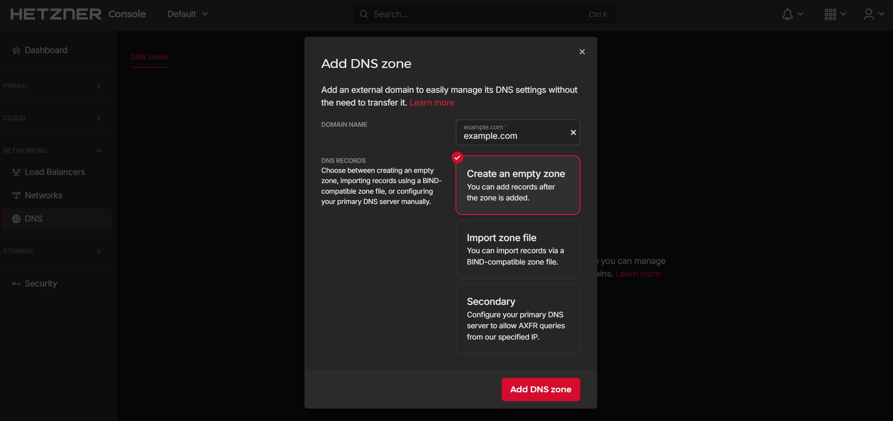
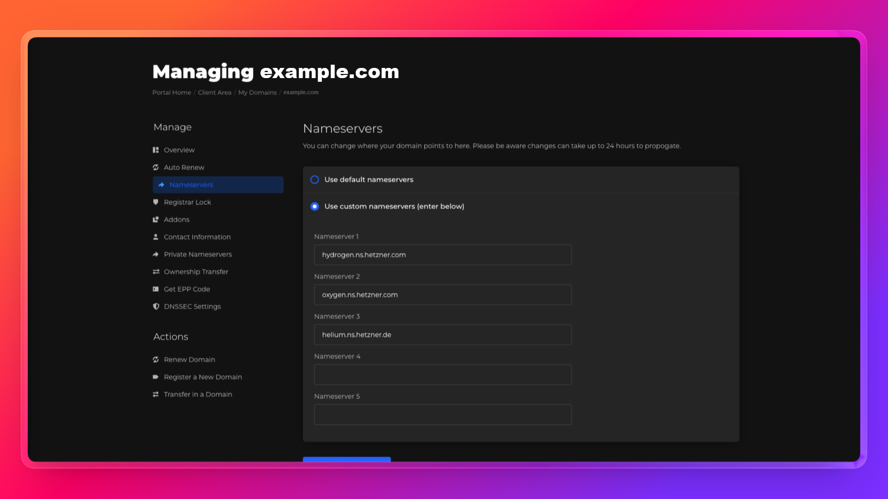

## Introduction

In the previous tutorial, [Pulumi Load Balancer with Two App Servers on Hetzner Cloud](https://community.hetzner.com/tutorials/pulumi-load-balancer-two-servers-hetzner), you set up a public Load Balancer routing HTTP traffic to two app servers over a private network. That setup works, but it serves traffic over plain HTTP. For any real application, you need HTTPS.

This tutorial adds TLS termination to that setup using a Hetzner managed certificate. TLS termination (Transport Layer Security) means the Load Balancer handles all HTTPS traffic, decrypts it, and forwards plain HTTP to the servers internally. The servers never see TLS — no certificate configuration is needed on the servers themselves.

By the end, you will have:

- A domain pointing to Hetzner DNS
- A Hetzner managed certificate (Let's Encrypt) issued and renewed automatically
- A Load Balancer serving HTTPS on port 443 with TLS terminated at the LB
- HTTP on port 80 redirecting automatically to HTTPS
- Two app servers receiving plain HTTP on the private network — unchanged from the previous tutorial

**Prerequisites**

- Completed [Pulumi Load Balancer with Two App Servers on Hetzner Cloud](https://community.hetzner.com/tutorials/pulumi-load-balancer-two-servers-hetzner), or already familiar with Pulumi and Hetzner Load Balancers
- A domain name you can point to Hetzner DNS
- Hetzner Cloud [API token](https://docs.hetzner.com/cloud/api/getting-started/generating-api-token)
- [Node.js](https://nodejs.org/en/download) 18 or later
- [Pulumi CLI](https://www.pulumi.com/docs/install/) installed and logged in:
  ```bash
  pulumi login --local
  ```

**Example values used in this tutorial**

| Resource                 | Value            |
| ------------------------ | ---------------- |
| Domain                   | `example.com`    |
| Network CIDR             | `10.44.0.0/16`   |
| Private subnet           | `10.44.10.0/24`  |
| Load Balancer private IP | `10.44.10.10`    |
| App server 1 private IP  | `10.44.10.11`    |
| App server 2 private IP  | `10.44.10.12`    |
| Location                 | `hel1`           |
| Server type              | `cx23`           |
| OS image                 | `ubuntu-24.04`   |

## Architecture

```text
Internet
    │
    ├── HTTPS (443) → Load Balancer (TLS terminated, public IP: <203.0.113.1>)
    │                       │ Private network (10.44.10.0/24)
    │                       ├── App Server 1 (10.44.10.11) ← HTTP port 80 from LB only
    │                       └── App Server 2 (10.44.10.12) ← HTTP port 80 from LB only
    │
    └── HTTP  (80)  → Load Balancer → 301 redirect to HTTPS
```

Key points:

- TLS is terminated at the Load Balancer. Servers receive plain HTTP on port 80 — no certificates or HTTPS configuration on the servers.
- The firewall on each server only allows HTTP from the Load Balancer's private IP. Direct HTTP access to the server's public IP is blocked.
- The Hetzner managed certificate uses Let's Encrypt (LE) with a DNS-01 challenge. Hetzner DNS must be authoritative for your domain so Hetzner can write the challenge record automatically.

## Step 1 - Set up Hetzner DNS

> Complete this step first — DNS propagation can take up to 10 minutes. Start it now and continue with Step 2 while you wait.

Hetzner managed certificates use [Let's Encrypt DNS-01](https://letsencrypt.org/docs/challenge-types/#dns-01-challenge) validation. Let's Encrypt writes a `_acme-challenge` TXT record to your domain to prove ownership. For this to work automatically, your domain's DNS must be managed by Hetzner DNS.

### Step 1.1 - Create a zone in Hetzner DNS

Go to [console.hetzner.com](https://console.hetzner.com) and [add a zone](https://docs.hetzner.com/networking/dns/getting-started/creating-a-zone). Enter your root domain name (e.g. `example.com`) and confirm.

> Hetzner DNS only accepts root domains — not subdomains. Enter `example.com`, not `tls.example.com`.



After the zone is created, Hetzner shows you the [nameservers assigned to your zone](https://docs.hetzner.com/networking/dns/overview#authoritative-name-servers):

```text
hydrogen.ns.hetzner.com
oxygen.ns.hetzner.com
helium.ns.hetzner.de
```

### Step 1.2 - Point your domain to Hetzner DNS

At your domain registrar or DNS provider, update the nameservers for your domain to the three Hetzner nameservers above.



> If your domain is currently managed by Cloudflare, go to Cloudflare → your domain → **Overview** → scroll to **Nameservers** → switch to custom nameservers and enter the Hetzner nameservers. This moves DNS authority for the domain to Hetzner. Cloudflare is no longer involved after this step.

### Step 1.3 - Verify the delegation

DNS changes can take a while to propagate. Run this command to verify Hetzner DNS is now authoritative for your domain:

```bash
dig NS example.com +short
```

When the output shows Hetzner's nameservers, you are ready to continue:

```text
hydrogen.ns.hetzner.com.
oxygen.ns.hetzner.com.
helium.ns.hetzner.de.
```

## Step 2 - Set up the project

Create the project directory and initialize it:

```bash
mkdir hetzner-tls-lb-pulumi && cd hetzner-tls-lb-pulumi
pulumi new typescript -y
npm install @pulumi/hcloud
```

`pulumi new typescript -y` creates the project, initializes the `dev` stack, and generates `.gitignore`.

Now create a `.env` file with your credentials:

**`.env`**

```bash
HCLOUD_TOKEN=your_hetzner_api_token_here
PULUMI_CONFIG_PASSPHRASE=your_passphrase_here
```

`PULUMI_CONFIG_PASSPHRASE` is required because Pulumi uses a local state backend (`file://~`) that encrypts secrets. Without it, Pulumi prompts for the passphrase on every command.

Add `.env` to `.gitignore` and load the environment variables:

```bash
echo ".env" >> .gitignore
set -a && source .env && set +a
```

`set -a` marks all variables as exported automatically, so child processes like `pulumi` can read them.

Configure the stack:

> Replace `~/.ssh/id_rsa.pub` with the path to your public key if it is different.

```bash
pulumi config set domain example.com
pulumi config set sshPublicKeyPath ~/.ssh/id_rsa.pub
pulumi config set --secret hcloudToken "$HCLOUD_TOKEN"
pulumi config set sshAllowedCidrs "[\"$(curl -4 https://ip.hetzner.com)/32\"]"
```

Check your values:

```bash
pulumi config get domain
pulumi config get sshPublicKeyPath
pulumi config get hcloudToken
pulumi config get sshAllowedCidrs
```

## Step 3 - Write the infrastructure code

Open `index.ts` and replace its contents with the following. The code is explained section by section below.

### Step 3.1 - Configuration

```typescript
import * as fs from "node:fs";
import * as path from "node:path";
import * as pulumi from "@pulumi/pulumi";
import * as hcloud from "@pulumi/hcloud";

const stack = pulumi.getStack();
const project = pulumi.getProject();
const config = new pulumi.Config();
const projectConfig = new pulumi.Config(project);

const hcloudToken = config.requireSecret("hcloudToken");
const existingSshKeyName = config.get("sshKeyName");
const sshPublicKeyPath = config.get("sshPublicKeyPath");
const sshAllowedCidrs = config.getObject<string[]>("sshAllowedCidrs") ?? [];
const domain = config.require("domain");

if (!existingSshKeyName && !sshPublicKeyPath) {
  throw new pulumi.RunError(
    "Set either `sshKeyName` (existing Hetzner SSH key name) or `sshPublicKeyPath` (local public key path).",
  );
}

const location = projectConfig.get("location") ?? "hel1";
const networkZone = projectConfig.get("networkZone") ?? "eu-central";
const loadBalancerType = projectConfig.get("loadBalancerType") ?? "lb11";
const serverType = projectConfig.get("serverType") ?? "cx23";
const image = projectConfig.get("image") ?? "ubuntu-24.04";
const networkCidr = projectConfig.get("networkCidr") ?? "10.44.0.0/16";
const privateSubnetCidr = projectConfig.get("privateSubnetCidr") ?? "10.44.10.0/24";
const loadBalancerPrivateIpAddress = projectConfig.get("loadBalancerPrivateIp") ?? "10.44.10.10";
const appPrivateIp1 = projectConfig.get("appPrivateIp1") ?? "10.44.10.11";
const appPrivateIp2 = projectConfig.get("appPrivateIp2") ?? "10.44.10.12";
const namePrefix = `${project}-${stack}`;

const sshPublicKey = sshPublicKeyPath
  ? fs
    .readFileSync(path.resolve(sshPublicKeyPath.replace(/^~(?=$|\/|\\)/, process.env.HOME ?? "~")), "utf-8")
    .trim()
  : undefined;

const labels = { project, stack, managedBy: "pulumi", role: "tutorial" };

const provider = new hcloud.Provider("hcloud", { token: hcloudToken });
const providerOpts: pulumi.CustomResourceOptions = { provider };
```

`domain` is the only new config value compared to the previous tutorial. It holds the domain name that the managed certificate will be issued for.

### Step 3.2 - Network, SSH key, and firewall

```typescript
const network = new hcloud.Network("private-network", {
  name: `${namePrefix}-network`,
  ipRange: networkCidr,
  labels,
}, providerOpts);
const networkId = network.id.apply((id) => Number(id));

const privateSubnet = new hcloud.NetworkSubnet("private-subnet", {
  networkId,
  type: "cloud",
  networkZone,
  ipRange: privateSubnetCidr,
}, providerOpts);

const sshKeyRef: pulumi.Input<string> = existingSshKeyName
  ? existingSshKeyName
  : new hcloud.SshKey("deployer-key", {
    name: `${namePrefix}-ssh-key`,
    publicKey: sshPublicKey!,
    labels,
  }, providerOpts).id;

const appFirewall = new hcloud.Firewall("app-firewall", {
  name: `${namePrefix}-app-fw`,
  labels: { ...labels, tier: "app" },
  rules: [
    {
      description: "HTTP from load balancer private IP only",
      direction: "in",
      protocol: "tcp",
      port: "80",
      sourceIps: [`${loadBalancerPrivateIpAddress}/32`],
    },
    ...sshAllowedCidrs.map((cidr, index) => ({
      description: `SSH allowlist entry ${index + 1}`,
      direction: "in" as const,
      protocol: "tcp" as const,
      port: "22",
      sourceIps: [cidr],
    })),
  ],
}, providerOpts);
const appFirewallId = appFirewall.id.apply((id) => Number(id));
```

The firewall rules are unchanged from the previous tutorial. Port 80 is allowed only from the Load Balancer's private IP. Port 443 is not needed on the servers — TLS is terminated at the Load Balancer, so the servers never receive HTTPS traffic.

### Step 3.3 - App servers

Create the cloud-init directory and file:

```bash
mkdir cloud-init
touch cloud-init/app-server.yaml
```

**`cloud-init/app-server.yaml`**

```yaml
#cloud-config

write_files:
  - path: /var/www/html/index.html
    permissions: "0644"
    owner: root:root
    content: |
      <html>
        <head>
          <title>${SERVER_NAME}</title>
          <style>
            body {
              font-family: system-ui, sans-serif;
              max-width: 760px;
              margin: 40px auto;
              padding: 0 16px;
              line-height: 1.5;
            }
            code {
              background: #f4f4f4;
              padding: 2px 6px;
              border-radius: 4px;
            }
          </style>
        </head>
        <body>
          <h1>Hello from ${SERVER_NAME}</h1>
          <p>Traffic reached this server through the Hetzner Load Balancer over the private network.</p>
          <p>Server: <code>${SERVER_NAME}</code></p>
          <p>Private IP: <code>${SERVER_PRIVATE_IP}</code></p>
        </body>
      </html>
  - path: /var/www/html/health
    permissions: "0644"
    owner: root:root
    content: "ok"
  - path: /etc/systemd/system/simple-web.service
    permissions: "0644"
    owner: root:root
    content: |
      [Unit]
      Description=Simple Python HTTP server
      After=network-online.target
      Wants=network-online.target

      [Service]
      Type=simple
      WorkingDirectory=/var/www/html
      ExecStart=/usr/bin/python3 -m http.server 80 --bind 0.0.0.0
      Restart=always
      RestartSec=2
      User=root

      [Install]
      WantedBy=multi-user.target

runcmd:
  - systemctl enable simple-web.service
  - systemctl restart simple-web.service
```

> The cloud-init file here runs a simple Python web server as a demo. In a real project, replace it with whatever your application needs. Two things must stay in place: your app must listen on port 80 (the Load Balancer routes to port 80), and the `/health` endpoint must return `ok` with a `200` status (the Load Balancer health check depends on it).

Add the server provisioning to `index.ts`:

```typescript
const cloudInitTemplate = fs.readFileSync(
  path.join(__dirname, "cloud-init", "app-server.yaml"),
  "utf-8"
);

const serverDefs = [
  { suffix: "app-1", privateIp: appPrivateIp1 },
  { suffix: "app-2", privateIp: appPrivateIp2 },
];

const appServers = serverDefs.map((def) => {
  const userData = cloudInitTemplate
    .split("${SERVER_NAME}").join(`${namePrefix}-${def.suffix}`)
    .split("${SERVER_PRIVATE_IP}").join(def.privateIp);

  return new hcloud.Server(`server-${def.suffix}`, {
    name: `${namePrefix}-${def.suffix}`,
    serverType,
    image,
    location,
    sshKeys: [sshKeyRef],
    firewallIds: [appFirewallId],
    publicNets: [{ ipv4Enabled: true, ipv6Enabled: false }],
    networks: [{ networkId, ip: def.privateIp }],
    userData,
    labels: { ...labels, tier: "app", instance: def.suffix },
  }, { ...providerOpts, dependsOn: [privateSubnet] });
});
```

### Step 3.4 - Load Balancer

```typescript
const loadBalancer = new hcloud.LoadBalancer("public-load-balancer", {
  name: `${namePrefix}-lb`,
  loadBalancerType,
  location,
  labels: { ...labels, tier: "edge" },
}, providerOpts);
const loadBalancerIdNumber = loadBalancer.id.apply((id) => Number(id));

const loadBalancerNetwork = new hcloud.LoadBalancerNetwork("private-network-attachment", {
  loadBalancerId: loadBalancerIdNumber,
  subnetId: privateSubnet.id,
  ip: loadBalancerPrivateIpAddress,
  enablePublicInterface: true,
}, { ...providerOpts, dependsOn: [privateSubnet, loadBalancer] });

const loadBalancerTargets = appServers.map((server, i) => {
  const serverId = server.id.apply((id) => Number(id));
  return new hcloud.LoadBalancerTarget(`app-target-${i + 1}`, {
    type: "server",
    loadBalancerId: loadBalancerIdNumber,
    serverId,
    usePrivateIp: true,
  }, { ...providerOpts, dependsOn: [loadBalancerNetwork, server] });
});
```

### Step 3.5 - Managed certificate and HTTPS service

This is the core of the tutorial. First, request the managed certificate:

```typescript
const certificate = new hcloud.ManagedCertificate("tls-cert", {
  name: `${namePrefix}-cert`,
  domainNames: [domain],
}, { ...providerOpts, dependsOn: loadBalancerTargets });
```

`hcloud.ManagedCertificate` tells Hetzner to request a Let's Encrypt certificate for your domain using DNS-01 validation. Because Hetzner DNS is authoritative for your domain, Hetzner can write the `_acme-challenge` TXT record automatically. The certificate is renewed automatically before it expires — you never manage it manually.

Now add the HTTPS service:

```typescript
const httpsService = new hcloud.LoadBalancerService("https-service", {
  loadBalancerId: loadBalancer.id,
  protocol: "https",
  listenPort: 443,
  destinationPort: 80,
  http: {
    certificates: [certificate.id.apply((id) => Number(id))],
    redirectHttp: true,
  },
  healthCheck: {
    protocol: "http",
    port: 80,
    interval: 10,
    timeout: 5,
    retries: 3,
    http: {
      path: "/health",
      statusCodes: ["200"],
      response: "ok",
    },
  },
}, { ...providerOpts, dependsOn: [certificate] });
```

Three things to note:

- `protocol: "https"` with `listenPort: 443` — the Load Balancer accepts encrypted traffic on port 443 and decrypts it using the managed certificate.
- `destinationPort: 80` — after decryption, traffic is forwarded to servers on port 80 as plain HTTP. No TLS configuration is needed on the servers.
- `redirectHttp: true` — this tells the Load Balancer to also listen on port 80 and return a `301 Moved Permanently` redirect to HTTPS for any HTTP request. This is set on the HTTPS service, not as a separate service.

### Step 3.6 - Outputs

```typescript
export const loadBalancerPublicIpv4 = loadBalancer.ipv4;
export const appUrl = pulumi.interpolate`https://${domain}/`;
export const appHealthUrl = pulumi.interpolate`https://${domain}/health`;
export const server1Name = appServers[0].name;
export const server1PrivateIp = pulumi.output(appPrivateIp1);
export const server2Name = appServers[1].name;
export const server2PrivateIp = pulumi.output(appPrivateIp2);
export const dnsNote = pulumi.interpolate`Add an A record in Hetzner DNS: ${domain} → ${loadBalancer.ipv4}`;
export const cleanupNote = pulumi.interpolate`Before destroying, delete the A record in Hetzner DNS for ${domain}`;
```

`dnsNote` and `cleanupNote` remind you of the manual DNS steps before and after each deployment.

## Step 4 - Deploy

Preview what will be created:

```bash
set -a && source .env && set +a
pulumi preview
```

You should see 14 resources to be created: provider, SSH key, Firewall, network, subnet, 2 servers, Load Balancer, LB network attachment, 2 LB targets, managed certificate, and HTTPS service.

Deploy when ready:

```bash
pulumi up
```

Pulumi prompts you to confirm. Select `yes`. The deployment takes about 2–3 minutes. The managed certificate issuance adds roughly 1–2 minutes on top of the server creation time.

## Step 5 - Add the DNS record and verify

After the deployment completes, Pulumi shows the `dnsNote` output with the exact A record to add:

```bash
pulumi stack output dnsNote
# Add an A record in Hetzner DNS: example.com → <load-balancer-ip>
```

Go to [console.hetzner.com](https://console.hetzner.com), open the zone for your domain, and add an A record:

| Type | Name | Value                  | TTL |
| ---- | ---- | ---------------------- | --- |
| A    | `@`  | `<load-balancer-ip>`   | 300 |


Wait about a minute for DNS to propagate, then verify:

```bash
# Check HTTPS is working
curl https://example.com/

# Check the health endpoint
curl https://example.com/health
# expected output: ok

# Check HTTP redirects to HTTPS
curl -I http://example.com/
# expected: HTTP/1.1 301 Moved Permanently
#           location: https://example.com/
```

Refresh the first curl a few times — you will see responses alternating between `app-1` and `app-2` as the Load Balancer distributes traffic.

## Step 6 - Clean up

Before destroying the infrastructure, delete the A record from Hetzner DNS. Run this to see which record to remove:

```bash
pulumi stack output cleanupNote
# Before destroying, delete the A record in Hetzner DNS for example.com
```

Go to [console.hetzner.com](https://console.hetzner.com), open your zone, and delete the A record you added in Step 5.

Then destroy the infrastructure:

```bash
set -a && source .env && set +a
pulumi destroy
pulumi stack rm dev
```

## Conclusion

You now have a Hetzner Load Balancer serving HTTPS using a managed certificate, with HTTP traffic automatically redirected to HTTPS. TLS is fully terminated at the Load Balancer — the servers receive plain HTTP over the private network and require no certificate configuration.

Some directions to explore next:

- Add sticky sessions so returning users always reach the same server
- Configure custom health check intervals and thresholds for your application's startup time
- Add more servers by extending the `serverDefs` array — the Load Balancer and certificate require no changes

**Full source code:** [hetzner-tls-lb-pulumi](https://github.com/salemaljebaly/infra-labs/tree/main/hetzner-tls-lb-pulumi)

##### License: MIT

<!--

Contributor's Certificate of Origin

By making a contribution to this project, I certify that:

(a) The contribution was created in whole or in part by me and I have
    the right to submit it under the license indicated in the file; or

(b) The contribution is based upon previous work that, to the best of my
    knowledge, is covered under an appropriate license and I have the
    right under that license to submit that work with modifications,
    whether created in whole or in part by me, under the same license
    (unless I am permitted to submit under a different license), as
    indicated in the file; or

(c) The contribution was provided directly to me by some other person
    who certified (a), (b) or (c) and I have not modified it.

(d) I understand and agree that this project and the contribution are
    public and that a record of the contribution (including all personal
    information I submit with it, including my sign-off) is maintained
    indefinitely and may be redistributed consistent with this project
    or the license(s) involved.

Signed-off-by: Salem Aljebaly <salemaljebaly@gmail.com>

-->
