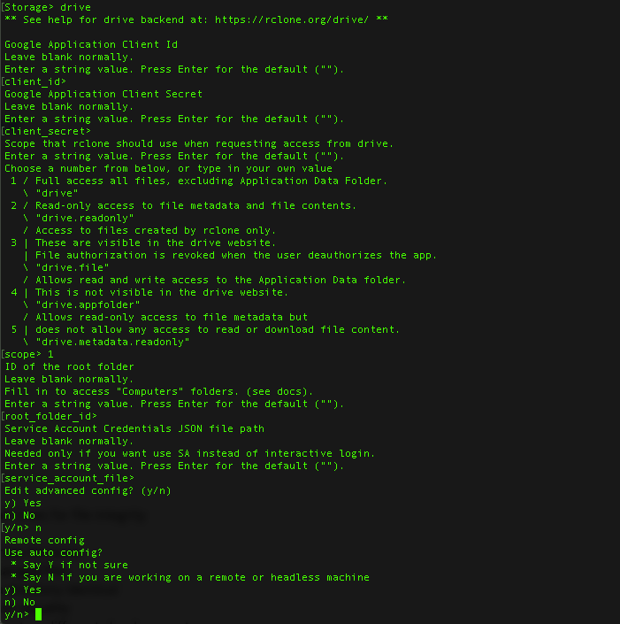

<!-- This where the actual tutorial begins, with the title: -->

# Managing Multiple Cloud Remotes with Hetzner

## Introduction

Creating a VPS server to centralize and manage multiple file storage systems can simplify tedious tasks such as moving files, syncing folders, updating versions, merging drives, consolidiating files, etc. A fast VPS or dedicated server with a gigabit connection can dramatically speed up these tasks.

[Rclone](https://rclone.org/), is a powerful tool that can be used to manage multiple directories, filesystems, local files and remote drives such as <b>FTP servers, cloud servers, S3 buckets, Dropbox accounts, etc</b>. Below is a starter’s guide to Rclone, broken up so it can be used by anyone, new users and experienced users alike.

**Prerequisites**

Rclone functions on any OS and versions are available for both 32 & 64 bit systems. When running on a server we will be using the Linux versions via SSH.

## Step 1 - Installation

Download it. The Rclone site breaks this down very well and if you are on a Linux VPS or dedicated server you don’t even need to visit the homepage. Simply connect via SSH to your server and paste:

```
    curl https://rclone.org/install.sh | sudo bash
```

Once this installation is complete, we can start using rClone.

## Step 2 - Startup

With Rclone, we can begin to check out the features:

```
    rclone config
```


*Rclone Getting Started*

From here we are greeted with a the config menu. My advice is to create a Config Password immediatly and note it as we will need this when running commands. If you choose to go without a password, that is fine, it is only a suggestion. If you lose a password, you can uninstall rclone and reinstall it - setting up your remotes again.

## Step 3 - Setting Up a Remote

Rclone has integrations with many of the major and minor cloud storage providers and the interface guides you through the steps. There are traditional integrations and some other useful encrypted and mounted options also. For this tutorial, I will sync files from my Dropbox to my Google Drive.

Note: When we set up remotes, we set them up as a remote / headless machine.

* Alibaba Cloud
* Amazon Drive
* Amazon S3
* Backblaze B2
* Box
* Ceph
* DigitalOcean Spaces
* Dreamhost
* Dropbox
* FTP
* Google Cloud Storage
* Google Drive
* HTTP
* Hubic
* Jottacloud
* IBM COS S3
* Memset Memstore
* Mega
* Microsoft Azure Blob Storage
* Microsoft OneDrive
* Minio
* Nextcloud (Can be useful with Hetzner Nextcloud instances)
* OVH
* OpenDrive
* Openstack Swift
* Oracle Cloud Storage
* ownCloud
* pCloud
* put.io
* QingStor
* Rackspace Cloud Files
* Scaleway
* SFTP
* Wasabi
* WebDAV
* Yandex Disk
* Your local filesystem (Rclone can manage files within your server instance also)


*Picking Your Remote*

Pick your remote by typing the name of the service, “dropbox” in my case. From here we are guided through the setup of each remote. Rclone has fantastic docs on the setup of each remote and they do example walk-troughs on all of them.

Here is a walk-through of Google Drive and Dropbox:

Google Drive:



*Picking Drive*

We can see above, that we must choose which config to use.
```
Use auto config?
 * Say Y if not sure
 * Say N if you are working on a remote or headless machine
```
We are selecting `N` in this case, as we are working on a headless server.


*Setting Up Headless Drive*


*Setting Up Access to Drive*


*Getting GDrive Token*

Dropbox:

Dropbox has a small nuance where you must have rclone on your local machine. If you are on a MAC, then you can install it with this simple command:
```
    curl https://rclone.org/install.sh | sudo bash
```
Once this is complete, the setup of dropbox (and any other remote) is straightforward.


*Dropbox Setup*


*Getting Dropbox Token*

We have now set up 2 remote controls on our server.
```
Current remotes:

Name                 Type
====                 ====
test-dropbox         dropbox
test-gdrive          drive
```

## Step 4 - Managing Files Using Rclone

I set up 2 remotes for this tutorial, their names can be generic or unique. From here we quit (q) and we can begin to use the features of Rclone. Exit the config (q) and we can begin to move files between remotes using the gigabit speeds of Hetzner.

**Note 1**: Likely if you are unable to list files or have ERROR messages, you may have set up your remote drives incorrectly in Rclone. If you have done this, go to 'rclone config', select the 'Delete remote — d' option and remove the remote to start again.

**Note 2**: When accessing a drive, some remotes take a few moments to establish a connection. Don’t worry if you are waiting 10-15 seconds for the remote to respond.

**Note 3**: If you need to see logs of what is happening for any command in Rclone. Add '-vv' (very detailed) or '-v' (normal details) to the end of the command, this will generate messages and display any errors. Errors are normal depending on the remote you are using (e.g. Google Drive Generates errors).

### Step 4.1 - Moving Files Using Rclone
Some example commands used to explore folders and files in Rclone:
```
    rclone lsd [remote name]:/[Optional - Specify Remote Folder]
    (List the directories of the top level folder or specific folder)

    rclone ls [remote name]:/[Optional - Specify Remote Folder]
    (List all the files in the remote or specific folder)

    rclone lsl [remote name]:/[Optional - Specify Remote Folder]
    (List location / size / of all files in remote or specific folder)
```

We can see the output of the `ls` below.


*Getting Fill Files List*

All the commands are listed in the Docs [here](https://rclone.org/docs/#subcommands).

Note above 2 things:

* Running the **ls** command on the whole remote will produce a long list of files, it’s better to specify a specific folder and run the command there.

* If your folder has spaces in its name, use quotation markets to bind it together. Example: Temp folder → ‘Temp Folder’

### Step 4.2 - Moving Files Using Rclone

Moving files and folders is easy once you understand the structure of Rclone commands. These are broken down below with definitions for each action.

Below are the steps required to transfer files between 2 providers, Google Drive and Dropbox. Remember to be careful when using some of these commands as they can be destructive (files get deleted or removed). I can’t help if you move files and they get lost or deleted.

The most basic command is:

`rclone copy [Source]:/[Folder] [Destination)]:/[Folder]`

`rclone copy` <-- This is the copy command that Copy files from source to dest, skipping already copied. Use this one for first sync as files won’t be deleted when used.

`[Source]:/[Folder]` <-- Source is the remote containing the files. And if you are only syncing a specific folder, then ensure you specify this folder or you will sync the whole remote.

`[Destination)]:/[Folder]` <-- Destination is the remote recieving the files. And if you are putting the files in specific folder, then ensure you specify this folder or you end up with a messy remote.


*Moving Files Between Remotes*

You can see that the files are mirrored from my Google Drive to my Dropbox.

Note: A bonus to using Rclone is that file metadata is preserved. If a file is dated in the past on Remote1, the same date is seen on Remote2. Very handy when transferring large sets of files.

Additionally, we could use a command like `sync`, to move files between remotes.

Note: **Destructive** use of SYNC. If we want to exactly mirror 2 remotes, this can be very useful. If we want to backup 2 remotes this is not useful as **all changes are copied from the *source* remote to the *destination* remote, including any files deleted will be deleted in the destination remote**.

### Step 5 - Bonus - Flags

Getting fine control on Rclone can unlock many benefits such as increased speed, updating, and more. Below are some of my favorites broken down:

```rclone copy [Source]: [Dest]: -v -c --bwlimit 8M --transfers=3 --stats=30s --dry-run```

`-v` <-- Using the -v flag, rclone will produce Error, Notice and Info messages.

`-c` <-- Rclone will look at modification time and size of files to see if they are equal. If you set this flag then rclone will check the file hash and size to determine if files are equal.

`--bwlimit 8M` <-- Taking up all the bandwidth is rude. If you need to limit the speed of the transfers use this flag. Example: Google Drive limits daily transfers to 750GB, or ~9MB/s.

`--transfers=3` <-- Specify the number of files being transferred parallel. The default is 4, but I have gone up to 20 without any issues.

`--stats=30s` <-- Rclone will produce an update for stats every X seconds or minutes to show you the rate or transfer and other key details.

`--dry-run` <-- Before committing to a transfer and potentially regretting it, run the command with this flag. It will show you what will happen when you run a copy/sync/etc without performing it. Once you are confident, remove this flag and repeat the command.

Some more useful flags:

Update Remotes:

`--update` <-- Rclone will be forced to skip any files which exist on the destination and have a modified time that is newer than the source file.

Progress Block:

`--progress` <-- Rclone updates the stats in a static block in the terminal providing a real-time overview of the transfer. This would be used in place of `--stats`.

Immutable

`--immutable` <-- Rclone treat the source and destination files as immutable and won't allow any modification. This does NOT stop files being deleted, existing files will only never be updated.


### Terminology
* Remote: Online file storage system used to host files.

## Conclusion

Rclone is a powerful tool. When combined with Hetzner Gigabit speeds, it can be used to manage huge quantities of information quickly and efficiently. I always advise on testing out moving files first, before attempting large data migrations to ensure the commands and flags are as expect. In order to test this, I have a small CX11. When moving large sets of files, i scale up the instance to 2-4 vCPUs and begin the transfer.

P.S.: To keep files moving while not connected via SSH on the server. A great program for Linux is: `screen`. Details on this can be found [here](https://linuxize.com/post/how-to-use-linux-screen/).

##### License: MIT

<!---

Contributors's Certificate of Origin

By making a contribution to this project, I certify that:

(a) The contribution was created in whole or in part by me and I have
    the right to submit it under the license indicated in the file; or

(b) The contribution is based upon previous work that, to the best of my
    knowledge, is covered under an appropriate license and I have the
    right under that license to submit that work with modifications,
    whether created in whole or in part by me, under the same license
    (unless I am permitted to submit under a different license), as
    indicated in the file; or

(c) The contribution was provided directly to me by some other person
    who certified (a), (b) or (c) and I have not modified it.

(d) I understand and agree that this project and the contribution are
    public and that a record of the contribution (including all personal
    information I submit with it, including my sign-off) is maintained
    indefinitely and may be redistributed consistent with this project
    or the license(s) involved.

Signed-off-by: David Sharkey david@sharkey.io

-->
