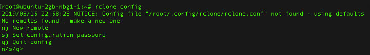
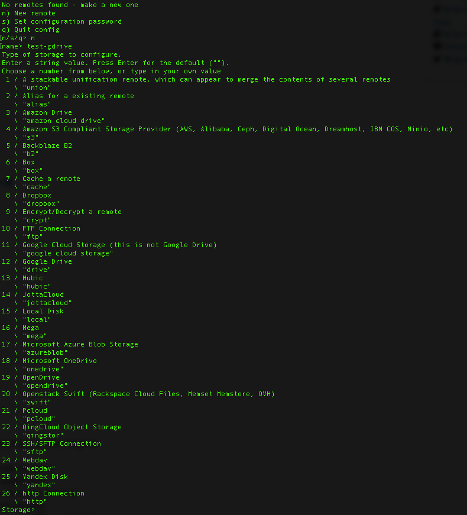
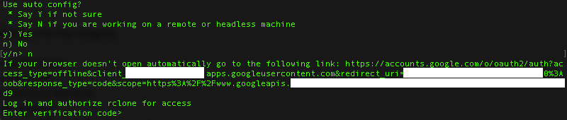
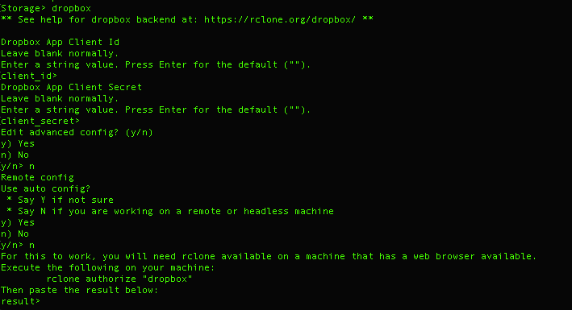
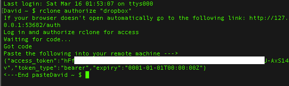
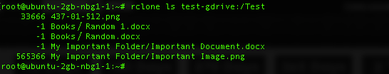

## Введение

Создание VPS-сервера для централизации и управления несколькими системами хранения файлов может упростить утомительные задачи, такие как перемещение файлов, синхронизация директорий, обновление версий, объединение дисков, консолидация файлов и т.д. Быстрый VPS или выделенный сервер с гигабитным соединением может значительно ускорить выполнение этих задач.

[Rclone](https://rclone.org/) — это мощный инструмент, который может использоваться для управления несколькими каталогами, файловыми системами, локальными файлами и удаленными хранилищами, такими как **FTP-серверы, облачные серверы, S3 бакеты, учетные записи Dropbox и т.д.** Ниже приведено руководство по rclone, структурированное таком образом, чтобы его могли использовать как новые, так и опытные пользователи.

Rclone работает на любых ОС и доступен как для 32-битных, так и для 64-битных систем. При работе на сервере мы будем использовать версию для Linux через SSH.

## Шаг 1 — Установка

Скачайте его. Сайт rclone очень удобно устроен, например, для установки rclone на виртуальный сервер с Linux даже не нужно посещать домашнюю страницу. Просто подключитесь через SSH к серверу и вставьте:

```console
curl https://rclone.org/install.sh | sudo bash
```

Как только эта установка будет завершена, мы можем начать использовать rclone.

## Шаг 2 — Запуск

Начнём изучать особенности rclone:

```console
rclone config
```



*Начало работы с rclone*

Нас приветствует меню конфигурации. Рекомендую сразу создать пароль конфигурации и записать его, так как нам это понадобится при запуске команд. Это лишь рекомендация — можно продолжить и без пароля. Если вы потеряли пароль, то удалите конфигурационный файл `~/.config/rclone/rclone.conf` и настройте удаленные хранилища заново.

## Шаг 3 — Настройка удаленного хранилища

Rclone имеет интеграцию со многими крупными и не очень поставщиками облачных хранилищ, и интерфейс проведет вас через шаги. Кроме традиционных интеграций с внешними сервисами также есть полезные возможности шифрования и монтирования. В этом руководстве я буду синхронизировать файлы из моего Dropbox на мой Google Диск.

Примечание: при настройке удаленного хранилища мы настраиваем его в режиме без графического интерфейса.



*Выбор удаленного хранилища*

Выберите удаленное хранилище, введя название сервиса, «dropbox» в моем случае. Из этого места начинается настройка любого из поддерживаемых удаленных хранилищ. Rclone имеет фантастическую документацию с примерами настройки по каждому удаленному хранилищу.

Ниже приведены пошаговые инструкции для Google Диска и Dropbox.

### Шаг 3.1 — Google Диск


*Выбор диска*

Мы можем видеть выше, что мы должны выбрать, какую конфигурацию использовать.

```console
Use auto config?
 * Say Y if not sure
 * Say N if you are working on a remote or headless machine
```

Мы выбираем `N` в этом случае, поскольку мы работаем на сервере без графического интерфейса.



*Настройка хранилища без графического интерфейса*


*Настройка доступа к хранилищу*


*Получение токена Google Диска*

### Шаг 3.2 — Dropbox

Dropbox имеет небольшой нюанс — нужно иметь rclone на вашем локальном компьютере. Если у вас MAC, то вы можете установить его с помощью этой простой команды:

```console
curl https://rclone.org/install.sh | sudo bash
```

Как только это будет завершено, настройка dropbox (и любого другого удаленного хранилища) будет простой.



*Настройка Dropbox*



*Получение токена Dropbox*

Теперь у нас на сервере настроено два удаленных хранилища.

```console
Current remotes:

Name                 Type
====                 ====
test-dropbox         dropbox
test-gdrive          drive
```

## Шаг 4 — Управление файлами с помощью rclone

Я настроил два удаленных хранилища для этого руководства. Теперь можно выйти (q), и начать использовать функции rclone. Выйдите из конфигурации (q), и мы сможем начать перемещать файлы между удаленными хранилищами, используя гигабитные скорости Hetzner.

**Примечание 1**: если вы не видите список файлов или же видите сообщения об ошибках, возможно, вы неправильно настроили свои удаленные хранилища в rclone. Если это так, то перейдите в «rclone config», выберите «Delete remote — d» для того чтобы начать заново.

**Примечание 2**: установка соединения с некоторыми удаленными хранилищами требуют какого-то времени. Не волнуйтесь, если вы ждете ответа 10-15 секунд.

**Примечание 3**: если вам нужно увидеть журналы того, что происходит, то добавьте «-vv» (очень подробно) или «-v» (обычные детали) в конец любой команды rclone. При этом будут генерироваться сообщения, показывающие любые ошибки. В зависимости от типа удаленного хранилища само наличие ошибок не является проблемой (например, Google Диск генерирует ошибки).

### Шаг 4.1 — Получение списка файлов с помощью rclone

Примеры команд, используемых для изучения файлов и директорий в rclone:

```text
rclone lsd [remote name]:/[Optional - Specify Remote Folder]
(List the directories of the top level folder or specific folder)

rclone ls [remote name]:/[Optional - Specify Remote Folder]
(List all the files in the remote or specific folder)

rclone lsl [remote name]:/[Optional - Specify Remote Folder]
(List location / size / of all files in remote or specific folder)
```

Ниже приведен вывод `ls`.



*Получение списка файлов*

Все команды приведены в документации [здесь](https://rclone.org/docs/#subcommands).

Обратите внимание на 2 вещи:

* Запуск команды **ls** на всем удаленном хранилище приведет к созданию длинного списка файлов, лучше указать конкретную директорию и запустить команду там.

* Если директория имеет пробелы в имени, используйте кавычки. Пример: директория Temp → "директория Temp"

### Шаг 4.2 — Перемещение файлов с помощью rclone

Перемещение файлов и директорий не сложно, если понимаете структуру команд rclone. Структура команд подробно разобрана ниже.

Ниже приведены шаги, необходимые для передачи файлов между Google Диск и Dropbox. Не забывайте быть осторожными при использовании некоторых из этих команд, поскольку они могут быть разрушительными. Я не могу помочь, если файлы потеряются или будут удалены в результате перемещения.

Вот команда в общем виде:

`rclone copy [источник]:/[директория] [назначение]:/[директория]`

`rclone copy` это команда копирования, которая копирует файлы из источника в назначение, пропуская уже скопированные. Используйте её для первой синхронизации, так как она не удаляет файлы.

`[источник]:/[директория]` источник — это удаленное хранилище с файлами. И если вы хотите синхронизировать определенную директорию, укажите ее, чтобы не было синхронизировано все удаленное хранилище.

`[назначение]:/[директория]` назначение — это удаленное хранилище, получающее файлы. И если вы помещаете файлы в определенную директорию, то убедитесь, что вы указываете эту директорию, или вы в конечном итоге получите хранилище с мешаниной из файлов.


*Перемещение Файлов Между Удаленными Хранилищами*

Вы можете видеть, на моем Dropbox теперь есть такие же файлы, что и на Google Диске.

Примечание: бонус к использованию rclone заключается в том, что метаданные файлов сохраняются. Если файл датирован в прошлом на хранилище1, та же дата отображается на хранилище2. Это удобно при передаче больших наборов файлов.

Кроме того, мы могли бы использовать команду `sync` для перемещения файлов между удаленными хранилищами.

Примечание: команда sync **деструктивна**. Если мы хотим иметь два одинаковых удаленных хранилища, то эта команда очень полезна. Если же мы хотим создать резервную копию двух удаленных хранилищ, то она бесполезна, так как **все изменения копируются с *хранилища-источника* на *хранилище-назначение*, включая любые удаленные файлы, которые будут удалены в целевом хранилище**.

## Шаг 5 — Бонус: Флаги

Получение точного контроля над rclone может разблокировать множество преимуществ, таких как повышенная скорость, обновление и многое другое. Ниже приведены некоторые из моих любимых флагов и объяснение того, что они делают:

```console
rclone copy [Source]: [Dest]: -v -c --bwlimit 8M --transfers=3 --stats=30s --dry-run
```

`-v` при использовании флага -v rclone будет выдавать сообщения с типами Error, Notice и Info.

`-c` по умолчанию rclone смотрит на время модификации и на размер файлов, чтобы увидеть, одинаковы ли они. Если вы установите этот флаг, то rclone проверит хэш и размер файла, чтобы определить, одинаковы ли файлы.

`--bwlimit 8M` использование всего доступного канала может оказаться неприемлемым. Если нужно ограничить скорость передачи, используйте этот флаг. Пример: Google Диск ограничивает объем передаваемого трафика за день до 750 ГБ, или ~9 МБ/с.

`--transfers=3` укажите количество файлов, передаваемых параллельно. Значение по умолчанию 4, но я дошел до 20 без каких-либо проблем.

`--stats=30s` Rclone будет производить обновление для статистики каждые X секунд или минут, чтобы показать вам скорость или передачу и другие ключевые детали.

`--dry-run` прежде чем совершить передачу и, возможно, пожалеть об этом, запустите команду с этим флагом. Тогда rclose покажет, что произойдет при запуске copy/sync без его выполнения. Как только вы будете уверены, снимите этот флаг и повторите команду.

Еще несколько полезных флагов:

Обновление удаленных хранилищ:

`--update` rclone будет вынужден пропустить все файлы, которые существуют на хранилище-назначении и новее (на основании информации о времени модификации) исходного файла.

Отображение прогресса:

`--progress` rclone будет в реальном времени выводить на терминал статистику по передаче. Это будет использоваться вместо `--stats`.

Неизменный

`--immutable` rclone рассматривает исходный и конечный файлы как неизменяемые и не допускает никаких изменений. Это не препятствует удалению файлов, но существующие файлы никогда не будут обновлены.

## Вывод

Rclone — это мощный инструмент. В сочетании с гигабитными скоростями Hetzner он может использоваться для быстрого и эффективного управления огромными объемами информации. Я всегда советую сначала протестировать перемещение файлов, прежде чем пытаться выполнить миграцию больших данных, чтобы убедиться, что команды и флаги соответствуют ожиданиям. Чтобы проверить это, у меня есть небольшой CX11. Для работы с большими наборами данных я предварительно увеличиваю сервер до 2 или 4 виртуальных процессоров.

##### Лицензия: MIT

<!---

Contributor's Certificate of Origin

By making a contribution to this project, I certify that:

(a) The contribution was created in whole or in part by me and I have
    the right to submit it under the license indicated in the file; or

(b) The contribution is based upon previous work that, to the best of my
    knowledge, is covered under an appropriate license and I have the
    right under that license to submit that work with modifications,
    whether created in whole or in part by me, under the same license
    (unless I am permitted to submit under a different license), as
    indicated in the file; or

(c) The contribution was provided directly to me by some other person
    who certified (a), (b) or (c) and I have not modified it.

(d) I understand and agree that this project and the contribution are
    public and that a record of the contribution (including all personal
    information I submit with it, including my sign-off) is maintained
    indefinitely and may be redistributed consistent with this project
    or the license(s) involved.

Signed-off-by: David Sharkey david@sharkey.io

-->
