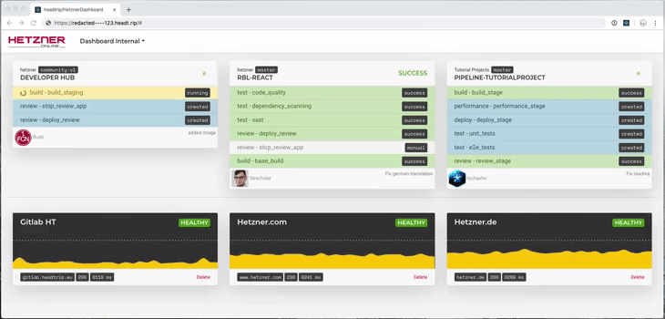

## About the Series

Welcome to the third part of a series of tutorials called **Real-time Applications with Go and ReactJS**. We will build a live dashboard that monitors servers and receives webhooks via GitlabCI (or any CI really), rendering this data live to every client that is connected **without any delay**.

After the series, this is what the app will look like:



We are going to cover every step from an empty text editor to configuring your CI for the dashboard and deploying the docker container we build.

### Technologies covered

-   GoLang for the server
-   HTTP/2 and Server-Sent Events (SSE)
-   ReactJS for the client
-   Docker for building the app and deploying it
    
### Series Index

-   [Part 1: Building a real-time HTTP Server](/tutorials/real-time-apps-with-go-and-reactjs)
-   [Part 2: Implementing SSE Protocol Standards](/tutorials/real-time-apps-with-go-and-reactjs/server-sent-events)
-   **Part 3: Creating a Basic UI with ReactJS (you are here)**
-   Part 4: Visualizing Real-time Data with ReactJS *(not yet released)*
-   Part 5: Getting Ready for Production *(not yet released)* 
 
#### Additional Information: Definition of `real-time` in Computing

After reviewing the tutorial with my colleague @schaeferthomas, he stated that "real-time" could be understood in different ways. For this tutorial I use it in the context of Public Networking Applications using the following definition:

> \[adjective\] (real-time)Computation of or relating to a system in which input data is processed within milliseconds so that it is available virtually immediately as feedback, e.g., in missile guidance or airline booking system.
> 
> -   Oxford Pocket Dictionary of Current English
>

***

## Introduction

In the third part of this tutorial, we will build a simple chat application with ReactJS, based on our previously
implemented server. We start with building static components, which will then be connected to the state.
In the last step, we will subscribe to the event server.

#### Prerequisites

- Basic knowledge of JavaScript and ReactJS (I will try to keep things simple)
- npm v6
- npx v6
- node v12

## Step 1: Setup the project

In your project folder run `npx create-react-app --use-npm simple-chat-app` and wait for the installation to finish. This
adds all necessary dependencies and offers a simple developing and building experience.

Add the following files to the src folder:

- App.js (should already exist)
- ChatLineHolder.js
- ChatLine.js
- ChatInput.js

Run `npm run start` from the project folder in your console. This starts a development server and opens
the app in your default browser.

There should already be an App.js file in your src folder. For now, you can delete everything it returns
and only return a `<div>`.

```js
const App = () => {
  return <div className='chat-app'></div>
}
```

We start with creating our components from bottom up

## Step 2: The `<ChatLine>` component

In ChatLine.js we create a new component that takes two props:

- `name`: string
- `message`: string

This is the data we later receive as event data from the server.

The component returns a simple `<li>` and displays the name and message:

```js
import React from 'react'

const ChatLine = ({ name, message }) => {
  return (
    <li>
      {name}: {message}
    </li>
  )
}

export default ChatLine
```

Note: ReactJS automatically prevents html injection, so we don't need to worry about that.

## Step 3: The `<ChatHolder>` component

In ChatHolder.js we create a new component, that takes a single prop:

- `lines`: Array<{ name: string, message: string }>

If `lines` is empty, we display a simple notification.

```js
if (lines.length === 0) {
  return <div>Chat history is empty</div>
}
```

`lines` is an array of objects. Every object has the attribute `name` and `message`. We map over
all of the items in the array to create multiple `ChatLine` nodes
by passing down `name` and `string` to the `<ChatLine>` component.

```js
const chatLines = lines.map(
  (line, index) => (
    <ChatLine key={index} name={line.name} message={line.message} />
  )
)
```

We then render the result in a `<ul>`, leaving us with the finished component:

``` js
import React from 'react'
import ChatLine from './ChatLine'

const ChatLineHolder = ({ lines }) => {
  if (lines.length === 0) {
    return <div>Chat history is empty</div>
  }

  const chatLines = lines.map(
    (line, index) => (
      <ChatLine key={index} message={line.message} name={line.name} />
    )
  )

  return (
    <ul>
      {chatLines}
    </ul>
  )
}

export default ChatLineHolder
```

Note: You would normally use a unique ID as a key. In this case, we can safely use the index, since the
association between the index and the object does not change. In a real-world application, this is **highly discouraged**.


## Step 4: The `<ChatInput>` component

As you might have noticed, there is no way to input a message yet. The `<ChatInput />` handles text input and uses a
callback function `onSend` to trigger a new chat message when a button is clicked. It takes a single prop:

- `onSend`: (message: string) => void

The component keeps the user input in its own state and handles updates.

```js
 const [value, setValue] = useState('')

 const onChange = (event) => {
   setValue(event.target.value)
 }
```

The `onSend` function is called with the current state when the `send button` is clicked. Since we don't want 
the user to have to manually clear the input field, we reset the state after `onSend` was called.

```js
const onClickSend = () => {
  onSend(value)
  setValue('')
}
```

Here is the final component:

```js
import React, { useState } from 'react'

const ChatInput = ({ onSend }) => {
  const [value, setValue] = useState('')

  const onChange = (event) => {
    setValue(event.target.value)
  }

  const onClickSend = () => {
    setValue('')
    onSend(value)
  }

  return (
    <div>
      <input type='text' value={value} onChange={onChange} />
      <button onClick={onClickSend}>send</button>
    </div>
  )
}

export default ChatInput
```

## Step 5: The `<App>` component

#### State

Since our components don't hold any data of their own, we use `<App>` as the parent component for
state management. We have 3 kinds of state:

- `name`: The name of the user that is chatting
- `chatLines`: An array representing the chat history
- `eventLister`: Used to handle events from the server. (Note: I decided to put the listener in the 
state for simplicity's sake. You might want to take different approach in a real-world application)

We [use state](https://reactjs.org/docs/hooks-reference.html#usestate) hooks to initialize our state:

```js
  const [chatLines, setChatLines] = useState([])
  const [eventListener, setEventListener] = useState(null)
  const [name] = useState(generateRandomName())
```

#### Test-rendering the components

For now we only display our name and render the `<ChatLineHolder>` component with static items.
Since `chatLines` is an empty array, our notification should render. We pass an empty arrow function to`<ChatInput>`.
The implementation will follow in the next step.

```js
return (
  <div className='chat-app'>
    <h2>Chatting as {name}</h2>
    <ChatLineHolder lines={chatLines} />
    <ChatInput onSend={() => {}} />
  </div>
)
```

 If you want to check if your implementation works with some data, just add a few items to `chatLines`
 when it is initialized:
 
```js
const [chatLines, setChatLines] = useState([{ name: 'Thomas', 'message': 'Hi' }])
```

#### Adding interactivity

We can already enter some text into our chat input field, but pressing `send` does not do anything.
This is because we passed a function to `<ChatInput>` that does absolutely nothing. So we need an
implementation for it.

Since we are not connected to our server yet, we implement our `onSend` in a way, that directly
updates the state. For that we add a helper function `addChatLine: (chatLine) => void`.
We later reuse it to handle server sent message events.

```js
const addChatLine = (chatLine) => {
  setChatLines(chatLines => {
    return [...chatLines, chatLine]
  })
  // If you don't have a lot of experience with ReactJS, just think of this as:
  // setChatLines([...chatLines, chatLine])
}

```

`onSend` creates a chat line object and calls `addChatLine`

```js

const onSend = (message) => {
  const chatLine = { name, message }
  addChatLine(chatLine)
}
```

Don't forget to pass `onSend` to `<ChatInput>`

```js
return (
  <div className='chat-app'>
    <h2>Chatting as {name}</h2>
    <ChatLineHolder lines={chatLines} />
    <ChatInput onSend={onSend} />
  </div>
)
```

You should now be able to enter text into the input field, click send and instantly see your message.

## Step 6: Connecting to the server

Chatting with yourself is very boring. This is why we need to connect our App to the server. This
is happening in 2 parts:

- send messages to the server
- subscribe to server sent events

#### Send messages to the server

We need to modify the `onSend` function we just wrote. We can replace the whole body with a simple
fetch call, that sends our `name` and `message` in the body. It is important not to call
`addChatLine` since we will do this later when we receive the server sent event.

```js
const onSend = async (message) => {
  fetch('http://localhost:4000/say',
    {
      headers: {
        'Content-Type': 'application/x-www-form-urlencoded',
      },
      method: 'post',
      mode: 'no-cors',
      body: `name=${name}&message=${message}`
    })
}
```

If you now click the `send` button, a request will be sent to the server but your state does
**not** update yet! We will handle this in the next step.

#### Subscribe to server sent events

Before we start listening to events, we need to have a function that handles such message events.
Since we will later bind to events of type `message`, we can implement it accordingly. All it does
is taking the `event.data`, parsing it into an object, and calling `addChatLine`

```js
const onMessage = (event) => {
  const chatLine = JSON.parse(event.data)
  addChatLine(chatLine)
}
```

To receive server sent events, we create an object of the [EventSource](https://developer.mozilla.org/en-US/docs/Web/API/EventSource)
class with our local url. Then we add an event listener for the type `message`. We then wrap it into a
[useEffect](https://reactjs.org/docs/hooks-reference.html#useeffect) hook (It ensures, that when the `<App>` component
is mounted the event source is initialized and closed when it's unmounted).

```js
useEffect(() => {
  let source = new EventSource('http://localhost:4000/listen')
  source.addEventListener('message', onMessage)
  setEventSource(source)
  return () => { source.close() }
}, [])
```

The `<App>` component finally looks like this:

```js
import React, { useEffect, useState } from 'react'
import ChatLineHolder from './ChatLineHolder'
import ChatInput from './ChatInput'

const App = () => {
  const [chatLines, setChatLines] = useState([])
  const [eventSource, setEventSource] = useState(null)
  const [name] = useState(generateRandomName())

  const addChatLine = (chatLine) => {
    setChatLines(chatLines => [...chatLines, chatLine])
  }

  const onMessage = (event) => {
    const chatLine = JSON.parse(event.data)
    addChatLine(chatLine)
  }

  useEffect(() => {
    let source = new EventSource("http://localhost:4000/listen")
    source.addEventListener('message', onMessage)
    setEventSource(source)

    return () => { source.close() }
  }, [])

  const onSend = (message) => {
    fetch(
      `http://localhost:4000/say`,
      {
        headers: {
          "Content-Type": "application/x-www-form-urlencoded",
        },
        method: "post",
        mode: 'no-cors',
        body: `name=${name}&message=${message}`,
      })
  }

  return (
    <div className='chat-app'>
      <h2>Chatting as {name}</h2>
      <ChatLineHolder lines={chatLines} />
      <ChatInput onSend={onSend} />
    </div>
  )
}

export default App
```

## Conclusion

You can now open your page in two tabs and chat with two alter egos! You could also mount the `App` component twice (by modifying index.js), since every instance
holds its own state.

---

We first created some basic components that display static content. To add interactivity, we implemented the `<ChatInput>`
that updated the `<App>` state. In the last step, we called the `/say` endpoint and added an `EventSource` that subscribed
to the `/listen` endpoint. By updating the state with the event data, the UI automatically rerenders.

- `<App>`
  - Holds the state and handles server events
  - Passes `chatLines` down to `<ChatLineHolder>` and `onSend` down to `<ChatInput>`
  - The `EventSource` class is used to subscribe to events.
  - A simple `fetch` call sends a message

- `<ChatLineHolder>` - Receives multiple chat lines and renders `<ChatLine>` components
-  `<ChatLine>` - Renders a single chat message
- `<ChatInput>` - Holds the text a users types in local state. Calls `onSend` when the `send` button is clicked

## Thanks for Reading

##### License: MIT

<!--

Contributor's Certificate of Origin

By making a contribution to this project, I certify that:

(a) The contribution was created in whole or in part by me and I have
    the right to submit it under the license indicated in the file; or

(b) The contribution is based upon previous work that, to the best of my
    knowledge, is covered under an appropriate license and I have the
    right under that license to submit that work with modifications,
    whether created in whole or in part by me, under the same license
    (unless I am permitted to submit under a different license), as
    indicated in the file; or

(c) The contribution was provided directly to me by some other person
    who certified (a), (b) or (c) and I have not modified it.

(d) I understand and agree that this project and the contribution are
    public and that a record of the contribution (including all personal
    information I submit with it, including my sign-off) is maintained
    indefinitely and may be redistributed consistent with this project
    or the license(s) involved.

Signed-off-by: Thomas Schäfer - github@tschaefer.eu

-->
