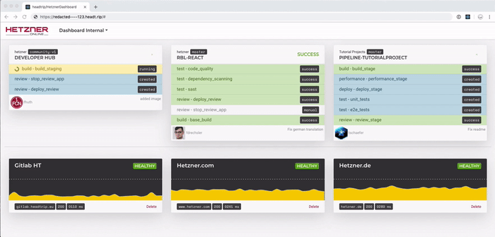

# Real-time Applications with Go and ReactJS: Building a minimalistic real-time HTTP Server

## About the Series

This is the first Part of a Series of Tutorials called **Real-time Applications with Go and ReactJS**. We will build a Live Dashboard that Monitors Servers and receives Webhooks by GitlabCI (or any CI really), rendering this Data live to every Client that is connected **without any delay**.

This is what the App will look like in the End:

[](../assets/real-time-apps-with-go-and-reactjs.mp4)

We gonna cover every step from an empty text editor to configuring your CI for the dashboard and deploy the docker container we will build.

**Technologies covered**

-   GoLang for the Server
    
-   HTTP/2 and Server-Sent Events (SSE)
    
-   ReactJS for the Client
    
-   Docker for Building the App and Deploying it
    

**Series Index**

-   Part 1: Basic HTTP Eventstreaming Server (*)
    
-   Part 2: Implementing the SSE Protocol Standard (not yet released)
    
-   Part 3: Building a Basic UI with ReactJS (not yet released)
    
-   Part 4: Visualizing Realtime Data with React (not yet released)
    
-   Part 5: Continious Integration and Deployment Setup (not yet released)
    
At reviewing the Tutorial with a Colleague @schaeferthomas he stated that "real-time" can be understood in different ways. For this Tutorial i use it in the Context of Public Networking Appliactions using the Definition of Oxford English:

> \[adjective\] (real-time)Computation of or relating to a system in which input data is processed within milliseconds so that it is available virtually immediately as feedback, e.g., in a missile guidance or airline booking system:*real-time signal processing*
> 
> -   Oxford Pocket Dictionary of Current English
>


## Introduction

**Prerequisites**

-   Basic Networking Knowledge
    
-   Basic Knowledge of HTTP
    
-   Some experience in Parallel or Concurrent Programming
    
-   Minimal Knowledge of GoLang
    

If you did not yet have any contact with golang, no worries. I am not gonna dive deep into the mechanics of go. You should be able to follow even if you haven't used go yet. But wouldn't that be a great time to make the first contact with go?

### What we gonna build in this part

We gonna use the builtin `net/http` package to build a very basic real-time server that keeps connections to an endpoint `/listen` alive and takes input at `/say` to we will have the most minimal possible real-time chat app and see the awesomeness of go.

[](https://asciinema.org/a/231626)
(https://asciinema.org/a/231626)

**Results at over 9000 Requests per Second**

```
Requests      [total, rate]            45005, 9001.05
Duration      [total, attack, wait]    5.000096946s, 4.99997s, 126.946µs
Latencies     [mean, 50, 95, 99, max]  132.54µs, 126.556µs, 174.755µs, 255.119µs, 3.755665ms
Success       [ratio]                  100.00%
```

This will be the base we need to build our ServerSentEvent Server for the Dashboard Application.

## Step 1 - Implementing a HTTP Endpoint `/say`

Starting an HTTP Server in Go is as easy as it gets. The Standard `net/http` Module gives us the `ListenAndServe(address string, handler Handler)` function. The Function will run till it may receive an unrecoverable error, so this is the last Statement in our main function.

```go
http.ListenAndServe(":4000", nil)
```

To implement Handler, one possibility is using the `http.HandleFunc(urlPattern string, handlerFunction Handler)` Method. It takes a Pattern that describes the url, in our example simply `/say` and a Callback Function thats gonna execute on any request to that url.

Lets implement the Callback. The Callback function receives a ResponseWriter interface which has a `Write([]byte]) `.

> The Write Method takes a byte array. That's great for HTTP/2 which is a binary protocol unlike HTTP.

In our case we want to return just a UTF-8 String. Gladly, this isn't C (even if it looks like it is) and the byte array type has a very convenient interface for converting our String to a bytearray: `[]byte("string here")`.

Now we just stick the Parts together:

```go
package main

import "net/http"

func sayHandler(w http.ResponseWriter, r *http.Request) {
    w.Write([]byte("Hi"))
}

func main() {
    http.HandleFunc("/say", sayHandler)
    http.ListenAndServe(":8080", nil)
}
```

Testing it by curl:

```bash
$ curl localhost:4000/say
Hi%
```

## Step 2 - Process Form Input

The Web and HTTP(S)(/2) is a native construct for Go, actually its made for Webdevelopment and Networking.

So of course, it comes with parsing functions for URL and POST/PATCH/PUT Bodys.

`Request.FormValue(key String)` returns a String with the Value of the Key.

So we will just exchange the static "Hi" with the String we read from an Requests URL or Body.

```go
func sayHandler(w http.ResponseWriter, r *http.Request) {
 w.Write([]byte(r.FormValue("name")))

}
```

Test: `curl` (or just open it in any web browser)

```sdafsdf
$ curl localhost:4000/say -d 'name=Florian'
Florian%+
```

For our Chat Application we need another Parameter `message`.

> Usually in Go you would create structs now, but as said in the Intro: This is not a go tutorial and i want to keep the Code short and understandable for People not programming in Go yet.

```go
func sayHandler(w http.ResponseWriter, r *http.Request) {
    name := r.FormValue("name")
    message := r.FormValue("message")

     w.Write([]byte(name + " " + message))
}
```

## Step 3 - Implementing the Endpoint `/listen`

For the listenHandler we do exactly the same as before, but without parsing any input. We will instead tell the Client that the connection should be kept alive.

We create a new Handler `listenHandler` and set the HTTP Header "Connection" to "keep-alive" to tell the Client to not terminate the Connection.

To make sure that we are not Terminating the Connection from our side early, we wait for the Close event of the Client.

```go
//......
func listenHandler(w http.ResponseWriter, r *http.Request) {
    w.Header().Set("Connection", "keep-alive")

    select {
        case <-r.Context().Done():
            return;
    }
}
//......
func main() {
    http.HandleFunc("/listen", listenHandler)
    //......
}
```

The Arrow Syntax "<-" is one of the Core Concepts of Concurrency in Go, it blocks the routine till it receives data from a `channel`.

> A `channel` in go is a typed conduit that can reiceive data`channel <- data` and data can be read from `data <- channel` Writing or Reading from a Channel BLOCKS the subroutine.

## Step 4 - Streaming input Data to the Listeners

We have a `/say` Endpoint, receiving Data from the Client. And a `/listen` Endpoint supposed to send the Data we receive on `/say`to connected clients..

Now lets combine those. To do that, we need a new channel for every listener connected to send them data, we will list them in a global map of channels like so:

`var messageChannels = make(map[chan []byte]bool)`

**listenerHandler**

Now every new Listener should create his own messageChannel:

`_messageChannel := make(chan []byte)`

And then, list it to the messageChannels Map:

`messageChannels[_messageChannel] = true`

```go
func listenHandler(//........
    //........
	_messageChannel := make(chan []byte)
	messageChannels[_messageChannel] =  true
	//........
```

In the Select Statement of the Listen Handler we are actually waiting for Data from the Close Channel before we return the function and end the Connection.

Now, let's just make another Select Case in which we are waiting for Data from the messageChannel and write the data into the Response Stream

```go
func listenHandler(w http.ResponseWriter, r *http.Request) {
	w.Header().Set("Connection", "keep-alive")

	_messageChannel := make(chan []byte)
	messageChannels[_messageChannel] =  true

	for {
		select {
			case _msg := <- _messageChannel:
				w.Write(append(_msg,[]byte("\r\n")...))
				w.(http.Flusher).Flush()
			case <-r.Context().Done():
				delete(messageChannels, _messageChannel)
				return;
		}
	}
}
```

> `w.(http.Flusher).Flush()` sends Data down the HTTP Connection, otherwise go would wait till we are done writing to the ResponseWriter and the Handler exits.

**sayHandler**

In the sayHandler, instead of writing to the output, we should now write to the messageChannels the listener added. We do this in an own routine so we dont let the client wait till we channeled and processed all the data.

Since Concurrency is the main concept of go, the keyword for creating a new co(go)routine is `go`

```go
// sayHandler Function
    // ...
    //old: w.Write([]byte(name + " " + message))
    go func() {
        for messageChannel := range messageChannels {
            messageChannel <- []byte(name + " " + message)
        }
    }()
    w.Write([]byte("ok"))
```

> pay attention to the `}()` at the end, we are creating and instantly invoking the function here.

## Conclusion

And that's it. We just built a Realtime Chat app in 45 Lines of Go.

#### Disclaimer: This is not production Ready Code, for simplicity reason we omitted all the Error Checking and Input Sanitization

```go
package main

import (
	"net/http"
)

var messageChannels = make(map[chan []byte]bool)

func sayHandler(w http.ResponseWriter, r *http.Request) {
	name := r.FormValue("name")
	message := r.FormValue("message")

	go func() {
		for messageChannel := range messageChannels {
			messageChannel <- []byte(name + " " + message)
		}
	}()

	w.Write([]byte("ok."))
}

func listenHandler(w http.ResponseWriter, r *http.Request) {
	w.Header().Set("Connection", "keep-alive")

	_messageChannel := make(chan []byte)
	messageChannels[_messageChannel] =  true

	for {
		select {
			case _msg := <- _messageChannel:
				w.Write(append(_msg,[]byte("\r\n")...))
				w.(http.Flusher).Flush()
			case <-r.Context().Done():
				delete(messageChannels, _messageChannel)
				return;
		}
	}
}

func main() {
	http.HandleFunc("/say", sayHandler)
	http.HandleFunc("/listen", listenHandler)

	http.ListenAndServe(":4000", nil)
}
```

In the next Part we will built the Server-Sent-Event Protocol ourself and connect it to a JavaScript Client for Realtime Browser Action. Thanks for Reading.
