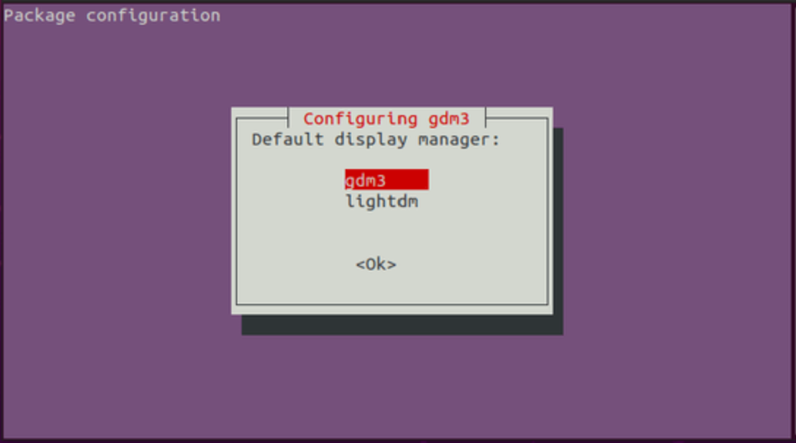
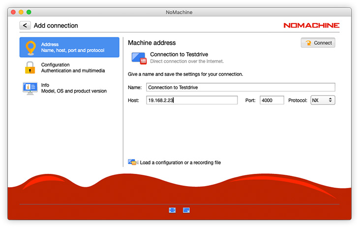

---

SPDX-License-Identifier:  MIT

path:  "/tutorials/remote-desktop-with-nomachine-on-ubuntu"

slug:  "remote-desktop-with-nomachine-on-ubuntu"

date:  "2022-06-25"

title:  "Install and Configure Remote Desktop Access with NoMachine on Ubuntu Server"

short_description:  "This tutorial describes the step-by-step process of installing the XFCE, a lightweight desktop environment, along with the installation and configuration of NoMachine."

tags: ["Remote Dekstop",  "NoMachine",  "Xfce", "Ubuntu"]

author:  "Mohammad-Reza Malekpour"

author_link:  "https://github.com/more-malekpour"

author_img:  "https://avatars.githubusercontent.com/u/62154249?v=4"

author_description:  "M.D. and Data Scientist"

language:  "en"

available_languages: ["en"]

header_img:  "images/banner.jpg"

cta:  "product"

---

  

## Introduction

NoMachine is a free proprietary software for remote desktop access and file transfer. NX technology enables NoMachine to offer extra features and significantly better performance than other remote desktop tools, such as Xrdp and VNC. 
Moreover, it is truely cross-platform and seamlessly runs on Windows, Mac, Linux, Android, and even iOS devices. Thus, you can access your *Hetzner* server whenever you want, wherever you are!

This tutorial describes the step-by-step process of installing the XFCE, a lightweight desktop environment, along with installation and configuration of NoMachine.

**Prerequisites**
1.  An Ubuntu server
2.  SSH access with `sudo` privilege

## Step 1 - `XFCE Installation`

As usual, first let's update the list of available packages of *aptitude*:
```bash
sudo apt update
```
Be aware that installation of XFCE is so easy that it sometimes hurts😉:
```bash
sudo apt install xfce4
```


Depending on the version of your Ubuntu, while installing the XFCE, it might ask for the default display manager. Feel free to select the default display manager and select the OK.


## Step 2 - `NoMachine Installation`

To install NoMachine, you need to download the `.deb` package from its official website at https://nomachine.com/download/linux. Considering the modern infrastructure of *Hetzner* cloud, you need to download the `amd64` architecture.

At the time of writing this tutorial, the latest version (7.10) of NoMachine can be downloaded with the following command:
```bash
wget https://download.nomachine.com/download/7.10/Linux/nomachine_7.10.1_1_amd64.deb
```
Finally, install the `.deb` package:
```bash
sudo dpkg -i nomachine_7.10.1_1_amd64.deb
``` 

## Step 3 - `NoMachine Configuration`
If you've installed XFCE as in this tutorial, there is no need to change default configuration of NoMachine at `/usr/NX/etc/node.cfg`. 

However, you might have installed another desktop environment. In that case, head over to `/usr/NX/etc/node.cfg` and change the value of `DefaultDesktopCommand` according to your desktop environment as below:
  

* GNOME - `DefaultDesktopCommand "/usr/bin/gnome-session"`

* KDE Plasma - `DefaultDesktopCommand "/usr/bin/startplasma-x11"`

* LXDE - `DefaultDesktopCommand "/usr/bin/startlxde"`

* XFCE - `DefaultDesktopCommand "/usr/bin/startxfce4"`
  
 Then, restart the NoMachine:
 ```bash
sudo /etc/NX/nxserver --restart
```

**Note**: If you have an active firewall on your server, allow connection to port 4000 as below:

```bash
sudo ufw allow 4000
```

## Step 4 - `Client Connection`
Finally, check out the https://nomachine.com/download, and install the NoMachine client based on your local device that will connect to the server. Run the NoMachine in the local device, click the `Add` button, fill the host with your server's public IP address, and leave other parameters as default. 



Next, click the `Connect` button and enter your Ubuntu username (e.g., `root` as default) and password. If you've not set the password yet, you can simply do it interactively with `passwd` command.

Enjoy!

## Conclusion

This tutorial provided instructions on how to install XFCE desktop and NoMachine on Ubuntu servers for remote desktop access, along with step-by-step configuration of NoMachine.

  

##### License: MIT

  

<!--

  

Contributor's Certificate of Origin

  

By making a contribution to this project, I certify that:

  

(a) The contribution was created in whole or in part by me and I have

the right to submit it under the license indicated in the file; or

  

(b) The contribution is based upon previous work that, to the best of my

knowledge, is covered under an appropriate license and I have the

right under that license to submit that work with modifications,

whether created in whole or in part by me, under the same license

(unless I am permitted to submit under a different license), as

indicated in the file; or

  

(c) The contribution was provided directly to me by some other person

who certified (a), (b) or (c) and I have not modified it.

  

(d) I understand and agree that this project and the contribution are

public and that a record of the contribution (including all personal

information I submit with it, including my sign-off) is maintained

indefinitely and may be redistributed consistent with this project

or the license(s) involved.

  

Signed-off-by: [Mohammad-Reza Malekpour | more.malekpour@outlook.com]

  

-->
