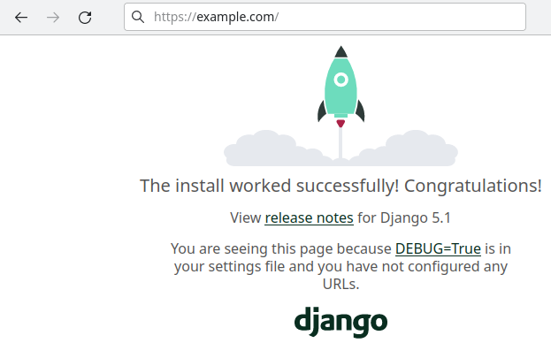

## Introduction

In this tutorial we will learn how to run a Python Django app on Webhosting or Managed Server. Django is a python web framework. By default it does run on WSGI (interface between webserver and application), but mod_wsgi is not available on the managed Apache server. Nevertheless, there are different ways to convert the WSGI to other compatible interfaces.
 
**Prerequisites**

- [Webhosting](https://www.hetzner.com/webhosting?country=ot) with SSH support (>= Level 9) or [Managed Server](https://www.hetzner.com/managed-server?country=ot) with enabled SSH access

## Step 1 - Install dependencies

### Step 1.1 - Install and enable virtualenv 

```bash
pip3 install --break-system-packages virtualenv
mkdir /usr/home/holu/virtualenvs
python3 -m virtualenv /usr/home/holu/virtualenvs/example_com
. /usr/home/holu/virtualenvs/example_com/bin/activate
```

### Step 1.2 - Install Django

Install the framework Django.

```bash
pip install django
```

### Step 1.3 - Install Flup (Optional, required for FastCGI)

Install the wsgi-to-fcgi flup server.

```bash
pip install flup
```

## Step 2 - Create and configure your Django project

### Step 2.1 - Start project

Create the project directory and start the project.

```bash
mkdir  /usr/home/holu/djangoprojects
env -C "/usr/home/holu/djangoprojects" django-admin startproject example_com
```

### Step 2.2 - Configure project

Add all requesting domains to the ALLOWED_HOSTS variable to allow the access.

```bash
vim /home/holu/djangoprojects/example_com/example_com/settings.py 
```

```python
ALLOWED_HOSTS = ['example.com']
```

## Step 3 - Prepare document root of webserver

Create an empty website directory and change the document root in konsoleH. 

```bash
mkdir /usr/home/holu/public_html/example_com
```

### Step 3 Option 1 - FastCGI

#### Create .htaccess

Create the .htaccess with the content below.

```bash
vim /usr/home/holu/public_html/example_com/.htaccess
```

```apacheconf
<IfModule mod_rewrite.c>
  RewriteEngine On
  RewriteBase /
  RewriteCond %{REQUEST_FILENAME} !-f
  RewriteRule ^(.*)$ djangoapp.fcgi/$1 [QSA,L]
</IfModule>
```

#### Create ".fcgi"-script

Create the djangoapp.fcgi with the content below.

```bash
vim /usr/home/holu/public_html/example_com/djangoapp.fcg
#!/usr/home/holu/virtualenvs/example_com/bin/python

import sys
import os
import django
from flup.server.fcgi import WSGIServer
from django.core.handlers.wsgi import WSGIHandler

sys.path.append("/usr/home/holu/djangoprojects/example_com")
os.environ['DJANGO_SETTINGS_MODULE']="example_com.settings"

django.setup(set_prefix=False)
WSGIServer(WSGIHandler()).run()
```

Set the executable bit for the owner.

```bash
chmod 744 /usr/home/holu/public_html/example_com/djangoapp.fcgi
```

### Step 3 Option 2 - CGI

#### Create .htaccess

Create the .htaccess with the content below.

```bash
vim /usr/home/holu/public_html/example_com/.htaccess
```

```apacheconf
<IfModule mod_rewrite.c>
  RewriteEngine On
  RewriteBase /
  RewriteCond %{REQUEST_FILENAME} !-f
  RewriteRule ^(.*)$ djangoapp.cgi/$1 [QSA,L]
</IfModule>
```

#### Create ".cgi"-script

Create the djangoapp.cgi with the content below.

```bash
vim /usr/home/holu/public_html/example_com/djangoapp.cgi
```

```python
#!/usr/home/holu/virtualenvs/example_com/bin/python

import sys
import os
import django
import wsgiref.handlers
from django.core.handlers.wsgi import WSGIHandler

sys.path.append("/usr/home/holu/djangoprojects/example_com")
os.environ['DJANGO_SETTINGS_MODULE']="example_com.settings"

django.setup(set_prefix=False)
wsgiref.handlers.CGIHandler().run(WSGIHandler())
```
Set the executable bit for the owner.

```bash
chmod 744 /usr/home/holu/public_html/example_com/djangoapp.cgi
```

## Step 4 - Test

Test it by visiting your domain. You should see something like on the screenshot below.



## Conclusion

Now you can deploy your Django apps on the managed OS.

- [Django documentation](https://docs.djangoproject.com)

##### License: MIT

<!--

Contributor's Certificate of Origin

By making a contribution to this project, I certify that:

(a) The contribution was created in whole or in part by me and I have
    the right to submit it under the license indicated in the file; or

(b) The contribution is based upon previous work that, to the best of my
    knowledge, is covered under an appropriate license and I have the
    right under that license to submit that work with modifications,
    whether created in whole or in part by me, under the same license
    (unless I am permitted to submit under a different license), as
    indicated in the file; or

(c) The contribution was provided directly to me by some other person
    who certified (a), (b) or (c) and I have not modified it.

(d) I understand and agree that this project and the contribution are
    public and that a record of the contribution (including all personal
    information I submit with it, including my sign-off) is maintained
    indefinitely and may be redistributed consistent with this project
    or the license(s) involved.

Signed-off-by: [Alexander Knerlein alexanderknerlein@outlook.de]

-->
