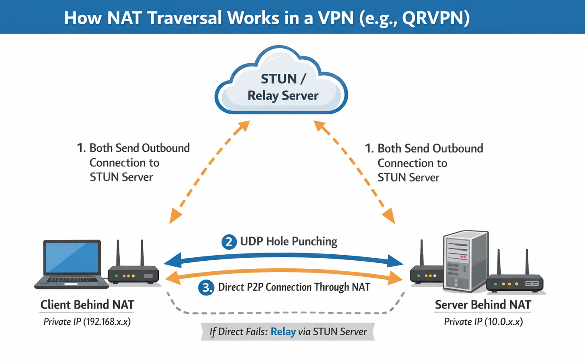
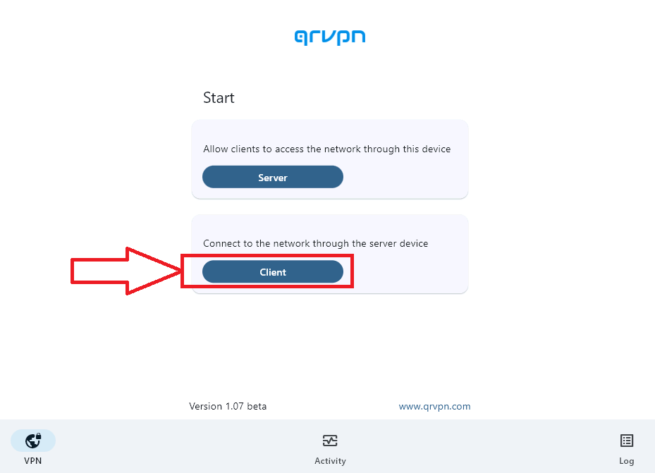
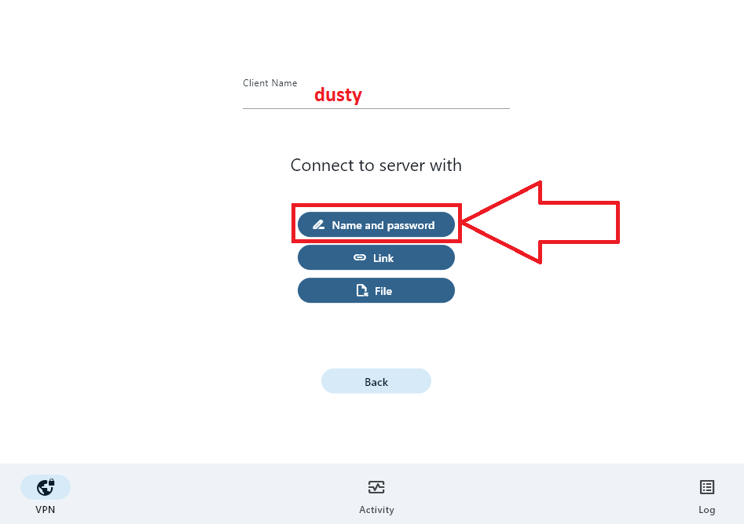
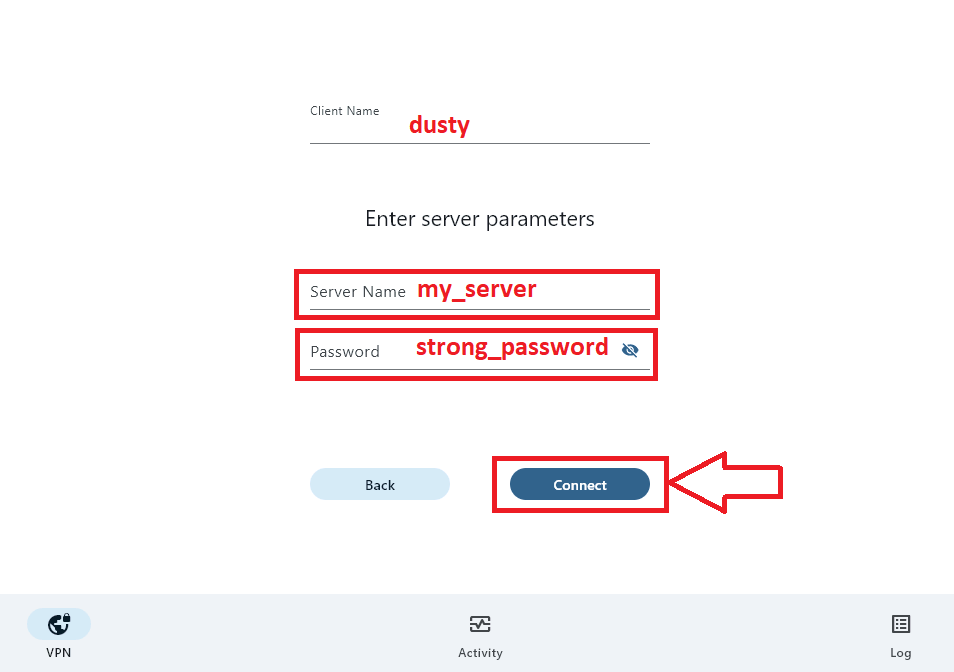
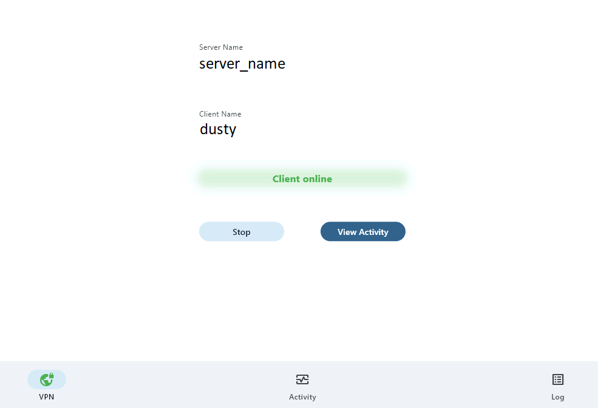

## Einführung

Dieses Tutorial zeigt, wie **Qrvpn** auf einem **Rocky-Linux-VPS** mit **Docker** bereitgestellt wird und wie man sich von einem Windows-Client damit verbindet.

[Qrvpn][qrvpn] wird von [VentoByte][ventobyte] entwickelt, dem Team hinter [Proxifier][proxifier].

**Qrvpn** basiert auf dem branchenführenden WireGuard-VPN-Protokoll. Es bietet optimale Performance und eine moderne Ende-zu-Ende-Verschlüsselung für Daten während der Übertragung. Es werden keine Daten gespeichert.

**Voraussetzungen**

Bevor du beginnst, benötigst du:

* Einen [VPS][hetzner] mit [Rocky Linux 10][rocky]
* `root`- oder `sudo`-Zugriff
* Eine öffentliche IPv4-Adresse

### Wie Qrvpn funktioniert

Dieser Abschnitt erklärt, warum Qrvpn keine offenen Ports benötigt.

#### Architektur auf hoher Ebene

**Qrvpn** verwendet ein **reines Outbound-Verbindungsmodell** in Kombination mit **NAT-Traversal** und **verschlüsselten Relays**.  
Weder der Server noch der Client lauschen jemals auf eingehende Verbindungen.

Wichtige Details:

* Der Datenverkehr bleibt **Ende-zu-Ende verschlüsselt**.
* Das Relay kann keine Nutzdaten einsehen.
* Keine offenen Ports erforderlich.



#### Verbindungsablauf

<table border="1" style="min-width:29rem;">
<tr><td>Server-Registrierung</td>
<td>
<br>

Wenn der Qrvpn-Server startet:

* Öffnet er eine **ausgehende verschlüsselte Verbindung** zur **Qrvpn-Backend-Infrastruktur**.
* Registriert seine kryptografische Identität.
* Hält eine Heartbeat-Verbindung aufrecht.

Da die Verbindung ausgehend ist, funktioniert sie auch hinter NAT und Firewalls. Das bedeutet:

* Der Server ist aus dem öffentlichen Internet nicht erreichbar.
* Die Angriffsfläche wird drastisch reduziert.

</td>
</tr>

<tr><td>Client-Authentifizierung</td>
<td>
<br>

Wenn sich ein Client verbindet:

* Öffnet auch er eine **ausgehende Verbindung** zum **Qrvpn-Backend-Server**.
* Authentifiziert sich und fordert Zugriff auf den Server an.

Auch hier ist kein eingehender Traffic erforderlich.

</td>
</tr>

<tr><td>NAT-Traversal (Direkter Tunnel)</td>
<td>
<br>

**Qrvpn** versucht, einen **direkten Peer-to-Peer-Tunnel** mittels NAT-Traversal-Techniken (ähnlich WebRTC) aufzubauen:

```
Client <--- Verschlüsselter P2P-Tunnel --->  Server
```

Wenn dies erfolgreich ist:

* Fließt der Traffic direkt
* Geringe Latenz
* Kein Relay notwendig

</td>
</tr>

</table>

## Schritt 1 - Docker auf Rocky Linux installieren

Ich habe eine [Rocky Linux 10][rocky]-VPS-Instanz bei der [Hetzner Cloud][hetzner] gekauft.

Du musst Docker auf deiner Rocky--Linux-Instanz installieren.  
Falls du eine andere Linux-Distribution verwendest, folge den Anweisungen auf der offiziellen [Docker-Website][docker_install].

```sh
# System aktualisieren
dnf -y update

# Nützliche Pakete installieren
dnf -y install \
	epel-release \
	bash-completion

# Linux-Instanz neu starten
reboot
```
```sh
# Docker-Repository hinzufügen
dnf config-manager \
	--add-repo \
	https://download.docker.com/linux/centos/docker-ce.repo

# Docker Engine installieren
dnf -y install \
	docker-ce \
	docker-ce-cli \
	containerd.io \
	docker-compose-plugin

# Docker-Dienst aktivieren und starten
systemctl --now enable docker

# Installation überprüfen
docker version
```

## Schritt 2 - Docker-Image bauen

Nach der Installation von Docker müssen wir unser Docker-Image erstellen.
Wie du vielleicht weißt, sind Docker-Images unveränderlich, das heißt, sie können nach der Erstellung nicht mehr modifiziert werden.

```sh
# Projektverzeichnis erstellen
mkdir /etc/qrvpn

# In das Verzeichnis wechseln
cd /etc/qrvpn

# Dockerfile mit vim erstellen
vi Dockerfile
```

Dies ist unsere `Dockerfile`-Konfigurationsdatei mit den Anweisungen, wie Docker das Image bauen soll.

**Dockerfile**

```md
# Rocky Linux als Basis-Image verwenden
FROM rockylinux/rockylinux:10

# Qrvpn-Laufzeitumgebung
ENV PATH=$PATH:/etc/qr
WORKDIR /etc/qr

RUN \
	curl -O "https://get.qrvpn.com/qrvpn.tgz" && \
	tar -zxvf qrvpn.tgz && \
	rm -rf qrvpn.tgz

# Startpunkt des Images festlegen
ENTRYPOINT ["sh", "-c", "qrvpn $QR_MODE $QR_SERVER_NAME $QR_PASSWORD $QR_INSTANCE_ID"]
```

Nun bauen wir das neue Image.

```sh
# Build
docker build --rm -t qrvpn:1.0 --file Dockerfile ./

# Docker-Images auf dem System anzeigen
docker image list --all
```

## Schritt 3 - Docker-Container starten

Du musst 4 Umgebungsvariablen angeben, um **Qrvpn** zu starten.

```sh
# QR_MODE         -->  "server" oder "client"
# QR_SERVER_NAME  -->  eine zufällige Zeichenkette
# QR_PASSWORD     -->  Server-Passwort
# QR_INSTANCE_ID  -->  eine 6-stellige Zahl
```
```sh
# Container starten
docker run -d \
	--name=c_qrvpn \
	--restart always \
	--cap-add NET_ADMIN \
	--device /dev/net/tun \
	--sysctl net.ipv4.conf.all.src_valid_mark=1 \
	-e QR_MODE=server \
	-e QR_SERVER_NAME=my_server \
	-e QR_PASSWORD=strong_password \
	-e QR_INSTANCE_ID=333999 \
	qrvpn:1.0
```
```sh
# Logs prüfen
docker logs c_qrvpn
```

Wenn du eine Fehlermeldung wie unten siehst, ändere den `QR_SERVER_NAME`.

```sh
# [E] Server with this name already exists.
```

Wenn der Server erfolgreich läuft, solltest du eine ähnliche Ausgabe sehen:

```sh
# [M] Initialization started
# [M] VPN interface opened tun0
# [M] VPN interface initialized
# [M] Server ready
```

## Schritt 4 - Verbindung von Windows herstellen

### Schritt 4.1 - Qrvpn-Client herunterladen

Lade den Windows-Client von der offiziellen [Qrvpn][qrvpn_download]-Website herunter.

### Schritt 4.2 - Client-Bereich

* Öffne den Qrvpn-Client.
* Klicke auf die Schaltfläche **Client**.
  

* Wähle **Name and Password**.
  

* Gib **Server Name** und **Password** ein.
  
  

* Überprüfe mit einem Webbrowser, ob sich deine öffentliche IP-Adresse geändert hat (z.B. unter [ip.hetzner.com](https://ip.hetzner.com/)).

## Ergebnis

Du hast **Qrvpn** erfolgreich auf einem Rocky-Linux-VPS mit Docker bereitgestellt und einen Windows-Client verbunden.

Dieses Setup ist leichtgewichtig, reproduzierbar und einfach zu warten - ideal für den persönlichen Gebrauch oder kleine Teams.

[hetzner]: https://www.hetzner.com/cloud/
[rocky]: https://rockylinux.org/
[docker_install]: https://docs.docker.com/engine/install/

[ventobyte]: https://ventobyte.com/
[proxifier]: https://www.proxifier.com/
[qrvpn]: https://www.qrvpn.com/
[qrvpn_download]: https://www.qrvpn.com/download/

##### License: MIT

<!--

Contributor's Certificate of Origin

By making a contribution to this project, I certify that:

(a) The contribution was created in whole or in part by me and I have
    the right to submit it under the license indicated in the file; or

(b) The contribution is based upon previous work that, to the best of my
    knowledge, is covered under an appropriate license and I have the
    right under that license to submit that work with modifications,
    whether created in whole or in part by me, under the same license
    (unless I am permitted to submit under a different license), as
    indicated in the file; or

(c) The contribution was provided directly to me by some other person
    who certified (a), (b) or (c) and I have not modified it.

(d) I understand and agree that this project and the contribution are
    public and that a record of the contribution (including all personal
    information I submit with it, including my sign-off) is maintained
    indefinitely and may be redistributed consistent with this project
    or the license(s) involved.

Signed-off-by: Nik oqabemail@gmail.com

-->
