## Introduction

WordPress is a popular CMS (content management system) written in PHP, with a large number of plugins and themes developed by community.
When it comes to working with WordPress, usually you want to set up a local development environment and once the project is complete, deploy it to a server.
How to do it without a hassle? One option is to use containers.

WordPress is a complex piece of software, it requires
the web server (nginx), database server (MariaDB) and of course PHP installation (PHP-FPM) to work.
You can configure the above software manually, directly on your host.
The problem comes up when you need to run multiple WordPress websites, which may require different
PHP versions, configuration and incompatible PHP extensions. Some dependencies may not be available in the package repositories of your distro.
Not to mention that the client website you're working on may contain malicious plugins and you don't want to allow them to access your personal files on the host.
If you're working in a team, it's helpful to have the same versions and configuration of software, which is hard to achieve by installing everything directly on the host.

One way to isolate the WordPress websites from each other and from the host is to use Docker. As I mentioned earlier, WordPress requires multiple software
packages to work, hence we will use Docker Compose to manage services for each major component. One of the tenets of Docker is that each container
should do one thing only. That means a separate container for the web server, database server and PHP is needed.
In theory it's not strictly required to use Docker Compose.
You can start your containers using `docker run`, but managing containers for WordPress this way will be annoying and time consuming.

**Prerequisites**

* Docker Engine and Docker Compose are installed on your host. On Ubuntu you can [install Docker using apt repository](https://docs.docker.com/engine/install/ubuntu/#install-using-the-repository). The proprietary Docker Desktop is not needed for this tutorial to work.

  [Add your user to the `docker` group](https://docs.docker.com/engine/install/linux-postinstall/#manage-docker-as-a-non-root-user).

* Basic understanding of Docker is needed. You can read a [Docker tutorial](https://community.hetzner.com/tutorials/howto-docker-container) to get familiar with it.

* A user with sudo privileges.

## Step 1 - Creating a new WordPress website using Docker Compose

Follow this step if you want to create a new WordPress website and develop it using Docker.

Skip to [Step 2](#step-2---running-an-existing-wordpress-website-in-docker) if you have an existing WordPress website that you want to run in Docker.

Create a directory where you will store your project files:

* Replace `wordpress-compose` with any desired directory name.

```bash
mkdir wordpress-compose && cd wordpress-compose
```

Let's create `compose.yaml` where we will define the services needed to run WordPress:

```bash
nano compose.yaml
```

Paste the following content:

```yaml
# File compose.yaml
services:
    wordpress:
        image: wordpress:fpm
        environment:
            - WORDPRESS_DB_HOST=mariadb
            - WORDPRESS_DB_NAME=${DB_NAME}
            - WORDPRESS_DB_USER=root
            - WORDPRESS_DB_PASSWORD=${MARIADB_ROOT_PASSWORD}
        volumes:
        - ./www:/var/www/html
    nginx:
        image: nginx
        volumes:
        - ./nginx.conf:/etc/nginx/conf.d/default.conf
        - ./www:/var/www/html
        ports:
        - 80:80
    mariadb:
        image: mariadb
        restart: always
        environment:
            - MARIADB_DATABASE=${DB_NAME}
            - MARIADB_ROOT_PASSWORD=${MARIADB_ROOT_PASSWORD}
        volumes:
        - db-data:/var/lib/mysql
volumes:
    db-data:
```

The services are described below.

| Service | Description |
| --- | --- |
| `wordpress` | The WordPress itself and PHP server to run it. Specifically, its `fpm` image variant is used for performance and reliability reasons, instead of its default `apache` variant. |
| `nginx` | nginx is used as a reverse proxy. It  serves the static content (like images) and delegates the dynamic content generation to the `wordpress` service. |
| `mariadb` | WordPress stores the information like users and posts in the MySQL/MariaDB database. `mariadb` service is used to provide one. |

The `db-data` volume is used for persistent storage of the database data.

WordPress is stored in the local directory `./www`.
Both `nginx` and `wordpress` services need to have access to it. The `./www` directory is initially empty, but WordPress will be copied there by the `wordpress` service.

Create the `.env` file for storing the WordPress database name and root password:

* Replace `your_password` with a desired password for the database root user.
* In later steps the `.env` file will be used to define the additional variables.

```bash
# File .env
DB_NAME=wordpress
MARIADB_ROOT_PASSWORD=your_password
```

<a name="nginx_conf"></a> You need to provide a configuration for the nginx service. It will act as a reverse proxy by passing dynamic content requests to PHP-FPM.
Create the `nginx.conf` file with following content:

```nginx
# File nginx.conf
server {
    listen 80;
    root /var/www/html;
    index index.html index.php;

    location / {
        try_files $uri $uri/ /index.php?$args;
    }

    location ~ \.php$ {
        try_files $fastcgi_script_name =404;
        fastcgi_pass wordpress:9000;
        fastcgi_param SCRIPT_FILENAME $document_root$fastcgi_script_name;
        include fastcgi_params;
    }
}
```

Now, the directory listing of `wordpress-compose` should look as follows:

```
wordpress-compose
├── compose.yaml
├── .env
└── nginx.conf
```

Run the following command to start containers:

```bash
docker compose up
```

> **Note:**
> You can run containers in the background by passing `-d` flag: `docker compose up -d`.

Open <http://localhost> in a browser. Choose a desired language for your website:

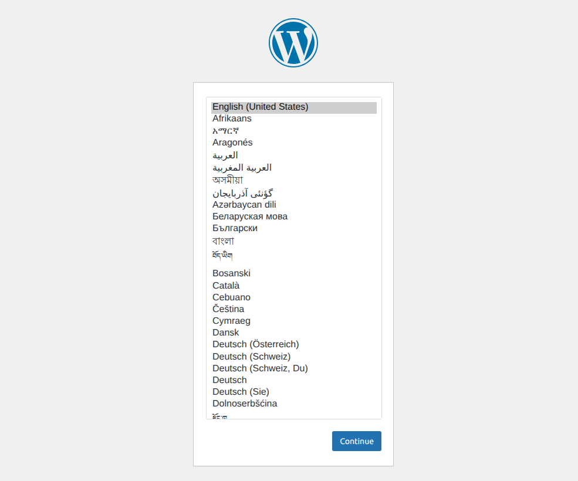

The website setup is almost complete.
Choose the website title, specify the username and password for the new user.
And click _Install WordPress_.

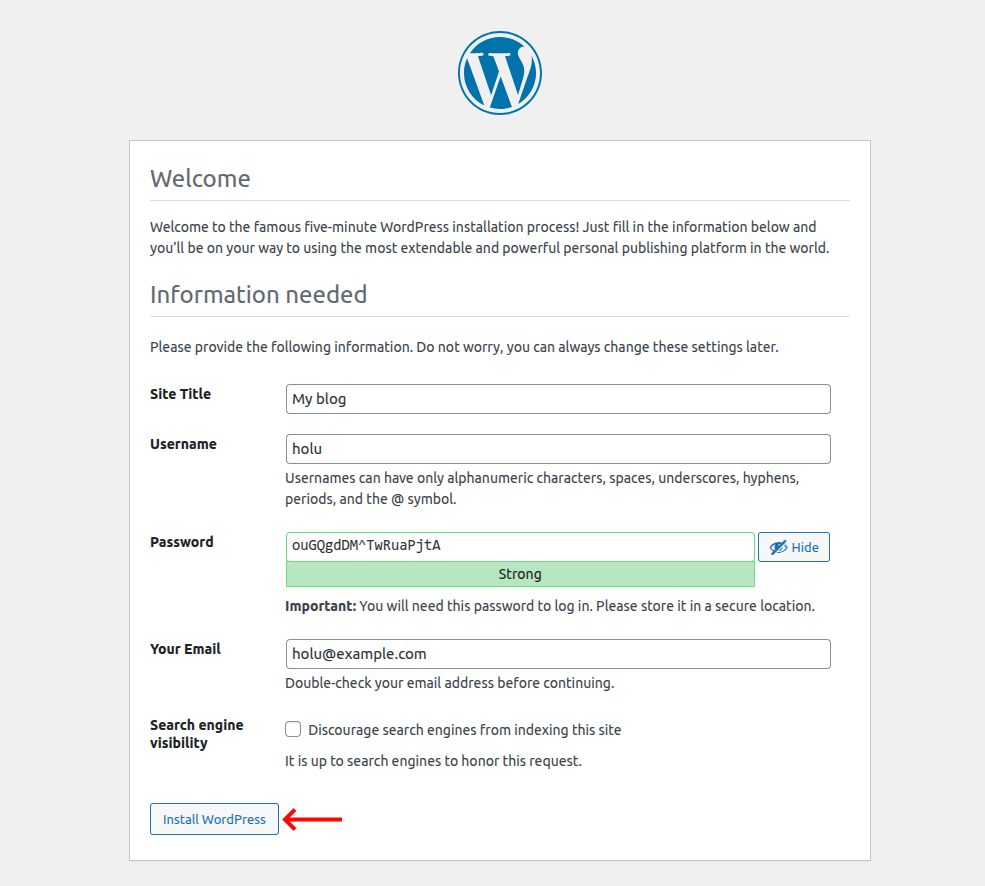

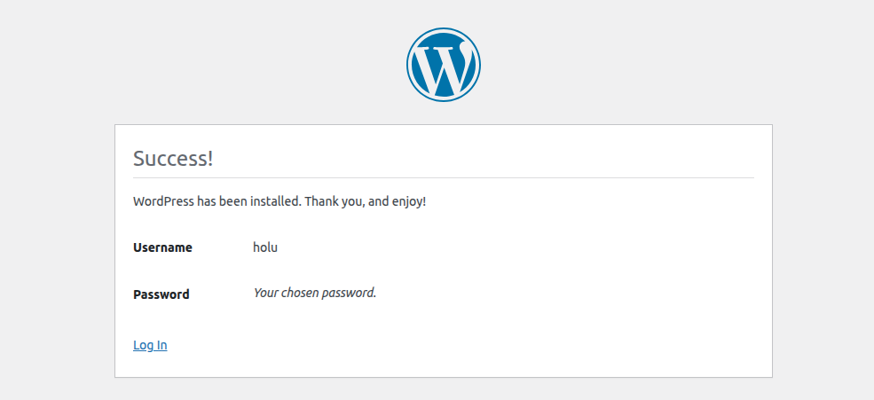

Now, you can open <http://localhost> in a browser. You should see the website homepage with a default theme:

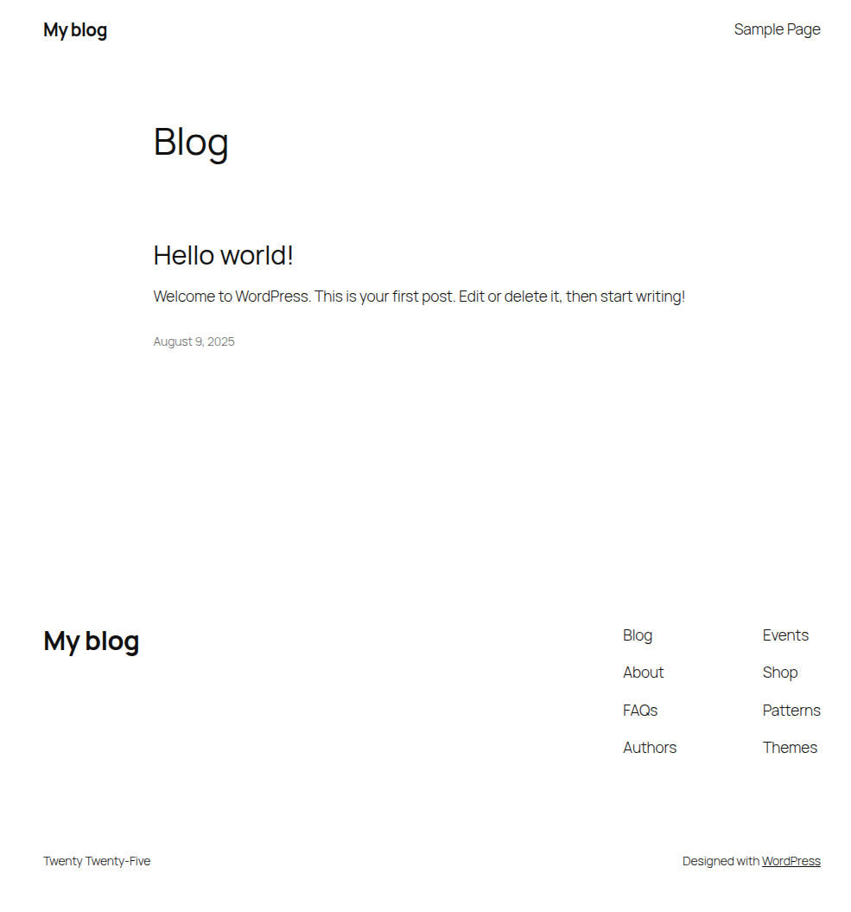

You can open <http://localhost/wp-admin/> to access the WordPress dashboard:

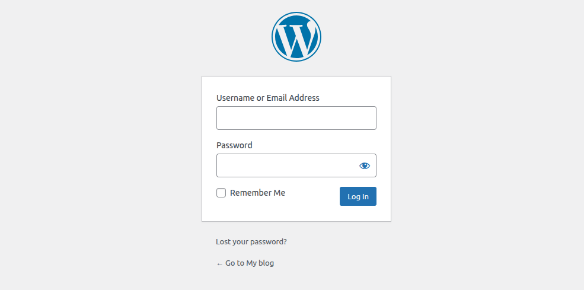

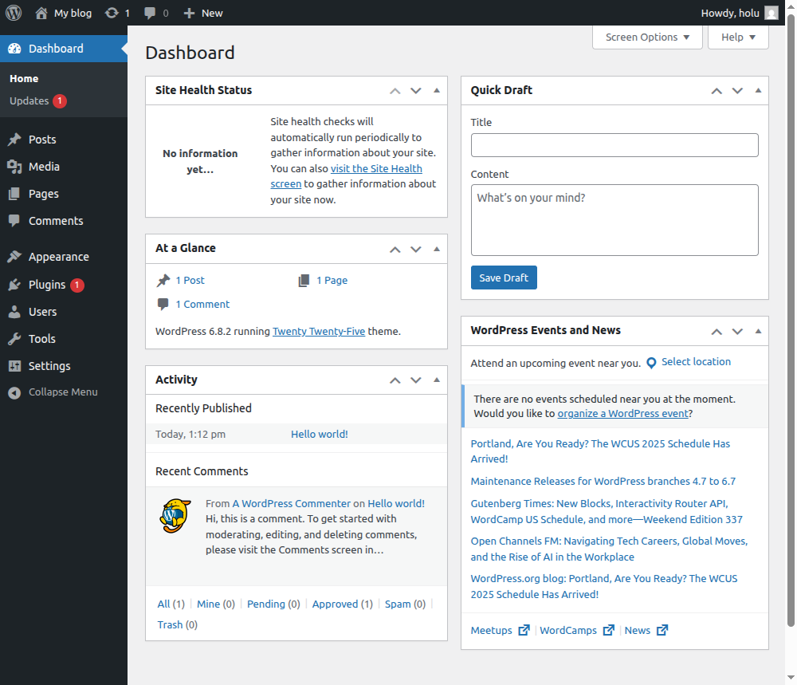

### Step 1.1 - Installing a custom theme or plugin

You can install plugins and themes, and update them from the WordPress dashboard.
They will be downloaded from the official WordPress directory.

But what if you want to install a custom plugin or a premium theme which is not available in the official sources?
You can copy your plugins into the `wp-content/plugins`, and themes can be put into the `wp-content/themes`.

You can find those directories in the directory in which you ran `docker compose`. If you followed the example above, you can find the directories in `wordpress-compose`.

For example, to install a custom theme:

1. Copy a theme directory to `wp-content/themes`:

   * Replace `custom_theme` with a path to your theme.

   ```bash
   sudo cp -rp custom_theme www/wp-content/themes
   ```

2. Open <http://localhost/wp-admin/themes.php> in your browser and click _Activate_ on a copied theme:

   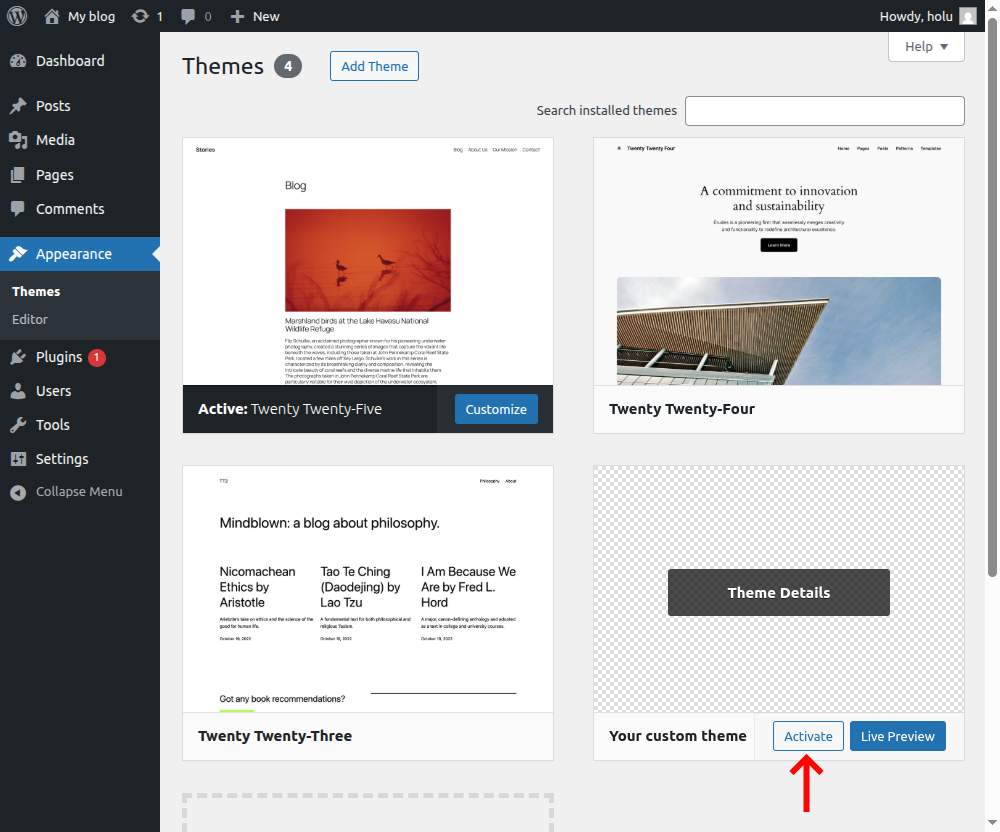

### Step 1.2 - Exporting a complete project

To make a copy of the WordPress website which can be deployed to a hosting, you need to perform two steps.
The first one is to make a copy of all the files of your website. And the second one is to make a database dump, which contains posts, users and settings of your WordPress website. To do this, follow the instructions below.

#### Step 1.2.1 - Creating an archive of the files

Once the WordPress website is complete and you're ready to deploy it, you can prepare its archive, which can be extracted on your hosting.

```bash
cd wordpress-compose && tar -czf wordpress-site.tar.gz -C www .
```

To deploy your website, copy the tar file to the web root of your hosting and extract it:

```bash
tar -xzf wordpress-site.tar.gz
```

You may need to adjust the database related configuration variables inside the `wp-config.php` file.
Particularly the database host (`DB_HOST`), database name (`DB_NAME`) and user credentials (`DB_USER` and `DB_PASSWORD`) need to be adjusted.

Disable `WP_DEBUG`, if it's enabled. By setting it to `false`, like this: `define( 'WP_DEBUG', false );`.

#### Step 1.2.2 - Creating a database dump

Now, you need to create a dump of your MariaDB database in the `.sql` file format. To do this, run the following command:

> **Note:**
> To run this command, the `mariadb` container should be running, i.e. you need to run `docker compose up` first.

* <a name="docker_ps"></a> Replace `wordpress-compose-mariadb-1` with a cotainer name, which can be found by running `docker ps`.
  The `wordpress-compose` prefix corresponds to the name of directory of the `compose.yaml` file, which
  is followed by `mariadb` which is the service name.
* `wordpress` is the database name defined in the `.env` file.
* You will be asked for a password, which is defined as `MARIADB_ROOT_PASSWORD` in the `.env` file.

```bash
docker exec -i wordpress-compose-mariadb-1 mariadb-dump wordpress -p > dump.sql
```

Alternatively, you can run the following command, which will select the right container for the `wordpress` service for you:

```bash
docker compose exec -T mariadb mariadb-dump wordpress -p > dump.sql
```

If the database is large, you can compress it:

```bash
docker compose exec -T mariadb mariadb-dump wordpress -p | gzip > dump.sql.gz
```

The resulting database dump can be imported to the destination using the following command:

* Replace `wordpress` with a database name created on your hosting.
* Replace `root` with a user which is allowed to modify the database.

```bash
mariadb wordpress -u root -p < dump.sql
```

#### Step 1.2.3 - Changing the domain of a website

If you have used `localhost` as a website domain while developing, and once deployed it will use `example.com`,
you need to change the domain inside the WordPress database.

This can be done using [WP-CLI].

[Install WP-CLI] on your server. To replace all occurrences of `http://localhost` with `https://example.com`, run:

* Change `/var/www/wordpress` with a web root of your website.
* Change `http://localhost` and `https://example.com` with an old and new domain respectively.

```bash
cd /var/www/wordpress && \
wp search-replace http://localhost https://example.com
```

[WP-CLI]: https://wp-cli.org
[Install WP-CLI]: https://community.hetzner.com/tutorials/installing-wordpress-on-ubuntu#step-23---installing-wp-cli

## Step 2 - Running an existing WordPress website in Docker

This step will be focused on running an existing WordPress website in a container, using Docker Compose.

If you want to create a new WordPress website follow [Step 1](#step-1---creating-a-new-wordpress-website-using-docker-compose) instead.

**Prerequisites**

* Copy of the web root directory of your WordPress website.

  It must include folders like `wp-admin`, `wp-content` and files like `index.php`.

* Dump of your WordPress database in the `.sql` format.

  Which can be made:

  * [Using `mysqldump`/`mariadb-dump` utility](#step-122---creating-a-database-dump).

  * phpMyAdmin database export functionality:

    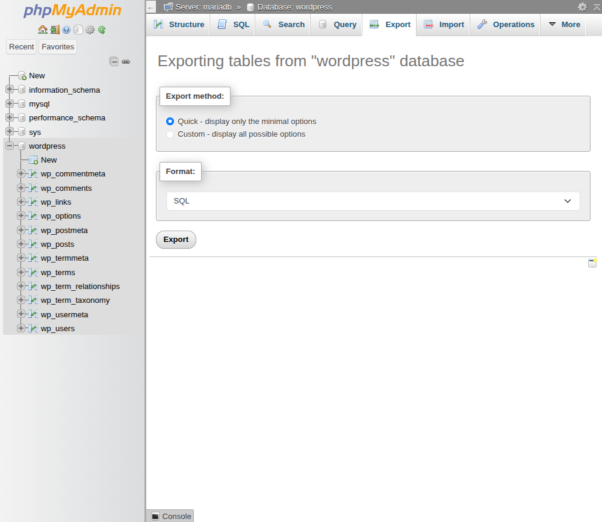

  * [WP-CLI `db export` command](https://developer.wordpress.org/cli/commands/db/export/)
  or by other tools.

### Step 2.1 - Preparing files and folders

Create a directory where you will store your project files:

* Replace `wordpress-compose-import` with any desired directory name.

```bash
mkdir wordpress-compose-import && cd wordpress-compose-import
```

Now, put a database dump there, and name it `dump.sql`.

Place your WordPress files inside the `www` directory.

You need to download WP-CLI to the current working directory, which will be used for search and replace inside the database tables.

```bash
curl -fLO https://raw.githubusercontent.com/wp-cli/builds/gh-pages/phar/wp-cli.phar && \
chmod +x wp-cli.phar
```

Create the `compose.yaml` file, which will look as follows:

```yaml
# File compose.yaml
services:
    wordpress:
        image: wordpress:fpm
        environment:
            - WORDPRESS_DB_HOST=mariadb
            - WORDPRESS_DB_NAME=${DB_NAME}
            - WORDPRESS_DB_USER=root
            - WORDPRESS_DB_PASSWORD=${MARIADB_ROOT_PASSWORD}
        volumes:
        - ./www:/var/www/html
        - ./wp-cli.phar:/usr/local/bin/wp
    nginx:
        image: nginx
        volumes:
        - ./nginx.conf:/etc/nginx/conf.d/default.conf
        - ./www:/var/www/html
        ports:
        - 80:80
    mariadb:
        image: mariadb
        restart: always
        environment:
            - MARIADB_DATABASE=${DB_NAME}
            - MARIADB_ROOT_PASSWORD=${MARIADB_ROOT_PASSWORD}
        volumes:
        - db-data:/var/lib/mysql
        - ./dump.sql:/docker-entrypoint-initdb.d/dump.sql
volumes:
    db-data:
```

Two more files are needed: `.env` and `nginx.conf`. They are the same as in [Step 1](#step-1---creating-a-new-wordpress-website-using-docker-compose).

After all necessary files are created, the `wordpress-compose-import` directory should look as follows:

```
wordpress-compose-import
├── compose.yaml
├── dump.sql
├── .env
├── nginx.conf
├── wp-cli.phar
└── www
    ├── index.php
    ├── license.txt
    ├── readme.html
    ├── wp-activate.php
    ├── wp-admin
    ├── wp-blog-header.php
    ├── wp-comments-post.php
    ├── wp-config.php
    ├── wp-config-sample.php
    ├── wp-content
    ├── wp-cron.php
    ├── wp-includes
    ├── wp-links-opml.php
    ├── wp-load.php
    ├── wp-login.php
    ├── wp-mail.php
    ├── wp-settings.php
    ├── wp-signup.php
    ├── wp-trackback.php
    └── xmlrpc.php
```

The `www/wp-config.php` file needs to be removed or renamed.
You need to let the `wordpress` service to create its own `wp-config.php`.

If there is anything important in the original `wp-config.php` file, you can copy it to the newly created file, after running the [`compose up`](#compose_up) command below.

To remove the original config, run:

```bash
rm www/wp-config.php
```

Alternatively, to rename it, run:

```bash
mv www/wp-config.php www/wp-config-orig.php
```

### Step 2.2 - Fixing permissions

You now need to fix permissions on the `www` directory and all its children files and directories.
It's now owned by your local user. But the container process runs as the `www-data` user.
It's not allowed to modify the WordPress files. That means that automatic updates and media uploads will not work,
you will not be able to install plugins and themes.

The are two ways to solve this problem:

* [The first one](#owner_33) is to change the ownership (`chown`) of the `www` directory to the `www-data` user.

* [The second one](#run_user) is to run the `wordpress` service with the permissions of your local user.

<a name="owner_33"></a> Let's start with the first method.

Run the following command to change the ownership:

> **Note**: `33` is a number that corresponds to the user id of the `www-data` user inside a container.

```bash
sudo chown -R 33:33 www
```

The downside of this method is that you may need to use `sudo`, if you want to modify the WordPress files from the host.

Now, you can jump to [Step 2.3](#step-23---running-the-website) below.

---

<a name="run_user"></a> The second method is to run the container process with permissions of your local user.
Modify the `wordpress` service by specifying the `user` which will be used to run the container process:

* Replace `1000:1000` with a string obtained by running `echo "$(id -u):$(id -g)"` on your host.

```yaml
wordpress:
    image: wordpress:fpm
    environment:
        - WORDPRESS_DB_HOST=mariadb
        - WORDPRESS_DB_NAME=${DB_NAME}
        - WORDPRESS_DB_USER=root
        - WORDPRESS_DB_PASSWORD=${MARIADB_ROOT_PASSWORD}
    volumes:
    - ./www:/var/www/html
    - ./wp-cli.phar:/usr/local/bin/wp
    user: "1000:1000"
```

<details>
<summary>After you added the <code>user</code> attribute, the <code>compose.yaml</code> will look like this:</summary>

```yaml
# File compose.yaml
services:
    wordpress:
        image: wordpress:fpm
        environment:
            - WORDPRESS_DB_HOST=mariadb
            - WORDPRESS_DB_NAME=${DB_NAME}
            - WORDPRESS_DB_USER=root
            - WORDPRESS_DB_PASSWORD=${MARIADB_ROOT_PASSWORD}
        volumes:
        - ./www:/var/www/html
        - ./wp-cli.phar:/usr/local/bin/wp
        user: "1000:1000"
    nginx:
        image: nginx
        volumes:
        - ./nginx.conf:/etc/nginx/conf.d/default.conf
        - ./www:/var/www/html
        ports:
        - 80:80
    mariadb:
        image: mariadb
        restart: always
        environment:
            - MARIADB_DATABASE=${DB_NAME}
            - MARIADB_ROOT_PASSWORD=${MARIADB_ROOT_PASSWORD}
        volumes:
        - db-data:/var/lib/mysql
        - ./dump.sql:/docker-entrypoint-initdb.d/dump.sql
volumes:
    db-data:
```

As you can see the `user` configuration is added inside the `wordpress` service, to run it as your host user.

</details>

### Step 2.3 - Running the website

Now, you can start your services. But don't open your website, it will not work yet:

```bash
docker compose up
```

The next step is to change your WordPress domain name. WordPress stores its domain name inside the database.
You will need to change it from the domain that was used previously to the `localhost`.
If you will not change it, the website will not work.

Open a Bash shell inside the container of the `wordpress` service:

```bash
docker compose exec --user www-data:www-data wordpress bash
```

Run the following command to change the domain name to `localhost`:

* Replace `https://example.com` with the domain and protocol that was used previously on your website.

```bash
wp search-replace https://example.com http://localhost
```

Now, you can open <http://localhost> in a browser to view your working website.
Use your regular username and password to [log in to the dashboard](http://localhost/wp-admin/).

## Step 3 - Managing the WordPress database using phpMyAdmin

If you want to query the WordPress database, you can start the `mariadb` command-line shell:

```bash
docker compose exec mariadb mariadb wordpress -p
```

Provide the password from the `.env` file.

Now, you can type your query. For example, to get the latest published posts and their authors, run:

```sql
SELECT post_date, display_name AS post_author, post_title
FROM wp_posts
INNER JOIN wp_users ON wp_posts.post_author = wp_users.ID
WHERE post_status = 'publish' AND post_type = 'post'
ORDER BY post_date DESC
LIMIT 10;
```

You can dump your WordPress database as described in [Step 1.2.2](#step-122---creating-a-database-dump).

If you need a functionality which is not provided by [`mariadb` shell] or you just want to use a GUI,
you can control your database using [phpMyAdmin] instead.

To do this, define a new service for [phpMyAdmin] in the `compose.yaml` file:

```yaml
services:
    wordpress:
        image: wordpress:fpm
        environment:
            - WORDPRESS_DB_HOST=mariadb
            - WORDPRESS_DB_NAME=${DB_NAME}
            - WORDPRESS_DB_USER=root
            - WORDPRESS_DB_PASSWORD=${MARIADB_ROOT_PASSWORD}
        volumes:
        - ./www:/var/www/html
    nginx:
        image: nginx
        volumes:
        - ./nginx.conf:/etc/nginx/conf.d/default.conf
        - ./www:/var/www/html
        - phpmyadmin:/var/www/phpmyadmin
        ports:
        - 80:80
    mariadb:
        image: mariadb
        restart: always
        environment:
            - MARIADB_DATABASE=${DB_NAME}
            - MARIADB_ROOT_PASSWORD=${MARIADB_ROOT_PASSWORD}
        volumes:
        - db-data:/var/lib/mysql
    phpmyadmin:
        image: phpmyadmin:fpm
        restart: always
        ports:
        - 8080:80
        environment:
        - PMA_HOST=mariadb
        - PMA_USER=root
        - PMA_PASSWORD=${MARIADB_ROOT_PASSWORD}
        - PMA_ABSOLUTE_URI=http://localhost/phpmyadmin/
        volumes:
        - phpmyadmin:/var/www/html
volumes:
    db-data:
    phpmyadmin:
```

The `PMA_*` variables connect phpMyAdmin to the MariaDB server.
`PMA_ABSOLUTE_URI` is the URL you need to open in your browser to access phpMyAdmin.

The `phpmyadmin` volume is defined. The first time the service is started, phpMyAdmin files will be copied to it.
This is needed because we need to access phpMyAdmin files from both the `nginx` and `phpmyadmin` containers.
Thus, you need to add it into the `volumes` attribute of the `nginx` service:

```yaml
volumes:
- ./nginx.conf:/etc/nginx/conf.d/default.conf
- ./www:/var/www/html
- phpmyadmin:/var/www/phpmyadmin
```

You need to adjust the nginx configuration as follows:

```nginx
# File nginx.conf
server {
    listen 80;
    root /var/www/html;
    index index.html index.php;

    location / {
        try_files $uri $uri/ /index.php?$args;
    }

    location ~ \.php$ {
        try_files $fastcgi_script_name =404;
        fastcgi_pass wordpress:9000;
        fastcgi_param  SCRIPT_FILENAME $document_root$fastcgi_script_name;
        include fastcgi_params;
    }

    location /phpmyadmin/ {
        root /var/www;
        location ~ \.php$ {
            try_files /phpmyadmin$fastcgi_script_name =404;
            fastcgi_split_path_info ^/phpmyadmin(.+\.php)(.*)$;
            fastcgi_pass phpmyadmin:9000;
            fastcgi_param  SCRIPT_FILENAME /var/www/html$fastcgi_script_name;
            include fastcgi_params;
        }
    }
}
```

All the configuration related to phpMyAdmin is placed in the `/phpmyadmin/` location.
The configuration is somewhat tricky. We need to remove the `/phpmyadmin` prefix,
before we can pass a request to PHP-FPM.

Now, you are ready to run:

```bash
docker compose up
```

to start your services.

Open <http://localhost/phpmyadmin/> in your browser. You should see the working phpMyAdmin installation:

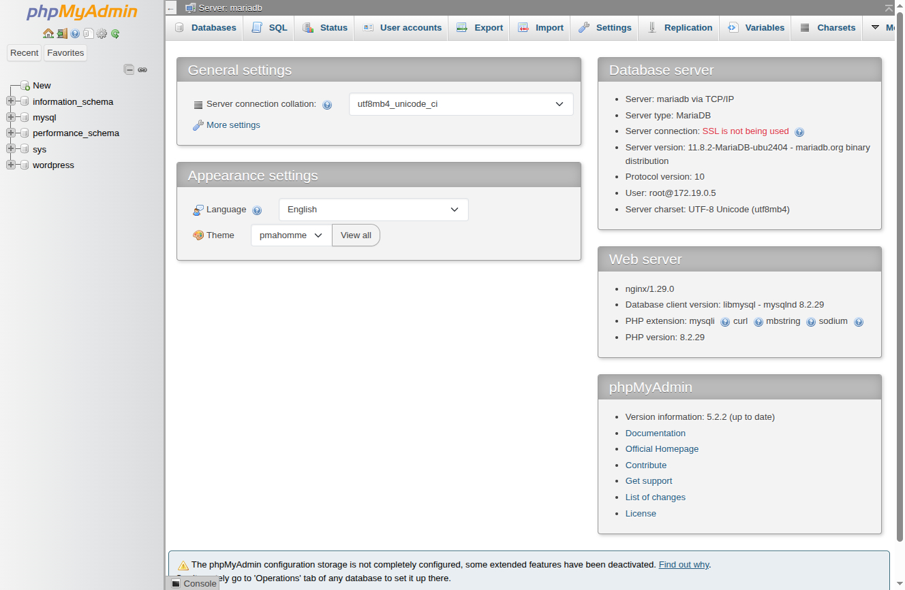

Click _wordpress_ in the left sidebar to select the database:

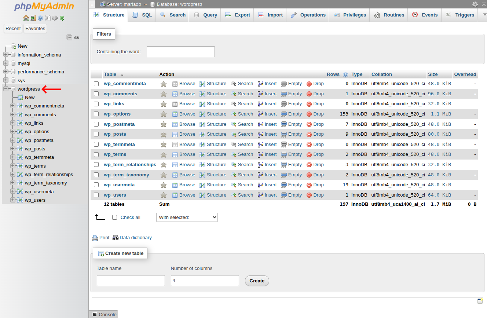

Now, you can perform all the tasks needed.

[`mariadb` shell]: https://mariadb.com/docs/server/clients-and-utilities/mariadb-client/mariadb-command-line-client
[phpMyAdmin]: https://www.phpmyadmin.net

## Step 4 - Logging errors

### Step 4.1 - Using `compose logs` to view the logs

Logs of your `wordpress` service can be viewed with the command below:

```bash
docker compose logs wordpress
```

You can write to the log using the [`error_log`] function. For example, add this function call somewhere in your PHP code:

```php
error_log("Hello World");
```

Open the website to trigger the logging call. Now, you can re-run the `compose logs` command above to see your message.

[`error_log`]: https://www.php.net/manual/en/function.error-log.php

### Step 4.2 - Writing logs to the file

You can write the WordPress logs to the file on your host. Then you can view and analyze them using your regular tools.

There are multiple steps needed to configure this.

First, change the working directory to the one with a `compose.yaml` file,
and create a file where the logs will be written:

> **Note:** What is `33:33` is [already described](#owner_33).

```bash
touch wordpress.log && sudo chown 33:33 wordpress.log
```

Second, adjust the `.env` file as follows:

* New environment variable `WORDPRESS_DEBUG` is added and set to `1`.

  This will enable the [debug mode in WordPress](https://developer.wordpress.org/advanced-administration/debug/debug-wordpress/).

* `WORDPRESS_CONFIG_EXTRA` is used to pass the additional configuration options.

  The  [`WP_DEBUG_DISPLAY`] option ensures that errors are not displayed on the web pages,
  and [`WP_DEBUG_LOG`] that they are written into `/var/log/wordpress.log` inside the container instead.

<a name="wp_debug_display"></a>

```bash
# File .env
DB_NAME=wordpress
MARIADB_ROOT_PASSWORD=your_password
WORDPRESS_DEBUG=1
WORDPRESS_CONFIG_EXTRA="define( 'WP_DEBUG_DISPLAY', false );
define( 'WP_DEBUG_LOG', '/var/log/wordpress.log' );"
```

You can switch the `WORDPRESS_DEBUG` on and off by setting it to 1 or 0 respectively in the `.env` file.
The log file will be populated only when it's on.

Finally, modify the `compose.yaml` file:

* The `WORDPRESS_DEBUG` and `WORDPRESS_CONFIG_EXTRA` variables above are added to the `environment` attribute of the `wordpress` service.
* The `wordpress.log`, created at the [beginning of this step](#step-42---writing-logs-to-the-file) is mounted into the `/var/log/wordpress.log` inside the container.

```yaml
wordpress:
    image: wordpress:fpm
    environment:
        - WORDPRESS_DB_HOST=mariadb
        - WORDPRESS_DB_NAME=${DB_NAME}
        - WORDPRESS_DB_USER=root
        - WORDPRESS_DB_PASSWORD=${MARIADB_ROOT_PASSWORD}
        - WORDPRESS_DEBUG=${WORDPRESS_DEBUG}
        - WORDPRESS_CONFIG_EXTRA=${WORDPRESS_CONFIG_EXTRA}
    volumes:
    - ./www:/var/www/html
    - ./wordpress.log:/var/log/wordpress.log
```

<details>
<summary>After you adjusted the <code>wordpress</code> service, the <code>compose.yaml</code> will look similar to this:</summary>

```yaml
# File compose.yaml
services:
    wordpress:
        image: wordpress:fpm
        environment:
            - WORDPRESS_DB_HOST=mariadb
            - WORDPRESS_DB_NAME=${DB_NAME}
            - WORDPRESS_DB_USER=root
            - WORDPRESS_DB_PASSWORD=${MARIADB_ROOT_PASSWORD}
            - WORDPRESS_DEBUG=${WORDPRESS_DEBUG}
            - WORDPRESS_CONFIG_EXTRA=${WORDPRESS_CONFIG_EXTRA}
        volumes:
        - ./www:/var/www/html
        - ./wordpress.log:/var/log/wordpress.log
    nginx:
        image: nginx
        volumes:
        - ./nginx.conf:/etc/nginx/conf.d/default.conf
        - ./www:/var/www/html
        ports:
        - 80:80
    mariadb:
        image: mariadb
        restart: always
        environment:
            - MARIADB_DATABASE=${DB_NAME}
            - MARIADB_ROOT_PASSWORD=${MARIADB_ROOT_PASSWORD}
        volumes:
        - db-data:/var/lib/mysql
volumes:
    db-data:
```

</details>

The configuration is done, stop and start your services again to apply your changes:

```bash
docker compose down
docker compose up
```

If an error happens or the [`error_log`] function is called, the message will be written into the `./wordpress.log` file on the host.

Additionally, you will potentially see more errors than in the default configuration.
Because when `WORDPRESS_DEBUG` is on, WordPress will use the [`E_ALL`] reporting level. In other words, all PHP errors will be reported.

[`E_ALL`]: https://www.php.net/manual/en/errorfunc.constants.php#constant.e-all
[`WP_DEBUG_DISPLAY`]: https://developer.wordpress.org/advanced-administration/debug/debug-wordpress/#wp_debug_display
[`WP_DEBUG_LOG`]: https://developer.wordpress.org/advanced-administration/debug/debug-wordpress/#wp_debug_log

### Step 4.3 - Display errors on the web pages

If an error happens while you're opening the page of your website, usually what you see is this:

> 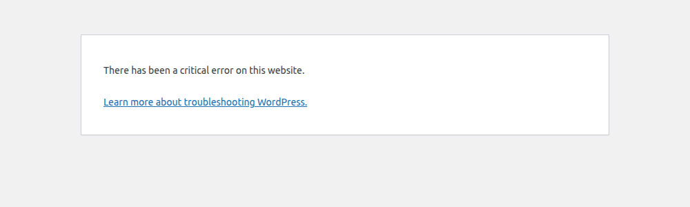
>
> There has been a critical error on this website.
>
> [Learn more about troubleshooting WordPress.](https://wordpress.org/documentation/article/faq-troubleshooting/)

This kind of error is sometimes called "white screen of death".

It's not very useful if you want to investigate the underlying issue.

If you're developing your website locally and it's not publicly available, it's safe to show the exact text of an error on the web page.
This makes debugging easier.

In WordPress, the display of the errors is controlled by the configuration option [`WP_DEBUG_DISPLAY`]. By default, it's set to `true` and errors are displayed,
unless the [`WP_DEBUG`] option is set to `false`.

Thus, we need to set [`WP_DEBUG`] to `true`, and ensure that [`WP_DEBUG_DISPLAY`] is not set to `false` explicitly.

In Docker, [`WP_DEBUG`] can be set to `true` by setting the environment variable `WORDPRESS_DEBUG` to `1`:

```bash
# File .env
DB_NAME=wordpress
MARIADB_ROOT_PASSWORD=your_password
WORDPRESS_DEBUG=1
```

The configuration of the `wordpress` service will be similar to this:

```yaml
wordpress:
    image: wordpress:fpm
    environment:
        - WORDPRESS_DB_HOST=mariadb
        - WORDPRESS_DB_NAME=${DB_NAME}
        - WORDPRESS_DB_USER=root
        - WORDPRESS_DB_PASSWORD=${MARIADB_ROOT_PASSWORD}
        - WORDPRESS_DEBUG=${WORDPRESS_DEBUG}
    volumes:
    - ./www:/var/www/html
```

Note that `WORDPRESS_DEBUG` is present in the list of the environment variables.

Now, you can start your services. If an error happens it will be displayed like this:

> 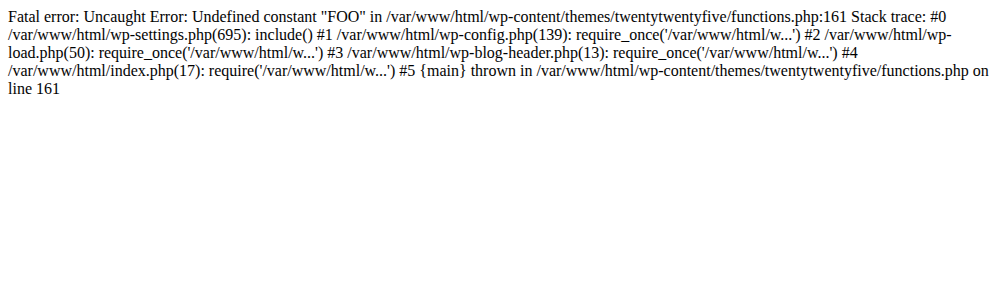
>
> ```
> Fatal error: Uncaught Error: Undefined constant "FOO" in /var/www/html/wp-content/themes/twentytwentyfive/functions.php:161
> Stack trace:
> #0 /var/www/html/wp-settings.php(695): include()
> #1 /var/www/html/wp-config.php(139): require_once('/var/www/html/w...')
> #2 /var/www/html/wp-load.php(50): require_once('/var/www/html/w...')
> #3 /var/www/html/wp-blog-header.php(13): require_once('/var/www/html/w...')
> #4 /var/www/html/index.php(17): require('/var/www/html/w...')
> #5 {main}
>   thrown in /var/www/html/wp-content/themes/twentytwentyfive/functions.php on line 161
> ```

You should set [`WP_DEBUG_DISPLAY`] to `false` in production environments to prevent the exposure of sensitive information.
This can be done by putting it into [`WORDPRESS_CONFIG_EXTRA`](#wp_debug_display) inside the `.env` file.

## Step 5 - Debugging WordPress using Xdebug

As noted in [Step 4.1](#step-41---using-compose-logs-to-view-the-logs) you can call the [`error_log`] function to write the PHP values into a log file.
Sometimes this is not enough and you need to step through your code in a debugger.
Xdebug extension provides the step debugger which can be used within your IDE (Integrated development environment) or editor of choice.

### Step 5.1 - Creating a custom Docker image with the Xdebug extension

The official WordPress Docker image doesn't include the Xdebug extension.
Thus, we will create a custom one.

Change the working directory to the directory with a `compose.yaml` file. For example:

```bash
cd wordpress-compose
```

Let's create a Dockerfile and place it to the `wordpress-xdebug` directory:

```bash
mkdir wordpress-xdebug \
&& nano wordpress-xdebug/Dockerfile
```

Paste the following content:

```dockerfile
FROM wordpress:fpm

RUN set -ex; \
    pecl install xdebug; \
    docker-php-ext-enable xdebug; \
    rm -r /tmp/pear

RUN { \
        echo 'xdebug.discover_client_host=1'; \
        echo 'xdebug.mode=debug'; \
        echo 'xdebug.start_with_request=yes'; \
    } > /usr/local/etc/php/conf.d/xdebug-custom.ini
```

There are two layers in this Dockerfile. In the first one Xdebug is installed.
In the second one the Xdebug extension is configured to enable a step debugger and
to make it convenient to use with an IDE on your host.

You need to adjust the `wordpress` service in the `compose.yaml` file.
Replace the `image` with a `build` attribute:

```yaml
wordpress:
    build: ./wordpress-xdebug
    environment:
        - WORDPRESS_DB_HOST=mariadb
        - WORDPRESS_DB_NAME=${DB_NAME}
        - WORDPRESS_DB_USER=root
        - WORDPRESS_DB_PASSWORD=${MARIADB_ROOT_PASSWORD}
        - WORDPRESS_DEBUG=${WORDPRESS_DEBUG}
    volumes:
    - ./www:/var/www/html
```

<details>
<summary>The <code>compose.yaml</code> and <code>.env</code> files for Xdebug debugging of WordPress should look as follows:</summary>

* The nginx configuration is the same as in [Step 1](#nginx_conf).

```yaml
# File compose.yaml
services:
    wordpress:
        build: ./wordpress-xdebug
        environment:
            - WORDPRESS_DB_HOST=mariadb
            - WORDPRESS_DB_NAME=${DB_NAME}
            - WORDPRESS_DB_USER=root
            - WORDPRESS_DB_PASSWORD=${MARIADB_ROOT_PASSWORD}
            - WORDPRESS_DEBUG=${WORDPRESS_DEBUG}
        volumes:
        - ./www:/var/www/html
    nginx:
        image: nginx
        volumes:
        - ./nginx.conf:/etc/nginx/conf.d/default.conf
        - ./www:/var/www/html
        ports:
        - 80:80
    mariadb:
        image: mariadb
        restart: always
        environment:
            - MARIADB_DATABASE=${DB_NAME}
            - MARIADB_ROOT_PASSWORD=${MARIADB_ROOT_PASSWORD}
        volumes:
        - db-data:/var/lib/mysql
volumes:
    db-data:
```

```bash
# File .env
DB_NAME=wordpress
MARIADB_ROOT_PASSWORD=your_password
WORDPRESS_DEBUG=0
```

</details>

Now, you can start the services and build your custom WordPress image with Xdebug support:

```bash
docker compose up --build
```

### Step 5.2 - Configuring IDE

In this step I will show you how you can connect your IDE with the Xdebug extension inside a container.
Instructions are provided for [VS Code]. For other IDEs and editors, the steps will be similar, consult their official documentation.

Install the [Xdebug extension for VS Code] and enable it:

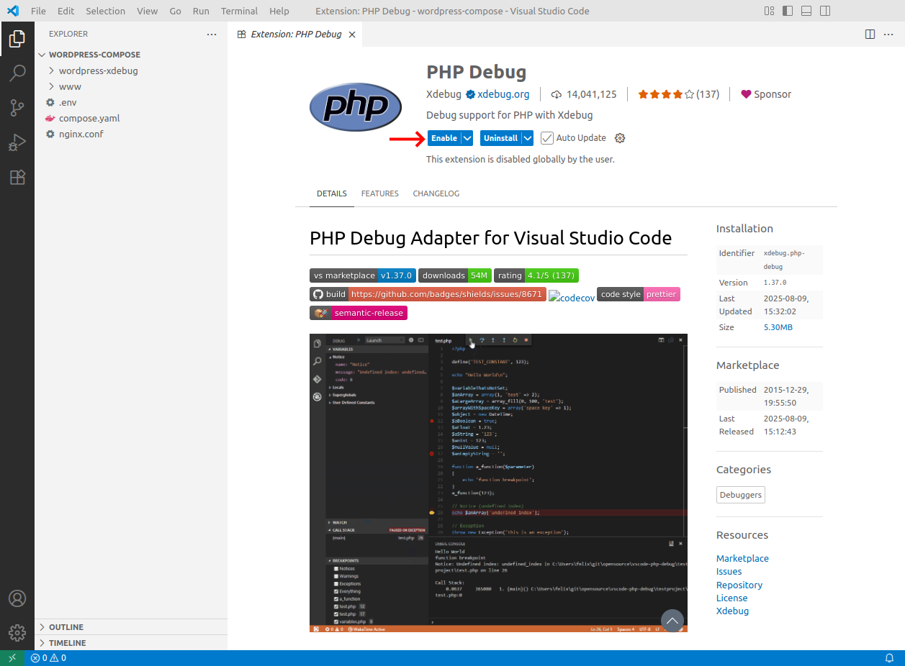

[VS Code]: https://code.visualstudio.com
[Xdebug extension for VS Code]: vscode:extension/xdebug.php-debug

Create a VS Code launch configuration:

```bash
mkdir -p .vscode \
&& nano .vscode/launch.json
```

Paste the following content:

```json
{
    "version": "0.2.0",
    "configurations": [

        {
            "name": "Listen for Xdebug",
            "type": "php",
            "request": "launch",
            "port": 9003,
            "pathMappings": {
                "/var/www/html": "${workspaceFolder}/www"
            }
        }
    ]
}
```

The only interesting thing here is path mapping, which maps from the path inside a container (`/var/www/html`) to the path on the host.
Without this mapping, debugger will not work.

Now, close all the VS Code windows and reopen it:

* Replace `wordpress-compose` with a directory of the `compose.yaml` file.

```bash
code wordpress-compose
```

Place a breakpoint on a desired line, where you want to stop the execution:

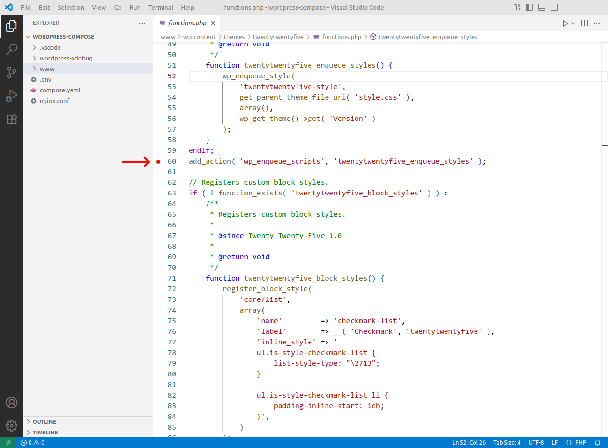

Press `F5` to start debugging in VS Code. Now, you need to visit your website to trigger the breakpoint.

Once you are back in VS Code, you should see that execution is stopped.

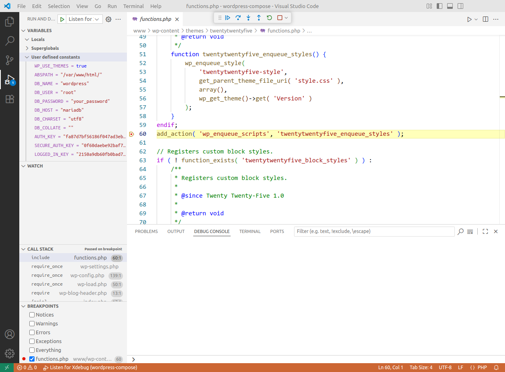

You can inspect the variables, call stack and step through your code.

### Step 5.3 - Break on an error

If an error has occurred, it's often helpful to inspect the state of your WordPress website at that point.

[Configure your IDE](#step-52---configuring-ide) and press `F5` to start debugging:

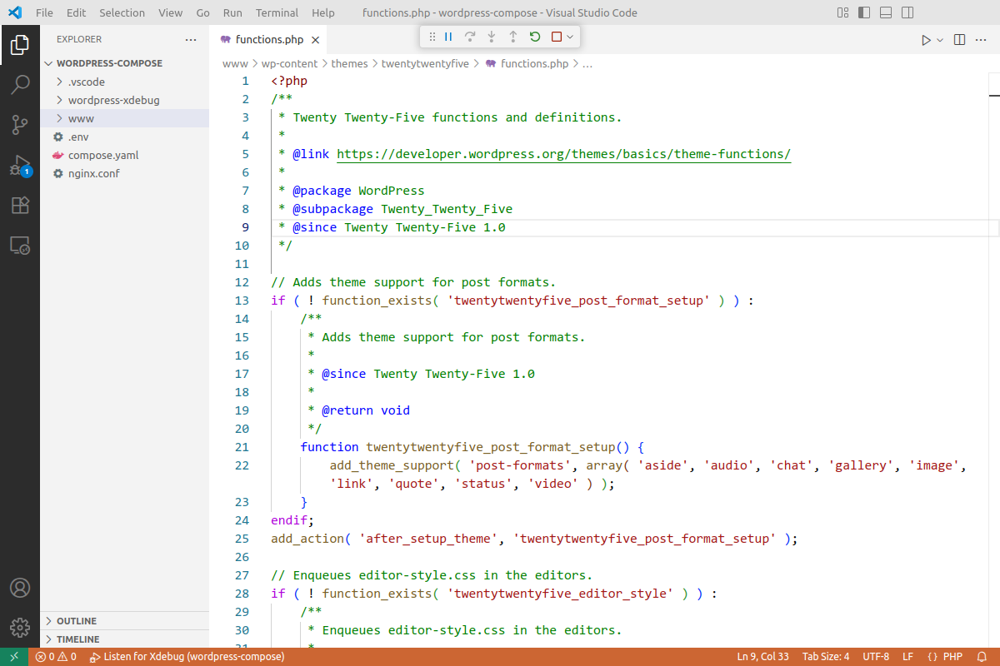

Now, open the _Run and  Debug_ view by pressing `Ctrl+Shift+D` or by clicking its icon in the activity bar:

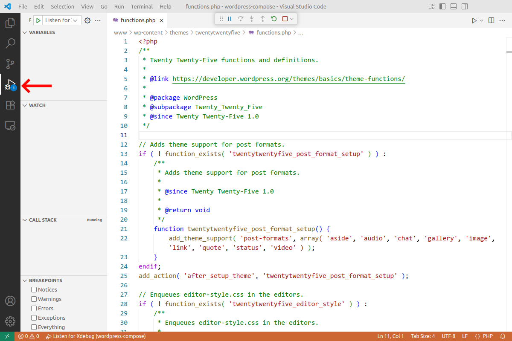

Find the _Breakpoints_ section in the sidebar and check _Everything_.
This means that breakpoint will be created at the point of any error condition.

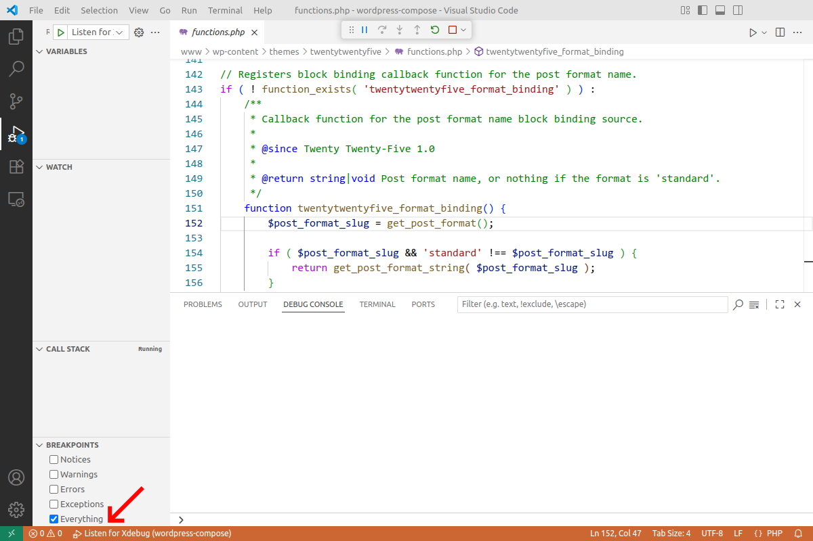

When an error happens, you will see that execution is stopped at the erroneous line:

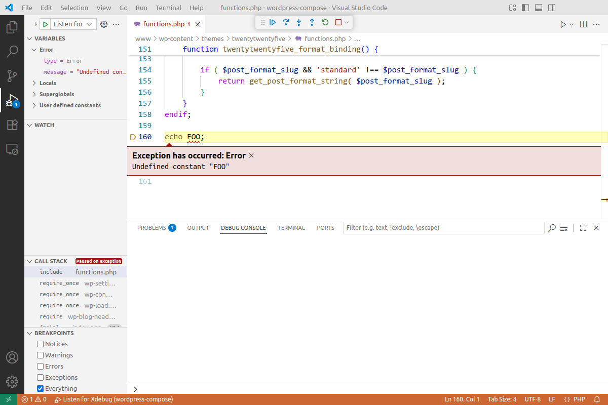

At this point you can inspect the variables and call stack to find out what caused the error.

## Conclusion

Hopefully you have learned the basics of running WordPress in a container.
Not just running, but solving issues if they arise. You know how to debug your PHP code running in a container using Xdebug,
and how to inspect the logs. No matter if you need to develop a WordPress website from scratch or to run an existing website.
You can use Docker Compose to provide an isolated and reproducible environment for it.

##### License: MIT

<!--

Contributor's Certificate of Origin

By making a contribution to this project, I certify that:

(a) The contribution was created in whole or in part by me and I have
    the right to submit it under the license indicated in the file; or

(b) The contribution is based upon previous work that, to the best of my
    knowledge, is covered under an appropriate license and I have the
    right under that license to submit that work with modifications,
    whether created in whole or in part by me, under the same license
    (unless I am permitted to submit under a different license), as
    indicated in the file; or

(c) The contribution was provided directly to me by some other person
    who certified (a), (b) or (c) and I have not modified it.

(d) I understand and agree that this project and the contribution are
    public and that a record of the contribution (including all personal
    information I submit with it, including my sign-off) is maintained
    indefinitely and may be redistributed consistent with this project
    or the license(s) involved.

Signed-off-by: wpdevelopment11 wpdevelopment11@gmail.com

-->
