## Introduction

> **Note:**
>
> This is an opinionated guide on how to run DRM-free Windows games (and programs) on Linux.
> It's mostly intended for people who prefer to use command-line tools instead of GUIs,
> and for tinkerers who like to understand how various pieces fit together.
>
> If you just want to play your Windows games in the easiest way possible and don't care what is going on under the hood
> you will be much better served by projects such as:
> * [Bottles](https://flathub.org/en/apps/com.usebottles.bottles)
> * [Faugus Launcher](https://flathub.org/en/apps/io.github.Faugus.faugus-launcher)
> * [Heroic Games Launcher](https://flathub.org/en/apps/com.heroicgameslauncher.hgl)
> * [Lutris](https://flathub.org/en/apps/net.lutris.Lutris)
>
> You can manage their permissions using [Flatseal](https://flathub.org/en/apps/com.github.tchx84.Flatseal).

There are many Windows games that are not ported to Linux, and most of them never will.
One obvious solution is to dual boot with Windows to play them. The other is to use a complicated VM setup
with GPU passthrough. But there is a better way.

Wine can be used to run 32-bit and 64-bit Windows programs, including games.

First, some background information.

Games on Windows usually use Direct3D graphics API.
Direct3D is a proprietary API, it's not supported by drivers on Linux.
Modern games on Linux use Vulkan, and older ones use OpenGL.

Windows Direct3D games can run using Wine OpenGL renderer,
but the compatibility and performance in games is not that great.
This is why DXVK was created, which translates Direct3D to Vulkan API calls.
A combination of Wine and DXVK can run pretty much anything you can throw at it,
with nearly native performance. My experience is mostly based on playing classic (read: old) games.
But modern games work just fine too. If the game is using Direct3D 12 you need to look into [vkd3d-proton
](https://github.com/HansKristian-Work/vkd3d-proton), though.

So in other words, the combination of Wine and DXVK will allow you to run most, if not all, your favorite Windows games.
And maybe eventually to completely stop using Windows.

Additionally, this tutorial will show you how to isolate your games from your Linux host.
If you are paranoid like me, you don't want to expose all your personal files to the running game.
Besides file system isolation you can, for example, restrict access to a network.

To accomplish this, Wine will be installed through Flatpak.
As it allows you to tweak the Wine permissions to allow or disallow
access to a particular filesystem path.

Running Windows software which is not ported to Linux is also possible.
Wine can be used to run programs such as Notepad++ and SumatraPDF which are popular among Windows users,
and which don't have an official Linux version.
It's expected that some Windows programs will not run using Wine.
Because they are too tied to Windows and even the Wine compatibility layer doesn't cut it.

**Prerequisites**

* Install Flatpak on your distro, if not already installed, and add the Flathub repository.
  Consult the [Flatpak] documentation on how to do it.
  It will be used to install Wine in a sandbox.

* An environment variable `WINEPREFIX` needs to be set <a name="wine_prefix"></a>
  before you try to run any command in this tutorial.
  It will point to a directory in which Wine stores
  files (including installed games) and configuration.

  In the Bash shell it can be set using the following command:

  > Replace `~/.wine_sandboxed` with a desired **absolute** path to the directory.

  ```bash
  export WINEPREFIX=~/.wine_sandboxed
  ```

  Alternatively, if you want the `WINEPREFIX` to be preserved after reboot you can set it
  in your `~/.profile`. You need to source it afterwards:

  ```bash
  source ~/.profile
  ```

  Make sure that the directory is created:

  ```bash
  mkdir -p "${WINEPREFIX:?}"
  ```

  * A Windows game that uses DirectX/Direct3D that you want to play.

    Some Windows games use OpenGL instead. You can play them using instructions below just fine,
    but you need to ignore everything that is related to DXVK, as it's not used for OpenGL games.

[Flatpak]: https://flatpak.org

## Step 1 - Installing Wine using Flatpak

The problem with installing Wine through your distro package manager is that Wine by itself
doesn't have sandboxing capabilities. Windows programs and games are running
with your user privileges and will be able to do anything the normal Linux programs can do.

Run the following command to install Wine using Flatpak:

```bash
sudo flatpak install flathub org.winehq.Wine
```

You will see output similar to this:

```
Looking for matches…
Similar refs found for ‘org.winehq.Wine’ in remote ‘flathub’ (system):

   1) app/org.winehq.Wine/x86_64/stable-21.08
   2) app/org.winehq.Wine/x86_64/stable-22.08
   3) app/org.winehq.Wine/x86_64/stable-23.08
   4) app/org.winehq.Wine/x86_64/wow64-24.08
   5) app/org.winehq.Wine/x86_64/stable-24.08
   6) app/org.winehq.Wine/x86_64/wow64-25.08
   7) app/org.winehq.Wine/x86_64/stable-25.08

Which do you want to use (0 to abort)? [0-7]:
```

You need to choose the WoW64 version with the latest runtime.
So in my case I need to enter 6 to choose the 25.08 runtime.

The WoW64 version is chosen because it avoids pulling a huge number of 32-bit dependencies.
You are still able to run both 32-bit and 64-bit Windows games.

## Step 2 - Creating a new Wine prefix

Wine prefix is something that resembles `C:` drive on Windows,
It contains directories such as `Program Files`, `Program Files (x86)`, and `Windows`.
You can have as many Wine prefixes as you like. If something behaves weirdly you can
"reinstall Windows" by creating a new Wine prefix and starting from scratch.

Without further ado, let's create our first Wine prefix by executing the following command:

> Define a `WINEPREFIX` variable first, as [mentioned in Prerequisites](#wine_prefix).

```bash
flatpak run --env=WINEPREFIX="${WINEPREFIX:?}" --filesystem="${WINEPREFIX}:create" \
    org.winehq.Wine wineboot -u
```

Usual Windows directories will be created inside `$WINEPREFIX/drive_c`:

```shellsession
$ ls -1 "${WINEPREFIX:?}/drive_c"
ProgramData
'Program Files'
'Program Files (x86)'
users
windows
```

You can configure your Wine prefix by opening a Wine configuration editor [`winecfg`]:

```bash
flatpak run --env=WINEPREFIX="${WINEPREFIX:?}" --filesystem="$WINEPREFIX" org.winehq.Wine winecfg
```

A Wine registry can be tweaked using [`regedit`]:

```bash
flatpak run --env=WINEPREFIX="${WINEPREFIX:?}" --filesystem="$WINEPREFIX" org.winehq.Wine regedit
```

[`regedit`]: https://gitlab.winehq.org/wine/wine/-/wikis/Wine-User's-Guide#using-the-registry-and-regedit
[`winecfg`]: https://gitlab.winehq.org/wine/wine/-/wikis/Wine-User's-Guide#configuring-wine

## Step 3 - Restricting sandbox permissions

By default a Wine Flatpak has the following filesystem permissions:

```
--filesystem=xdg-desktop
--filesystem=xdg-documents
--filesystem=xdg-pictures
--filesystem=xdg-music
--filesystem=xdg-videos
--filesystem=xdg-download
```

In other words, directories like Documents and Downloads in your home directory
will be accessible to games running using Wine. In my opinion this is too permissive.

To remove access to the XDG directories, run the following command:

```bash
flatpak override --user \
    --nofilesystem=xdg-documents \
    --nofilesystem=xdg-desktop \
    --nofilesystem=xdg-pictures \
    --nofilesystem=xdg-music \
    --nofilesystem=xdg-videos \
    --nofilesystem=xdg-download \
    org.winehq.Wine
```

The problem is that Wine creates symbolic links inside `$WINEPREFIX/drive_c/users/$USER` (user home directory inside Wine)
that point to the corresponding directories in your real home. For example, `$WINEPREFIX/drive_c/users/$USER/Documents` points to
`~/Documents`. You can easily check it by running: `ls -l "$WINEPREFIX/drive_c/users/$USER"`.
But if you remove the xdg permissions above,
symbolic links will point to the non-persistent directories inside a sandbox.
They will be cleared after each run of a game, in practice this means you will lose your game saves and settings.

To fix it run the snippet below. It will remove the problematic symbolic links and create normal directories inside your Wine prefix.
The prefix itself is persistent, so the new directories will be too.

> **Note:** Instead of running the snippet above, you can use an `isolate_home` [winetricks] verb for the same effect:
>
> ```bash
> flatpak run --env=WINEPREFIX="${WINEPREFIX:?}" --filesystem="$WINEPREFIX" \
>     --command=winetricks org.winehq.Wine isolate_home
> ```

```bash
for xdg_dir in Desktop Documents Downloads Music Pictures Videos; do
    xdg_dir=${WINEPREFIX:?}/drive_c/users/$USER/$xdg_dir
    if [[ -L $xdg_dir ]]; then
        rm "$xdg_dir"
        mkdir "$xdg_dir"
    fi
done
```

Now, check that symbolic links are replaced indeed with directories:

```bash
ls -l "$WINEPREFIX/drive_c/users/$USER"
```

Additionally, Wine has the following permission that is probably not needed.
At least in my testing Wine works fine without it:

```
--system-talk-name=org.freedesktop.UDisks2
```

To remove it, run:

```bash
flatpak override --user --system-no-talk-name=org.freedesktop.UDisks2 org.winehq.Wine
```

[winetricks]: https://github.com/winetricks/winetricks

## Step 4 - Installing DXVK

### Step 4.1 - Installing DXVK using a Bash script

Copy the script below and save to a file `install_dxvk.sh`.

```bash
#!/usr/bin/env bash

set -euo pipefail

latest="$(curl -sI https://github.com/doitsujin/dxvk/releases/latest | tr -d '\r' | grep '^location:')"
latest="${latest##*/v}"
dxvk_archive=$(mktemp)
curl -fLo "$dxvk_archive" "https://github.com/doitsujin/dxvk/releases/download/v${latest}/dxvk-${latest}.tar.gz"
tar -xf "$dxvk_archive" --strip-components 2 --wildcards -C "${WINEPREFIX:?}/drive_c/windows/system32" "dxvk-${latest}/x64/*.dll" \
    -C "${WINEPREFIX}/drive_c/windows/syswow64" "dxvk-${latest}/x32/*.dll"
rm "$dxvk_archive"

for dll in d3d8 d3d9 d3d10core d3d11 dxgi; do
    echo wine reg add "'HKEY_CURRENT_USER\Software\Wine\DllOverrides'" /v "$dll" /d native /f
done | flatpak run --env=WINEPREFIX="${WINEPREFIX:?}" --filesystem="$WINEPREFIX" --command=bash org.winehq.Wine
```

Make it executable and run the script to install DXVK into your Wine prefix:

```bash
chmod +x install_dxvk.sh && ./install_dxvk.sh
```

### Step 4.2 - Install DXVK using winetricks

As an alternative to the commands above, you can install DXVK using winetricks as follows:

> The result should be more or less the same as installing using the Bash script above.
> Choose the installation method you prefer.

```bash
flatpak run --env=WINEPREFIX="${WINEPREFIX:?}" --filesystem="$WINEPREFIX" \
    --command=winetricks org.winehq.Wine dxvk
```

### Step 4.3 - Verify your DXVK installation

To verify that DXVK is installed properly you need to check if required
DLL overrides are created. To do this, open the Wine configuration editor:

```bash
flatpak run --env=WINEPREFIX="${WINEPREFIX:?}" --filesystem="$WINEPREFIX" org.winehq.Wine winecfg
```

Check the Libraries tab, it should look as follows:

> If you installed DXVK using [`winetricks`](#step-42---install-dxvk-using-winetricks)
> the DLL names will be prefixed with asterisk `*`.

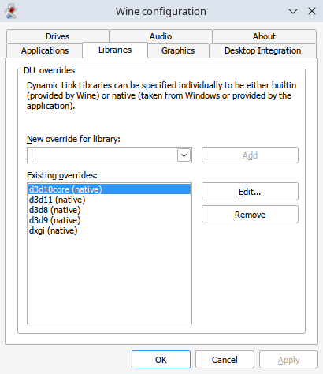

If it's not the case, make sure that the directory of your `WINEPREFIX` actually exists on disk:

```bash
mkdir -p "${WINEPREFIX:?}"
```

and try to reinstall DXVK.

## Step 5 - Installing a game

Finally, after all prerequisites are done, you can install your favorite game to play it on Linux.

### Step 5.1 - Installing by unpacking Inno Setup installer using innoextract

Windows games are commonly packaged using Inno Setup installers.
For example, [GOG Offline installers](https://support.gog.com/hc/en-us/articles/213148105-How-do-I-download-my-purchased-items?product=gog#h_01J7K99T5QYE9E478NJY3DX6AJ)
are in fact Inno Setup installers. So it makes sense to describe how to use them to install games on Linux.

I will show you how to unpack such Windows installers without actually running them.

First, choose a game and download offline game installers.

Next, list the languages that are available and choose the one you want, it will be specified in the next command.

> Replace `~/path/to/game.exe` with a path to the game installer.

```bash
INSTALLER_PATH=~/path/to/game.exe
innoextract --list-languages "${INSTALLER_PATH:?}"
```

Now, installer can be unpacked using the following command:

> * Change the `${GAME_NAME:?}` to a desired directory name for your game.
  Note that `${WINEPREFIX:?}/drive_c/${GAME_NAME:?}` is the same as `C:\${GAME_NAME:?}`.
  In other words, the game will be "installed" to the root of the `C:` drive.
> * Change the `${GAME_LANG:?}` with the desired language.

```bash
innoextract --exclude-temp --output-dir "${WINEPREFIX:?}/drive_c/${GAME_NAME:?}" --language "${GAME_LANG:?}" "${INSTALLER_PATH:?}"
```

In a rare occurrence when extracting GOG installer you may get a warning like this:

```
Warning: "setup-1.bin" is not part of the installer!
Warning: "setup-2.bin" is not part of the installer!
Warning: "setup-3.bin" is not part of the installer!
Use the --gog option to try extracting these files.
```

Pass the `--gog` option as suggested, to extract the RAR archives with the `.bin` extension that come with an installer `.exe` file.
Normally that is not needed.

```bash
innoextract --exclude-temp --output-dir "${WINEPREFIX:?}/drive_c/${GAME_NAME:?}" --language "${GAME_LANG:?}" --gog "${INSTALLER_PATH:?}"
```

### Step 5.2 - Installing by running installer .exe using Wine

Instead of unpacking the installer using `innoextract` or by other means,
you can run it directly using Wine.

The question is how to make an installer `.exe` available inside a Flatpak sandbox
and how to launch it. The one possibility is to copy the installer to your Wine prefix
and launch it from there. As the Flatpak sandbox already has an access to the Wine prefix,
it will be possible to launch the installer. But this involves unnecessary copying, so
that approach will not be used.
Instead of copying the installer it will be shared read-only with a sandbox.

A game installer usually consists of many files. So you may need to share an installer directory,
not just the main `.exe` file. You can find a script below that should hopefully simplify the steps involved.

> Copy-and-paste it to a file: `run_win_installer.sh`.

```bash
#!/usr/bin/env bash

set -eu

ask_user() {
    # read -p "Do you want to proceed? (y/n): " response
    local response
    while true; do
        read -rp "$1 (y/n): " response
        response=${response,,}
        case "$response" in
            y|yes) return 0 ;;
            n|no) return 1 ;;
        esac
    done
}

# Backslash escapes are needed in paths
# shellcheck disable=SC2162
read -e -p 'Path to an installer exe file: ' installer
installer=$(realpath -e "${installer/#~/~}")
exe_name=$(basename "$installer")

if ask_user "Does installer have other files besides ${exe_name}?"; then
    mount=$(dirname "$installer")
else
    mount=$installer
fi

if ! ask_user "The path '${mount}' will be shared read-only with Flatpak sandbox.
Do you want to proceed?"; then
    echo "Exiting..." >&2
    exit
fi

echo "Trying to run the installer '${installer}'" >&2

flatpak run --env=WINEPREFIX="${WINEPREFIX:?}" --filesystem="$WINEPREFIX" \
    --filesystem="${mount}:ro" \
    org.winehq.Wine "$installer"
```

Make the script executable and run:

```bash
chmod +x run_win_installer.sh && ./run_win_installer.sh
```

After you have answered questions asked by the script you should see an installer wizard
to appear on your screen.

Install a game as you would do it on Windows, and note
an installation directory, it will be needed later when you will want to launch the game.

Games on Windows usually install desktop shortcuts to launch them, but this will not
work with a Wine Flatpak, you need to launch them using the command line.

In the next step we will see how to run the installed game.

## Step 6 - Running the game

Now, you can run the game:

Path to the game to launch can be specified using its path on your Linux host or its windows equivalent.
For example, `c:\game\launcher.exe` is the same as `$WINEPREFIX/drive_c/game/launcher.exe`.

Launching using an absolute path on your Linux host:

> Note that the `DXVK_HUD` environment variable is used to display the [DXVK HUD], which can show FPS and other useful information.
>
> Replace `${GAME_PATH:?}` with a path where your game is installed and `${GAME_EXE:?}` with a filename of the game executable. <a name="game_path"></a>
>
> For example:
> ```bash
> GAME_PATH=Program Files/Cool Game
> GAME_EXE='cool_game.exe'
> ```

```bash
flatpak run --env=WINEPREFIX="${WINEPREFIX:?}" --env=DXVK_HUD=1 \
    --filesystem="$WINEPREFIX" org.winehq.Wine \
    "$WINEPREFIX/drive_c/${GAME_PATH:?}/${GAME_EXE:?}"
```

Some games will refuse to run if invoked outside of their directory. To fix it add the `--cwd` option to specify a working directory:

```bash
flatpak run --env=WINEPREFIX="${WINEPREFIX:?}" --env=DXVK_HUD=1 \
    --cwd="$WINEPREFIX/drive_c/${GAME_PATH:?}" \
    --filesystem="$WINEPREFIX" org.winehq.Wine \
    "$WINEPREFIX/drive_c/${GAME_PATH:?}/${GAME_EXE:?}"
```

Launching using its windows equivalent:

> Don't forget to escape backslashes by doubling them or just put the game path in single quotes.

```bash
flatpak run --env=WINEPREFIX="${WINEPREFIX:?}" --env=DXVK_HUD=1 \
    --filesystem="$WINEPREFIX" org.winehq.Wine \
    "c:\\${GAME_PATH:?}\\${GAME_EXE:?}"
```

Once the game is launched, in the top left corner you will see the following information:

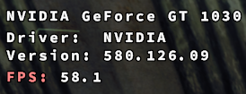

This is the proof that the game is running using DXVK instead of WineD3D.
You can display just the FPS counter by changing `--env=DXVK_HUD=1` to `--env=DXVK_HUD=fps`:

Which will look as follows:

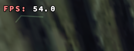

[DXVK HUD]: https://github.com/doitsujin/dxvk#hud

## Step 7 - Using MangoHud for FPS monitoring

Instead of using the built-in DXVK HUD to display FPS
as explained above, you can install MangoHud, which has far more features.

MangoHud is a Linux alternative to MSI Afterburner overlay on Windows.
You can use it to tweak and monitor performance of your games
while keeping an eye on temperatures of your GPU and CPU.

Run the following command to install MangoHud:

```bash
sudo flatpak install org.freedesktop.Platform.VulkanLayer.MangoHud
```

You will be presented with a choice:

```
Looking for matches…
Similar refs found for ‘org.freedesktop.Platform.VulkanLayer.MangoHud’ in remote ‘flathub’ (system):

   1) runtime/org.freedesktop.Platform.VulkanLayer.MangoHud/x86_64/21.08
   2) runtime/org.freedesktop.Platform.VulkanLayer.MangoHud/x86_64/22.08
   3) runtime/org.freedesktop.Platform.VulkanLayer.MangoHud/x86_64/23.08
   4) runtime/org.freedesktop.Platform.VulkanLayer.MangoHud/x86_64/24.08
   5) runtime/org.freedesktop.Platform.VulkanLayer.MangoHud/x86_64/25.08

Which do you want to use (0 to abort)? [0-5]:
```

You need to select the same runtime version that was chosen when [installing Wine](#step-1---installing-wine-using-flatpak).
So, in my case I need to enter 5 (the version of runtime is 25.08).

### Step 7.1 - Run a game with MangoHud enabled

To enable MangoHud you need to set an environment variable `MANGOHUD` when launching a game as follows:

> [Define the `GAME_PATH` and `GAME_EXE` variables or replace them appropriately](#game_path).

```bash
flatpak run --env=WINEPREFIX="${WINEPREFIX:?}" --filesystem="$WINEPREFIX" \
    --env=MANGOHUD=1 \
    org.winehq.Wine "$WINEPREFIX/drive_c/${GAME_PATH:?}/${GAME_EXE:?}"
```

When the game is launched you will see that MangoHud shows the FPS and other stats
in the top left corner that looks like this:

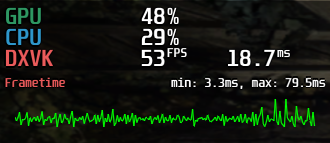

<details>

<summary><b>If you want to play an OpenGL game and MangoHud doesn't work...</b></summary>

To enable MangoHud for an OpenGL game run your game as follows:

```bash
flatpak run --env=WINEPREFIX="${WINEPREFIX:?}" --filesystem="$WINEPREFIX" \
    --env=MANGOHUD=1 \
    --command=/usr/lib/extensions/vulkan/MangoHud/bin/mangohud \
    org.winehq.Wine wine "$WINEPREFIX/drive_c/${GAME_PATH:?}/${GAME_EXE:?}"
```

You can see that the game is using OpenGL instead of DXVK:

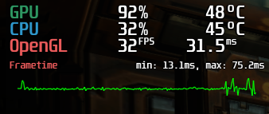

As an alternative, you can set an environment variable which will allow you to see your FPS without MangoHud.

You need to set it according to your GPU vendor:

* For an NVIDIA GPU you need to set the `__GL_SHOW_GRAPHICS_OSD` environment variable.
  Run your game as follows:

  ```bash
  flatpak run --env=WINEPREFIX="${WINEPREFIX:?}" --filesystem="$WINEPREFIX" \
      --env=__GL_SHOW_GRAPHICS_OSD=1 \
      org.winehq.Wine "$WINEPREFIX/drive_c/${GAME_PATH:?}/${GAME_EXE:?}"
  ```

* For AMD/Intel you need to set the [`GALLIUM_HUD`] environment variable:

  ```bash
  flatpak run --env=WINEPREFIX="${WINEPREFIX:?}" --filesystem="$WINEPREFIX" \
      --env=GALLIUM_HUD=fps \
      org.winehq.Wine "$WINEPREFIX/drive_c/${GAME_PATH:?}/${GAME_EXE:?}"
  ```

</details>

[`GALLIUM_HUD`]: https://docs.mesa3d.org/envvars.html#envvar-GALLIUM_HUD

### Step 7.2 - Tweaking a MangoHud configuration

If you want to configure which information is displayed by MangoHud or adjust
other settings you need to create a MangoHud configuration directory:

```bash
mkdir -p "/home/$USER/.var/app/org.winehq.Wine/config/MangoHud"
```

Now, you need to get a copy of an example MangoHud configuration file,
which you can tweak for your needs.
Once you have it, put it into the directory mentioned above.

You can use the command below to download the example [MangoHud configuration](https://github.com/flightlessmango/MangoHud/blob/master/data/MangoHud.conf) and put it in the configuration directory:

```bash
curl -fL --output-dir "/home/$USER/.var/app/org.winehq.Wine/config/MangoHud" \
    -O 'https://raw.githubusercontent.com/flightlessmango/MangoHud/master/data/MangoHud.conf'
```

It's time to tweak the configuration:

```bash
nano "/home/$USER/.var/app/org.winehq.Wine/config/MangoHud/MangoHud.conf"
```

Uncomment the following lines:

```bash
# gpu_temp

# cpu_temp
```

```bash
gpu_temp

cpu_temp
```

To see your GPU and CPU temperatures while you're in game.

[Re-run the game with MangoHud enabled](#step-71---run-a-game-with-mangohud-enabled) to check your changes.
You should see something like this:

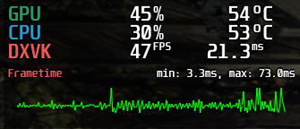

## Step 8 - Installing and running Windows software using Wine (Optional)

In this step you will see how to run Windows software such as Notepad++
and SumatraPDF using Wine on Linux.

You can apply what you will learn in this step to make other Windows software work on Linux as well.

> If you want to run multiple Windows apps _simultaneously_ it's recommended to create a separate
> [Wine prefix](#step-2---creating-a-new-wine-prefix) for each app. For reasons outlined in the GitHub issue: [flathub/org.winehq.Wine#41](https://github.com/flathub/org.winehq.Wine/issues/41).
>
> In other words, the environment variable `WINEPREFIX` must be different for each app.

### Step 8.1 - Installing Notepad++

You can manually download Notepad++ installer into the `$WINEPREFIX/drive_c/users/$USER/Downloads` and run it from there.
Alternatively, use a script below. Save it into a file `install_npp.sh`.

```bash
#!/usr/bin/env bash

set -euo pipefail

downloads=${WINEPREFIX:?}/drive_c/users/$USER/Downloads

latest="$(curl -sI https://github.com/notepad-plus-plus/notepad-plus-plus/releases/latest | tr -d '\r' | grep '^location:')"
latest="${latest##*/v}"
filename=npp.${latest}.Installer.x64.exe
curl -fL --output-dir "$downloads" -O "https://github.com/notepad-plus-plus/notepad-plus-plus/releases/download/v${latest}/$filename"
flatpak run --env=WINEPREFIX="$WINEPREFIX" --filesystem="$WINEPREFIX" org.winehq.Wine "$downloads/$filename"
```

Make it executable and run:

```bash
chmod +x install_npp.sh && ./install_npp.sh
```

The installer window will appear:

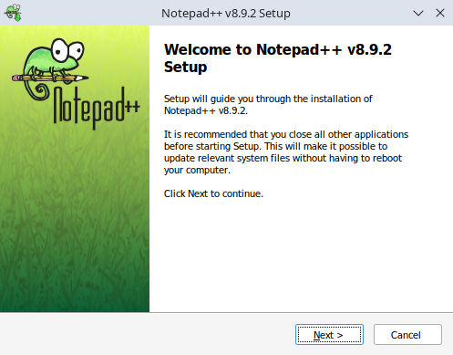

Proceed to the installation process, after Notepad++ is installed you can run it like this:

```bash
flatpak run --env=WINEPREFIX="${WINEPREFIX:?}" --filesystem="$WINEPREFIX" org.winehq.Wine notepad++
```

The Notepad++ main window should appear:

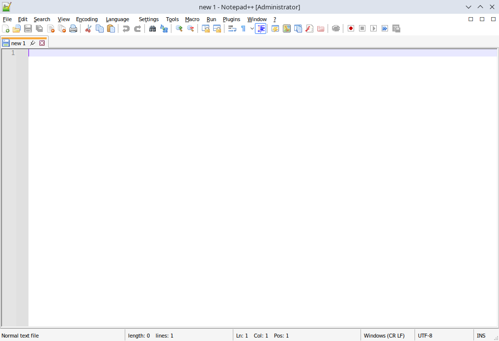

#### Sharing files with a sandbox <a name="filesystem_permissions"></a>

If you followed [Step 3 (Restricting sandbox permissions)](#step-3---restricting-sandbox-permissions) Notepad++ will not be able to access
files on your Linux host. Only files that are placed inside a Wine prefix, e.g.
`$WINEPREFIX/drive_c/users/$USER/Documents` will be accessible to Notepad++.
You need to explicitly give permission for a particular path to be available inside a sandbox.

Filesystem permission can be given using `--filesystem` option for a single `flatpak run` invocation.
For a more persistent solution `flatpak override` can be used.

Let's look at the `--filesystem` option. You have seen it's used throughout this tutorial
to allow access to a Wine prefix. For example, to run Notepad++ and make a directory
of a project you're working on to be available for modification inside a sandbox, you can use the following command:

> Replace `${SHARED_DIR:?}` with an absolute path to the directory you want to share.

```bash
flatpak run --env=WINEPREFIX="${WINEPREFIX:?}" \
    --filesystem="$WINEPREFIX" \
    --filesystem="${SHARED_DIR:?}" \
    org.winehq.Wine notepad++ -openFoldersAsWorkspace ${SHARED_DIR:?}
```

If you don't want to pass `--filesystem` with a desired path each time you invoke Notepad++, there is a second option.
You can use `flatpak override` to configure a path to be always available inside a sandbox.
To share a directory `${SHARED_DIR:?}` permanently with Wine, run the following:

> Replace `${SHARED_DIR:?}` with a full path to a directory.

```bash
flatpak override --user --filesystem="${SHARED_DIR:?}" org.winehq.Wine
```

Now, you can run Notepad++ without passing `--filesystem="${SHARED_DIR:?}"` each time:

```bash
flatpak run --env=WINEPREFIX="${WINEPREFIX:?}" \
    --filesystem="$WINEPREFIX" \
    org.winehq.Wine notepad++
```

Overrides that are specific to your user are stored in `~/.local/share/flatpak/overrides/org.winehq.Wine`.

### Step 8.2 - Installing SumatraPDF

A script below will download the latest version of SumatraPDF and install it in a silent mode.
In other words, you don't need to interact with an installer wizard to install SumatraPDF.
Many Windows installers support the silent mode, but the syntax to invoke it may differ.

Save the script below into a file `install_sumatra_pdf.sh`.

```bash
#!/usr/bin/env bash

set -euo pipefail

downloads=${WINEPREFIX:?}/drive_c/users/$USER/Downloads

latest="$(curl -sI https://github.com/sumatrapdfreader/sumatrapdf/releases/latest | tr -d '\r' | grep '^location:')"
latest="${latest##*/}"
latest="${latest%rel}"
curl -fL --output-dir "$downloads" -O "https://www.sumatrapdfreader.org/dl/rel/${latest}/SumatraPDF-${latest}-64-install.exe"
flatpak run --env=WINEPREFIX="${WINEPREFIX:?}" \
    --filesystem="$WINEPREFIX" org.winehq.Wine \
    "$WINEPREFIX/drive_c/users/$USER/Downloads/SumatraPDF-${latest}-64-install.exe" \
    -install -all-users -s
echo 'SumatraPDF installation is complete.' >&2
```

Make the script executable and run it to start the installation process:

```bash
chmod +x install_sumatra_pdf.sh && ./install_sumatra_pdf.sh
```

You can launch SumatraPDF as follows: <a name="sumatrapdf_launch"></a>

```bash
flatpak run --env=WINEPREFIX="${WINEPREFIX:?}" --filesystem="$WINEPREFIX" org.winehq.Wine 'C:\Program Files\SumatraPDF\SumatraPDF.exe'
```

SumatraPDF will appear on your screen:

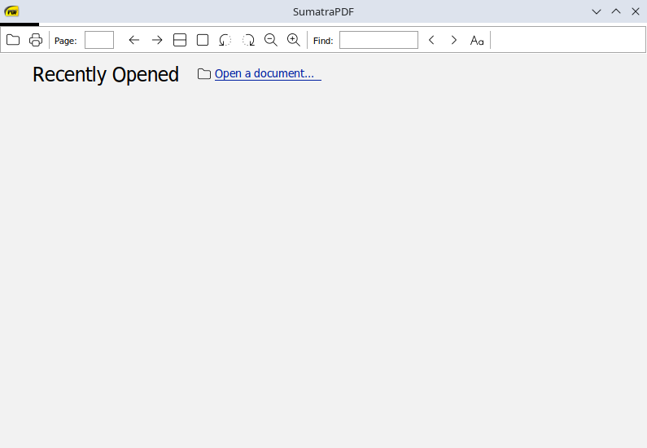

SumatraPDF has a bug when running using Wine, a program menu is not shown.
It can be fixed by adjusting a SumatraPDF configuration.

Open the configuration file:

```bash
flatpak run --env=WINEPREFIX="${WINEPREFIX:?}" --filesystem="$WINEPREFIX" org.winehq.Wine notepad 'C:\Users\'"$USER"'\AppData\Local\SumatraPDF\SumatraPDF-settings.txt'
```

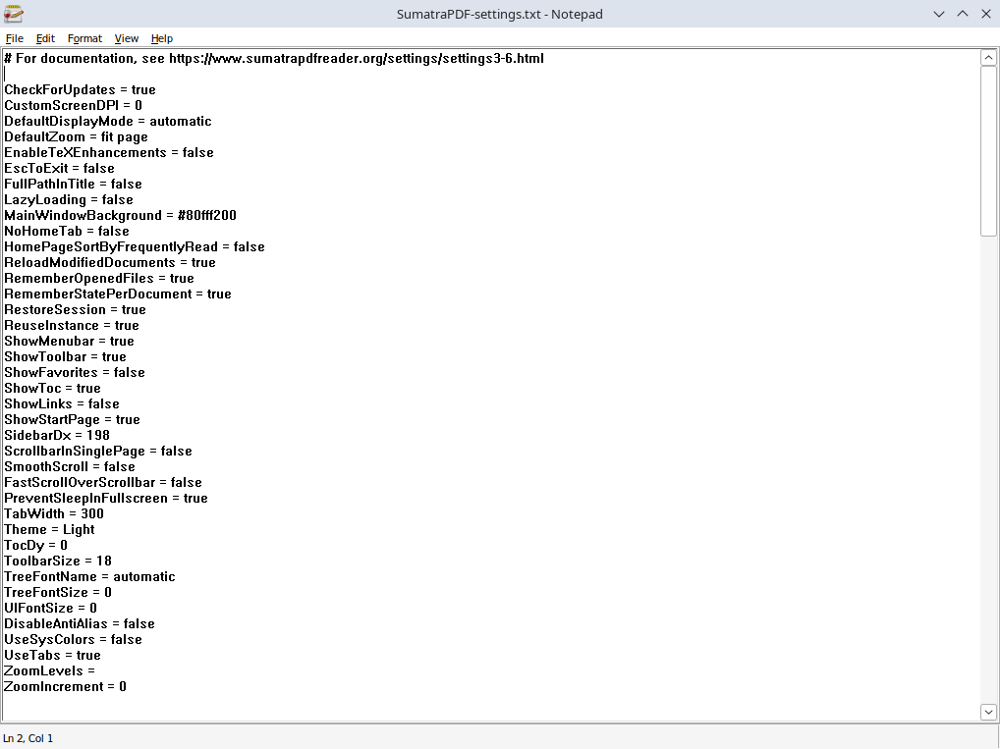

Find the following lines:

```ini
RestoreSession = true

UseTabs = true
```

and change them to:

```ini
RestoreSession = false

UseTabs = false
```

Save the file. You can [relaunch SumatraPDF](#sumatrapdf_launch) to check that the menu is visible and working now:

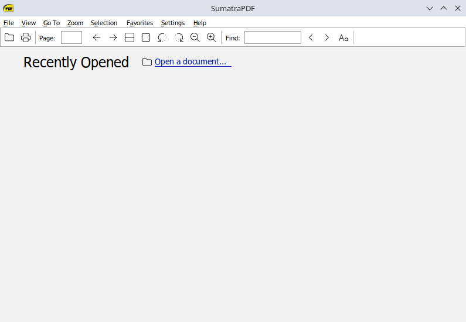

If you want to read PDF files stored on your Linux host using SumatraPDF you may need to [adjust
filesystem](#filesystem_permissions) permissions as already described.

In contrast to Notepad++, you can probably share your files read-only by adding `:ro` suffix to the `--filesystem` option.
So SumatraPDF will not be able to modify your files.
For example:

> Replace `${BOOK:?}` with a path to a book you want to read.
> Alternatively, define the `BOOK` variable as follows: `BOOK=~/path/to/my/book.pdf`.

```bash
flatpak run --env=WINEPREFIX="${WINEPREFIX:?}" \
    --filesystem="$WINEPREFIX" \
    --filesystem="${BOOK:?}" \
    org.winehq.Wine \
    'C:\Program Files\SumatraPDF\SumatraPDF.exe' "${BOOK:?}"
```

## Conclusion

Thanks to projects like Wine and DXVK it has never been easier
to play Windows games on Linux. Hopefully you enjoy your time playing them.

If you don't want or can't use Flatpak, you can install Wine using your package manager.
Be aware that your distro may not provide the WoW64 build of Wine. The advantage of the WoW64 mode, as already mentioned,
is that you don't need to install hundreds of 32-bit dependencies on your Linux system.
If you're on Ubuntu 25.10 and up you can install Wine from the [WineHQ repository], which provides the WoW64 builds.
Sandboxing in that case, can be achieved using [bubblewrap] or other similar tools.

Further reading may include a [Wine page on Arch Wiki] which contains some useful tips and tricks.
The official [Wine docs] are helpful too.

[bubblewrap]: https://github.com/containers/bubblewrap
[Wine docs]: https://gitlab.winehq.org/wine/wine/-/wikis/Documentation
[Wine page on Arch Wiki]: https://wiki.archlinux.org/title/Wine
[WineHQ repository]: https://gitlab.winehq.org/wine/wine/-/wikis/Debian-Ubuntu#winehq-repository

##### License: MIT

<!--

Contributor's Certificate of Origin

By making a contribution to this project, I certify that:

(a) The contribution was created in whole or in part by me and I have
    the right to submit it under the license indicated in the file; or

(b) The contribution is based upon previous work that, to the best of my
    knowledge, is covered under an appropriate license and I have the
    right under that license to submit that work with modifications,
    whether created in whole or in part by me, under the same license
    (unless I am permitted to submit under a different license), as
    indicated in the file; or

(c) The contribution was provided directly to me by some other person
    who certified (a), (b) or (c) and I have not modified it.

(d) I understand and agree that this project and the contribution are
    public and that a record of the contribution (including all personal
    information I submit with it, including my sign-off) is maintained
    indefinitely and may be redistributed consistent with this project
    or the license(s) involved.

Signed-off-by: wpdevelopment11 wpdevelopment11@gmail.com

-->
