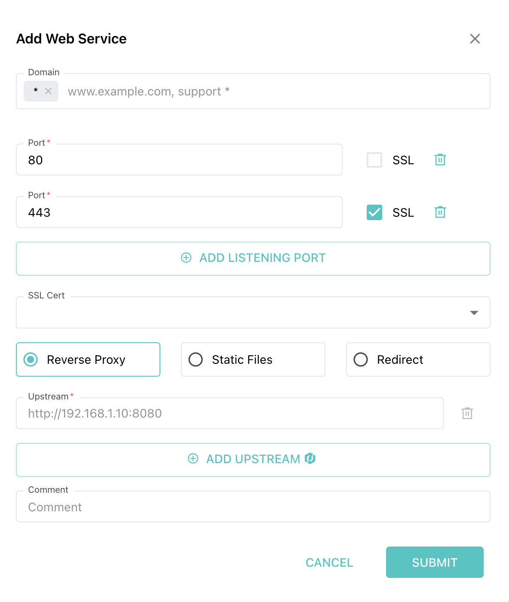
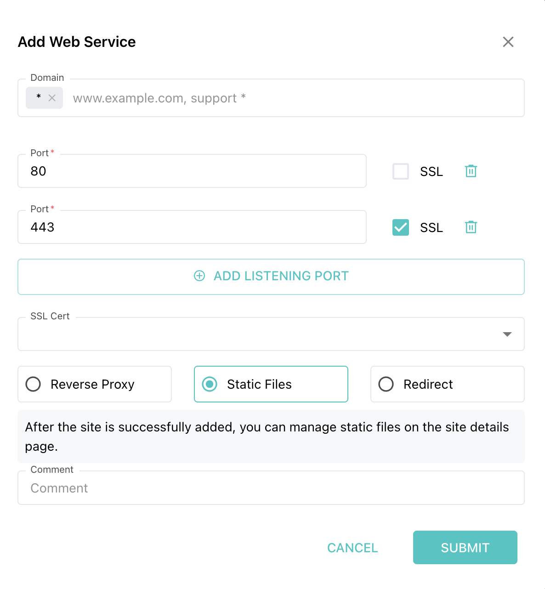
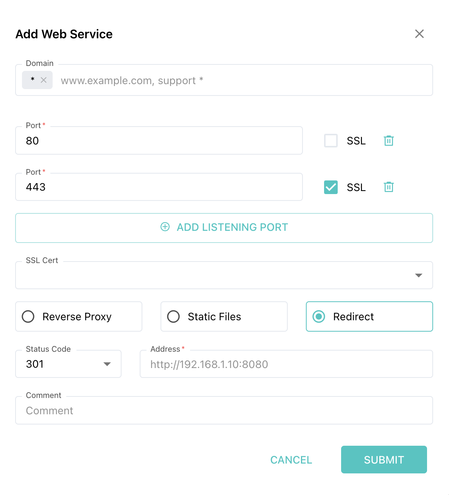

## About SafeLine WAF
[SafeLine WAF](https://waf.chaitin.com/) is a free, open source and self-hosted WAF that protects your web applications from cyber attacks. Its core capabilities include:
* Defenses for web attacks
* Bot protection
* HTML & JS code encryption
* Rate limiting
* Web access control

## How to Configure Your Websites on SafeLine

SafeLine offers three different website configuration modes to cater to various website needs:

1. **Proxy to Existing Site**
2. **Using Static Files**
3. **Site Redirection**

## Proxy to Existing Site

If you already have a web service running with the domain name `demo.safeline.com`, resolving to the server `192.168.1.2:8000`, and you need to secure it using SafeLine WAF, you can choose the "Proxy to Existing Site" mode.


### Domain
It is the domain name used when accessing through SafeLine. By default, it does not restrict specific access domains (`*`). You can change this to `demo.safeline.com` so that access is only allowed through this domain.

**Tips:** Remember to modify the domain's DNS records with your DNS service provider to point to the WAF server's IP address. Otherwise, traffic will not be routed through the WAF, and protection will not be effective.

### Port
About the port SafeLine listening to for the site, typically, HTTP uses port 80 and HTTPS uses port 443. Select SSL if the port uses the HTTPS protocol.

### Upstream Server
This is the server that currently hosts your web service. Enter the address according to your setup. For this tutorial, use `http://192.168.1.2:8000`.

**Tips:** If you encounter an error like `nginx: [emerg] duplicate listen options for 0.0.0.0:80`, it means there is a port conflict on the WAF server. Resolve the conflict by checking if another proxy server (like Nginx) is occupying the port.

### Remarks
You can give this configuration a memorable name, or leave it blank.

## Using Static Files

If you have a front-end static site that needs to be hosted and protected by the WAF, you can use this mode. Unlike the proxy mode, you only need to specify the listening port. Once the site is created, upload the static resource files to be proxied.


After entering the site details, switch to the static resources tab to upload the files.

**Tips:** If you upload a zip file, it will automatically extract and overwrite the entire directory.

## Site Redirectiong

If you have a site domain that is no longer in use and you need to redirect it to a new domain, you can use this mode. For example, you can redirect `old.safeline.com` to `new.safeline.com` with a 301 redirect.


## Testing Protection Performance

After completing the above steps, SafeLine should start working for you. Access the configured domain and port to test it.

You can simulate SQL injection attacks on your site to check if they are intercepted correctly.

## Common Issues and Troubleshooting

### How to Confirm Traffic Passes Through SafeLine WAF
All requests passing through the WAF will have a `sl-session` cookie set in the response header. Check for its presence.

### Port Conflicts
Use commands like `lsof` or `ss` to identify which program is occupying the port and resolve the issue accordingly.

### Tengine Keeps Restarting
This may be due to an invalid configuration in the current environment, preventing Tengine from starting. Possible reasons include port occupation by another process or DNS configuration issues. Check Tengine container logs to diagnose the problem, or use the `reset_tengine.sh` script in the installation directory to reset Tengine configuration.

```
# Assuming the installation directory is the default directory
cd /data/safeline && bash reset_tengine.sh
```

##### License: MIT

<!--

Contributor's Certificate of Origin

By making a contribution to this project, I certify that:

(a) The contribution was created in whole or in part by me and I have
    the right to submit it under the license indicated in the file; or

(b) The contribution is based upon previous work that, to the best of my
    knowledge, is covered under an appropriate license and I have the
    right under that license to submit that work with modifications,
    whether created in whole or in part by me, under the same license
    (unless I am permitted to submit under a different license), as
    indicated in the file; or

(c) The contribution was provided directly to me by some other person
    who certified (a), (b) or (c) and I have not modified it.

(d) I understand and agree that this project and the contribution are
    public and that a record of the contribution (including all personal
    information I submit with it, including my sign-off) is maintained
    indefinitely and may be redistributed consistent with this project
    or the license(s) involved.

Signed-off-by: [Carrie liyan.luo@chaitin.com]

-->
