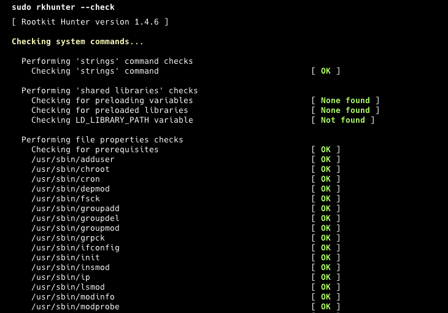

## Introduction
I remember my first servers. I did almost nothing to keep them safe because I wasn't aware that someone with bad intentions could reach my server. And you can guess how it ended. Thankfully, I had backups and I could easily restore them. But it happened again. So, this time, I did some research, did my homework, and made my servers more secure. I know there is no unhackable server, but I will show you how to keep your server safe and what to do if it goes down.

We will start with the initial setup. You will learn what you should do when you first create a new server. Then, we will cover how to maintain it by doing regular check-ups. Lastly, you will learn what to do when your server goes down. This tutorial will not make you a professional server manager, as that requires much work and is a serious job. But at least you will be able to keep your hobby projects safe.

Let's start!

**Prerequisites**

* 1 server (e.g. with [Hetzner](https://docs.hetzner.com/cloud/servers/getting-started/creating-a-server))

**Example terminology**

* Username: `holu`

## Step 1 - Initial Setup and Basic Security


After you created your server, make sure to follow steps 1 to 5 in the tutorial "[Initial Server Setup with Ubuntu](https://community.hetzner.com/tutorials/howto-initial-setup-ubuntu)". It explains how to:

* Create a new user with sudo permissions
* Add an SSH key

After you completed the first 5 steps of the linked tutorial and connected to the new sudo user, you can continue with the steps below.

### Update The System

The first thing you should do is check for updates because outdated software can have vulnerabilities that are easily exploitable. It's easier than you think; just run these two commands:

```bash
sudo apt update
sudo apt upgrade
```

Easy, right? We have now ensured we are using the latest versions.

### Secure SSH Access

When someone targets your server, the first thing they will likely try is accessing it via SSH. They often do this with bots and multiple methods. So securing SSH access is crucial.

Edit the configuration file:

```bash
sudo nano /etc/ssh/sshd_config
```

* **Disable root access**
  
  Find the line "PermitRootLogin" and change it to "no".

<br>

* **Disable password login**
  
  If you added an SSH key as suggested above, you can disable password login.

  * Find "PasswordAuthentication" and set it to "no".
  * Find "PubkeyAuthentication" and set it to "yes".

<br>

* **Change the default SSH port**
  
  By just changing that, we can eliminate most of the automated bot attacks because most of them are dummy bots and will try to access SSH via port 22.
  
  Find the line "#Port 22" and change it to something like "Port 2222" (or change 2222 to anything you want).

Save the changes and check if the port was changed successfully: 

```bash
sudo systemctl restart ssh.service
sudo systemctl status ssh
```

Make sure it says `Server listening on :: port 2222`.

<blockquote><details>
<summary>Click here if the port is still 22</summary>

If your server has Ubuntu 24.04 and the port did not change after you edited `/etc/ssh/sshd_config`, you can try and run these commands:

```bash
sudo systemctl stop ssh.socket
sudo systemctl restart ssh.service
sudo systemctl status ssh
```

</details></blockquote>

If is says `port 2222`, you can run `exit` to end the connection to the server and test if connecting to the new port works:

```bash
ssh -p 2222 holu@<203.0.113.1>
```

If you can connect to the port you set, you can continue with the tutorial.

### Configure a Firewall
We will use "ufw" to manage firewall rules. It is designed to be easy to use and utilizes a command line interface. Ufw is probably already installed on your system, but you can run this command to make sure it's installed:

```bash
sudo apt install ufw
```

Next, we will deny all incoming network traffic unless specifically allowed by other rules. This is fundamental to securing your server by only allowing traffic that you explicitly allow. You need to run this command:

```bash
sudo ufw default deny incoming
```

Then, we will allow all outgoing network traffic. This is typically safe and allows your server to communicate with other servers or services without restriction. Run this command:

```bash
sudo ufw default allow outgoing
```

Now, we need to allow our SSH port to be able to log in to our server via SSH. Just make sure you change 2222 to your SSH port if you specified something else, and run this command:

```bash
sudo ufw allow 2222/tcp
```

Lastly, we need to enable our firewall rules:

```bash
sudo ufw enable
```

### Fail2Ban

We changed our SSH port and set up our firewall. But what happens if a bot finds our port and still tries to access our server via SSH? That would be a brute force attack, and we can protect our server with Fail2Ban. This software will ban IPs that show malicious signs or attempts. You need to run these three commands to install and enable Fail2Ban:

```bash
sudo apt install fail2ban
sudo systemctl enable fail2ban
sudo systemctl start fail2ban
```

You can also customize the settings for Fail2Ban by editing the configuration files in the `/etc/fail2ban/` folder. For more detailed information and best practices, you can check the [Fail2Ban documentation](https://github.com/fail2ban/fail2ban/wiki/Best-practice).

Great! You've made a big step and already have a more protected server. Now, you just need to perform regular maintenance from time to time. We will explain what you need to do in the next section.

## Step 2 - Regular Maintenance


* **Update The System**
  
  First things first, we need to check if there are any updates for our system. Run this command:
  
  ```bash
  sudo apt update && sudo apt upgrade -y
  ```

<br>

* **Monitor Logs**
  
  You need to regularly review your system logs to detect unusual activities. Logwatch can help you automate this process. You can install logwatch with this command:
  
  ```bash
  sudo apt install logwatch
  ```
  
  You can check more detailed information, how to set up daily reports, and see what its reports look like from [this guide](https://ubuntu.com/server/docs/how-to-install-and-configure-logwatch).

<br>

* **Check Disk Usage**
  
  Just to make sure you have enough space to keep your server running, check your remaining disk space with this command:
  
  ```bash
  df -h
  ```

<br>

* **Backup Your Data**
  
  You should always have multiple backups to ensure you can recover from disasters if your server is completely deleted or unreachable. Luckily, Hetzner has an automated backup solution for cloud servers, and you can check it out in the [official documentation](https://docs.hetzner.com/cloud/servers/getting-started/enabling-backups). If you want to set up your own backups, you can use tools like "rsync" or "Duplicity."

<br>

* **Audit User Accounts**
  
  Don't forget to check user accounts on the server regularly. Ensure only authorized users have access to your server. Delete any accounts that are no longer needed. You can check user accounts by running this command:
  
  ```bash
  sudo nano /etc/passwd
  ```

<br>

* **Check for Rootkits and Malware**
  
  To make quick scans on your server, you can use tools like "rkhunter" and "chkrootkit." These tools help you check for rootkits, backdoors, and possible local exploits, ensuring everything is okay. Run these commands to make sure rkhunter is installed and run a check:
  
  ```bash
  sudo apt install rkhunter
  sudo rkhunter --check
  ```
  
  

<br>

* **Monitor System Performance**
  
  Lastly, you can quickly check system performance to make sure there are no resource bottlenecks while running your software. There are tools like "htop," "top," or "atop." But you can just run this command:
  
  ```bash
  htop
  ```
  
  

## Step 3 - More Security Tools


* **Use Intrusion Detection Systems**
  
  You can use tools like "AIDE" (Advanced Intrusion Detection Environment) to monitor changes to your system. It generates a database for your files and folders and compares your system against that database to ensure file integrity. You can check more details from its [repo](https://github.com/aide/aide). For basic usage, you can install it with this command:
  
  ```bash
  sudo apt install aide
  ```
  
  Start and generate the database with these commands:
  
  ```bash
  sudo aideinit
  sudo cp /var/lib/aide/aide.db.new /var/lib/aide/aide.db
  ```
  
  And compare your system with the database using this command:
  
  ```bash
  sudo aide --config /etc/aide/aide.conf --check
  ```

<br>

* **Enable Two-Factor Authentication (2FA)**
  
  You can also set up 2FA (Two-Factor Authentication) for logging in to your server via SSH. This adds an extra layer of protection and reduces the risk of unauthorized access. You can install it with this command:
  
  ```bash
  sudo apt install libpam-google-authenticator
  ```
  
  And run this command to setup:
  
  ```bash
  google-authenticator
  ```

<br>

* **Secure Web Applications**
  
  If you are running web applications on your server, make sure you are following their best practices and updating them regularly. For example, if you are running WordPress, you should always use the latest version of WordPress, as well as keeping all plugins and themes up to date. Additionally, you need to install a proper WordPress security plugin. This will reduce the risk of unauthorized access to your server and applications.

## Step 4 - Incident Response Plan


This plan can be very detailed in big organizations. But we will keep it simple and actionable for small hobby servers. For this reason, I have prepared a 3-step plan for you.

* **Preparation**
  
  For this part, you need to create a small text file or a note in your notes app about your server info. Include information such as your server architecture, the software it is running, where your backups and logs are stored, and your configurations. Keep this note somewhere safe. You can check this example as a starting point:
  
  **Server Information**
  
  | Info             | Desc             |
  | ---------------- | ---------------- |
  | Server Name      | MyServer01       |
  | IP Address       | 192.168.1.100    |
  | Operating System | Ubuntu 24.04 LTS |
  | CPU              | 4 vCPUs          |
  | RAM              | 8 GB             |
  | Storage          | 100 GB SSD       |
  | SSH Port         | 2222             |
  
  - Software and Services: Nginx 1.18.0, PostgreSQL 13, Django 3.1
  - Backup: Duplicity, Daily, /mnt/backups and remote storage on AWS S3, 30days retention
  - Nginx Config: /etc/nginx/nginx.conf
  - PostgreSQL Config: /etc/postgresql/13/main/postgresql.conf
  - Django Config: /home/myuser/myapp/settings.py
  - UFW Config: /etc/ufw/ufw.conf

<br>

* **Identification**
  
  In this part, you should check what the problem is with your server. Is the problem or breach related to your web application, the server itself, or one of the databases inside your server? If you are not sure, always assume everything is at risk. So you should start checking everything again, beginning with the server.

<br>

* **Recovery**
  
  Restore affected systems in this part. If you cannot reach your server, you need to restore from a server backup. If one of the web applications is broken, you may only need to restore its backup. Ensure everything is restored, tested, working as expected, and that you have performed a security scan.


## Conclusion

Securing your server requires a combination of best practices and regular maintenance. By following the steps outlined in this post, you can significantly enhance the security of your server and protect your valuable data. Remember, security is an ongoing process, so don't forget to regularly check your servers.

##### License: MIT

<!--

Contributor's Certificate of Origin

By making a contribution to this project, I certify that:

(a) The contribution was created in whole or in part by me and I have
    the right to submit it under the license indicated in the file; or

(b) The contribution is based upon previous work that, to the best of my
    knowledge, is covered under an appropriate license and I have the
    right under that license to submit that work with modifications,
    whether created in whole or in part by me, under the same license
    (unless I am permitted to submit under a different license), as
    indicated in the file; or

(c) The contribution was provided directly to me by some other person
    who certified (a), (b) or (c) and I have not modified it.

(d) I understand and agree that this project and the contribution are
    public and that a record of the contribution (including all personal
    information I submit with it, including my sign-off) is maintained
    indefinitely and may be redistributed consistent with this project
    or the license(s) involved.

Signed-off-by: Oguzhan Selcuk Bulbul contact@osbulbul.com

-->