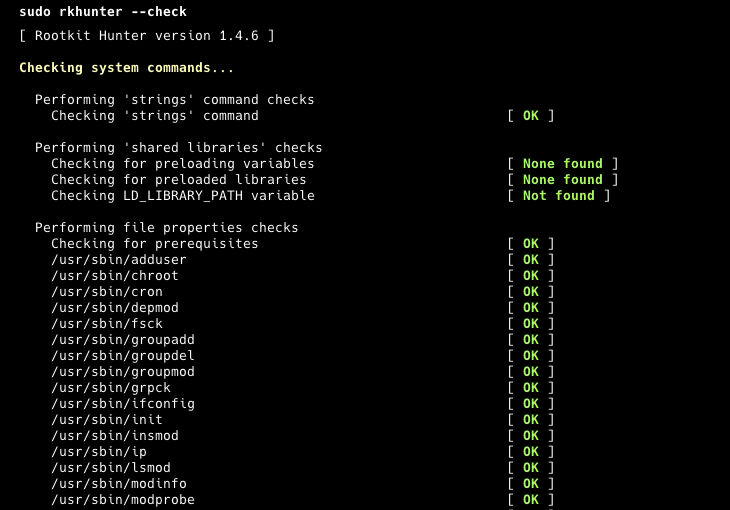
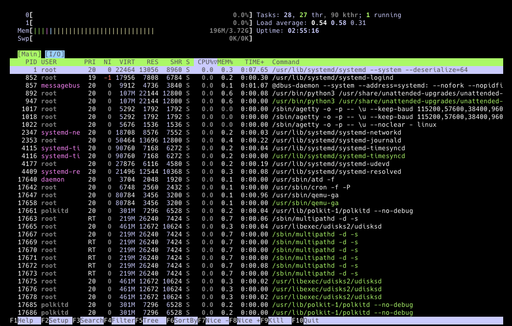

## Giriş
İlk sunucularımı hatırlıyorum. Onları güvende tutmak için neredeyse hiçbir şey yapmadım çünkü kötü niyetli birinin sunucuma ulaşabileceğinin farkında değildim. Ve nasıl bittiğini tahmin edebilirsiniz. Neyse ki, yedeklerim vardı ve onları kolayca geri yükleyebildim. Ama tekrar oldu. Bu sefer, araştırma yaptım, ödevimi yaptım ve sunucularımı daha güvenli hale getirdim. Biliyorum ki hiçbir sunucu kırılmaz değildir, ama size sunucunuzu nasıl güvende tutacağınızı ve sunucunuz çökerse ne yapmanız gerektiğini göstereceğim.

Başlangıç kurulumuyla başlayacağız. Yeni bir sunucu oluşturduğunuzda ne yapmanız gerektiğini öğreneceksiniz. Daha sonra, düzenli kontroller yaparak nasıl bakım yapacağımızı ele alacağız. Son olarak, sunucunuz çöktüğünde ne yapmanız gerektiğini öğreneceksiniz. Bu eğitim sizi profesyonel bir sunucu yöneticisi yapmaz, çünkü bu çok fazla çalışma ve ciddi bir iştir. Ama en azından hobi projelerinizi güvende tutabileceksiniz.

Hadi başlayalım!

**Ön Koşullar**

* 1 adet sunucu (ör. [Hetzner](https://docs.hetzner.com/cloud/servers/getting-started/creating-a-server) sunucusu)

**Örnek terminoloji**

* Kullanıcı Adı: `holu`

## Adım 1 - Başlangıç Kurulumu ve Temel Güvenlik


İlk adımımız root girişini devre dışı bırakmaktır. Ancak root'u devre dışı bırakmadan önce yeni bir kullanıcı oluşturmalıyız. Yeni bir kullanıcı oluşturmak için bu komutu çalıştırın (holu'ı kendi kullanıcı adınızla değiştirin):

```bash
sudo adduser holu
```

Yeni kullanıcı için bir şifre belirlemeniz ve bazı ek bilgiler sağlamanız istenecektir. Yeni kullanıcıya yönetici yetkileri vermek için, onu sudo grubuna ekleyin:

```bash
sudo usermod -aG sudo holu
```

Her şeyin doğru çalıştığından emin olmak ve sudo erişimini test etmek için yeni kullanıcıya geçiş yapın:

```bash
su - holu
sudo apt update
```

Zaten bir SSH anahtar çiftiniz yoksa, ssh-keygen komutunu kullanarak bir tane oluşturabilirsiniz:

```bash
ssh-keygen -t ed25519
```

Bu, yeni bir SSH anahtar çifti (bir özel anahtar ve bir genel anahtar) oluşturacaktır. Varsayılan olarak, anahtarlar `~/.ssh` dizinine kaydedilecektir. Varsayılan dosya konumunu kabul etmek için Enter'a basabilir veya farklı bir yol belirtebilirsiniz. Ayrıca, isteğe bağlı olarak ek güvenlik için bir parola belirleyebilirsiniz.

Genel anahtarınızı sunucuya kopyalamak için `ssh-copy-id` komutunu kullanın. holu'ı kullanıcı adınız ve server_ip'yi sunucunuzun IP adresi ile değiştirin:

```bash
ssh-copy-id holu@server_ip
```

Alternatif olarak, ssh-copy-id mevcut değilse, genel anahtarı manuel olarak kopyalayabilirsiniz:

```bash
cat ~/.ssh/id_ed25519.pub | ssh holu@server_ip 'mkdir -p ~/.ssh && cat >> ~/.ssh/authorized_keys'
```

Sunucunuzdaki .ssh dizini ve authorized_keys dosyası için doğru izinleri sağladığınızdan emin olun:

```bash
chmod 700 ~/.ssh && chmod 600 ~/.ssh/authorized_keys
```

### Sistemi Güncelleme
Yapmanız gereken ilk şey, güncellemeleri kontrol etmektir çünkü güncel olmayan yazılımlar kolayca istismar edilebilecek güvenlik açıklarına sahip olabilir. Bu iki komutu çalıştırmak düşündüğünüzden daha kolaydır:

```bash
apt update
apt upgrade
```

Kolay, değil mi? Şimdi en son sürümleri kullandığımızdan emin olduk.

### SSH Erişimini Güvenceye Alma
Birisi sunucunuzu hedef aldığında, muhtemelen deneyecekleri ilk şey SSH üzerinden erişim sağlamaktır. Bunu genellikle botlar ve çeşitli yöntemlerle yaparlar. Bu yüzden SSH erişimini güvenceye almak çok önemlidir.

Konfigürasyon dosyasını düzenle:

```bash
sudo nano /etc/ssh/sshd_config
```

* **Root erişimini devre dışı bırak**
  
  "PermitRootLogin"ı bulun ve "no" olarak ayarlayın.

* **Şifre doğrulamayı devre dışı bırak**
  
  * "PasswordAuthentication"ı bulun ve "no" olarak ayarlayın.
  * "PubkeyAuthentication"ı bulun ve "yes" olarak ayarlayın.

* **Varsayılan SSH portunu değiştirme**
  
  Bunu değiştirerek, otomatik bot saldırılarının çoğunu ortadan kaldırabiliriz çünkü bunların çoğu SSH'ye port 22 üzerinden erişmeye çalışacak basit botlardır.
  
  "#Port 22" satırını bulun ve "Port 2222" gibi bir şeye değiştirin (veya 2222'yi istediğiniz herhangi bir portla değiştirin).

Değişiklikleri kaydedin ve portun değiştirilip değiştirilmediğini kontrol edin:

```bash
sudo systemctl restart ssh.service
sudo systemctl status ssh
```

`Server listening on :: port 2222` ifadesini görmelisiniz.

<blockquote><details>
<summary>Port hala 22 ise buraya tıklayın</summary>

Ubuntu 24.04'te şu komutları çalıştırın ve tekrar kontrol edin:

```bash
sudo systemctl disable ssh.socket && sudo systemctl stop ssh.socket
sudo systemctl restart ssh.service
sudo systemctl status ssh
```

</details></blockquote>

### Bir Güvenlik Duvarı Yapılandırma
Güvenlik duvarı kurallarını yönetmek için "ufw" kullanacağız. Kullanımı kolay olacak şekilde tasarlanmıştır ve bir komut satırı arayüzü kullanır. Ufw muhtemelen sisteminizde zaten yüklüdür, ancak yüklü olduğundan emin olmak için bu komutu çalıştırabilirsiniz:

```bash
sudo apt install ufw
```

Sonraki adım, diğer kurallarla özellikle izin verilmedikçe tüm gelen ağ trafiğini reddetmek olacaktır. Bu, yalnızca açıkça izin verdiğiniz trafiğe izin vererek sunucunuzu güvence altına almak için temeldir. Bu komutu çalıştırmanız gerekir:

```bash
sudo ufw default deny incoming
```

Ardından, tüm giden ağ trafiğine izin vereceğiz. Bu genellikle güvenlidir ve sunucunuzun diğer sunucular veya hizmetlerle sınırlama olmaksızın iletişim kurmasına izin verir. Bu komutu çalıştırın:

```bash
sudo ufw default allow outgoing
```

Şimdi, sunucumuza SSH üzerinden giriş yapabilmek için SSH portumuzu izin vermemiz gerekiyor. 2222'yi belirttiğiniz başka bir portla değiştirdiğinizden emin olun ve bu komutu çalıştırın:

```bash
sudo ufw allow 2222/tcp
```

Son olarak, güvenlik duvarı kurallarımızı etkinleştirmemiz gerekiyor:

```bash
sudo ufw enable
```

### Fail2Ban

SSH portumuzu değiştirdik ve güvenlik duvarımızı kurduk. Ama bir bot portumuzu bulursa ve hala sunucumuza SSH üzerinden erişmeye çalışırsa ne olur? Bu bir brute force saldırısı olacaktır ve sunucumuzu Fail2Ban ile koruyabiliriz. Bu yazılım, kötü niyetli belirtiler veya girişimler gösteren IP'leri yasaklayacaktır. Fail2Ban'i kurmak ve etkinleştirmek için bu üç komutu çalıştırmanız gerekir:

```bash
sudo apt install fail2ban
sudo systemctl enable fail2ban
sudo systemctl start fail2ban
```

Ayrıca, `/etc/fail2ban/` dizinindeki yapılandırma dosyalarını düzenleyerek Fail2Ban ayarlarını özelleştirebilirsiniz. Daha ayrıntılı bilgi ve en iyi uygulamalar için[Fail2Ban belgelerine](https://github.com/fail2ban/fail2ban/wiki/Best-practice) göz atabilirsiniz.

Harika! Büyük bir adım attınız ve zaten daha korumalı bir sunucunuz var. Şimdi, zaman zaman düzenli bakım yapmanız gerekiyor. Bir sonraki bölümde ne yapmanız gerektiğini açıklayacağız.

## Adım 2 - Düzenli Bakım


* **Sistemi Güncelleme**
  
  Öncelikle, sistemimiz için herhangi bir güncelleme olup olmadığını kontrol etmemiz gerekiyor. Bu komutu çalıştırın:
  
  ```bash
  sudo apt update
  sudo apt upgrade
  ```

<br>

* **Günlükleri İzleme**
  
  Sistem günlüklerini düzenli olarak gözden geçirmen gerekiyor, böylece olağandışı etkinlikleri tespit edebilirsin. Logwatch bu süreci otomatikleştirmen için sana yardımcı olabilir. Logwatch'ı şu komutla kurabilirsin:
  
  ```bash
  sudo apt install logwatch
  ```
  
  Daha ayrıntılı bilgileri, günlük raporları nasıl ayarlayacağını ve raporların nasıl göründüğünü [bu kılavuzdan](https://ubuntu.com/server/docs/how-to-install-and-configure-logwatch) inceleyebilirsin.

<br>

* **Disk Kullanımını Kontrol Etme**
  
  Sunucunuzun çalışmaya devam etmesi için yeterli alanınız olduğundan emin olmak için kalan disk alanınızı bu komutla kontrol edin:
  
  ```bash
  df -h
  ```

<br>

* **Verilerinizi Yedekleme**
  
  Sunucunuz tamamen silinirse veya erişilemez hale gelirse felaketlerden kurtulabilmeniz için her zaman birden fazla yedeğiniz olmalıdır. Neyse ki, Hetzner'in bulut sunucuları için otomatik bir yedekleme çözümü vardır ve bunu [resmi belgelerde](https://docs.hetzner.com/cloud/servers/getting-started/enabling-backups) bulabilirsiniz. Kendi yedeklerinizi kurmak isterseniz, "rsync" veya "Duplicity" gibi araçları kullanabilirsiniz.

<br>

* **Kullanıcı Hesaplarını Denetleme**
  
  Sunucudaki kullanıcı hesaplarını düzenli olarak kontrol etmeyi unutmayın. Sadece yetkili kullanıcıların sunucunuza erişimi olduğundan emin olun. Artık gerekli olmayan hesapları silin. Kullanıcı hesaplarını kontrol etmek için bu komutu çalıştırabilirsiniz:
  
  ```bash
  sudo nano /etc/passwd
  ```

<br>

* **Rootkit ve Kötü Amaçlı Yazılımları Kontrol Etme**
  
  Sunucunuzda hızlı taramalar yapmak için "rkhunter" ve "chkrootkit" gibi araçları kullanabilirsiniz. Bu araçlar, rootkit'ler, arka kapılar ve olası yerel açıklar olup olmadığını kontrol etmenize yardımcı olur, böylece her şeyin yolunda olduğundan emin olabilirsiniz. rkhunter'ın yüklü ve kontrol edilmiş olduğundan emin olmak için bu komutları çalıştırın:
  
  ```bash
  sudo apt install rkhunter
  sudo rkhunter --check
  ```
  
  

<br>

* **Sistem Performansını İzleme**
  
  Son olarak, yazılımlarınızı çalıştırırken kaynak darboğazları olmadığından emin olmak için sistem performansını hızlıca kontrol edebilirsiniz. "htop", "top" veya "atop" gibi araçlar vardır. Ancak, sadece bu komutu çalıştırabilirsiniz:
  
  ```bash
  htop
  ```
  
  

## Adım 3 - Daha Fazla Güvenlik Araçları


* **Giriş Tespit Sistemlerini Kullanma**
  
  Sisteminizdeki değişiklikleri izlemek için "AIDE" (Advanced Intrusion Detection Environment) gibi araçları kullanabilirsiniz. Bu araç, dosya ve klasörleriniz için bir veritabanı oluşturur ve sisteminizi bu veritabanıyla karşılaştırarak dosya bütünlüğünü sağlar. Daha fazla ayrıntı için [deposuna](https://github.com/aide/aide) göz atabilirsiniz. Temel kullanım için bu komutla kurabilirsiniz:
  
  ```bash
  sudo apt install aide
  ```
  
  Veritabanını başlatın ve oluşturun:
  
  ```bash
  sudo aideinit
  sudo cp /var/lib/aide/aide.db.new /var/lib/aide/aide.db
  ```
  
  Ve bu komutu kullanarak sisteminizi veritabanıyla karşılaştırın:
  
  ```bash
  sudo aide --config /etc/aide/aide.conf --check
  ```

<br>

* **İki Faktörlü Kimlik Doğrulamayı (2FA) Etkinleştirme**
  
  Sunucunuza SSH ile giriş yapmak için 2FA (İki Faktörlü Kimlik Doğrulama) da kurabilirsiniz. Bu, ek bir koruma katmanı ekler ve yetkisiz erişim riskini azaltır. Bu komutu kullanarak kurabilirsiniz:
  
  ```bash
  sudo apt install libpam-google-authenticator
  ```
  
  Ve kurulum için bu komutu çalıştırın:
  
  ```bash
  google-authenticator
  ```

<br>

* **Web Uygulamalarını Güvenceye Alma**
Sunucunuzda web uygulamaları çalıştırıyorsanız, en iyi uygulamaları takip ettiğinizden ve düzenli olarak güncellediğinizden emin olun. Örneğin, WordPress kullanıyorsanız, her zaman en son sürümünü, tüm eklentileri ve temaları güncel tutmalısınız. Ayrıca, uygun bir WordPress güvenlik eklentisi kurmanız gerekir. Bu, sunucunuza ve uygulamalarınıza yetkisiz erişim riskini azaltacaktır.

## Adım 4 - Olay Müdahale Planı


Bu plan büyük organizasyonlarda çok detaylı olabilir. Ancak, biz bunu küçük hobi sunucuları için basit ve uygulanabilir tutacağız. Bu nedenle, sizin için 3 adımlı bir plan hazırladım.

* **Hazırlık**
  
  Bu bölüm için, sunucunuz hakkında bilgiler içeren küçük bir metin dosyası veya notlar uygulamanızda bir not oluşturmanız gerekir. Sunucu mimariniz, hangi yazılımların çalıştığı, yedeklemelerinizin ve günlüklerinizin nerede olduğu, yapılandırmalarınız gibi bilgileri dahil edin. Bu notu güvenli bir yerde saklayın. Başlangıç noktası olarak bu örneğe göz atabilirsiniz:
  
  **Sunucu Bilgileri**
  
  | Info             | Desc             |
  | ---------------- | ---------------- |
  | Server Name      | MyServer01       |
  | IP Address       | 192.168.1.100    |
  | Operating System | Ubuntu 24.04 LTS |
  | CPU              | 4 vCPUs          |
  | RAM              | 8 GB             |
  | Storage          | 100 GB SSD       |
  | SSH Port         | 2222             |
  
  - Yazılım ve Hizmetler: Nginx 1.18.0, PostgreSQL 13, Django 3.1
  - Yedekleme: Duplicity, Günlük, /mnt/backups ve AWS S3 üzerinde uzak depolama, 30 gün saklama süresi
  - Nginx Yapılandırması: /etc/nginx/nginx.conf
  - PostgreSQL Yapılandırması: /etc/postgresql/13/main/postgresql.conf
  - Django Yapılandırması: /home/myuser/myapp/settings.py
  - UFW Yapılandırması: /etc/ufw/ufw.conf

<br>

* **Tanımlama**
  
  Bu bölümde, sunucunuzda sorunun ne olduğunu kontrol etmelisiniz. Sorun veya ihlal web uygulamanızla mı, sunucunun kendisiyle mi yoksa sunucunuzdaki veritabanlarından biriyle mi ilgili? Emin değilseniz, her şeyin risk altında olduğunu varsayın. Bu yüzden her şeyi yeniden kontrol etmeye sunucudan başlayarak başlamalısınız.

<br>

* **Kurtarma**
  
  Etkilenen sistemleri bu bölümde geri yükleyin. Sunucunuza erişemiyorsanız, bir sunucu yedeğinden geri yüklemeniz gerekir. Web uygulamalarından biri bozulmuşsa, sadece onun yedeğini geri yüklemeniz gerekebilir. Her şeyin geri yüklendiğinden, test edildiğinden, beklendiği gibi çalıştığından ve bir güvenlik taraması yaptığınızdan emin olun.


## Sonuç

Sunucunuzu güvence altına almak, en iyi uygulamaların ve düzenli bakımın birleşimini gerektirir. Bu yazıda belirtilen adımları takip ederek, sunucunuzun güvenliğini önemli ölçüde artırabilir ve değerli verilerinizi koruyabilirsiniz. Unutmayın, güvenlik sürekli bir süreçtir, bu yüzden sunucularınızı düzenli olarak kontrol etmeyi unutmayın.

##### License: MIT

<!--

Contributor's Certificate of Origin

By making a contribution to this project, I certify that:

(a) The contribution was created in whole or in part by me and I have
    the right to submit it under the license indicated in the file; or

(b) The contribution is based upon previous work that, to the best of my
    knowledge, is covered under an appropriate license and I have the
    right under that license to submit that work with modifications,
    whether created in whole or in part by me, under the same license
    (unless I am permitted to submit under a different license), as
    indicated in the file; or

(c) The contribution was provided directly to me by some other person
    who certified (a), (b) or (c) and I have not modified it.

(d) I understand and agree that this project and the contribution are
    public and that a record of the contribution (including all personal
    information I submit with it, including my sign-off) is maintained
    indefinitely and may be redistributed consistent with this project
    or the license(s) involved.

Signed-off-by: Oguzhan Selcuk Bulbul contact@osbulbul.com

-->