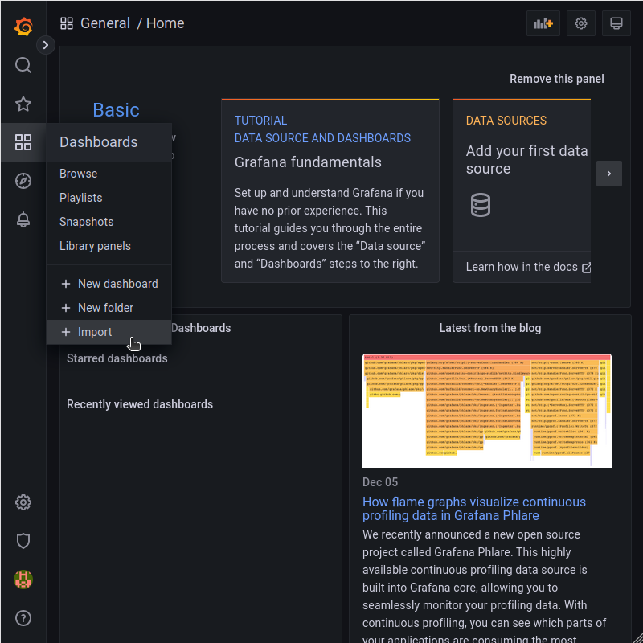

## Introduction

Grafana is a monitoring software for data visualization.
You can display every data, on several graphs or gauges.
We will use Telegraf for storing the data in InfluxDB, which will be displayed on a Grafana dashboard.

**Prerequisites**

For this tutorial, you need a machine/server you want to monitor, e.g. a Cloud server or a Dedicated root server with Ubuntu.

This tutorial has been tested on:

* Ubuntu 22.04
* Ubuntu 20.04
* Ubuntu 18.04

We assume you to be the `root` user.

And you also need DNS records pointing to the IP address of your server.

DNS records for Grafana:

| Type | Name    | Value                           |
| ---- | ------- | ------------------------------- |
| A    | grafana | `<IPv4 address of your server>` |
| AAAA | grafana | `<IPv6 address of your server>` |

DNS records for InfluxDB:

| Type | Name   | Value                           |
| ---- | ------ | ------------------------------- |
| A    | influx | `<IPv4 address of your server>` |
| AAAA | influx | `<IPv6 address of your server>` |

## Step 1 - Install InfluxDB

First, we need to add the InfluxDB repositories to our OS:

```console
curl -sL https://repos.influxdata.com/influxdb.key | apt-key add -
source /etc/lsb-release
echo "deb https://repos.influxdata.com/${DISTRIB_ID,,} ${DISTRIB_CODENAME} stable" > /etc/apt/sources.list.d/influxdb.list
```

After that, we need to update and install the package:

```console
apt update
apt install influxdb
```

Now we need to start and start our service and check if it's running without problems:

Starting:

```console
systemctl start influxdb
```

Checking:

```console
systemctl status influxdb
```

The Output should look similar to this:

```text
● influxdb.service - InfluxDB is an open-source, distributed, time series database
     Loaded: loaded (/lib/systemd/system/influxdb.service; enabled; vendor preset: enabled)
   Active: active (running) since Mon 2022-12-05 20:34:26 UTC; 9s ago
     Docs: https://docs.influxdata.com/influxdb/
   Main PID: 6038 (influxd)
      Tasks: 8 (limit: 2286)
     Memory: 8.7M
     CGroup: /system.slice/influxdb.service
             └─6038 /usr/bin/influxd -config /etc/influxdb/influxdb.conf
```

Your service should be available on the default Port 8086

Now that we have installed InfluxDB correctly, we will go to the `influx` cli and create a user for authentication.
(Please use a secure password for authentication)

```console
influx
```

```sql
CREATE USER telegraf WITH PASSWORD '<password>' WITH ALL PRIVILEGES
show users
```

The output should look like this:

```text
user     admin
----     -----
telegraf true
```

Leave the `influx` cli with the command `exit`.

Now that we have created the user, we can configure InfluxDB for basic auth.
To do that you have to edit the file `/etc/influxdb/influxdb.conf`.
Here, uncomment/change the necessary lines to get an output like this:

```ini
[http]
  # Determines whether HTTP endpoint is enabled.
  enabled = true
  # The bind address used by the HTTP service.
  bind-address = ":8086"
  # Determines whether user authentication is enabled over HTTP/HTTPS.
  auth-enabled = true
```

To refresh our changes to the config, we need to restart InfluxDB

```console
systemctl restart influxdb
```

## Step 2 - Install Telegraf

Telegraf will pass the necessary information from the monitored system to InfluxDB.

The packages for Telegraf are located in the same repository as InfluxDB.
If you are installing Telegraf on other machines, do not forget to add a repository as per [Step 1 - Install InfluxDB](#step-1---install-influxdb), and then run `apt update` command.


Install Telegraf with the following command:

```console
apt install telegraf
```

Now we have to edit the `/etc/telegraf/telegraf.conf`.
Here, go to the `[[outputs.influxdb]]` section, uncomment `username` and `password`, and also specify the password you have set in [Step 1 - Install InfluxDB](#step-1---install-influxdb).

```ini
## HTTP Basic Auth
  username = "telegraf"
  password = "<password>"
```

We need to add a config file for the collection of some extra data.
Create the file `/etc/telegraf/telegraf.d/netquery.conf`, and paste the following content:

```text
[[inputs.net]]
[[inputs.netstat]]
```

It's possible to check your new configuration, isolated from the running Telegraf service:

```console
telegraf --test --config /etc/telegraf/telegraf.d/netquery.conf
```

If the test runs well, the output should look similar to this:

```text
2022-12-05T17:32:50Z I! Starting Telegraf 1.24.4
2022-12-05T17:32:50Z I! Available plugins: 222 inputs, 9 aggregators, 26 processors, 20 parsers, 57 outputs
2022-12-05T17:32:50Z I! Loaded inputs: net netstat
2022-12-05T17:32:50Z I! Loaded aggregators: 
2022-12-05T17:32:50Z I! Loaded processors: 
2022-12-05T17:32:50Z W! Outputs are not used in testing mode!
2022-12-05T17:32:50Z I! Tags enabled: host=influx-18
> net,host=influx-18,interface=eth0 bytes_recv=104995256i,bytes_sent=4023451i,drop_in=0i,drop_out=0i,err_in=0i,err_out=0i,packets_recv=67591i,packets_sent=61189i 1670261571000000000
> net,host=influx-18,interface=all icmp_inaddrmaskreps=0i,icmp_inaddrmasks=0i,icmp_incsumerrors=0i,icmp_indestunreachs=49i,icmp_inechoreps=0i,icmp_inechos=14i,icmp_inerrors=10i,icmp_inmsgs=64i,icmp_inparmprobs=0i,icmp_inredirects=0i,icmp_insrcquenchs=0i,icmp_intimeexcds=1i,icmp_intimestampreps=0i,icmp_intimestamps=0i,icmp_outaddrmaskreps=0i,icmp_outaddrmasks=0i,icmp_outdestunreachs=200i,icmp_outechoreps=14i,icmp_outechos=0i,icmp_outerrors=0i,icmp_outmsgs=214i,icmp_outparmprobs=0i,icmp_outredirects=0i,icmp_outsrcquenchs=0i,icmp_outtimeexcds=0i,icmp_outtimestampreps=0i,icmp_outtimestamps=0i,icmpmsg_intype11=1i,icmpmsg_intype3=49i,icmpmsg_intype8=14i,icmpmsg_outtype0=14i,icmpmsg_outtype3=200i,ip_defaultttl=64i,ip_forwarding=2i,ip_forwdatagrams=0i,ip_fragcreates=0i,ip_fragfails=0i,ip_fragoks=0i,ip_inaddrerrors=13i,ip_indelivers=59198i,ip_indiscards=0i,ip_inhdrerrors=0i,ip_inreceives=59214i,ip_inunknownprotos=1i,ip_outdiscards=20i,ip_outnoroutes=0i,ip_outrequests=57568i,ip_reasmfails=0i,ip_reasmoks=0i,ip_reasmreqds=0i,ip_reasmtimeout=0i,tcp_activeopens=20i,tcp_attemptfails=25i,tcp_currestab=3i,tcp_estabresets=0i,tcp_incsumerrors=17i,tcp_inerrs=17i,tcp_insegs=81946i,tcp_maxconn=-1i,tcp_outrsts=49871i,tcp_outsegs=75572i,tcp_passiveopens=130i,tcp_retranssegs=150i,tcp_rtoalgorithm=1i,tcp_rtomax=120000i,tcp_rtomin=200i,udp_ignoredmulti=0i,udp_incsumerrors=0i,udp_indatagrams=67i,udp_inerrors=0i,udp_noports=251i,udp_outdatagrams=106i,udp_rcvbuferrors=0i,udp_sndbuferrors=0i,udplite_ignoredmulti=0i,udplite_incsumerrors=0i,udplite_indatagrams=0i,udplite_inerrors=0i,udplite_noports=0i,udplite_outdatagrams=0i,udplite_rcvbuferrors=0i,udplite_sndbuferrors=0i 1670261571000000000
> netstat,host=influx-18 tcp_close=0i,tcp_close_wait=0i,tcp_closing=0i,tcp_established=3i,tcp_fin_wait1=0i,tcp_fin_wait2=0i,tcp_last_ack=0i,tcp_listen=5i,tcp_none=22i,tcp_syn_recv=0i,tcp_syn_sent=0i,tcp_time_wait=0i,udp_socket=8i 1670261571000000000
```

Reload Telegraf service to apply changes:

```console
systemctl reload telegraf
```

## Step 3 - Install Grafana

Finally, we can install Grafana for visualization of the InfluxDB tables and values, which are created by Telegraf.

Therefore, we install the necessary software and add the Grafana repository. After that, we update and install Grafana.

```console
curl -sL https://packages.grafana.com/gpg.key | apt-key add -
echo "deb https://packages.grafana.com/oss/deb stable main" > /etc/apt/sources.list.d/grafana.list
apt update
apt install grafana
```

Start and check the status:

```console
systemctl start grafana-server
systemctl status grafana-server
```

If everything runs well, also add it to the autostart:

```console
systemctl enable grafana-server
```

## Step 4 - Install Nginx

If you only use Grafana/InfluxDB on your local machine and don't expose it to the Internet, you don't need to secure your connection.

In this tutorial, we will use an nginx webserver to redirect the traffic and get a certificate for `grafana.example.com` and `influx.example.com` via `certbot`.

Install required packages:

```console
apt install certbot nginx python3-certbot-nginx
```

Create a file `/etc/nginx/sites-available/proxy` with the following content:

```text
server {
  listen 80;
  listen [::]:80;
    server_name influx.example.com;
    location / {
      proxy_pass http://127.0.0.1:8086;
    }
}
server {
  listen 80;
  listen [::]:80;
    server_name grafana.example.com;
    location / {
      proxy_pass http://127.0.0.1:3000;
      proxy_set_header Host $http_host;
    }
}
```

This basic configuration has HTTP protocol settings only. `Certbot` will add HTTPS settings for us later.

Finally, we need to create a symlink to activate the nginx configuration file.

```console
ln -v -s /etc/nginx/sites-available/proxy /etc/nginx/sites-enabled/proxy
```

We are done with the nginx configuration.
It's time to get certificates.
Simply run:

```console
certbot
```

`Certbot` finds domains in your nginx configuration. It will ask you some simple questions. Answer **2** to the question about redirecting.

## Step 5 - Add a Data Source and a Dashboard

Go to `https://grafana.example.com` and log in with the default credentials:

* Username: **admin**
* Password: **admin**

After logging in, you are asked to change this password.

After that, go to "Data sources"


Click a big blue "Add data source" button to add a new data source, and then select `InfluxDB` in the `Time series databases` section.

Configure it as follows:

* HTTP -> URL: `http://localhost:8086`
* InfluxDB Details -> Database: `telegraf`
* InfluxDB Details -> User: `telegraf`
* InfluxDB Details -> Password: `<password>`


Now that we have a working data source for Grafana, we can start importing a dashboard for your server.



There are plenty of already available dashboards for Telegraf and InfluxDB.
As an example, we will work with a dashboard I created for this tutorial: [https://grafana.com/grafana/dashboards/14419](https://grafana.com/grafana/dashboards/14419).
Enter dashboard ID `14419` and click the `Load` button.


Rename it to your needs, select "InfluxDB" data source, and import it accordingly.


Now you can see the HC Monitor dashboard in action.


## Step 6 - Monitor Other Servers (optional)

To monitor your other servers, you would only need to install Telegraf ([Step 2 - Install Telegraf](#step-2---install-telegraf)) on the corresponding machine and edit the `/etc/telegraf/telegraf.conf` file.

Here, we replace `http://127.0.0.1:8086` with `https://influx.example.com:8086`.

```text
[[outputs.influxdb]]
  ## The full HTTP or UDP URL for your InfluxDB instance.
  ##
  ## Multiple URLs can be specified for a single cluster, only ONE of the
  ## URLs will be written at each interval.
  # urls = ["unix:///var/run/influxdb.sock"]
  # urls = ["udp://127.0.0.1:8089"]
  urls = ["https://influx.example.com"]
```

We also need to add the credentials for the Telegraf user:

```ini
  ## HTTP Basic Auth
  username = "telegraf"
  password = "<password>"
```

After reloading the Telegraf service, you can now choose another host on your dashboard in Grafana.

## Conclusion

You are now able to use Grafana.
For example, you can now create additional dashboards and users.
Grafana also offers an alerting function in case of e.g. unavailability of a specific target value.

##### License: MIT

<!--

Contributor's Certificate of Origin

By making a contribution to this project, I certify that:

(a) The contribution was created in whole or in part by me and I have
    the right to submit it under the license indicated in the file; or

(b) The contribution is based upon previous work that, to the best of my
    knowledge, is covered under an appropriate license and I have the
    right under that license to submit that work with modifications,
    whether created in whole or in part by me, under the same license
    (unless I am permitted to submit under a different license), as
    indicated in the file; or

(c) The contribution was provided directly to me by some other person
    who certified (a), (b) or (c) and I have not modified it.

(d) I understand and agree that this project and the contribution are
    public and that a record of the contribution (including all personal
    information I submit with it, including my sign-off) is maintained
    indefinitely and may be redistributed consistent with this project
    or the license(s) involved.

Signed-off-by: Tim Stich tim.stich@hetzner.com

-->
