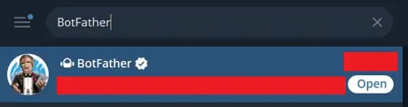
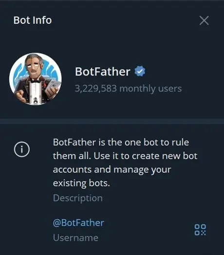
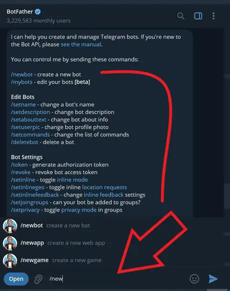
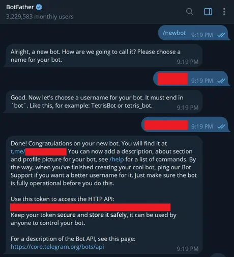
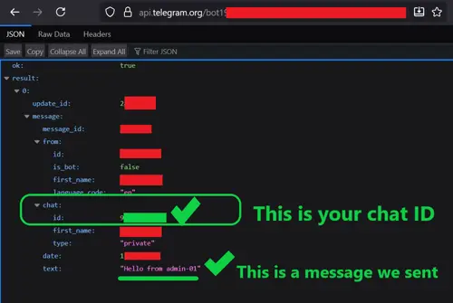

## Introduction

If you're running a server, you know that keeping track of what's going on is just as important as setting it up in the first place. Imagine someone logs into your server at 2 AM. Was that you or some random stranger who just found a way in? Without proper notifications, you'd probably never know until it's too late.

That's why real-time alerts matter for system admins. The faster you know about important events, the faster you can respond.

Now, you could set up email alerts, but honestly, email is a pain in the neck for this. It's clunky, prone to delays, and setting up a mail server properly is a headache (SPF, DKIM, Postfix configs etc.). No thanks!

**Telegram**, on the other hand, is perfect for this job:

* 💰 It's free. No limits.
* ⭐ Easy to set up, just an app installation and a bot token.
* ✔️ Works everywhere; on your phone, tablet, desktop.
* ⚡ Reliable: messages show up instantly, unlike email filters that eat alerts.
* 🧭 Portable: if you switch devices, you still get notifications without hassle.
* 🔔 Zero risk of "oops I forgot to check my email!"

Therefore, `Telegram` is pretty much the ideal tool for sending yourself server alerts. I've been using it on a daily basis for the past couple of years. It just works seamlessly!

**Prerequisites**

Before we dive in, let's make sure you've got the basics covered:

1. A VPS running Ubuntu (20.04, 22.04, or similar).
2. Basic Linux knowledge! You should be comfortable using the terminal, editing config files, and running scripts.
3. Essential packages (we'll use these to interact with Telegram's API):  
    ```bash
    apt update && apt install -y curl jq
    ```  
    * `curl`: used for making HTTP requests to Telegram's API.
    * `jq`: useful for parsing JSON output when debugging. 

4. Telegram app installed on your phone or desktop. It's free on both App Store and Play Store.  

----  

> **All of the scripts used in this tutorial can be found on [its github repo](https://github.com/ruvee-dev/server-monitoring-using-telegram-bot-101.git), just for future reference. This will ensure convinience and easier portability and accessibility, for everyone. If you have a Github account and find this tutorial beneficial to your everyday workflow, then I'd appreciate it, if you could give [its github repo](https://github.com/ruvee-dev/server-monitoring-using-telegram-bot-101.git) a star! ⭐😉⭐**


## Step 1 – Setting Up Your Telegram Bot

This is where we set up the "middleman" that will deliver notifications from your server to your Telegram account.  

### Step 1.1 – Create a bot and get its token

* Open Telegram and search for @BotFather.
  
 
* Start a chat with it and run:
    * `/newbot`  

     

* BotFather will ask you for the followings:  
    * a name (e.g., “MyServerNotifier”)
    * a username (must end with _bot).

Once created, you'll get something like this:  

> Use this token to access the HTTP API:    
> `123456789:ABC-YourSuperSecretToken`
  

 

> Save that token. We'll need it in a bit.  

### 1.2 – Get your chat ID

Your bot needs to know where to send messages. There are a few ways to get your chat ID using third party bots but I'm going to show you how you could get yours manually. To get your chat ID follow these steps: 

1. Start a chat with your new bot and send `"Hello from admin-01"`, for example!
2. Open this URL in your browser (replace `TOKEN` with your actual bot token):
    ```
    https://api.telegram.org/botTOKEN/getUpdates   
    ```  
    For example, it would look like this:  
    ```
    https://api.telegram.org/bot123456789:ABC-YourSuperSecretToken/getUpdates
    ```
3. You'll get a JSON response. Look for `"chat":{"id":987654321,...}`. That number is your chat ID.  

  

> 💡 Tip: If you want multiple admins to receive alerts, repeat the same process for each admin to grab the chat IDs! We'll handle those chat IDs in the script.

## Step 2 – Writing the Telegram Notification Script

Now that we've got the bot ready, let's wire up our server to talk to it.

### Step 2.1 – Store your bot token and chat IDs 🗝️

We don't want to hardcode secrets into scripts, so let's keep them in an environment file:

```bash
mkdir -p /etc/telegram
```  
Create and open up `telegram.env` file:  
```bash
nano /etc/telegram/telegram.env
```  
Add the followings inside `telegram.env`:  
```bash
TELEGRAM_BOT_TOKEN="123456789:ABC-YourSuperSecretToken"
TELEGRAM_CHAT_IDS="123456789,987654321"
```  
> * Do not forget to replace those placeholders with your actuall values.
> * If you have multiple chat IDs, separate them with commas and no spaces.

🔒 Then lock down the file so only `root` user can read it:  

```bash
chmod 600 /etc/telegram/telegram.env
```  

### Step 2.2 – Create the notification script 🔔

Let's create a script that accepts a message and sends it to Telegram.

1. Create and open up `telegram-notify` file:

    ```bash
    nano /usr/local/bin/telegram-notify
    ```
2. Paste this script:

    ```bash
    #!/bin/bash
    set -euo pipefail

    source /etc/telegram/telegram.env

    MESSAGE="$1"

    for CHAT_ID in $(echo "$TELEGRAM_CHAT_IDS" | tr "," "\n"); do
    curl -s -X POST "https://api.telegram.org/bot$TELEGRAM_BOT_TOKEN/sendMessage" \
        -d chat_id="$CHAT_ID" \
        -d text="$MESSAGE" \
        -d parse_mode="Markdown" > /dev/null
    done
    ```
3. Make the script executable:

    ```bash
    chmod +x /usr/local/bin/telegram-notify
    ```
This is what the script does:
* `set -euo pipefail`: ensures the script exits if anything goes wrong.
* `source /etc/telegram/telegram.env`: loads your bot token and chat IDs.
* `MESSAGE="$1"`: grabs the first argument you pass to the script as the notification text.
* The `for loop`: sends the message to every chat ID listed in your env file.
* `curl` command: hits Telegram's API /sendMessage endpoint.
* `/dev/null`: keeps things quiet in your terminal (no messy output).

Now go ahead and test it out:

```bash
telegram-notify "😎 Hello from my server!"
```
You should instantly get a message on `Telegram`. 🔔 Yaaay! 

## Step 3 – Put Your Bot to Work 🤖

Now that your server can talk to you through Telegram, let's make it say something useful. Don't worry, no complicated scripts here. We'll do everything with just one line in cron. 

Open your crontab:

```bash
crontab -e
```
Then add the following examples:

### 3.1 – Daily heartbeat (server is alive ✅)

Do you want peace of mind that your server is still up? Send yourself a daily `"I'm alive"` message:

```bash
0 9 * * * /usr/local/bin/telegram-notify "✅ $(hostname) is alive as of $(date)"
```  

This runs every morning at 9 AM ⏰. If you don't get the message one day, then you know something's wrong.  

### 3.2 – Service crash alert 🚨

If your web server (nginx in this example) stops, you'll know within 5 minutes:  

```bash
*/5 * * * * ! systemctl is-active --quiet nginx && /usr/local/bin/telegram-notify "🚨 $(hostname): nginx is NOT running at $(date)"
```
> 🌟 Change `nginx` to `apache2`, `mysql`, or whatever service you want to keep an eye on.

## Conclusion

👏 Congrats! You now have a working `Telegram bot` that sends you `real-time` server notifications. You'll never be in the dark again when something happens, when something crashes, or when your web server goes down. You've just turned your server into a chatty assistant that tells you when it's healthy or when a service crashes. No extra files, no complicated configs, just drop these `one-liners` into `cron` and watch Telegram light up ✨.

## Next Steps 👣

### Real-World Use Cases 💪 

Here are some cool things you can do with this setup:

* 📲 Monitor your web servers (nginx, Apache) and get an alert if they stop running.
* ✔️ Check if your website is up or down 
* ⚡ Track resource usage (disk space, CPU spikes) and get notified before things break.
* 🔧 LAMP/LEMP stack and Website monitoring
* 💾 Automated DB backups
* 📈 Health checks & uptime reports
* 🔐 Security alerts  

----  

> **Don't forget to grab the scripts used in this tutorial from [its github repo](https://github.com/ruvee-dev/server-monitoring-using-telegram-bot-101.git). If you have a Github account and find this tutorial beneficial to your everyday workflow, then please give [its github repo](https://github.com/ruvee-dev/server-monitoring-using-telegram-bot-101.git) a star! ⭐ It'll make me happy!**

##### License: MIT

<!--

Contributor's Certificate of Origin

By making a contribution to this project, I certify that:

(a) The contribution was created in whole or in part by me and I have
    the right to submit it under the license indicated in the file; or

(b) The contribution is based upon previous work that, to the best of my
    knowledge, is covered under an appropriate license and I have the
    right under that license to submit that work with modifications,
    whether created in whole or in part by me, under the same license
    (unless I am permitted to submit under a different license), as
    indicated in the file; or

(c) The contribution was provided directly to me by some other person
    who certified (a), (b) or (c) and I have not modified it.

(d) I understand and agree that this project and the contribution are
    public and that a record of the contribution (including all personal
    information I submit with it, including my sign-off) is maintained
    indefinitely and may be redistributed consistent with this project
    or the license(s) involved.

Signed-off-by: [Ruvee 230401966+ruvee-dev@users.noreply.github.com]

-->