## Introduction

[Xray](https://github.com/XTLS/Xray-core) is a proxy with support for multiple network protocols. It's commonly used to penetrate firewalls to access blocked websites and apps. Xray is created by Chinese developers and is a fork of [V2Ray](https://github.com/v2fly/v2ray-core). This is why some documentation is only available in Chinese. There are many ways to configure Xray, depending on a use case and blocking that you want to circumvent. I will show you a simple configuration that works well for me.

**Prerequisites**

* A user with sudo privileges

## Step 1 - Installing Xray-core on the server

Connect to your server via SSH.

Install the `unzip` package using your package manager. Run the command below to download and install `xray` to the `/usr/local/xray` directory:

```bash
cd ~ \
&& curl -fLo xray.zip "https://github.com/XTLS/Xray-core/releases/latest/download/Xray-linux-$(uname -m | sed -e s/x86_64/64/ -e s/aarch64/arm64-v8a/).zip" \
&& sudo unzip -d /usr/local/xray xray.zip \
&& rm xray.zip
```

Add `xray` to your `PATH` by executing:

```bash
export PATH=$PATH:/usr/local/xray
```

You need to add the line above to your `~/.profile` to preserve the change between logins.

Run the following command to check that `xray` is installed properly:

```bash
xray version
```

If you need to update `xray`, run `sudo rm -r /usr/local/xray` and repeat [step 1](#step-1---installing-xray-core-on-the-server) again.

## Step 2 - Server configuration

You need to create a configuration file for your Xray server.

First, create the directory where the configuration file will be stored:

```bash
sudo mkdir -p /usr/local/etc/xray
```

The skeleton of the server configuration (e.g. `/usr/local/etc/xray/config.json`) looks like this:

```json
{
    "log": {
        "loglevel": "warning"
    },
    "inbounds": [
        {
            "port": 443,
            "protocol": "vless",
            "settings": {
                "clients": [],
                "decryption": "none"
            },
            "streamSettings": {
                "network": "tcp",
                "security": "tls",
                "tlsSettings": {
                    "certificates": []
                }
            }
        }
    ],
    "outbounds": [
        {
            "protocol": "freedom"
        }
    ]
}
```

* 443 (https) port is used by `xray` here. It's a privileged port (less than 1024) and some additional configuration will be needed to run `xray` as a non-root user. You can choose some other port if you want.
* `inbounds` define which protocols are accepted for incoming requests (only VLESS in this case), and `outbounds` define how the request is proxied (`"freedom"` means that Xray sends it to the appropriate destination).
* To be able to accept requests from clients, you need to add them to `inbounds[].settings.clients`, which will be shown later.
* `inbounds[].streamSettings` specify how the data gets sent over the wire. Protocols that you define here are used to penetrate the firewall. TCP with TLS encryption is used here. Other protocols are available, for example WebSockets.
* `inbounds[].streamSettings.tlsSettings.certificates` is empty for now. In the steps below, you will create a certificate and add it here.

Now, let's add the first client. The client object looks like this:

* `id` is used for client authentication. You can think of it like the user password.
* `email` is used to distinguish clients in the logs. This doesn't need to be a valid email address. You can just put the name of the person for which you want to add a client.

```json
{
    "id": "<User UUID>",
    "email": "<Name or email>"
}
```

To generate the user ID (UUID) run the following command:

```bash
xray uuid
```

Put the result into the `id` field.

Now, put your client configuration into the `inbounds[].settings.clients` array in the server configuration.

<details>

<summary>After you added the client, the configuration will look like this:</summary>

* Don't forget to replace the client ID with your own.

```json
{
    "log": {
        "loglevel": "warning"
    },
    "inbounds": [
        {
            "port": 443,
            "protocol": "vless",
            "settings": {
                "clients": [
                    {
                        "id": "4d6e0338-f67a-4187-bca3-902e232466bc",
                        "email": "John"
                    }
                ],
                "decryption": "none"
            },
            "streamSettings": {
                "network": "tcp",
                "security": "tls",
                "tlsSettings": {
                    "certificates": []
                }
            }
        }
    ],
    "outbounds": [
        {
            "protocol": "freedom"
        }
    ]
}
```

</details>

Additional clients can be added in the same way.

You need to generate the TLS certificate. It will be used to establish an encrypted connection between client and server. There are two ways to do it. You can generate a self-signed certificate, this way you don't need a domain attached to your server. Alternatively, you can obtain a certificate from Let's Encrypt for your domain.

<details>

<summary>Generate a self-signed certificate.</summary>

Run the following command:

```bash
sudo /usr/local/xray/xray tls cert -file /usr/local/etc/xray/my > /dev/null
```

Two files will be created:

* `/usr/local/etc/xray/my_cert.pem` is your self-signed certificate.
* `/usr/local/etc/xray/my_key.pem` is your private key.

Now you need to create a JSON object for the certificate and add it to your Xray server configuration.

The certificate object will look like this:

```json
{
    "certificateFile": "/usr/local/etc/xray/my_cert.pem",
    "keyFile": "/usr/local/etc/xray/my_key.pem"
}
```

Put it into the `inbounds[].streamSettings.tlsSettings.certificates` array in the server configuration.

<details>

<summary>After you added self-signed certificate, the configuration will look like this:</summary>

```json
{
    "log": {
        "loglevel": "warning"
    },
    "inbounds": [
        {
            "port": 443,
            "protocol": "vless",
            "settings": {
                "clients": [
                    {
                        "id": "4d6e0338-f67a-4187-bca3-902e232466bc",
                        "email": "John"
                    }
                ],
                "decryption": "none"
            },
            "streamSettings": {
                "network": "tcp",
                "security": "tls",
                "tlsSettings": {
                    "certificates": [
                        {
                            "certificateFile": "/usr/local/etc/xray/my_cert.pem",
                            "keyFile": "/usr/local/etc/xray/my_key.pem"
                        }
                    ]
                }
            }
        }
    ],
    "outbounds": [
        {
            "protocol": "freedom"
        }
    ]
}
```

</details>

---

<br><br>

</details>

<details>

<summary>Obtain a certificate from Let's Encrypt for your domain.</summary>

**Prerequisites**

* A domain name, e.g. `example.com` with an `A` and optionally an `AAAA` DNS record pointing to your server.
* `certbot` package is installed [using Snap](https://certbot.eff.org/instructions?ws=other&os=snap) (preferred) or package manager of your distribution.

Run the following command to get a certificate for your domain:

* Replace `user@example.com` with your email.
* Replace `example.com` with your domain for which you want to generate a certificate.

```bash
sudo certbot certonly --standalone --agree-tos -m user@example.com -d example.com
```

> **Note:** Xray supports hot reloading of certificates, that is you don't need to do anything when your certificate is renewed by Certbot.

Certificate and private key will be saved into the `/etc/letsencrypt/live/example.com` directory, where `example.com` is your domain.

You will need two files:

* `/etc/letsencrypt/live/example.com/fullchain.pem` is your certificate issued by Let's Encrypt.
* `/etc/letsencrypt/live/example.com/privkey.pem` is your private key.

You need to change permissions if you want to run `xray` as a non-root user.

* Replace `example.com` with your domain.

```bash
mydomain=example.com
sudo chmod a+rx /etc/letsencrypt/{live,archive}
sudo chgrp $USER "/etc/letsencrypt/live/$mydomain/privkey.pem"
sudo chmod g+r "/etc/letsencrypt/live/$mydomain/privkey.pem"
```

Now you need to create a JSON object for the certificate and add it to your Xray server configuration.

The certificate object will look like this:

* Replace `example.com` with your domain.

```json
{
    "certificateFile": "/etc/letsencrypt/live/example.com/fullchain.pem",
    "keyFile": "/etc/letsencrypt/live/example.com/privkey.pem"
}
```

Put it into the `inbounds[].streamSettings.tlsSettings.certificates` array in the server configuration.

<details>

<summary>After you added your Let's Encrypt certificate, the configuration will look like this:</summary>

```json
{
    "log": {
        "loglevel": "warning"
    },
    "inbounds": [
        {
            "port": 443,
            "protocol": "vless",
            "settings": {
                "clients": [
                    {
                        "id": "4d6e0338-f67a-4187-bca3-902e232466bc",
                        "email": "John"
                    }
                ],
                "decryption": "none"
            },
            "streamSettings": {
                "network": "tcp",
                "security": "tls",
                "tlsSettings": {
                    "certificates": [
                        {
                            "certificateFile": "/etc/letsencrypt/live/example.com/fullchain.pem",
                            "keyFile": "/etc/letsencrypt/live/example.com/privkey.pem"
                        }
                    ]
                }
            }
        }
    ],
    "outbounds": [
        {
            "protocol": "freedom"
        }
    ]
}
```

</details>

---

<br><br>

</details>

The configuration is complete and you can put it into the file:

```bash
sudo nano /usr/local/etc/xray/config.json
```

You can test your configuration for errors using the following command:

```bash
xray run -test -c /usr/local/etc/xray/config.json
```

If you're using port 443 (https) in your configuration, you need to run the following command. This will allow `xray` to bind the port without requiring root privileges.

```bash
sudo setcap cap_net_bind_service=+ep /usr/local/xray/xray
```

You can run `xray` in the foreground for testing, logs will be printed to your terminal:

```bash
xray run -c /usr/local/etc/xray/config.json
```

When you are sure that your configuration is correct, you can run the following command to create a systemd service file to run `xray` in the background:

* `xray` starts with the permissions of your current user.
* `Restart` directive is used to restart the server if `xray` exits unexpectedly.
* `[Install]` section is used to automatically start the service on system boot.

```bash
echo "[Unit]
Description=xray-core
After=network-online.target
Wants=network-online.target

[Service]
User=$USER
Type=exec
ExecStart=/usr/local/xray/xray -c /usr/local/etc/xray/config.json
Restart=on-failure

[Install]
WantedBy=multi-user.target" | sudo tee /etc/systemd/system/xray.service
```

Now you can start up `xray` and configure it to always start up on system boot:

```bash
sudo systemctl start xray && sudo systemctl enable xray
```

## Step 3 - Client configuration

In [step 2](#step-2---server-configuration) you created a client object and added it to your server configuration.
The client ID from this object is used to configure your Xray client device to prevent unauthorized access to your Xray server.

* [Android client](#step-31---android-client)
* [Windows client](#step-32---windows-client)
* [Linux client](#step-33---linux-client)

### Step 3.1 - Android client

This step will show you how to configure an Xray client on an Android device.

Install [v2rayNG](https://play.google.com/store/apps/details?id=com.v2ray.ang) on your Android device.

1. Open v2rayNG and tap `+`:

   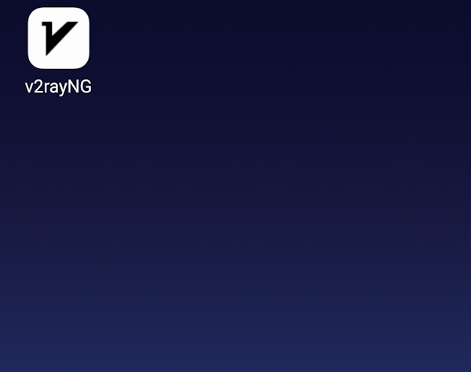

   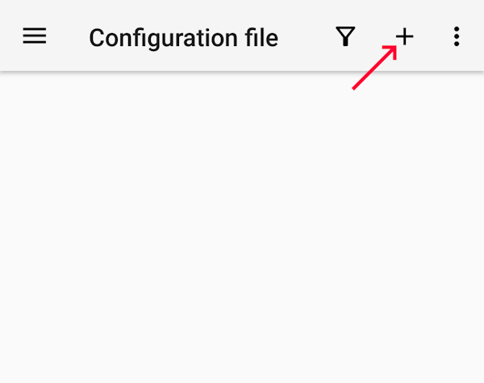

2. Choose _Type manually[VLESS]_:

   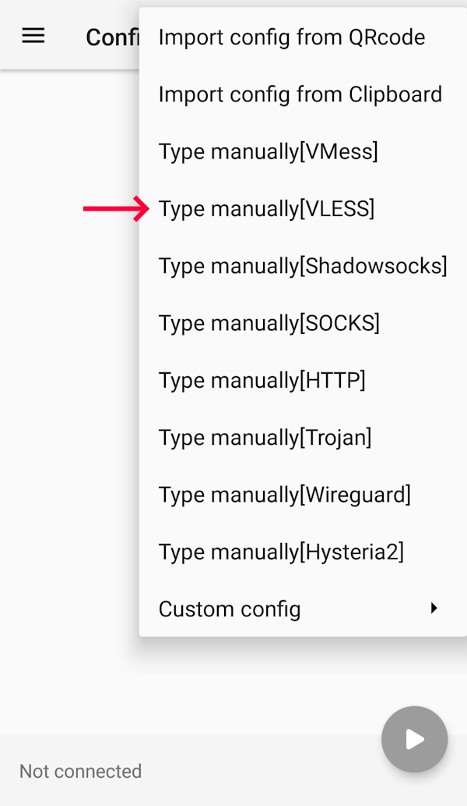

3. Fill in fields in the configuration: <a id="vless_config"></a>

   * Replace `example.com` in _address_ with your domain. If you're using a **self-signed certificate**, fill in _address_ with an IP address of your server.
   * Put your client ID into the _id_ field. It should be the same client ID that you added in the [server configuration](#step-2---server-configuration).

   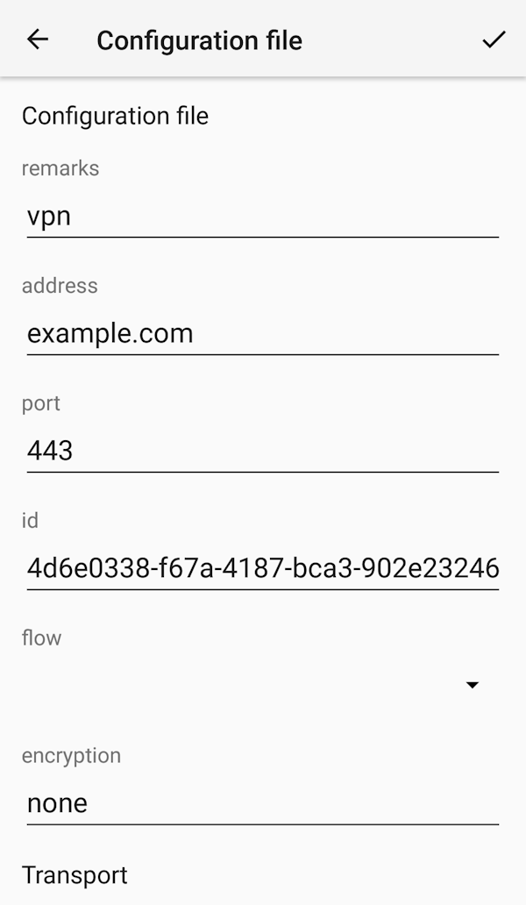

4. Scroll and change TLS settings:

   Open _TLS_ menu and select _tls_.

   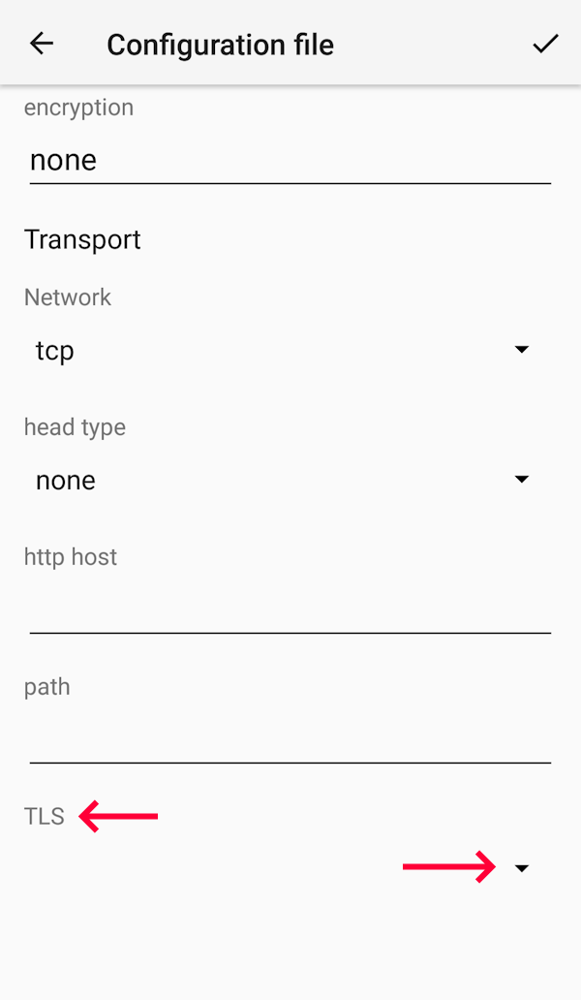

   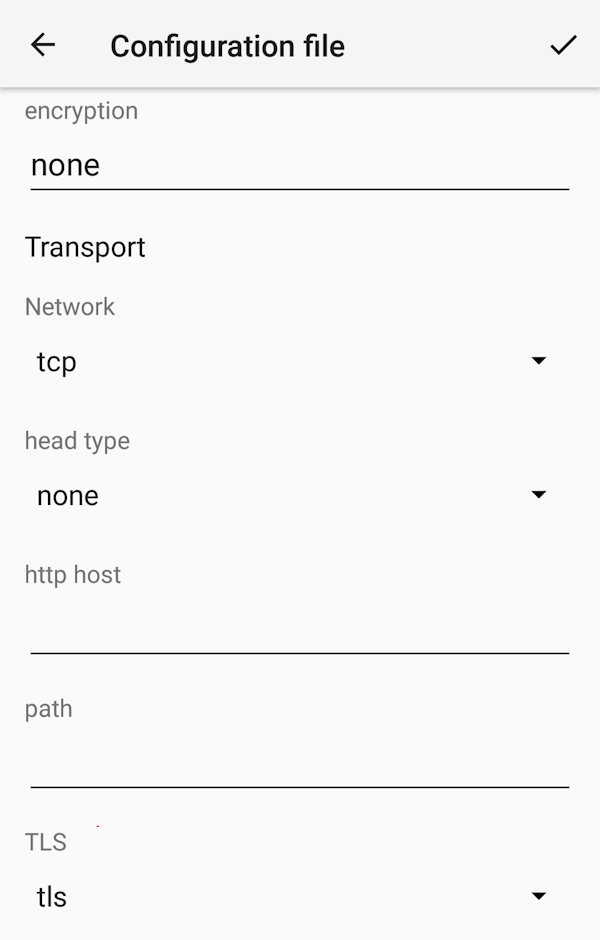

5. If you're using a **self-signed certificate**, open the _allowInsecure_ menu and select _true_.

   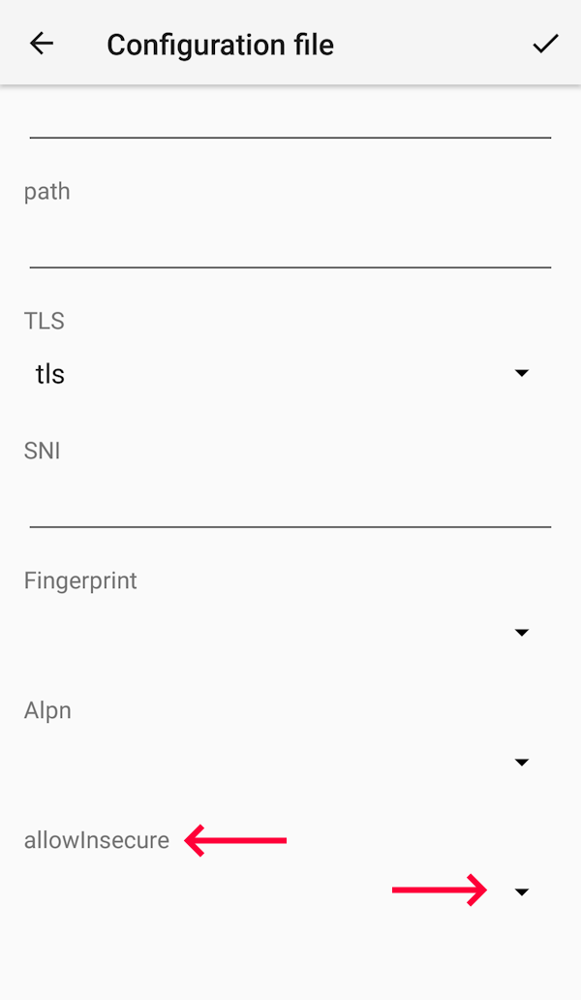

   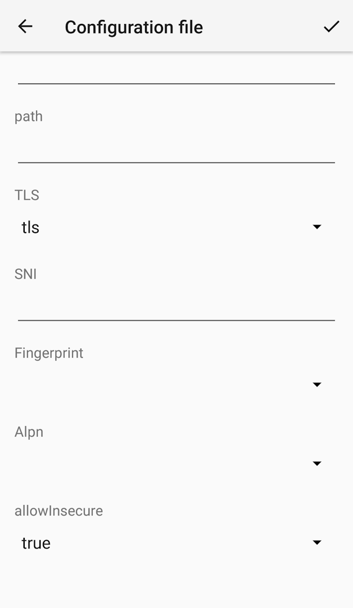

6. Save your configuration:

   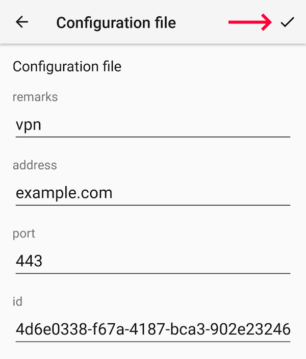

7. Tap the _play_ button to connect to your Xray server:

   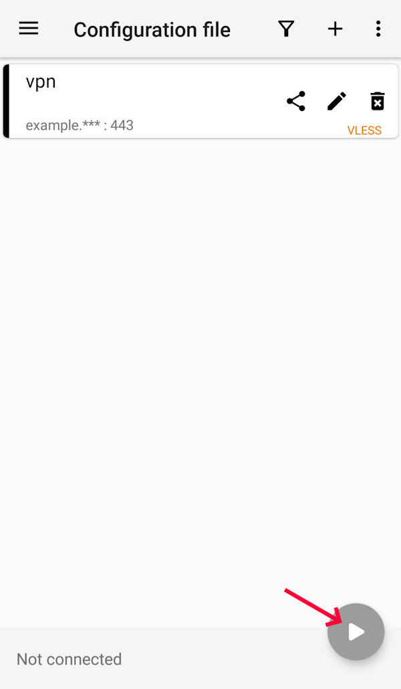

   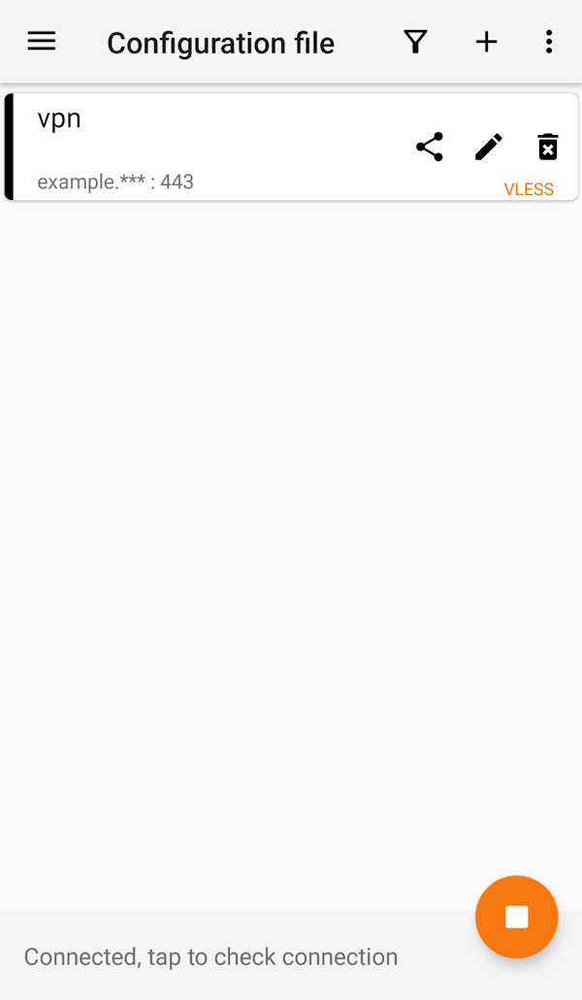

8. Tap to check the connection, it should be successful:

   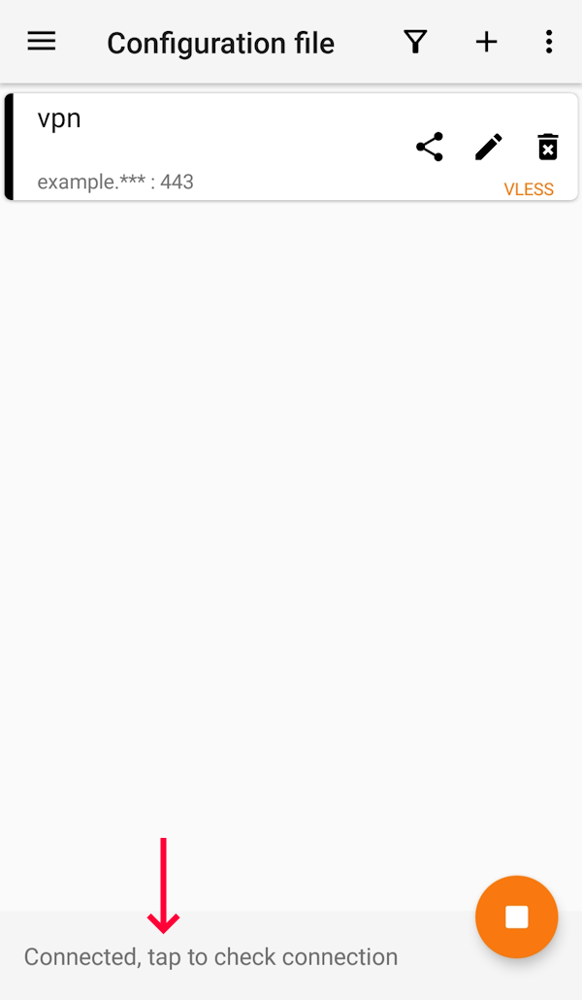

   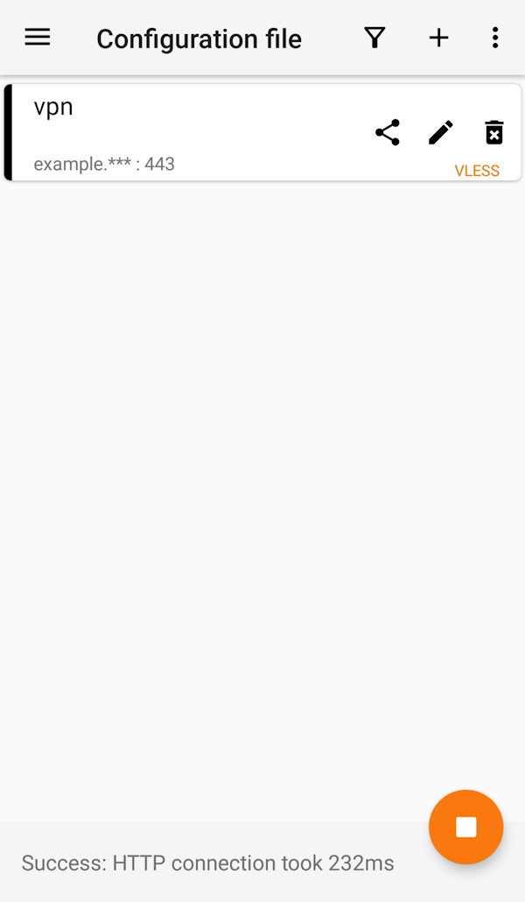

Try to access blocked websites and apps. They should work now.

### Step 3.2 - Windows client

You need to download the [latest Xray release for Windows](https://github.com/XTLS/Xray-core/releases/latest) for your architecture. Most likely you will need `Xray-windows-64.zip`.

You can do it manually or open PowerShell and execute the commands below. Xray will be downloaded and extracted to your home directory.

```powershell
cd ~
curl.exe -fLo xray.zip https://github.com/XTLS/Xray-core/releases/latest/download/Xray-windows-64.zip
Expand-Archive xray.zip xray
rm xray.zip
cd xray; ls
```

Close PowerShell and add the directory that contains the `xray.exe` binary (e.g. `C:\Users\holu\xray`) to your **system PATH**. How to modify your system PATH is [explained here](https://community.hetzner.com/tutorials/obfuscating-wireguard-using-wstunnel#step-32---windows-client).

Open PowerShell and run the following command to check that PATH is updated properly:

```powershell
xray version
```

There are two ways to configure Xray on Windows.

The first one is to use it as a SOCKS proxy, which is supported by Firefox, Chrome and other apps. Only apps that are specifically configured to use that SOCKS proxy will be routed through Xray.

Alternatively, you can configure Xray to work like VPN to route all your traffic through Xray. In this case you don't need to configure individual apps to use proxy.

* [SOCKS proxy](#step-321---socks-proxy)
* [Route all your traffic through the proxy](#step-322---route-all-your-traffic-through-the-proxy)

### Step 3.2.1 - SOCKS proxy

To configure your Xray client as a SOCKS proxy, use the following configuration.

* Replace `example.com` with your domain.

  If you're using a **self-signed certificate**, replace `example.com` with your server IP. Additionally set `"allowInsecure": true`.
* Replace `id` with your client `id` from the [server configuration](#step-2---server-configuration).
* `443` is the port on which the Xray server listens. It's the same port that is used in the [server configuration](#step-2---server-configuration).
* `1080` is the port on which the local SOCKS proxy server listens. It will accept connections from your apps that are configured to use it.

  Apps that want to use the SOCKS proxy need to set `127.0.0.1` as a host, and `1080` as a port.

```json
{
    "log": {
        "loglevel": "warning"
    },
    "inbounds": [
        {
            "listen": "127.0.0.1",
            "port": "1080",
            "protocol": "socks",
            "settings": {
                "udp": true,
                "ip": "127.0.0.1"
            }
        }
    ],
    "outbounds": [
        {
            "protocol": "vless",
            "settings": {
                "vnext": [
                    {
                        "address": "example.com",
                        "port": 443,
                        "users": [
                            {
                                "id": "4d6e0338-f67a-4187-bca3-902e232466bc",
                                "encryption": "none",
                                "level": 0
                            }
                        ]
                    }
                ]
            },
            "streamSettings": {
                "network": "tcp",
                "security": "tls",
                "tlsSettings": {
                    "allowInsecure": false
                }
            }
        }
    ]
}
```

Run the commands below to put it into the file `xray_config.json` in your HOME directory and run `xray` with that configuration.

```powershell
notepad "$env:USERPROFILE\xray_config.json"
xray run -c "$env:USERPROFILE\xray_config.json"
```

Now, `xray` is running and you can configure your apps to use a SOCKS proxy.

* **Use a SOCKS proxy with Google Chrome**
  
  Find the Google Chrome shortcut and open its _Properties_.
  
  Change _Target_ from
  
  ```
  "C:\Program Files\Google\Chrome\Application\chrome.exe"
  ```
  to
  ```
  "C:\Program Files\Google\Chrome\Application\chrome.exe" --proxy-server="socks5://127.0.0.1:1080"
  ```
  
  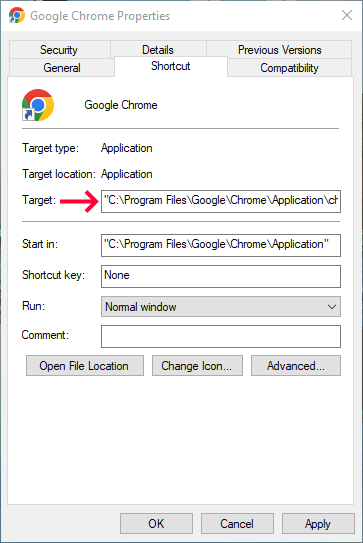
  
  Click _Apply_ and then _OK_.
  
  **Close all Chrome windows** to apply your change. Open Chrome and try to browse the web, it should be using the Xray SOCKS proxy now.
  
  Alternatively, instead of changing the existing shortcut you can copy it, and configure the copy to use the SOCKS proxy. This way you can have one Chrome shortcut that uses proxy, and one that doesn't.

<br>

* **Use a SOCKS proxy with Firefox** <a id="firefox_socks"></a>
  
  Consult [the official documentation](https://support.mozilla.org/en-US/kb/connection-settings-firefox). Fill in _SOCKS Host_ with `127.0.0.1` and corresponding _Port_ with `1080`. Click _SOCKS v5_ and select _Proxy DNS when using SOCKS v5_.
  
  Many other programs support SOCKS as well. Consult their documentation to learn how to configure it.

### Step 3.2.2 - Route all your traffic through the proxy

You need to download the `zz_v2rayN-With-Core-SelfContained.7z` archive from the [latest release of v2rayN](https://github.com/2dust/v2rayN/releases/latest). Extract it using [7-Zip](https://www.7-zip.org/).

1. Open the extracted directory and run the `v2rayN.exe` binary **as Administrator**.

2. Click _Servers_:

   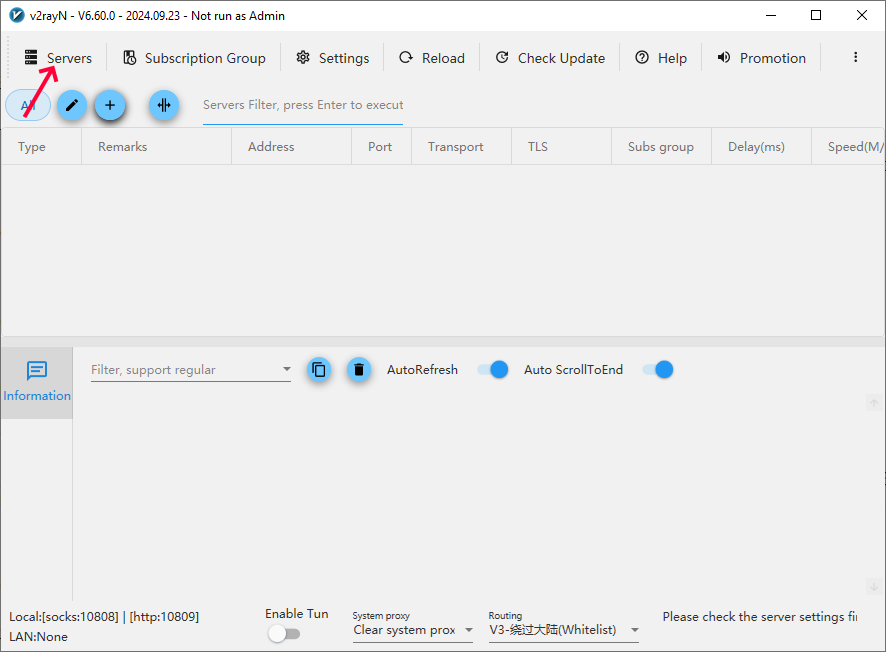

3. Click _Add [VLESS] server_:

   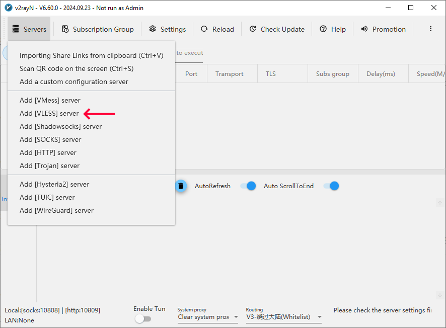

4. Fill in the fields in the same way as [described for an Android client](#vless_config) and click _Confirm_. Restart v2rayN.

   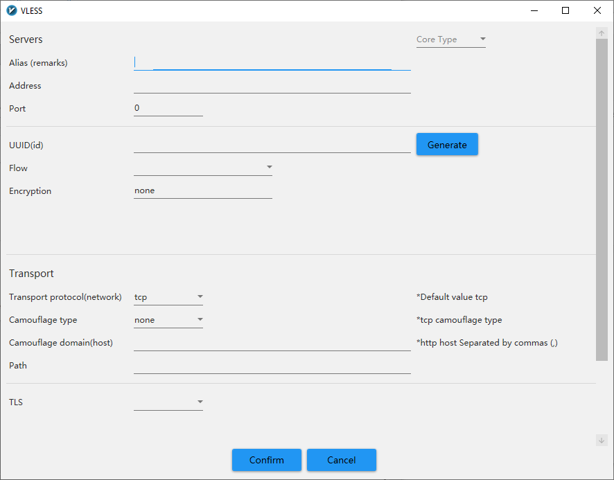

   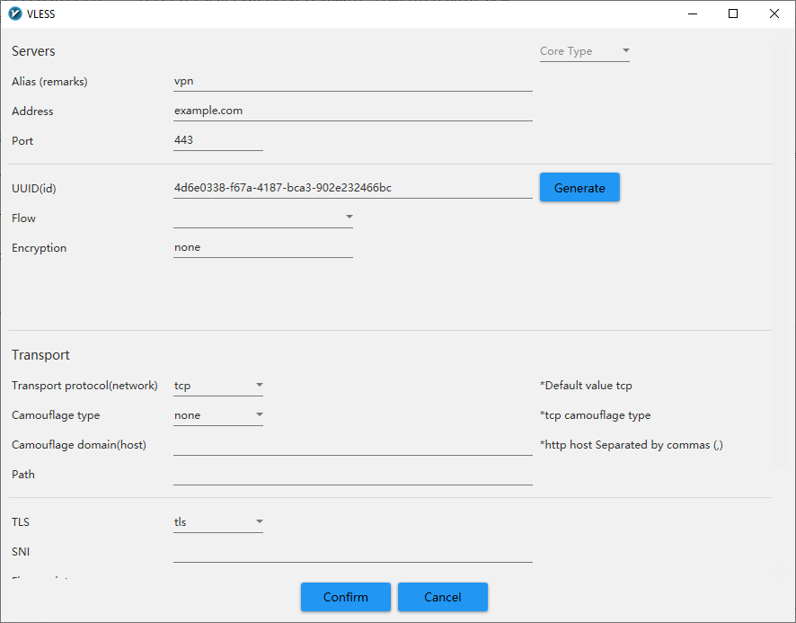

5. Click _Enable Tun_:

   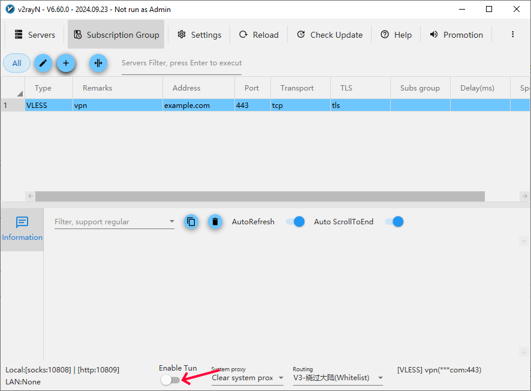

After that all your traffic should go through the Xray proxy.

>**Note:** Sometimes the _Enable Tun_ doesn't work from the first try. In the log, you will see errors like these:
>
> ```
> WARN inbound/tun[tun-in]: open tun interface take too much time to finish!
> FATAL[0016] start service: initialize inbound/tun[tun-in]: configure tun interface: Cannot create a file when that file already exists.
> ```
>
> Try to switch _Enable Tun_ on and off a few times. Take a look at your network connections in the Windows settings. After _Enable Tun_ is activated, the *singbox_tun* network connection should be present there.
>
> 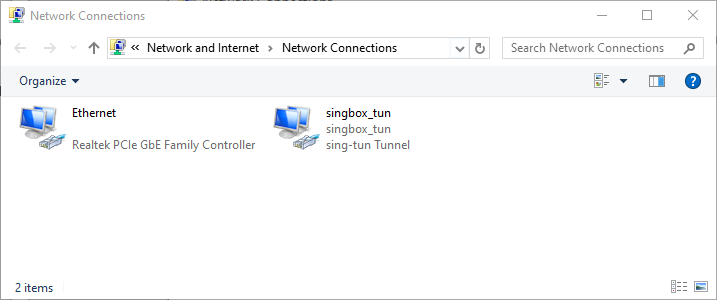

### Step 3.3 - Linux client

Xray on a Linux client can be installed in the same way [as on a Linux server in step 1](#step-1---installing-xray-core-on-the-server). You can run Xray as a service which is described [at the end of step 2](#step-2---server-configuration). Except the configuration file will be different.

Create the configuration file.

```bash
sudo mkdir -p /usr/local/etc/xray
sudo nano /usr/local/etc/xray/config.json
```

Configuration will be the same as in [step 3.2.1 for the Windows client](#step-321---socks-proxy). Adjust the configuration as described there. Save the file and run the command below to start Xray.

```bash
xray run -c /usr/local/etc/xray/config.json
```

Now, `xray` is running and you can configure your apps to use a SOCKS proxy.

* Use a SOCKS proxy with Google Chrome (Chromium)
  
  Close all Chrome windows and run the following command:
  
  * In this case the name of the binary is `google-chrome`, on your system it may be different. For example, it can be called `chromium`.
  
  ```bash
  google-chrome --proxy-server="socks5://127.0.0.1:1080"
  ```

<br>

* Use a SOCKS proxy with Firefox
  
  [It's configured in the same way as on Windows.](#firefox_socks)

### Step 3.3.3 - Set _Network Proxy_ in GNOME

In GNOME you can set a system-wide SOCKS proxy which will be used by all apps that support it automatically.
Follow the steps below.

1. Open the network settings and click the gear symbol in _Network Proxy_:

   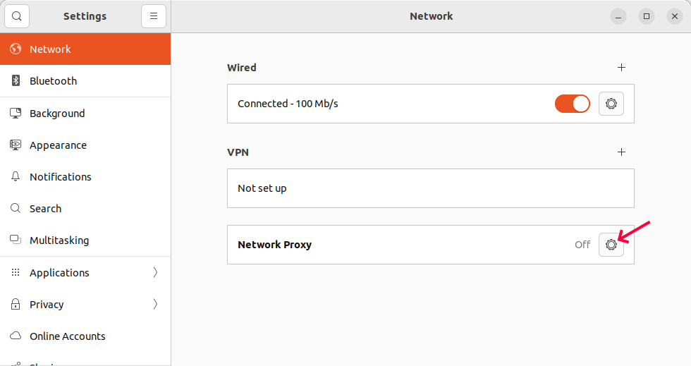

2. Click _Manual_:

   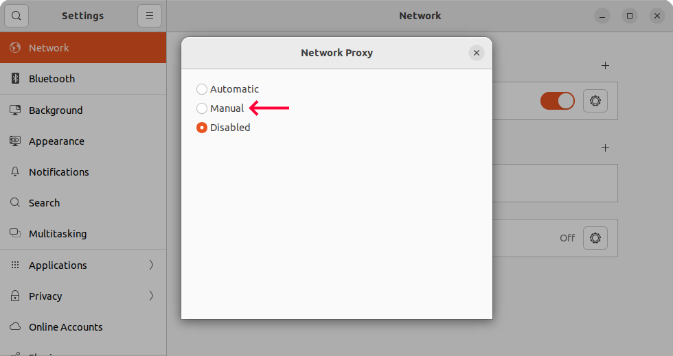

3. Fill in _Socks Host_ with `127.0.0.1` and port with `1080`:

   

   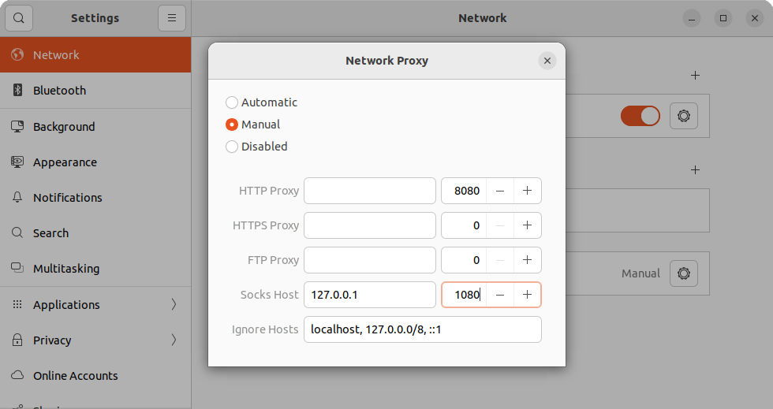

Open the browser and test your Internet connection, it should go through the proxy now.

## Conclusion

Xray is a good solution when your primary use case is to access blocked websites and apps. Contrary to popular VPN protocols it's not easy to block. The drawback is obviously its documentation, which is Chinese oriented.

Now, when you have a basic idea how to configure Xray, you can tweak its configuration for your own needs. Depending on what kind of blocking you want to circumvent, you may need to employ different techniques. Read the [Xray config reference](https://xtls.github.io/en/config/) and check the [repository full of configuration examples](https://github.com/XTLS/Xray-examples) to learn more.

Hopefully you now have your Xray server running and your Internet browsing is free from artificial restrictions. At least until a new kind of blocking is rolled out :)

##### License: MIT

<!--

Contributor's Certificate of Origin

By making a contribution to this project, I certify that:

(a) The contribution was created in whole or in part by me and I have
    the right to submit it under the license indicated in the file; or

(b) The contribution is based upon previous work that, to the best of my
    knowledge, is covered under an appropriate license and I have the
    right under that license to submit that work with modifications,
    whether created in whole or in part by me, under the same license
    (unless I am permitted to submit under a different license), as
    indicated in the file; or

(c) The contribution was provided directly to me by some other person
    who certified (a), (b) or (c) and I have not modified it.

(d) I understand and agree that this project and the contribution are
    public and that a record of the contribution (including all personal
    information I submit with it, including my sign-off) is maintained
    indefinitely and may be redistributed consistent with this project
    or the license(s) involved.

Signed-off-by: wpdevelopment11 wpdevelopment11@gmail.com

-->
