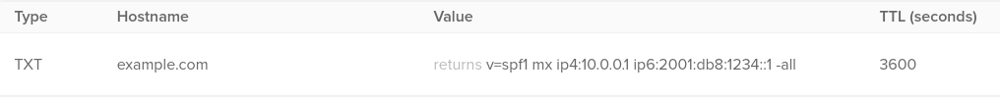

## Introduction

SPF (Sender Policy Framework) is used by an MTA (Mail Transfer Agent, or mail server) to help verify that incoming email is from the mail server where it originated from.

This guide will be showing you how to setup a TXT DNS record for SPF on your domain, thus preventing someone else who attempts to spoof your mail server from sending email to a mail server which is checking SPF.

This is beneficial as it will mean it is less likely your email will end up in spam folders, and making it harder for someone else to impersonate your mail server.

**Prerequisites**

* A working mail server that is using a domain
* Access to your domain's nameserver to be able to change DNS records for your domain

## Step 1 - Understanding SPF

An SPF record on a domain is used to tell mail servers dealing with incoming mail how to deal with mail claiming to be from your domain; for instance checking that the IP address of the server sending the incoming mail matches an IP address specified in the SPF record. This can prevent someone else from masquerading as your domain when sending email to a domain that checks SPF, by correlating information like the IP address of the connecting MTA with the SPF record if it is specified to do so.

Having SPF enabled on your domain will make it more likely that email that you send will not end up in spam or outright rejected, as many spam filtering programs like SpamAssassin check for the presence of a valid SPF record and take it into account when deciding if an email should be marked as spam.

Even if you do not have a mail server, having an SPF record setup to block all email claiming to be from your domain could make it harder for someone to try and send email from your domain, even if your server was compromised.

SPF records are made up of 3 parts. To help show this, here is an example SPF record:

```console
v=spf1 mx ip4:10.0.0.1 ip6:2001:db8:1234::1 -all
```

* `v=spf1` tells the MTA that the SPF record is version `spf1`, the most commonly used SPF version. This is required.
* `mx ip4:10.0.0.1 ip6:2001:db8:1234::1` says that email can be accepted from the IP address of any MX records found, in addition to the IP addresses listed. This part is not strictly required.
* `-all` makes the MTA reject all mail that does not meet the criteria specified in the second section of the SPF record.

The second part can customised to fit your mail servers needs, with the following options available:

* `a` - matches the IP address of any A/AAAA record of domain if it exists
* `a:[domain]` - matches the IP address of any A/AAAA record of domain specified if it exists, can be used more than once
* `exists` - matches if domain resolves to any IP address
* `ip4:[IPv4Address]` - matches IPv4 address or subnet, can be used more than once
* `ip6:[IPv6Address]` - matches IPv6 address or subnet, can be used more than once
* `include:[domain]` - uses the SPF policy of domain specified if it exists
* `mx` - matches domain used in the MX record

In addition to this, the following modifiers can be used to specify what happens if one of the SPF options matches:

* `+` - PASS (allow mail, default if no modifier is specified)
* `?` - NEUTRAL (no action taken)
* `~` - SOFTFAIL (usually does not reject but tags mail)
* `-` - FAIL (rejects mail)

Most SPF records have either `-all` or `~all` at the end to reject all email that does not meet any other criteria (if specified). Alternatively, you could use `?all` to have a less strict SPF setup. `v=spf1 -all` is a valid SPF record and can be used to prevent anyone from attempting to send email from your domain - however this is impractical if you are running a mail server as any MTA configured to check SPF will block your email.

From the options above you can make an SPF record which is tailored to your mail server's needs.

## Step 2 - Adding the SPF record to DNS

Once you have determined the options that you want for your SPF record as part of Step 1, you need to add a DNS TXT record which will contain the SPF details.

This tutorial will be using the example SPF record from earlier to show how it is setup.

Open your domain's DNS record settings, this is often hosted by either your domain registrar or server host.

Create a new TXT record in your domain, with the hostname as the root of your domain or `@`, and putting your SPF record in the "value" section. TTL (Time-to-live) tells a DNS resolver how long the contents of a DNS record should be cached in seconds - most DNS records have TTLs of between 1 hour (3600 seconds) and 24 hours (86400 seconds).

Here is a screenshot to what your DNS record should look like:



*If you are hosting your own nameservers for your domain, you will likely need to manually edit your domain zone file and add a line similar to this:*

```console
@	IN	TXT	"v=spf1 mx ip4:10.0.0.1 ip6:2001:db8:1234::1 -all"
```

## Step 3 - Verifying the SPF record

Now that the SPF record has been added, we need to check that we can see it, and that it is valid. To do so we will be using the `dig` tool provided by the `bind-tools` package. You may need to install this using your package manager if it is not already installed.

To check that `example.com` has a SPF record, we need to run the following:

```dig
dig example.com TXT
```

If you have added your SPF record successfully, you should get an output similar to this:

```dig
; <<>> DiG 9.13.0 <<>> example.com TXT
;; global options: +cmd
;; Got answer:
;; ->>HEADER<<- opcode: QUERY, status: NOERROR, id: 50010
;; flags: qr rd ra; QUERY: 1, ANSWER: 1, AUTHORITY: 0, ADDITIONAL: 1

;; OPT PSEUDOSECTION:
; EDNS: version: 0, flags:; udp: 4096
;; QUESTION SECTION:
;example.com.			IN	TXT

;; ANSWER SECTION:
example.com.		3600	IN	TXT	"v=spf1 mx ip4:10.0.0.1 ip6:2001:db8:1234::1 -all"

;; Query time: 32 msec
;; SERVER: 127.0.0.1#53(127.0.0.1)
;; WHEN: Fri Sep 04 00:00:00 UTC 2020
;; MSG SIZE  rcvd: 100
```

You may have one or more additional TXT records in your domain, check for a record that starts with `v=spf1`, as that will be the SPF record you added.

If it does not appear, you may need to wait a short time before the change to your DNS is facilitated.

To check that your SPF record is valid, you can use services available on sites like [kitterman.com](https://www.kitterman.com/spf/validate.html) or [mxtoolbox.com](https://mxtoolbox.com/spf.aspx). A successful example output of using the SPF verification on kitterman.com is seen here:

```console
Input accepted, querying now...
evaluating v=spf1 mx ip4:10.0.0.1 ip6:2001:db8:1234::1 -all ...
SPF record passed validation test with pySPF (Python SPF library)!
```

## Conclusion

You should now have a working SPF DNS record for your mail server, improving the authenticity of your email server for you and people who use it, and making it less likely that email sent from your server will be marked as spam.

Here are some things you can do after setting up a SPF record to further benefit your mail server:

* Configure your mail server to check incoming email for SPF, and if it is valid or not. This can be done in most MTAs like Postfix through the use of a transport.
* Adding DKIM (DomainKeys Identified Mail) to your mail server to further deter email spoofing, by using public/private key signatures embedded in email headers, and the incoming MTA checking that it matches with the public key in the DKIM TXT record.
  * This can be furthered through the use of DMARC (Domain-based Message Authentication Reporting and Conformance), a form of email authentication which requires both SPF and DKIM to be present as prerequisites.

##### License: MIT

<!---

Contributors's Certificate of Origin

By making a contribution to this project, I certify that:

(a) The contribution was created in whole or in part by me and I have
    the right to submit it under the license indicated in the file; or

(b) The contribution is based upon previous work that, to the best of my
    knowledge, is covered under an appropriate license and I have the
    right under that license to submit that work with modifications,
    whether created in whole or in part by me, under the same license
    (unless I am permitted to submit under a different license), as
    indicated in the file; or

(c) The contribution was provided directly to me by some other person
    who certified (a), (b) or (c) and I have not modified it.

(d) I understand and agree that this project and the contribution are
    public and that a record of the contribution (including all personal
    information I submit with it, including my sign-off) is maintained
    indefinitely and may be redistributed consistent with this project
    or the license(s) involved.

Signed-off-by: youiopmop <rosethorn@riseup.net>

-->
