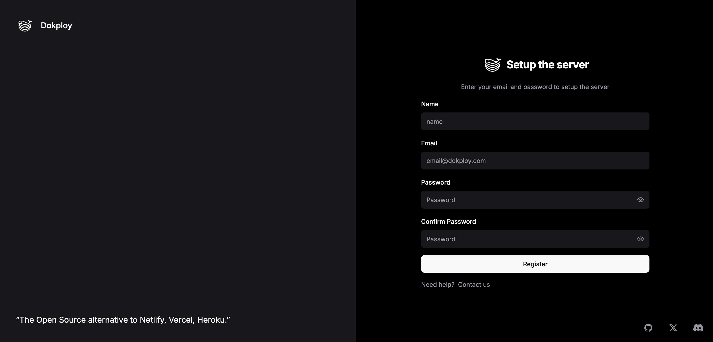
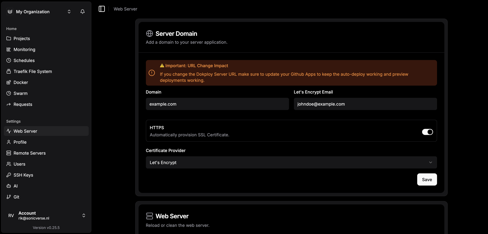
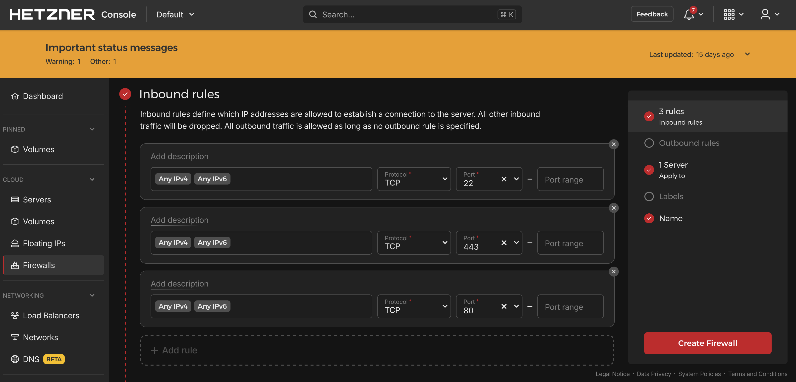

## Introduction

Dokploy is a Platform as a Service (PaaS) that simplifies the deployment and management of applications, databases, and Docker stacks. Think of it as your free and self-hosted alternative to platforms like Heroku or Vercel, giving you complete control over your infrastructure while maintaining ease of use.

In this comprehensive tutorial, you'll learn how to install and configure Dokploy on your VPS, set up a custom domain with SSL certificates, and implement essential security measures.

**What you'll accomplish:**
- Install Dokploy on a fresh Ubuntu server
- Configure a custom domain with automatic HTTPS
- Set up DNS records properly
- Implement firewall rules for security
- Access your production-ready Dokploy dashboard

This tutorial uses Ubuntu 24.04 LTS, though Dokploy has been successfully tested on various Linux distributions including Debian, CentOS, and Fedora.

**Prerequisites**

Before beginning, ensure you have:

* **A fresh Hetzner cloud server** with:
    * x86 architecture (Arm64 is currently untested and not recommended)
    * Minimum 2GB RAM and 30GB storage
    * Recommended: CX23 or CPX22 instance type
    * Ubuntu 24.04 LTS as the operating system
    * Root user access
    
* **Domain name** configured and ready to use

* **SSH access** configured (SSH key authentication is strongly recommended for security)

* **Basic command line knowledge**

If you're new to setting up a Hetzner VPS, consult the [Hetzner Cloud Server Setup Guide](https://docs.hetzner.com/cloud/servers/getting-started/creating-a-server).  
Important: Do not configure the firewall during initial setup — we'll handle that properly later in this tutorial.

**Example terminology**

| Component | Value | Notes |
|-----------|-------|-------|
| Server Public IPv4 | `203.0.113.1` | Replace with your actual server IP |
| Domain | `example.com` | Replace with your domain |
| Email | `holu@example.com` | Used for Let's Encrypt notifications |
| Password | `changeme` | Use a strong, unique password |

Remember to replace these example values with your actual configuration details.

## Step 1 - Connect to Your Server

Establish an SSH connection to your server using the root user:

```bash
ssh root@203.0.113.1
```

If you're using password authentication, enter your password when prompted. If you've configured SSH key authentication, you should be logged in automatically.

Once connected, you should see a command prompt similar to:

```shellsession
root@your-server:~#
```

## Step 2 - Update System and Install Dependencies

Before installing Dokploy, ensure your system is up to date and has the necessary tools.

Update all system packages:

```bash
apt update && apt upgrade -y
```

This command refreshes the package list and upgrades all installed packages to their latest versions. The `-y` flag automatically confirms any prompts.

Install curl, which we'll need to download the Dokploy installation script:

```bash
apt install curl -y
```

**Optional but recommended:** Install additional useful utilities:

```bash
apt install wget git vim -y
```

## Step 3 - Install Dokploy

Now you're ready to install Dokploy using the [official installation script](https://docs.dokploy.com/docs/core/installation#docker). This script will automatically handle all dependencies, including Docker and Docker Compose.

Run the installation command:

```bash
curl -sSL https://dokploy.com/install.sh | sh
```

**Understanding the command:**
- `curl -sSL` downloads the script silently with error reporting
- The pipe `|` passes the script to the shell `sh` for execution

The installation process typically takes 3-5 minutes and will:
1. Install Docker and Docker Compose if not already present
2. Pull the necessary [Dokploy Docker images](https://hub.docker.com/r/dokploy/dokploy)
3. Configure the Dokploy services
4. Start the Dokploy stack

You can review the installation script source code in the [official Dokploy repository](https://github.com/Dokploy/website/blob/main/apps/website/public/install.sh) for transparency and security verification.

**Installation complete:** When finished, you'll see:

```bash
Congratulations, Dokploy is installed!
Wait 15 seconds for the server to start
Please go to http://203.0.113.1:3000
```

Wait the full 15 seconds to allow all services to initialize properly.

## Step 4 - Create Your Admin Account

After the 15-second wait period, open your web browser and navigate to:

```
http://203.0.113.1:3000
```

You'll be greeted with the admin account setup page:



**Complete the registration form:**
- **Email:** Enter a valid email address (used for notifications and Let's Encrypt)
- **Password:** Choose a strong password (minimum 8 characters recommended)
- **Confirm Password:** Re-enter your password

**Security tip:** Use a password manager to generate and store a strong, unique password.

After submitting the form, you'll be automatically signed in to your new Dokploy dashboard.

## Step 5 - Configure Custom Domain for Dashboard

Instead of accessing your dashboard via IP address and port, let's set up a proper domain with HTTPS.

**In the Dokploy dashboard:**

1. Click **"Web Server"** in the left sidebar
2. You'll see the Server Domain configuration panel

**Configure the following settings:**

- **Domain:** Enter your chosen domain or subdomain (e.g., `dokploy.example.com` or `example.com`)
- **Certificate Email:** Enter your email address for Let's Encrypt notifications
- **HTTPS:** Toggle this switch to **ON**
- **Certificate Provider:** Select **"Let's Encrypt"** from the dropdown menu

Click **"Save"** to apply the configuration.

Your configuration should look like this:



**What happens next:** Dokploy will automatically configure its internal Traefik reverse proxy to handle SSL certificate generation and renewal through Let's Encrypt.

## Step 6 - Configure DNS Records

For your domain to point to your Dokploy server, you need to create DNS records.

**Navigate to your DNS management interface** (this could be your domain registrar's control panel or the DNS service in Hetzner Console if you're using Hetzner DNS).

**Create an A record:**

* **Option 1** — root domain (`example.com`)
  
  | Type | Name | Value         | TTL |
  | ---- | ---- | ------------- | --- |
  | A    | @    | `203.0.113.1` | 300 or Auto |

<br>

* **Option 2** — subdomain (`dokploy.example.com`)
  
  | Type | Name      | Value | TTL |
  | ---- | --------- | ------------- | --- |
  | A    | `dokploy` | `203.0.113.1` | 300 or Auto |

**DNS propagation:** Changes can take anywhere from a few minutes to 48 hours to propagate globally, though it's typically much faster (5-30 minutes). You can check propagation status using tools like [whatsmydns.net](https://whatsmydns.net).

**Verify DNS resolution:**

From your local machine (not the server), run:

```bash
nslookup example.com
```

Or:

```bash
dig example.com
```

The response should show your server's IP address (`203.0.113.1`).

## Step 7 - Verify Domain and HTTPS Access

Once DNS has propagated, test your secure connection.

**Open your browser and navigate to:**

```
https://example.com
```

(Replace `example.com` with your actual domain)

**You should see:**
- The Dokploy login page
- A secure padlock icon in your browser's address bar
- A valid SSL certificate issued by Let's Encrypt

**Troubleshooting:** If you encounter issues:
- **"Connection refused"**: DNS may not have propagated yet—wait 10-15 minutes
- **SSL certificate error**: Let's Encrypt needs port 80 accessible—check Step 8
- **"Site can't be reached"**: Verify your DNS A record is correct

## Step 8 - Configure Firewall Rules

Security is crucial. Let's implement proper firewall rules to protect your server while allowing necessary traffic.

**In the Hetzner Cloud Console:**

1. Navigate to **"Firewalls"** in the left menu
2. Click **"Create Firewall"**
3. Give it a descriptive name (e.g., "Dokploy-Firewall")

**Add these three inbound rules:**

| Protocol | Port | Source | Purpose |
|----------|------|--------|---------|
| TCP | 22 | 0.0.0.0/0 (or your IP) | Required for SSH access to manage your server|
| TCP | 80 | 0.0.0.0/0 | Needed for Let's Encrypt certificate validation and HTTP to HTTPS redirects |
| TCP | 443 | 0.0.0.0/0 | Handles all encrypted HTTPS traffic to your applications |

**Security enhancement:** For port 22, consider restricting the source to your specific IP address or range instead of `0.0.0.0/0` (which allows connections from anywhere). This significantly reduces the attack surface for SSH brute-force attempts.

Your configuration should look like this:



**Apply the firewall:**
1. After creating the rules, attach the firewall to your server
2. Select your server from the list
3. Click "Apply"

## Step 9 - Final Verification

Let's confirm everything is working correctly.

**Test the following:**

1. **Dashboard access via HTTPS:**
   ```
   https://example.com
   ```
   Should load the Dokploy login page with a valid SSL certificate.

2. **HTTP redirect:**
   ```
   http://example.com
   ```
   Should automatically redirect to the HTTPS version.

3. **SSH access:**
   ```bash
   ssh root@203.0.113.1
   ```
   Should still work despite the firewall rules.

4. **Check Docker services:**
   ```bash
   docker ps
   ```
   Should show running Dokploy containers.

All tests passing? Congratulations—your Dokploy installation is complete and secure!

## Step 10 - Next Steps

### Step 10.1 - Generall settings

Now that your Dokploy instance is up and running, you can:

- **Deploy your first application:** Try deploying a Node.js, Python, or PHP application
- **Set up databases:** Dokploy supports PostgreSQL, MySQL, MongoDB, and more
- **Configure CI/CD:** Connect your Git repositories for automatic deployments
- **Explore Docker Compose:** Deploy complex multi-container applications
- **Manage domains:** Add additional domains for your deployed applications
- **Set up backups:** Configure automated backups for your databases and applications

### Step 10.2 - Additional Security Recommendations

Consider implementing these security enhancements:

1. **Disable root SSH login:** Create a non-root user with sudo privileges
2. **Enable fail2ban:** Automatically block repeated failed SSH attempts
3. **Set up automatic security updates:** Use unattended-upgrades
4. **Configure server monitoring:** Use tools like Netdata or Prometheus
5. **Regular backups:** Implement automated backup solutions for your data

### Step 10.3 - Troubleshooting

**Common issues and solutions:**

| Problem | Solution | Recovery |
| ------- | -------- | -------- |
| Can't access dashboard after DNS configuration | Wait for DNS propagation (up to 48 hours, usually faster) | Verify DNS records with `nslookup` or `dig` |
| SSL certificate not generating | Ensure port 80 is open in your firewall | Review Dokploy logs with `docker logs dokploy` |
| Installation script fails | Ensure you have a fresh server install with at least 2GB RAM | Review error messages and server resources with `free -h` and `df -h` |
| Can't SSH after firewall configuration | Check that port 22 is included in your firewall rules | Use Hetzner's web console for emergency access |

## Conclusion

You've successfully set up Dokploy on your cloud server with a custom domain, automatic HTTPS via Let's Encrypt, and proper security through firewall rules. Your platform is now ready to host and deploy applications, databases, and Docker stacks with ease.

Dokploy provides a powerful, self-hosted alternative to commercial PaaS solutions, giving you full control over your deployment infrastructure while maintaining simplicity and ease of use.

For more advanced configuration options, deployment strategies, and detailed documentation, visit the [Official Dokploy Documentation](https://docs.dokploy.com/docs/core). See also the documentation on configuring [GitHub repositories for deployments](https://docs.dokploy.com/docs/core/github). After you added the GitHub App, you can view it on GitHub [here](https://github.com/settings/installations).

##### License: MIT

<!--
Contributor's Certificate of Origin
By making a contribution to this project, I certify that:
(a) The contribution was created in whole or in part by me and I have
    the right to submit it under the license indicated in the file; or
(b) The contribution is based upon previous work that, to the best of my
    knowledge, is covered under an appropriate license and I have the
    right under that license to submit that work with modifications,
    whether created in whole or in part by me, under the same license
    (unless I am permitted to submit under a different license), as
    indicated in the file; or
(c) The contribution was provided directly to me by some other person
    who certified (a), (b) or (c) and I have not modified it.
(d) I understand and agree that this project and the contribution are
    public and that a record of the contribution (including all personal
    information I submit with it, including my sign-off) is maintained
    indefinitely and may be redistributed consistent with this project
    or the license(s) involved.
Signed-off-by: Rik Visser rik@sonicverse.eu
-->