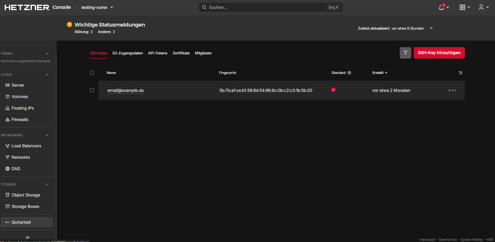
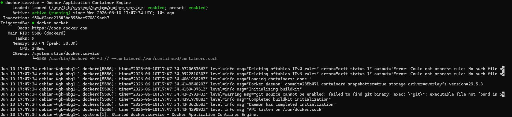
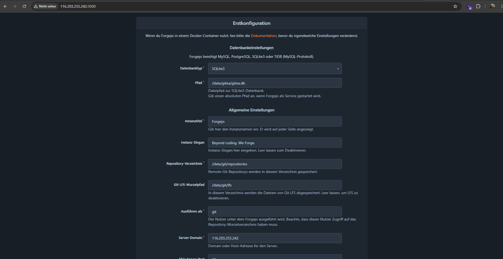
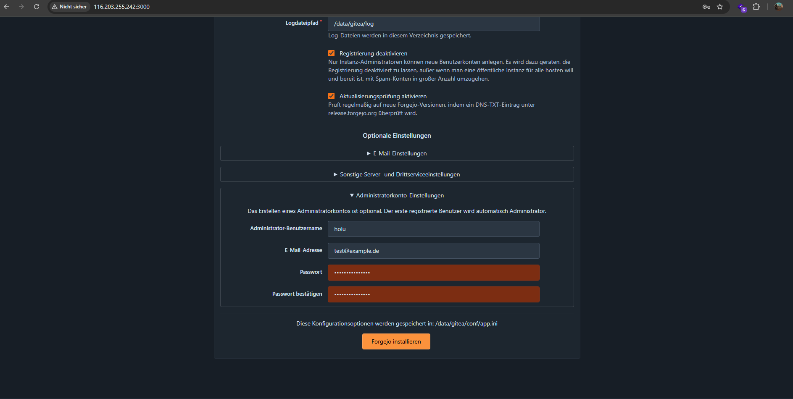

## Einführung

Forgejo ist eine Open-Source-Plattform zur Verwaltung von Git-Repositories. In diesem Tutorial zeige ich dir Schritt für Schritt, wie du Forgejo mit Docker auf einem Debian-13-Cloud-Server installierst und konfigurierst.

**Voraussetzungen**

* 1 Server (z.B. bei [Hetzner](https://docs.hetzner.com/cloud/servers/getting-started/creating-a-server))

**Beispiel-Benennungen**

* Benutzername: `holu`

## Schritt 1: Verbindung mit SSH herstellen

Erstelle zunächst einen SSH-Schlüssel auf deinem lokalen Rechner, falls du noch keinen hast:

```bash
ssh-keygen -t ed25519 -C "email@example.de"
```
Dieser wird unter `~/.ssh/id_ed25519.pub` gespeichert. Füge den Inhalt dieser Datei in die Hetzner Cloud Console unter "Sicherheit" -> "SSH-Key hinzufügen" hinzu, damit du dich später mit deinem Server verbinden kannst.



Nun erstellst du einen neuen Server in der Hetzner Cloud Console. Wähle dabei Debian 13 als Betriebssystem aus und füge den zuvor erstellten SSH-Key hinzu. Sobald der Server erstellt ist, erhältst du die IP-Adresse deines Servers.


Als nächstes musst du dich mit deinem Server verbinden. Öffne ein Terminal und gib den folgenden Befehl ein, wobei du `deine-server-ip` durch die tatsächliche IP-Adresse deines Servers ersetzt:

```bash 
ssh root@deine-server-ip -p 22
```

## Schritt 2 System aktualisieren

Nachdem du dich erfolgreich mit deinem Server verbunden hast, solltest du zunächst sicherstellen, dass dein System auf dem neuesten Stand ist. Führe dazu die folgenden Befehle aus:

```bash
sudo apt update
sudo apt upgrade -y
```
Diese Befehle aktualisieren die Paketliste und installieren die neuesten Versionen der Pakete auf deinem Server.

## Schritt 3: Docker installieren

Forgejo benötigt Docker, um die Anwendung in Containern auszuführen. Installiere Docker mit den folgenden Befehlen:

```bash
# Add Docker's official GPG key:
sudo apt update
sudo apt install ca-certificates curl
sudo install -m 0755 -d /etc/apt/keyrings
sudo curl -fsSL https://download.docker.com/linux/debian/gpg -o /etc/apt/keyrings/docker.asc
sudo chmod a+r /etc/apt/keyrings/docker.asc

# Add the repository to Apt sources:
sudo tee /etc/apt/sources.list.d/docker.sources <<EOF
Types: deb
URIs: https://download.docker.com/linux/debian
Suites: $(. /etc/os-release && echo "$VERSION_CODENAME")
Components: stable
Architectures: $(dpkg --print-architecture)
Signed-By: /etc/apt/keyrings/docker.asc
EOF

sudo apt update
sudo apt install docker-ce docker-ce-cli containerd.io docker-buildx-plugin docker-compose-plugin -y
```
Nach der Installation kannst du überprüfen, ob Docker korrekt installiert wurde, indem du den folgenden Befehl ausführst:

```bash
sudo systemctl status docker
```
Wenn Docker erfolgreich installiert wurde, solltest du eine Ausgabe sehen, die anzeigt, dass der Docker-Dienst aktiv und laufend ist.


Wenn Docker nicht läuft, kannst du es mit dem folgenden Befehl starten:

```bash
sudo systemctl start docker
```

## Schritt 4: Forgejo installieren
Nachdem Docker installiert ist, kannst du nun Forgejo installieren. Erstelle zunächst ein Verzeichnis für Forgejo und wechsle in dieses Verzeichnis:
```bash
mkdir forgejo
cd forgejo
```
Mit dem folgenden Befehl lädst du das Forgejo-Docker-Image der Version 15 herunter.

```bash
docker pull codeberg.org/forgejo/forgejo:15
```

Nun erstellst du eine `docker-compose.yml` Datei, um die Forgejo-Instanz zu konfigurieren. Erstelle die Datei mit dem folgenden Inhalt:
```yaml
networks:
  forgejo:
    external: false

services:
  server:
    image: codeberg.org/forgejo/forgejo:15
    container_name: forgejo
    environment:
      - USER_UID=1000
      - USER_GID=1000
    restart: always
    networks:
      - forgejo
    volumes:
      - ./forgejo:/data
      - /etc/localtime:/etc/localtime:ro
    ports:
      - '3000:3000'
      - '222:22'
```
Diese Konfiguration erstellt einen Docker-Container für Forgejo, der auf Port 3000 für die Weboberfläche und Port 222 für SSH-Verbindungen zugänglich ist. Die Daten von Forgejo werden im Verzeichnis `./forgejo` auf deinem Server gespeichert, damit sie auch nach einem Neustart des Containers erhalten bleiben.
USER_UID und USER_GID legen fest, unter welcher Benutzer- und Gruppen-ID Forgejo im Container ausgeführt wird.

Speichere die Datei und starte den Forgejo-Container mit dem folgenden Befehl:

```bash
docker compose up -d
```
Dieser Befehl startet den Forgejo-Container im Hintergrund. Du kannst den Status des Containers mit dem folgenden Befehl überprüfen:
```bash
docker ps
```

Wenn der Container erfolgreich gestartet wurde, solltest du ihn in der Liste der laufenden Container sehen.

## Schritt 5: Zugriff auf die Forgejo-Weboberfläche
Nachdem der Forgejo-Container läuft, kannst du nun auf die Weboberfläche zugreifen. Öffne einen Webbrowser und gib die IP-Adresse deines Servers gefolgt von `:3000` ein, z.B. `http://deine-server-ip:3000`. Du solltest die Anmeldeseite von Forgejo sehen.



Die Standardwerte können übernommen werden, da Forgejo automatisch SQLite als Datenbank verwendet.
Klicke auf den unteren Punkt "Adminstratorkonto-Einstellung" und erstelle ein neues Administratorkonto, indem du einen Benutzernamen, eine E-Mail-Adresse und ein Passwort eingibst.



Zum Schluss klicke auf "Forgejo installieren", um die Installation abzuschließen. Du wirst automatisch eingeloggt und kannst nun mit der Verwaltung deiner Git-Repositories beginnen.


##### License: MIT

<!--

Contributor's Certificate of Origin

By making a contribution to this project, I certify that:

(a) The contribution was created in whole or in part by me and I have
    the right to submit it under the license indicated in the file; or

(b) The contribution is based upon previous work that, to the best of my
    knowledge, is covered under an appropriate license and I have the
    right under that license to submit that work with modifications,
    whether created in whole or in part by me, under the same license
    (unless I am permitted to submit under a different license), as
    indicated in the file; or

(c) The contribution was provided directly to me by some other person
    who certified (a), (b) or (c) and I have not modified it.

(d) I understand and agree that this project and the contribution are
    public and that a record of the contribution (including all personal
    information I submit with it, including my sign-off) is maintained
    indefinitely and may be redistributed consistent with this project
    or the license(s) involved.

Signed-off-by: Maximilian Feix <contact@maxi-test.de> 

-->