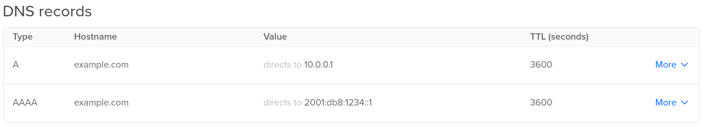

## Introduction

Having a HTTPS (Hypertext Transfer Protocol Secure) certificate on your website will improve the security of your website (especially if your site processes personal information like passwords or payment details) and will make your site look more professional with the green lock. 

If you are already using a domain with your website, it's completely free!

*Despite this tutorial being focused on websites, a Let's Encrypt TLS certificate can be used with other services like SMTP/IMAP (mail servers), FTP, or XMPP (IM servers)*

This tutorial will guide you through the steps necessary to update an already existing FreeBSD 12 server with a FEMP stack to use a HTTPS certificate provided by [Let's Encrypt](https://letsencrypt.org/). If you do not have a FEMP stack setup yet, please follow [this tutorial first.](https://community.hetzner.com/tutorials/install-a-femp-stack-on-freebsd-12)

* It is assumed that you are running as the `root` user during this guide. Use `su` to change to `root` if you are not running as `root` already.

**Prerequisites**

* A FreeBSD 12 server with root access.
* A FEMP stack (FreeBSD, Engine X, MySQL, PHP) installed as setup in [this tutorial.](https://community.hetzner.com/tutorials/install-a-femp-stack-on-freebsd-12)
* A domain or subdomain which can work with Let's Encrypt (e.g. *.your-server.de won't work as it has a CAA record preventing certificates for Let's Encrypt)

## Step 1 - Configuring Domain DNS Records

* If your domain/subdomain is already pointing to your server through the use of an A and/or AAAA record -- you may skip this step

Through your domain registrar or DNS hosting service, you need to create either an A record for an IPv4 address, or an AAAA record for an IPv6 address.

The TTL (Time to live) of your domain will tell DNS resolvers how often in seconds to query the DNS server for changes to the record. There is no minimum time requirement, but between 3600 seconds (one hour) and 86400 seconds (one day) is a good TTL range.

Here is an example of what that may look like for the domain "example.com"



## Step 2 - Updating FreeBSD

*By default, FreeBSD does not come with the `pkg` package manager, but comes with a tool to bootstrap it. If FreeBSD asks to install it, answer 'Yes'.*

It is best to update the system beforehand to ensure you are getting the latest packages when installing `certbot`. You can do this by running the following command:

```
pkg update ; pkg upgrade
```

This will update the repositories of `pkg`, and then upgrade any installed packages that you may have.

## Step 3 - Installing Certbot

*This will install certbot through `pkg`. Alternatively the `pip` package manager for Python may be used if it is installed.*

Certbot can be installed by using the `pkg` tool that may have been installed in the previous step. To do this, run the following command:

```
pkg install py37-certbot
```

Assuming that your webroot directory is in `/var/www/html/` as setup in the previous tutorial, run the following command to get your SSL certificate:

* Replace example.com with the domain you are using. To add additional subdomains, just use the `-d` option with certbot, prefaced with the webroot with `-w` if using a different server root. e.g. `-d example.com -d www.example.com`

```
certbot --webroot -w /var/www/html -d example.com
```

It will ask for your email address. Please put a real email address here, as this will be used for security notices and renewal notices incase auto-renewal fails

```
Enter email address (used for urgent renewal and security notices) (Enter 'c' to
cancel):
```

You must agree to the Terms of Service of [letsencrypt.org](https://letsencrypt.org/documents/LE-SA-v1.2-November-15-2017.pdf) to be able to get your certificate.

```
- - - - - - - - - - - - - - - - - - - - - - - - - - - - - - - - - - - - - - - -
Please read the Terms of Service at
https://letsencrypt.org/documents/LE-SA-v1.2-November-15-2017.pdf. You must
agree in order to register with the ACME server at
https://acme-v02.api.letsencrypt.org/directory
- - - - - - - - - - - - - - - - - - - - - - - - - - - - - - - - - - - - - - - -
(A)gree/(C)ancel:
```

You should now have your SSL certificate and chain saved at `/usr/local/etc/letsencrypt/live/example.com/`

It would be a good idea to backup your `/usr/local/etc/letsencrypt` folder as it contains your account credentials. If you lose it you will need to repeat this process again.

Your certificate will expire after 3 months, and you can renew certificates 1 month before they will expire. Simply running `certbot renew` will renew your certificate.

Automatic renewal is preferred however, to make sure someone browsing your site doesn't see an error relating to certificate expiration. To have `certbot` automatically attempt a renewal every week:

```
echo 'weekly_certbot_enable="YES"' >> /etc/periodic.conf
```

## Step 4 - Configuring Nginx to use HTTPS

Now we will be configuring Nginx to utilise the certificate we just created with `certbot`

But first, we need to create a new Diffie-Hellman group for Nginx [as it is a good idea for security](https://weakdh.org):

* This may take a few minutes to complete

```
openssl dhparam -out /usr/local/etc/letsencrypt/dhparams.pem 2048
```

We will be using the ["Intermediate" Server Side TLS configuration](https://wiki.mozilla.org/Security/Server_Side_TLS#Intermediate_compatibility_.28recommended.29) that Mozilla provides. Very old clients may not be able to connect to your website with this however, if this is importtant consider using the ["Old" configuration](https://wiki.mozilla.org/Security/Server_Side_TLS#Old_backward_compatibility). Keep in mind the security implications in doing so however.

If you followed the FEMP tutorial your `nginx` configuration (`/usr/local/etc/nginx/nginx.conf`) should look something like this -- without the commented out parts:

```
server {
        listen       80;
        listen       [::]:80; # If using IPv6
        server_name  example.com;

        root /var/www/html;
        index index.php index.html index.htm;

        error_page   500 502 503 504  /50x.html;
        location = /50x.html {
            root   /usr/local/www/nginx-dist;
        }

        location ~ [^/]\.php(/|$) {
            fastcgi_split_path_info ^(.+?\.php)(/.*)$;
            try_files $uri $document_root$fastcgi_script_name =404;
            fastcgi_pass unix:/var/run/php-fpm.sock;
            fastcgi_index index.php;
            fastcgi_param SCRIPT_FILENAME $document_root$fastcgi_script_name;
            include fastcgi_params;
        }

    }
```

The following changes need to be made:

* Change `listen 80;` and `listen [::]:80;` to `listen 443 ssl http2;` and `listen [::]:443 ssl http2;` respectively.
* Add an additional server block listening on port 80, for redirecting HTTP connections to HTTPS.
* Adding SSL certificate, key, and dhparam paths.
* Configuration relating to TLS session.
* Specifying allowed TLS protocols and ciphers to ensure no outdated ciphers vulnerable to attacks are offered by the server.
* Requiring HTTPS always by adding a header for HSTS (HTTP Strict Transport Security). 
* Making sure your servers domain or subdomain is listed under `server_name`.

Nginx's configuration should look something like this:

```
server {
        listen 80 default_server;
        listen [::]:80 default_server; # If using IPv6

        return 301 https://$host$request_uri;
    }

server {
        listen 443 ssl http2;
        listen [::]:443 ssl http2; # If using IPv6
        server_name example.com;
        
        root /var/www/html;
        index index.php index.html index.htm;
        
	error_page   500 502 503 504  /50x.html;
        location = /50x.html {
            root   /usr/local/www/nginx-dist;
        }

        location ~ [^/]\.php(/|$) {
            fastcgi_split_path_info ^(.+?\.php)(/.*)$;
            try_files $uri $document_root$fastcgi_script_name =404;
            fastcgi_pass unix:/var/run/php-fpm.sock;
            fastcgi_index index.php;
            fastcgi_param SCRIPT_FILENAME $document_root$fastcgi_script_name;
            include fastcgi_params;
        }

        ssl_certificate /usr/local/etc/letsencrypt/live/example.com/fullchain.pem;
        ssl_certificate_key /usr/local/etc/letsencrypt/live/example.com/privkey.pem;

        ssl_dhparam /usr/local/etc/letsencrypt/dhparams.pem;
  
        ssl_session_timeout 1d;
        ssl_session_cache shared:le_nginx_SSL:1m;
	ssl_session_tickets on;

        ssl_protocols TLSv1.2 TLSv1.3;
        ssl_prefer_server_ciphers on;
        ssl_ciphers ECDHE-ECDSA-AES128-GCM-SHA256:ECDHE-RSA-AES128-GCM-SHA256:ECDHE-ECDSA-AES256-GCM-SHA384:ECDHE-RSA-AES256-GCM-SHA384:ECDHE-ECDSA-CHACHA20-POLY1305:ECDHE-RSA-CHACHA20-POLY1305:DHE-RSA-AES128-GCM-SHA256:DHE-RSA-AES256-GCM-SHA384;

        add_header Strict-Transport-Security "max-age=63072000" always;
    }
```

Then to test your configuration, restart nginx:

```
service nginx restart
```

## Conclusion

Congratulations! Your web server is now using HTTPS, and redirecting HTTP to HTTPS!

* Consider testing your server's HTTPS configuration with [Qualys's SSL Server Test](https://www.ssllabs.com/ssltest/index.html) to see how your SSL configuration is rated. If you followed this tutorial you should get an `A+` grade.
* HSTS is enabled as part of the configuration, but won't be acknowledged by browsers until the initial connection to your site. To have your domain included as part of the HSTS Preload list, please see [https://hstspreload.org](https://hstspreload.org).

##### License: MIT

<!---

Contributors's Certificate of Origin

By making a contribution to this project, I certify that:

(a) The contribution was created in whole or in part by me and I have
    the right to submit it under the license indicated in the file; or

(b) The contribution is based upon previous work that, to the best of my
    knowledge, is covered under an appropriate license and I have the
    right under that license to submit that work with modifications,
    whether created in whole or in part by me, under the same license
    (unless I am permitted to submit under a different license), as
    indicated in the file; or

(c) The contribution was provided directly to me by some other person
    who certified (a), (b) or (c) and I have not modified it.

(d) I understand and agree that this project and the contribution are
    public and that a record of the contribution (including all personal
    information I submit with it, including my sign-off) is maintained
    indefinitely and may be redistributed consistent with this project
    or the license(s) involved.

Signed-off-by: youiopmop <rosethorn@riseup.net>

-->
