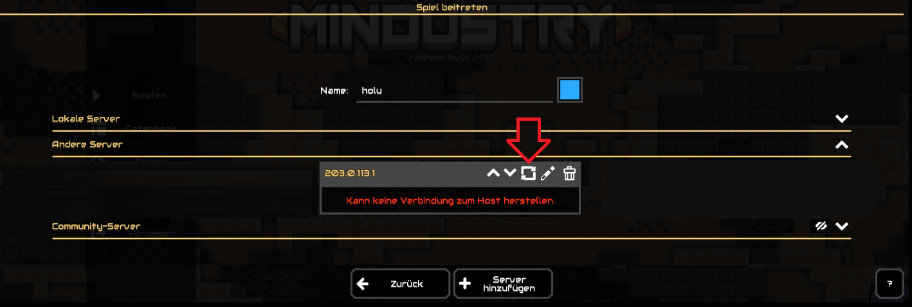
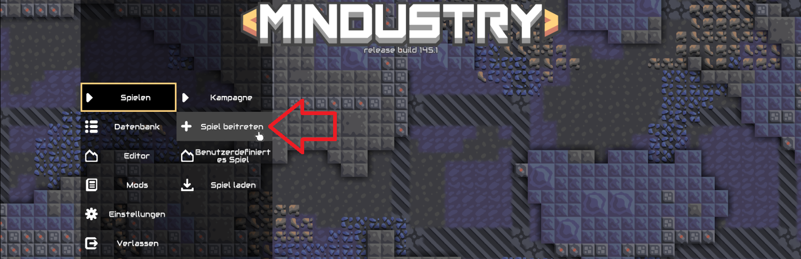
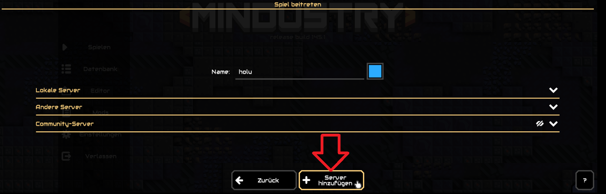
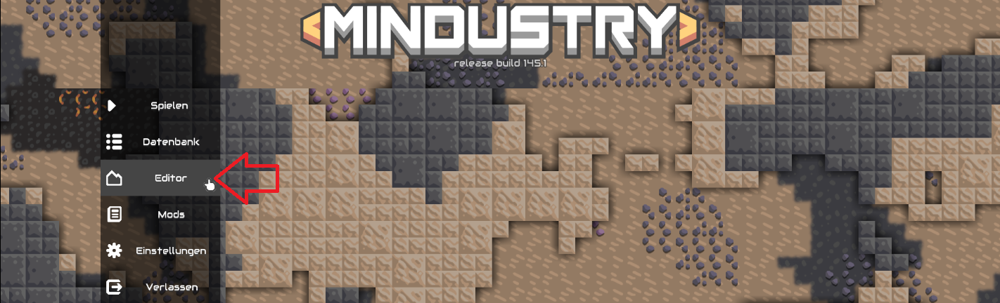
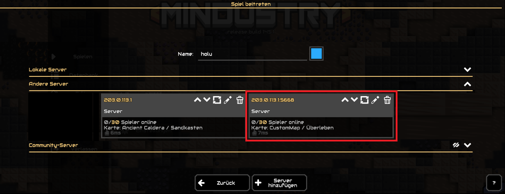

## Einführung

In diesem Tutorial wird erklärt, wie man ein Mindustry-Mehrspielerspiel auf einem Server mit Ubuntu oder Debian hostet. Es wird gezeigt, wie man das Spiel auch dann weiterlaufen lassen kann, wenn die Verbindung zum Server bereits beendet wurde, wie man den Port ändert und wie man ein Spiel mit einer benutzerdefinierten Karte starten kann.

**Mindustry spielen:**

Mindustry wird mit der Desktop-Version auf dem lokalen Gerät gespielt. Wenn man Mindustry öffnet, kann man entweder ein Spiel für Einzelspieler oder für Mehrspieler spielen. Mehrspielerspiele werden gewöhnlich auf einem separaten Server gehostet und man kann sich über deren IP-Adresse oder Domain-Namen mit diesen verbinden.

Bei **selbst gehosteten** Mehrspielerspielen unterscheidet Mindustry zwischen "Remote Server" und "Local Server". In diesem Tutorial wird nur erklärt, wie man einen "Remote Server" einrichtet.

Mehrspieler-Mindustry-Server:

| Mindustry Server | Mindustry Server gehostet auf                               | Beschreibung                                |
| ---------------- | ----------------------------------------------------------- | ------------------------------------------- |
| Remote Server    | **externem Server**<br>*(Zugriff über Eingabeaufforderung)* | Über **öffentliche** IP mit Spielern teilen |
| Local Server     | **lokalem Gerät**<br>*(Option im Spiel)*                    | Über **private** IP mit Spielern teilen     |

**Voraussetzungen**

* **Ein lokales Gerät** » um sich mit dem Spiel zu verbinden
* **Einen Server** mit Ubuntu/Debian » um das Spiel zu hosten
  * Zugriff auf den root-Benutzer oder einen Benutzer mit sudo-Rechten.
  * Bevor man auf dem Server das erste Spiel startet, sollten mindestens die ersten Basiseinstellungen einschließlich einer Firewall bereits vorgenommen worden sein. Für weitere Informationen, siehe:<br>[Ersteinrichtung eines Servers mit Ubuntu](/tutorials/howto-initial-setup-ubuntu/de)

**Beispiel-Benennungen**

* `203.0.113.1` » Öffentliche IP des Servers
* `holu` » Beispiel-Benutzer auf dem Server

In allen Beispiel-Befehlen muss `203.0.113.1` mit der IP-Adresse des eigenen Servers ersetzt werden und `holu` mit dem eigenen Benutzernamen.

## Schritt 1  - Lokales Gerät einrichten

Um das Spiel auf dem Server hosten zu können, muss man sich über das lokale Gerät mit dessen IP-Adresse verbinden. Um das Spiel testen zu können, während es auf dem Server gestartet und eingerichtet wird, muss zunächst das lokale Gerät vorbereitet werden.

Das beinhaltet:

* [Mindustry installieren](#schritt-11---mindustry-auf-dem-lokalen-gerät-installieren) (Desktop-Version)
* [Den Server (IP) im Spiel hinzufügen](#schritt-12---den-server-unter-remote-servers-hinzufugen)

### Schritt 1.1 - Mindustry auf dem lokalen Gerät installieren

Wenn das Spiel noch nicht auf dem lokalen Gerät installiert ist, sollte es nun hinzugefügt werden. Mindustry ist kostenlos verfügbar unter:

* [GitHub](https://github.com/Anuken/Mindustry/releases)
  * `Mindustry.jar`
* [itch.io](https://anuke.itch.io/mindustry)
  * `[Operating System]Mindustry.zip`

>  `server-release.jar` / `[Server]Mindustry.zip` müssen nicht installiert werden. Diese sind für den **Server**.

**Hinweis:** Um Mindustry starten zu können muss [Java](https://www.java.com/) installiert sein. 

<blockquote>

<details>

<summary>Beispiel-Installation der Desktop-Version von Mindustry über eine Kommandozeile unter Ubuntu/Debian</summary>

* **Neuen Ordner erstellen und öffnen:**
  ```bash
  mkdir mindustry && cd mindustry
  ```

* **Java installieren:**
  * Ubuntu
    ```bash
    apt update && apt install openjdk-21-jdk openjdk-21-jre
    ```
  * Debian
    ```bash
    apt update && apt install default-jdk default-jre
    ```

* **Das [Mindustry-Repository](https://github.com/Anuken/Mindustry/releases) auf GitHub öffnen**, eine Version auswählen und den Link zur Desktop-Version `Mindustry.jar` kopieren. Mit `wget` und dem eben kopierten Link kann die Datei jetzt auf dem Server gespeichert werden:
  ```bash
  wget https://github.com/Anuken/Mindustry/releases/download/v146/Mindustry.jar
  ```
  > Um eine andere Version zu installieren, muss der Link entsprechend ausgetauscht werden.
  
* **Der Datei Ausführrechte zuweisen:**
  ```bash
  chmod +x Mindustry.jar
  ```

* **Mindustry starten:**
  ```bash
  java -jar Mindustry.jar
  ```
  > Der Befehl muss unter dem Pfad ausgeführt werden, unter dem die JAR-Datei gespeichert wurde.

----------

</details>

</blockquote>

### Schritt 1.2 - Den Server unter "Remote Servers" hinzufügen

Auf dem Server wird bisher zwar noch kein Spiel gehostet, man kann die IP-Adresse des Servers aber trotzdem schon mal bei der Desktop-Version von Mindustry auf dem lokalen Gerät hinzufügen.

Wenn man den Server jetzt schon hinzufügt, muss man bei den untenstehenden Schritten nur noch die Server-Information aktualisieren (🔁), um zu sehen, ob Mindustry eine Verbindung herstellen kann, nachdem man beispielsweise das erste Spiel gestartet oder andere Einstellungen vorgenommen hat.



#### Um den Server hinzuzufügen, muss man:

* **`Spielen` » `+ Spiel beitreten` auswählen**
  

* **`+ Server hinzufügen` auswählen**<br>
  `+ Server hinzufügen` steht ganz unten auf der Seite.
  

* **Die IP-Adresse des Servers angeben**<br> 
  Um die IP-Adresse herauszufinden, kann auf dem **Server** dieser Befehl ausgeführt werden:
  ```bash
  curl -4 https://ip.hetzner.com
  ```
  Nachdem man die IP-Adresse auf dem lokalen Gerät in Minudstry eingetragen hat, kann `OK` ausgewählt werden.

Der Server sollte mit dem Hinweis "Kann keine Verbindung zum Host herstellen" erscheinen.

Nachdem einer der untenstehenden Schritte beendet wurde, kann man die Serverinformationen aktualisieren, um zu prüfen, ob das lokale Gerät eine Verbindung zum Server herstellen kann.

## Schritt 2 - Den Server vorbereiten

Für diesen Schritt und für alle folgenden Schritte muss man sich mit dem Server verbinden. Wie in den "Voraussetzungen" bereits erwähnt, sollte die [Ersteinrichtung auf dem Server](/tutorials/howto-initial-setup-ubuntu/de) einschließlich einer Firewall bereits durchgeführt worden sein.

Um Mindustry starten zu können, muss auf dem Server Java installiert sein. Nachdem das Spiel gestartet wurde, wird automatisch angegeben `Opened a server on port 6567.`

Aus diesem Grund sollte man erst:

* Port 6567 erlauben
* Java installieren

Anschließend kann Mindustry installiert und das erste Spiel gestartet werden.

### Schritt 2.1 - Port 6567 erlauben

Wenn auf dem Server eine Firewall eingerichtet wurde, muss diese so angepasst werden, dass Port 6567 TCP und UDP erlaubt ist. Ansonsten kann sich das lokale Gerät nicht mit dem Server verbinden.

Es gibt verschiedene Firewall-Tools. In diesem Tutorial werden erklärt:

* [`ufw`](#ufw-firewall-regeln-verwalten) » Standard-Firewall-Tool für Ubuntu
* [Hetzner Cloud Firewall](#hetzner-cloud-firewall-regeln-verwalten)

> Wenn eine andere Firewall verwendet wird, sollte auch dort der **eingehende Traffic** zu Port 6567 TCP und UDP erlaubt werden.

---------

#### `ufw` Firewall-Regeln verwalten

* **Aktuelle Firewall-Einstellungen anzeigen**<br>
  Um zu prüfen, ob die `ufw` Firewall aktiv ist und ob bereits Regeln hinzugefügt wurden, kann dieser Befehl genutzt werden:
  ```bash
  sudo ufw status
  ```
  > Beispiel-Output:
  > ```console
  > holu@remote-server:~# ufw status
  > Status: active
  > 
  > To                         Action      From
  > --                         ------      ----
  > OpenSSH                    ALLOW       Anywhere
  > OpenSSH (v6)               ALLOW       Anywhere (v6)
  > ```

* **Port 6567 TCP und UDP erlauben**<br>
  Wenn die Firewall aktiv ist, kann man mit diesen beiden Befehlen den eingehenden Traffic zu Port 6567 TCP und UDP erlauben:  
  ```bash
  sudo ufw allow proto tcp to any port 6567
  sudo ufw allow proto udp to any port 6567
  ```

* **Neue Firewall-Einstellungen anzeigen**<br>
  Die neuen Regeln sollten jetzt hinzugefügt sein. Zum Prüfen:
  ```bash
  sudo ufw status
  ```
  > Beispiel-Output:
  > ```console
  > holu@remote-server:~# sudo ufw status
  > Status: active
  > 
  > To                         Action      From
  > --                         ------      ----
  > OpenSSH                    ALLOW       Anywhere
  > 6567/tcp                   ALLOW       Anywhere
  > 6567/udp                   ALLOW       Anywhere
  > OpenSSH (v6)               ALLOW       Anywhere (v6)
  > 6567/tcp (v6)              ALLOW       Anywhere (v6)
  > 6567/udp (v6)              ALLOW       Anywhere (v6)
  > ```

<details>

<summary>Wenn bestehende Regeln gelöscht werden müssen, hier klicken.</summary>

> Mit folgenden Befehlen kann man eine Regel löschen:
> ```bash
> sudo ufw status numbered   # Alle Regeln nummeriert listen
> sudo ufw delete <number>   # Eine Regel mit Angabe der Nummer löschen
> ```

</details>

---------

#### Hetzner Cloud Firewall Regeln verwalten

Dieser Schritt ist nur relevant, wenn man einen Server bei Hetzner Cloud besitzt, auf den eine Hetzner Cloud Firewall angewendet wird. Um die Firewall-Regeln zu bearbeiten, muss man in der [Cloud Console](https://console.hetzner.cloud/projects) die Firewall auswählen und im Firewall-Menüpunkt "Regeln" die folgenden "eingehenden" Regeln hinzufügen:

| IPs                                     |Protokoll| Port |Portbereich|
| --------------------------------------- | ------- | ---- | --------- |
| <kbd>Any IPv4</kbd> <kbd>Any IPv6</kbd> | TCP     | 6567 |           |
| <kbd>Any IPv4</kbd> <kbd>Any IPv6</kbd> | UDP     | 6567 |           |

### Schritt 2.2 - Java installieren

Um Mindustry starten zu können, muss Java auf dem Server installiert sein.

* Prüfen ob Java bereits installiert ist
  ```bash
  java --version
  ```
* Java installieren
  * Ubuntu
    ```bash
    sudo apt update && sudo apt install openjdk-21-jdk openjdk-21-jre
    ```
  * Debian
    ```bash
    sudo apt update && sudo apt install default-jdk default-jre
    ```
  
  Um zu prüfen, ob die Installation erfolgreich war, kann wieder `java --version` genutzt werden.

## Schritt 3 - Mindustry installieren

Jetzt da der Port offen und Java installiert ist, kann Mindustry installiert werden. Die Server-Version von Mindustry ist kostenlos verfügbar unter:

* [GitHub](https://github.com/Anuken/Mindustry/releases)
  * `server-release.jar`
* [itch.io](https://anuke.itch.io/mindustry)
  * `[Server]Mindustry.zip`
  
> `Mindustry.jar` / `[Operating System]Mindustry.zip` müssen nicht installiert werden. Diese sind für das **lokale Gerät**.

In diesem Tutorial wird erklärt, wie man Mindustry über GitHub installiert:

* **Neuen Ordner für die Mindustry-Dateien erstellen und öffnen**
  ```bash
  mkdir mindustry && cd mindustry
  ```

* **Das [Mindustry-Repository](https://github.com/Anuken/Mindustry/releases) auf GitHub öffnen**<br>
  Hier kann man sich eine Version aussuchen und den Link zu `server-release.jar` kopieren. Mit `wget` und dem eben kopierten Link kann die Datei jetzt auf dem Server gespeichert werden:
  ```bash
  wget https://github.com/Anuken/Mindustry/releases/download/v146/server-release.jar
  ```
  > Dieser Link führt zu Version `v146`. Um eine andere Version zu installieren, muss der Link entsprechend ausgetauscht werden.
  
  Die Datei sollte nun auf dem Server sein:
  ```bash
  ls -al
  ```

* **Der Datei Ausführrechte zuweisen**
  ```bash
  chmod +x server-release.jar
  ```

* **Mindustry starten**
  ```bash
  java -jar server-release.jar
  ```
  > Der Befehl muss unter dem Pfad ausgeführt werden, unter dem die JAR-Datei gespeichert wurde.

Die Kommandozeile sollte jetzt ungefähr so aussehen:

```console
holu@remote-server:~/mindustry# java -jar server-release.jar
[08-09-2024 09:59:09] [I] Server loaded. Type 'help' for help.

```

Das ist die Mindustry-Konsole, in der Mindustry-Befehle ausgeführt werden können.

Im nächsten Schritt kann jetzt endlich das erste Spiel gestartet werden!

## Schritt 4 - Das erste Spiel starten

Die Mindustry-Konsole ist bereits offen, es muss also nur noch der Mindustry-Befehl ausgeführt werden, mit dem man ein Spiel startet.

Vorher muss man sich aber noch für eine Karte und einen Modus entscheiden.

* **Karte**<br>
  Welche Karten verfügbar sind, kann mit dem `maps`-Befehl geprüft werden:<br>
  * `maps custom` / `maps` » Benutzerdefinierte Karten listen<br>
  * `maps all` » Alle Karten listen<br>
  Bisher gibt es noch keine benutzerdefinierten Karten. Erstmal sollte man also `maps all` ausführen.
  
* **Modus**<br>
  Wenn beim Starten eines Spiels kein Modus angegeben wird, wird automatisch der Standard-Modus "survival" verwendet.

Mit dem `host`-Befehl kann das erste Spiel gestartet werden:

```console
host <mapname> <mode>
```

`<mapname>` muss mit dem Namen der gewünschten Karte ersetzt werden und `<mode>` mit einem der verfügbaren Modi.

> **Beispiel:**
> 
> ```console
> holu@remote-server:~/mindustry# java -jar server-release.jar
> [08-09-2024 09:59:09] [I] Server loaded. Type 'help' for help.
> host Ancient_Caldera sandbox
> ```

<br>

<details>

<summary>Bei einem Port-Fehler hier klicken</summary>

<blockquote>

Bei einer Fehlermeldung wie `Unable to host: Port 6567 already in use!` kann mit `lsof -i :6567` geprüft werden, welcher Prozess diesen Port verwendet.
 
```console
holu@remote-server# lsof -i :6567
COMMAND  PID USER   FD   TYPE DEVICE SIZE/OFF NODE NAME
java    4303 holu   11u  IPv6  28025      0t0  TCP *:6567 (LISTEN)
java    4303 holu   12u  IPv6  28026      0t0  UDP *:6567
```
Wenn der Prozess unwichtig ist, kann man diesen mit `kill -15` und der Prozess-ID (PID) beenden.
```bash
kill -15 <PID>
```

</blockquote>

</details>

Das Spiel sollte jetzt verfügbar sein und bereit zum Spielen!

---------

<br>

Auf dem lokalen Gerät kann jetzt die Desktop-Version von Mindustry geöffnet und der Aktualisierungs-Button neben der IP-Adresse des Servers ausgewählt werden.

* **Wenn alles funktioniert hat**, sollten jetzt der Name der Karte und der Modus angezeigt werden, in diesem Beispiel "Ancient Caldera" and "Sandkasten".
* **Wenn eine Warnung** wie "Kann keine Verbindung zum Host herstellen" angezeigt wird, sollte in den Firewall-Einstellungen nochmal geprüft werden, ob Port 6567 TCP und UDP erlaubt ist.

<br>

---------

Auf dem Server kann man die Mindustry-Konsole mit `exit` verlassen. Damit wird das gesamte Spiel beendet. In der Desktop-Version auf dem lokalen Gerät sollte anschließend wieder der Hinweis "Kann keine Verbindung zum Host herstellen" angezeigt werden. Das passiert auch dann, wenn man die Verbindung zum Server beendet.

Eine Möglichkeit, wie man ein Spiel 24/7 laufen lassen kann, wird in "Schritt 5" erklärt.

## Schritt 5 - Eine Screen-Sitzung starten

Momentan wird das Spiel automatisch beendet, sobald man die Verbindung zum Server schließt. Eine Möglichkeit das Spiel weiterlaufen zu lassen, ist das `screen`-Tool. Mit **screen** ist es möglich innerhalb einer externen Terminal-Sitzung eine separate virtuelle Terminal-Sitzung zu starten.

Wenn man die externe Terminal-Sitzung beendet, läuft die virtuelle Terminal-Sitzung (screen-Sitzung) trotzdem weiter. Wenn man sich das nächste Mal wieder mit dem Server verbindet, ist die screen-Sitzung weiterhin verfügbar.

<details>

<summary>Screen installieren</summary>

Wenn "screen" noch nicht installiert ist, kann es jetzt installiert werden mit:

```bash
sudo apt update && sudo apt install screen -y
```

---------

</details>

Um ein Mindustry-Spiel in einer screen-Sitzung auf dem Server zu starten, muss man:

* **Die Sitzung starten**
  ```bash
  screen -S mindustry-screen
  ```
  > `mindustry-screen` kann mit einem beliebigen Namen ersetzt werden.

* **Den Mindustry-Ordner öffnen**<br>
  Öffne den Ordner, in dem die JAR-Datei der Server-Version von Mindustry gespeichert wurde. In diesem Tutorial wurde dieser Pfad verwendet:
  ```bash
  cd ~/mindustry
  ```

* **Mindustry starten**
  ```bash
  java -jar server-release.jar
  ```

* **Das Spiel starten**<br>
  Der obere Befehl sollte wieder die Mindustry-Konsole geöffnet haben. Wie zuvor, kann ein neues Spiel mit dem Mindustry-Befehl `host` gestartet werden:
  ```bash
  host <mapname> <mode>
  ```
  > Beispiel: `host Ancient_Caldera sandbox`
  
  Wenn das vorherige Mindustry-Spiel nicht richtig beendet wurde mit dem `stop` oder `exit`-Befehl, wird eventuell eine Fehlermeldung bezüglich des Ports angezeigt.

  <details> 

  <summary>Bei Fehlermeldung, hier klicken</summary>

  <blockquote>

  Bei einer Fehlermeldung wie `Unable to host: Port 6567 already in use!` kann mit `lsof -i :6567` geprüft werden, welcher Prozess diesen Port verwendet.
  
  ```console
  holu@remote-server# lsof -i :6567
  COMMAND  PID USER   FD   TYPE DEVICE SIZE/OFF NODE NAME
  java    4303 holu   11u  IPv6  28025      0t0  TCP *:6567 (LISTEN)
  java    4303 holu   12u  IPv6  28026      0t0  UDP *:6567
  ```
  Wenn der Prozess unwichtig ist, kann man diesen mit `kill -15` und der Prozess-ID (PID) beenden. Beispiel:
  ```bash
  kill -15 <PID>
  ```
  Wenn der Befehl den Prozess nicht beendet und man sich **ganz sicher** ist, dass der Prozess unwichtig ist, kann der Stopp mit `kill -9` erzwungen werden:
  ```bash
  kill -9 <PID>
  ```

  </blockquote>

  </details>

Das Spiel sollte jetzt verfügbar sein und bereit zum Spielen!

---------

<br>

Auf dem lokalen Gerät kann jetzt die Desktop-Version von Mindustry geöffnet und der Aktualisierungs-Button ausgewählt werden, um zu prüfen ob alles funktioniert hat und das Spiel verfügbar ist.

<br>

---------

Auf dem Server kann man die screen-Sitzung mit der Tastenkombination `ctrl`+`A` gefolgt von `D` verlassen. Die screen-Sitzung selbst wird damit nicht beendet und das Spiel bleibt weiterhin erreichbar. Die externe Terminal-Sitzung kann jetzt auch beendet werden.

Mit folgenden Befehlen kann man die Mindustry screen-Sitzung erneut öffnen oder Änderungen vornehmen:

* Alle "Screens" listen
  ```bash
  screen -list
  ```
  > Der Screen, der gerade für Mindustry erstellt wurde, sollte hier auch gelistet werden.

* In eine laufende screen-Sitzung wechseln
  ```bash
  screen -dr mindustry-screen
  ```
  > Wenn ein anderer Name verwendet wurde, muss `mindustry-screen` entsprechend angepasst werden.

* Screen-Sitzung löschen<br>
  ```bash
  screen -X -S mindustry-screen quit
  ```
  > **Hinweis:** Damit wird das Mindustry-Spiel beendet und die screen-Sitzung ist anschließend nicht mehr verfügbar.

## Schritt 6 - Einen anderen Port verwenden

Mindustry-Spiele werden standardmäßig auf Port 6567 gestartet. Folgend wird erklärt, wie man ein Spiel auf einem anderen Port starten kann. Wenn du gerade in einer Mindustry screen-Sitzung bist, in der bereits ein Mindustry-Spiel gehostet wird, kann das Spiel mit `stop` beendet werden oder du nutzt die Tastenkombination `ctrl`+`A` gefolgt von `D`, um die screen-Sitzung zu verlassen. Anschließend kannst du eine neue screen-Sitzung erstellen und öffnen.

* **Prüfen welcher Port verwendet wird**<br>
  Um zu prüfen, welcher Port gerade eingestellt ist, muss dieser Befehl in der Mindustry-Konsole ausgeführt werden:
  ```bash
  config port
  ```
  > **Beispiel:**
  > ```bash
  > holu@remote-server:~/mindustry# java -jar server-release.jar
  > [08-07-2024 13:43:44] [I] Server loaded. Type 'help' for help.
  > config port
  > [08-07-2024 13:47:32] [I] 'port' is currently 6567.
  > ```

* **Port ändern**<br>
  ```bash
  config port 5668
  ```
  > `5668` kann mit jedem beliebigen Port ersetzt werden.

* **Prüfen ob es funktioniert hat**<br>
  Mit dem Befehl von zuvor kann geprüft werden, ob der Port jetzt anders ist:
  ```bash
  config port
  ```
  > **Beispiel:**
  > ```bash
  > config port
  > [08-07-2024 13:48:14] [I] 'port' is currently 5668.
  > ```
* **Ein neues Spiel starten**<br>
  Wie immer, kann ein neues Spiel mit dem `host`-Befehl gestartet werden. 
  ```bash
  host <mapname> <mode>
  ```
  > Beispiel: `host Ancient_Caldera sandbox`

* **Firewall aktualisieren**<br>
  Wenn eine Firewall auf den Server angewendet wird, sollte diese so angepasst werden, dass der Port, der eben für das Spiel festgelegt wurde, ebenfalls erlaubt ist, in diesem Beispiel Port 5668. Für `ufw` und Hetzner Cloud Firewall werden die notwendigen Schritte dafür in "[Schritt 2.1](#schritt-21---port-6567-erlauben)" beschrieben.

* **Spiel hinzufügen**<br>
  Auf dem lokalen Gerät kann jetzt die Desktop-Version von Mindustry geöffnet werden, um das Spiel hinzuzufügen:
  * `Spielen` » `+ Spiel beitreten` auswählen
  * `+ Server hinzufügen` ganz unter auf der Seite auswählen
  * Die IP-Adresse des Servers angeben und den Port bestimmen (`<ip-address>:<port>`), z.B.:
    ```bash
    203.0.113.1:5668
    ```
    > `203.0.113.1` muss mit der IP-Adresse des eigenen Servers ersetzt werden und `5668` mit dem Port des Spiels.

## Schritt 7 - Eine benutzerdefinierte Karte verwenden

Nun da erklärt wurde wie man ein einfaches Spiel startet, kann im nächsten Schritt ein Spiel mit einer benutzerdefinierte Karte gestartet werden. Dafür muss die Karten-Datei (`.msav`) auf dem Server unter `config/maps` gespeichert werden. Dieser Ordner befindet sich unter demselben Pfad wie die `server-release.jar`-Datei. In diesem Tutorial ist das dieser Pfad:

```bash
~/mindustry/config/maps
```

> Wenn ein anderer Pfad verwendet wurde, muss `~/mindustry` entsprechend angepasst werden.

* **Karten-Datei erstellen**<br>
  Auf dem lokalen Gerät kann jetzt die Desktop-Version von Mindustry geöffnet werden. Im Menü muss "Editor" ausgewählt werden.
  
  
  
  Man kann entweder eine bestehende Karte bearbeiten oder eine neue Karte erstellen. Bei neuen Karten darf nicht vergessen werden einen "Kern" hinzuzufügen.
  
  Sobald die benutzerdefinierte Karte fertig ist, kann man das Menü-Symbol oben links im Editor auswählen und anschließend auf "Exportiere..." gehen, um einen Speicherort zu bestimmen.

* **Karten-Datei auf den Server kopieren**<br>
  Die Karten-Datei muss jetzt vom lokalen Gerät auf den Server kopiert werden.

  Je nach Betriebssystem des lokalen Geräts, gibt es verschiedene Möglichkeiten.

  <details>

  <summary><b>SCP-Befehl</b><br>
  <ul><u>Geeignet für:</u><br>
  - Linux<br>
  - Windows 10 oder höher (PowerShell)
  </summary>

    --------

    Auf dem lokalen Gerät muss der folgende Befehl innerhalb von dem Ordner ausgeführt werden, in dem die Karten-Datei gespeichert wurde:
    ```bash
    scp custom-map.msav holu@203.0.113.1:~/mindustry/config/maps
    ```
    > Bei Bedarf anpassen:
    > * `custom-map.msav` mit dem Dateinamen der eigenen Karte
    > * `holu` mit dem eigenen Benutzernamen auf dem Server
    > * `203.0.113.1` mit der IP-Adresse des eigenen Servers
    > * `~/mindustry` mit dem Pfad, den man verwendet hat

    --------

  </details>
  
  <br>
  
  <details>

  <summary><b>Über GitHub</b><br>
  <ul><u>Geeignet für:</u><br>
  - Jedes Betriebssystem (z.B. Windows 8)
  
  Für diese Option braucht man einen GitHub-Account.</ul>

  </summary>

  --------

  * Speicher die Datei in deiner GitHub Repo.
  * Verbinde dich mit deinem Server und öffne den `config/maps`-Ordner:
    ```bash
    ~/mindustry/config/maps
    ```
    > `config/maps` ist im selben Ordner wie die `server-release.jar`-Datei. Wenn ein anderer Pfad verwendet wurde, muss `~/mindustry` entsprechend angepasst werden.
  * Speicher die Karte auf deinem Server mit `wget` und dem "Raw Link" zur Karten-Datei:
    ```bash
    wget https://github.com/user/repo/raw/main/custom-map.msav
    ```
  
  --------

  </details>

* **Prüfen ob die Karte für Spiele verfügbar ist**<br>
  Auf dem Server kann in der Mindustry-Konsole mit dem `maps`-Befehl geprüft werden, ob die Karte verfügbar ist:
  ```bash
  holu@remote-server:~/mindustry# java -jar server-release.jar
  [08-07-2024 13:43:44] [I] Server loaded. Type 'help' for help.
  maps
  [08-07-2024 13:43:48] [I] Maps:
  [08-07-2024 13:43:48] [I]   CustomMap (custom-map.msav): Custom / 500x500
  [08-07-2024 13:43:48] [I] Map directory: /home/holu/mindustry/config/maps
  ```
  > Mit `maps` werden ausschließlich **benutzerdefinierte** Karten gelistet. Standard-Karten werden nicht angezeigt.

  Wenn die Karte **nicht** gelistet wird, kann man die Liste mit `reloadmaps` aktualisieren und es anschließend mit `maps` erneut probieren. Es ist auch wichtig, dass man den richtigen Pfad verwendet. Der richtige Pfad wird im Output des `maps`-Befehls angezeigt.
  
* **Ein Spiel mit der eigenen Karte starten**
  
  Beim Starten eines neues Spiels muss der Name der eigenen Karte angegeben werden:
  ```bash
  host CustomMap survival
  ```

Auf dem lokalen Gerät kann jetzt die Desktop-Version von Mindustry geöffnet und der Aktualisierungs-Button ausgewählt werden. Der Name der benutzerdefinierten Karte sollte jetzt angezeigt werden.



## Ergebnis

Im vorangegangenen Tutorial wurde erklärt, wie man ein Mindustry-Spiel auf einem Server hosten kann. Zusätzlich wurde gezeigt, wie man eine benutzerdefinierte Karte erstellt, speichert und verwendet. Als nächsten Schritt kann die IP-Adresse mit Freunden geteilt werden. Mit dem `config`-Befehl können noch Spieleinstellungen bearbeitet werden. In dem `config/mods`-Ordner können Mods hinzugefügt werden.

<details>

<summary>Hier klicken für eine Zusammenfassung der Mindustry-Befehle</summary>

| Befehl                  | Beschreibung                                 |
| ----------------------- | -------------------------------------------- |
| `help`                  | Alle Befehle mit kurzer Beschreibung listen  |
| `status`                | Server-Status anzeigen, z.B. `server closed` |
| `host <mapname> <mode>` | Neues Mindustry-Spiel starten                |
| `pause <on/off>`        | Spiel pausieren / Pause aufheben             |
| `stop`                  | Spiel beenden                                |
| `exit`       |Mindustry-Konsole schließen. Damit endet auch das Spiel.|
| `config <name> <value>` | Spieleinstellungen bearbeiten                |

</details>

Für eine vollständige Liste aller Befehle, kann in der Mindustry-Konsole auf dem Server `help` eingegeben werden. Zusätzlich gibt es die Befehle auch hier: [mindustrygame.github.io](https://mindustrygame.github.io/wiki/servers/#dedicated-server-commands)

##### License: MIT

<!--

Contributor's Certificate of Origin

By making a contribution to this project, I certify that:

(a) The contribution was created in whole or in part by me and I have
    the right to submit it under the license indicated in the file; or

(b) The contribution is based upon previous work that, to the best of my
    knowledge, is covered under an appropriate license and I have the
    right under that license to submit that work with modifications,
    whether created in whole or in part by me, under the same license
    (unless I am permitted to submit under a different license), as
    indicated in the file; or

(c) The contribution was provided directly to me by some other person
    who certified (a), (b) or (c) and I have not modified it.

(d) I understand and agree that this project and the contribution are
    public and that a record of the contribution (including all personal
    information I submit with it, including my sign-off) is maintained
    indefinitely and may be redistributed consistent with this project
    or the license(s) involved.

Signed-off-by: Svenja Michal

-->
