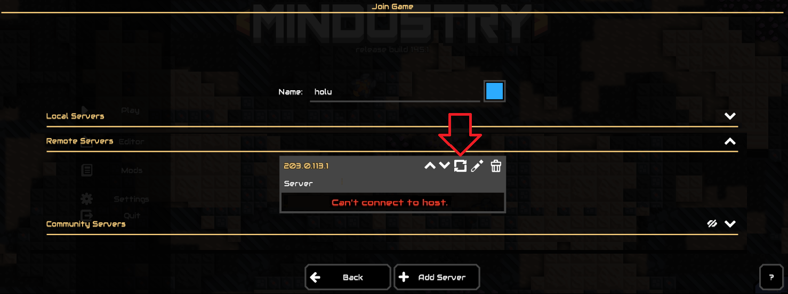
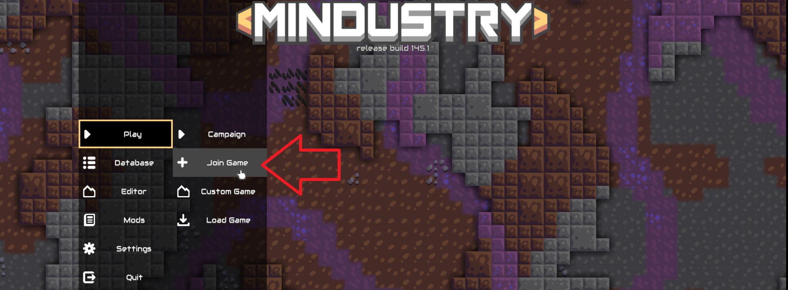
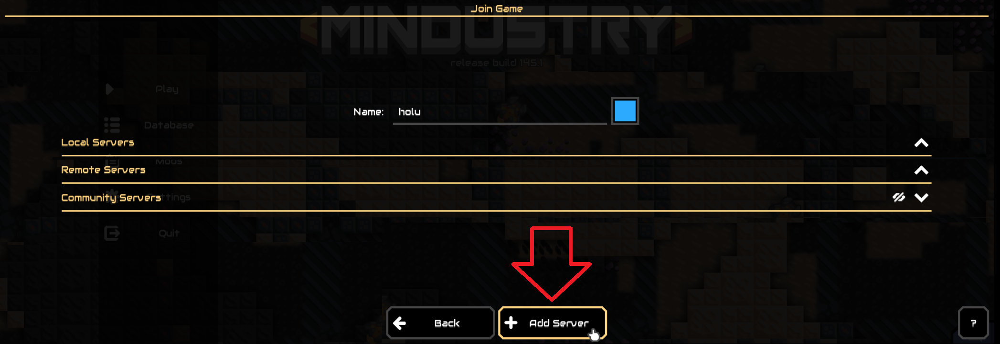
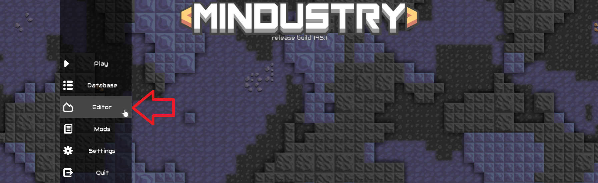
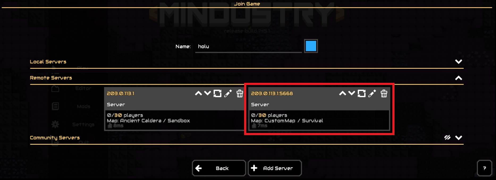

## Introduction

This tutorial explains how to host a Mindustry multiplayer game on a server with Ubuntu or Debian. It also shows how to keep the game running after closing the connection to the server, how to change the port, and how to start a game with a custom map.

**Playing Mindustry:**

Mindustry is played with the desktop release on the local device. When you open Mindustry, you can play a singleplayer game or a multiplayer game. Multiplayer games are usually hosted on separate servers and you can connect to them via their IP address or domain name.

When it comes to **self-hosting** a multiplayer game, Mindustry differentiates between "remote servers" and "local servers". This tutorial only covers the setting up of a "remote server".

Multiplayer Mindustry servers:

| Mindustry server | Mindustry server hosted on                  | Description                            |
| ---------------- | ------------------------------------------- | -------------------------------------- |
| Remote servers   | **remote server**<br>(managed via terminal) | Shared with players via **public** IP  |
| Local servers    | **local device**<br>*(in-game option)*      | Shared with players via **private** IP |

**Prerequisites**

* **One local device** » to connect to the game
* **One server** with Ubuntu/Debian » to host the game
  * You need access to the root user or a user with sudo permissions.
  * Before you start a game on the server, you should make at least some basic configuration, including a firewall. For more information, see:<br>[Initial Server Setup with Ubuntu](/tutorials/howto-initial-setup-ubuntu)

**Example terminology**

* `203.0.113.1` » Example public IP of the remote server
* `holu` » Example user on the remote server

Please replace `203.0.113.1` with your own IP address and `holu` with your username in all example commands.

## Step 1 - Setting up the local device

In order to play the game hosted on your remote server, you need to connect to it's IP address from your local device. If you would like to test your game alongside setting it up on the remote server, you should get your local device ready first.

This includes:

* [Installing Mindustry](#step-11---installing-mindustry-on-the-local-device) (desktop release)
* [Adding your remote server (IP) in the game](#step-12---adding-the-server-to-remote-servers)

### Step 1.1 - Installing Mindustry on the local device

If you haven't already, install the desktop release of Mindustry on your local device. Mindustry is available for free at:

* [GitHub](https://github.com/Anuken/Mindustry/releases)
  * `Mindustry.jar`
* [itch.io](https://anuke.itch.io/mindustry)
  * `[Operating System]Mindustry.zip`

>  Do not install `server-release.jar` / `[Server]Mindustry.zip`. This is for the **remote server**.

**Note:** To start Mindustry, you need to have [Java](https://www.java.com/) installed. 

<blockquote>

<details>

<summary>Click here for an example of how to install the desktop release of Mindustry via terminal on Ubuntu/Debian</summary>

* **Create a new directory and open it:**
  ```bash
  mkdir mindustry && cd mindustry
  ```

* **Install Java:**
  * Ubuntu
    ```bash
    apt update && apt install openjdk-21-jdk openjdk-21-jre
    ```
  * Debian
    ```bash
    apt update && apt install default-jdk default-jre
    ```

* **Go to the [Mindustry repository](https://github.com/Anuken/Mindustry/releases) on GitHub**, choose a version and copy the link to the desktop release `Mindustry.jar`. You can now use `wget` and the link to save the file on your server:
  ```bash
  wget https://github.com/Anuken/Mindustry/releases/download/v146/Mindustry.jar
  ```
  > If you want to use a different version, use the respective link.
  
* **Make the file executable:**
  ```bash
  chmod +x Mindustry.jar
  ```

* **Start Mindustry:**
  ```bash
  java -jar Mindustry.jar
  ```
  > Make sure to execute this command within the directory in which you saved the JAR file.

----------

</details>

</blockquote>

### Step 1.2 - Adding the server to "Remote Servers"

Even though you're not hosting a game yet, you can already add the IP address of the remote server in the Mindustry desktop release on your local device.

If you add the server now, you can simply use the refresh button (🔁) to check if Mindustry can build a connection after you made changes on your remote server such as starting your first game or other settings explained in the steps below.



#### To add your remote server, do the following:

* **Select `Play` » `+ Join Game`**
  

* **Select `+ Add Server`**<br>
  You can find `+ Add Server` at the very bottom of the screen.
  

* **Enter the IP address of your remote server**<br> 
  To double-check the IP address, you can run this command on your **remote server**:
  ```bash
  curl -4 https://ip.hetzner.com
  ```
  Enter the IP address and select `OK` to add your server.

You should now see your remote server with the note "Can't connect to host."

After completing any of the steps below, you can simply use the refresh button to check if your local device can connect to the remote server.

## Step 2 - Getting the server ready

For this step and for all following steps, you can connect to your remote server. As already mentioned in the "Prerequisites", please make sure you did at least some [basic configuration](/tutorials/howto-initial-setup-ubuntu) on your server, including a firewall.

To run Mindustry, you need Java installed on your remote server. When you start a game, it will automatically say `Opened a server on port 6567.`

For this reason, you need to:

* Enable port 6567
* Install Java

Once this is done, you can install Mindustry and start your first game.

### Step 2.1 - Enabling port 6567

If you have a firewall on your remote server, make sure it allows port 6567 TCP and UDP so that your local device can connect to the game on your remote server.

There are several different firewall tools. This tutorial covers:

* [`ufw`](#managing-ufw-firewall-rules) » Default firewall configuration tool for Ubuntu
* [Hetzner Cloud Firewall](#managing-hetzner-cloud-firewall-rules)

> If you're using a different firewall, make sure it allows **incoming traffic** to port 6567 TCP and UDP.

---------

#### Managing `ufw` firewall rules

* **View current firewall settings**<br>
  To check if the `ufw` firewall is active and if you already have any rules, you can use:
  ```bash
  sudo ufw status
  ```
  > Example output:
  > ```console
  > holu@remote-server:~# ufw status
  > Status: active
  > 
  > To                         Action      From
  > --                         ------      ----
  > OpenSSH                    ALLOW       Anywhere
  > OpenSSH (v6)               ALLOW       Anywhere (v6)
  > ```

* **Allow port 6567 TCP and UDP**<br>
  If the firewall is active, run these commands to allow incoming traffic to port 6567 TCP and UDP:  
  ```bash
  sudo ufw allow proto tcp to any port 6567
  sudo ufw allow proto udp to any port 6567
  ```

* **View new firewall settings**<br>
  The new rules should now be added. To check, use:
  ```bash
  sudo ufw status
  ```
  > Example output:
  > ```console
  > holu@remote-server:~# sudo ufw status
  > Status: active
  > 
  > To                         Action      From
  > --                         ------      ----
  > OpenSSH                    ALLOW       Anywhere
  > 6567/tcp                   ALLOW       Anywhere
  > 6567/udp                   ALLOW       Anywhere
  > OpenSSH (v6)               ALLOW       Anywhere (v6)
  > 6567/tcp (v6)              ALLOW       Anywhere (v6)
  > 6567/udp (v6)              ALLOW       Anywhere (v6)
  > ```

<details>

<summary>If you need to delete any rules, click here.</summary>

> To delete rules, you can use the following commands:
> ```bash
> sudo ufw status numbered   # List all rules with numbers
> sudo ufw delete <number>   # Delete a rule by specifying the number
> ```

</details>

---------

#### Managing Hetzner Cloud Firewall rules

This is only relevant if your remote server is a Hetzner Cloud server and you have a Hetzner Cloud Firewall applied to it. To edit your Firewall rules, open [Cloud Console](https://console.hetzner.cloud/projects) and select your Firewall. In the Firewall menu "Rules", add the following "inbound" rules:

| IPs                                     |Protocol| Port |Port range|
| --------------------------------------- | ------ | ---- | -------- |
| <kbd>Any IPv4</kbd> <kbd>Any IPv6</kbd> | TCP    | 6567 |          |
| <kbd>Any IPv4</kbd> <kbd>Any IPv6</kbd> | UDP    | 6567 |          |

### Step 2.2 - Installing Java

To start Mindustry, you need Java installed on your remote server. 

* Check if Java is already installed
  ```bash
  java --version
  ```
* Install Java
  * Ubuntu
    ```bash
    sudo apt update && sudo apt install openjdk-21-jdk openjdk-21-jre
    ```
  * Debian
    ```bash
    sudo apt update && sudo apt install default-jdk default-jre
    ```
  
  To check if the installation worked, you can use `java --version` again.

## Step 3 - Installing Mindustry

Now that the port is open and Java is installed, you can install Mindustry itself. The server release of Mindustry is available for free at:

* [GitHub](https://github.com/Anuken/Mindustry/releases)
  * `server-release.jar`
* [itch.io](https://anuke.itch.io/mindustry)
  * `[Server]Mindustry.zip`
  
> Do not install `Mindustry.jar` / `[Operating System]Mindustry.zip`. This is for the **local device**.

This tutorial explains how to install Mindustry via the GitHub files:

* **Create a new directory for the Mindustry files and open it:**
  ```bash
  mkdir mindustry && cd mindustry
  ```

* **Go to the [Mindustry repository](https://github.com/Anuken/Mindustry/releases) on GitHub**<br>
  Choose a version and copy the link to `server-release.jar`. You can now use `wget` and the copied link to save the file on your server:
  ```bash
  wget https://github.com/Anuken/Mindustry/releases/download/v146/server-release.jar
  ```
  > This will download `v146`. If you picked another version, replace the link with the link you just copied to your preferred version.
  
  Check if the file is now available on your server:
  ```bash
  ls -al
  ```

* **Make the file executable:**
  ```bash
  chmod +x server-release.jar
  ```

* **Start Mindustry**
  ```bash
  java -jar server-release.jar
  ```
  > Make sure to execute this command within the directory in which you saved the JAR file.

Your terminal should now look like this:

```console
holu@remote-server:~/mindustry# java -jar server-release.jar
[08-09-2024 09:59:09] [I] Server loaded. Type 'help' for help.

```

This is the Mindustry console where you can enter Mindustry commands.

You can now move on to the next step and start your first game!

## Step 4 - Starting the first game

You are already in the Mindustry console, all that's left is to enter the Mindustry command to start a game.

But first you need to pick a map and a mode.

* **Maps**<br>
  To check which maps are available, you can use the `maps` command:<br>
  * `maps custom` / `maps` » List custom maps<br>
  * `maps all` » List all maps<br>
  There aren't any custom maps yet, so for now, you should use `maps all`.
  
* **Mode**<br>
  If you don't specify a mode when you start a game, the default mode "survival" is automatically used.

To start your first game, use the `host` command:

```console
host <mapname> <mode>
```

Replace `<mapname>` with the map you picked and `<mode>` with any available mode.

> **Example:**
> 
> ```console
> holu@remote-server:~/mindustry# java -jar server-release.jar
> [08-09-2024 09:59:09] [I] Server loaded. Type 'help' for help.
> host Ancient_Caldera sandbox
> ```

<br>

<details>

<summary>Click here if you get a port error</summary>

<blockquote>

If you get an error like `Unable to host: Port 6567 already in use!`, you can use `lsof -i :6567` to check which process is using the port.
 
```console
holu@remote-server# lsof -i :6567
COMMAND  PID USER   FD   TYPE DEVICE SIZE/OFF NODE NAME
java    4303 holu   11u  IPv6  28025      0t0  TCP *:6567 (LISTEN)
java    4303 holu   12u  IPv6  28026      0t0  UDP *:6567
```
If the process is not important, you can use `kill -15` and the process ID (PID) to stop it. Example:
```bash
kill -15 <PID>
```

</blockquote>

</details>

The game should now be available and ready-to-play! 

---------

<br>

On your local device, open the desktop release of Mindustry and use the refresh button next to the IP address of your remote server.

* **If everything worked**, you should see the name of the map and the game mode, in this example "Ancient Caldera" and "Sandbox".
* **If you get a warning** such as "Can't connect to host", double check your firewall settings and make sure port 6567 TCP and UDP is allowed.

<br>

---------

On your remote server, you can enter `exit` to leave the Mindustry console. This will end the entire game. If you go back to the desktop release on your local device, it will probably say "Can't connect to host" again. The same will happen if you end the connection to your remote server.

If you would like to have your game up and running 24/7, you can use the workaround explained in "Step 5".

## Step 5 - Starting a screen session

At the moment, the game will automatically end as soon as you close the connection to your remote server. One way to keep the game running is to use the `screen` tool. **Screen** allows you to start separate virtual terminal sessions in one remote terminal session.

When you end your remote terminal session, the virtual terminal session (screen session) will stay open. When you start a new remote terminal session, you will see that the screen session is still there.

<details>

<summary>Install screen</summary>

If you don't have screen installed yet, you can install it now with:

```bash
sudo apt update && sudo apt install screen -y
```

---------

</details>

To start a Mindustry game in a screen session on your remote server, do the following:

* **Start the session**
  ```bash
  screen -S mindustry-screen
  ```
  > You can replace `mindustry-screen` with any other name for your screen.

* **Go to the Mindustry directory**<br>
  Open the directory in which you saved the server release JAR file of Mindustry. If you used the example path from "Step 3", you can open it with:
  ```bash
  cd ~/mindustry
  ```

* **Start Mindustry**
  ```bash
  java -jar server-release.jar
  ```

* **Start the game**<br>
  The command above should have opened the Mindustry console again. Just as before, you can now use the Mindustry command `host` to start the game:
  ```bash
  host <mapname> <mode>
  ```
  > Example: `host Ancient_Caldera sandbox`
  
  If you didn't end the previous Mindustry game properly with the `stop` or `exit` command, you might get an error regarding the port.

  <details> 

  <summary>Click here if you get an error</summary>

  <blockquote>

  If you get an error like `Unable to host: Port 6567 already in use!`, you can use `lsof -i :6567` to check which process is using the port.
  
  ```console
  holu@remote-server# lsof -i :6567
  COMMAND  PID USER   FD   TYPE DEVICE SIZE/OFF NODE NAME
  java    4303 holu   11u  IPv6  28025      0t0  TCP *:6567 (LISTEN)
  java    4303 holu   12u  IPv6  28026      0t0  UDP *:6567
  ```
  If the process is not important, you can use `kill -15` and the process ID (PID) to stop it. Example:
  ```bash
  kill -15 <PID>
  ```
  If this command does not work and you are **certain** that you don't need this process, you can use `kill -9` to force the stop:
  ```bash
  kill -9 <PID>
  ```

  </blockquote>

  </details>

The game should now be available and ready-to-play! 

---------

<br>

On your local device, open the desktop release of Mindustry and use the refresh button to see if it worked and if you can play the game.

<br>

---------

On your remote server, you can use the key combination `ctrl`+`A` followed by `D` to exit the screen session. This will not end the screen session and the game will continue to run. You can also end the remote terminal session if you want.

To go back to the Mindustry screen session or to make any other changes, you can use these commands:

* List all screens
  ```bash
  screen -list
  ```
  > The screen you just created should also be listed here.

* Go back to your running screen session
  ```bash
  screen -dr mindustry-screen
  ```
  > If you used a different name, replace `mindustry-screen` with your screen name.

* Delete the screen session<br>
  ```bash
  screen -X -S mindustry-screen quit
  ```
  > **Note:** This will end the Mindustry game and the screen session will no longer be available.

## Step 6 - Using a different port

By default, the Mindustry game is always started on port 6567. To start a game on a different port, follow the steps below. If you're currently in a Mindustry screen session that already hosts a Mindustry game, use `stop` to end the game or use the key combination `ctrl`+`A` followed by `D` to exit the screen session and create a new screen session.

* **Check which port is used**<br>
  To check which port is currently set, enter this in the Mindustry console:
  ```bash
  config port
  ```
  > **Example:**
  > ```bash
  > holu@remote-server:~/mindustry# java -jar server-release.jar
  > [08-07-2024 13:43:44] [I] Server loaded. Type 'help' for help.
  > config port
  > [08-07-2024 13:47:32] [I] 'port' is currently 6567.
  > ```

* **Change the port**<br>
  ```bash
  config port 5668
  ```
  > If you want to use another port, remove `5668` and enter your port.

* **Check if it worked**<br>
  Use the command from earlier to check if the port is now different:
  ```bash
  config port
  ```
  > **Example:**
  > ```bash
  > config port
  > [08-07-2024 13:48:14] [I] 'port' is currently 5668.
  > ```
* **Start a new game**<br>
  As usual, you can use the `host` command to start a game. 
  ```bash
  host <mapname> <mode>
  ```
  > Example: `host Ancient_Caldera sandbox`

* **Update your firewall**<br>
  If you have a firewall, make sure it allows the port you just set for the game, in this example port 5668. For `ufw` and Hetzner Cloud Firewall, you can follow the steps described in "[Step 2.1](#step-21---enabling-port-6567)".

* **Add the game**<br>
  On your local device, open the desktop release of Mindustry and add the game:
  * Go to `Play` » `+ Join Game`
  * Select `+ Add Server` at the very bottom of the screen
  * Enter the IP address of your remote server and specify the port (`<ip-address>:<port>`), e.g.:
    ```bash
    203.0.113.1:5668
    ```
    > Replace `203.0.113.1` with the IP address of your remote server and `5668` with the port of your game.

## Step 7 - Hosting a custom map

Now that you know how to start a Mindustry game, you can start playing your own custom maps. For this, you need to save your `.msav` map file on the remote server in the `config/maps` directory. You can find `config/maps` in the same directory as your `server-release.jar` file. In this tutorial, it is this example path:

```bash
~/mindustry/config/maps
```

> If you used a different path, change `~/mindustry` respectively.

* **Create a map file**<br>
  On your local device, open the desktop release of Mindustry. In the menu, select "Editor". 
  
  
  
  You can choose to either edit an existing map or create a completely new map. When you create a new map, remember to add a core.
  
  Once you are done with your custom map, use the menu icon at the top left of the editor screen to open the menu and select "Export File". Choose a location to save the file in.

* **Copy the map to the remote server**<br>
  Next, you need to copy the new map file from your local device to the remote server.

  The way you can do it depends on the OS of your local device.

  <details>

  <summary><b>SCP command</b><br>
  <ul><u>Suitable for:</u><br>
  - Linux<br>
  - Windows 10 and higher (PowerShell)
  </summary>

    --------

    On your local device, go to the directory in which you saved the map file and enter this command:
    ```bash
    scp custom-map.msav holu@203.0.113.1:~/mindustry/config/maps
    ```
    > Remember to replace:
    > * `custom-map.msav` with the file name you gave your map
    > * `holu` with your own username on the remote server
    > * `203.0.113.1` with the IP address of your remote server
    > * `~/mindustry` with the path you used

    --------

  </details>
  
  <br>
  
  <details>

  <summary><b>Via GitHub</b><br>
  <ul><u>Suitable for:</u><br>
  - Any OS (e.g. Windows 8)
  
  For this option, you need a GitHub account.</ul>

  </summary>

  --------

  * Save the file in your GitHub repo.
  * Connect to your remote server and go to the `config/maps` directory:
    ```bash
    ~/mindustry/config/maps
    ```
    > `config/maps` is in the same directory as your `server-release.jar` file. If you used a different path, change `~/mindustry` respectively.
  * Use `wget` and the link to the raw file of your map to save it on your remote server:
    ```bash
    wget https://github.com/user/repo/raw/main/custom-map.msav
    ```
  
  --------

  </details>

* **Check if the map is available for the game**<br>
  On your remote server, use the `maps` command in the Mindustry console to check if your map is available:
  ```bash
  holu@remote-server:~/mindustry# java -jar server-release.jar
  [08-07-2024 13:43:44] [I] Server loaded. Type 'help' for help.
  maps
  [08-07-2024 13:43:48] [I] Maps:
  [08-07-2024 13:43:48] [I]   CustomMap (custom-map.msav): Custom / 500x500
  [08-07-2024 13:43:48] [I] Map directory: /home/holu/mindustry/config/maps
  ```
  > With `maps`, you can list all **custom** maps. Default maps are not listed.

  If your map is **not** available, you can use `reloadmaps` to update the map list and try `maps` again afterwards. You should also make sure you used the correct path. The path is shown in the output of the `maps` command.
  
* **Start a game with your map**
  
  To start a new game, enter the name of your map:
  ```bash
  host CustomMap survival
  ```

On the local device, open the desktop version of Mindustry and use the refresh button to update the server information. It should now show the name of your map.



## Conclusion

In this tutorial, you learned how to set up a server to host a Mindustry game. You also learned how to create, save, and use a custom map. Next, you can share the IP address of your server with friends, so that you can start playing together. To set up some custom settings, you can use the `config` commands. In the `config/mods` directory, you can add mods.

<details>

<summary>Click here to view some of the main commands</summary>

| Command                 | Description                               |
| ----------------------- | ----------------------------------------- |
| `help`                  | List all commands with brief descriptions |
| `status`                | Show server status, e.g. `server closed`  |
| `host <mapname> <mode>` | Start a new Mindustry game                |
| `pause <on/off>`        | Pause or unpause the game                 |
| `stop`                  | End the game                              |
| `exit`          |Exit the Mindustry console. This will end the game.|
| `config <name> <value>` | Configure game settings                   |

</details>

For a full list of commands, enter `help` in the Mindustry console on your remote server or got to: [mindustrygame.github.io](https://mindustrygame.github.io/wiki/servers/#dedicated-server-commands)

##### License: MIT

<!--

Contributor's Certificate of Origin

By making a contribution to this project, I certify that:

(a) The contribution was created in whole or in part by me and I have
    the right to submit it under the license indicated in the file; or

(b) The contribution is based upon previous work that, to the best of my
    knowledge, is covered under an appropriate license and I have the
    right under that license to submit that work with modifications,
    whether created in whole or in part by me, under the same license
    (unless I am permitted to submit under a different license), as
    indicated in the file; or

(c) The contribution was provided directly to me by some other person
    who certified (a), (b) or (c) and I have not modified it.

(d) I understand and agree that this project and the contribution are
    public and that a record of the contribution (including all personal
    information I submit with it, including my sign-off) is maintained
    indefinitely and may be redistributed consistent with this project
    or the license(s) involved.

Signed-off-by: Svenja Michal

-->
