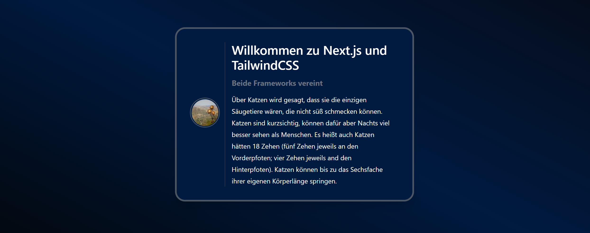

## Einleitung

Dieses Tutorial zeigt, wie man Next.js in Kombination mit TailwindCSS installiert, um ein Grund-Setup für unterschiedliche Frontend Projekte zu schaffen.

Next.js ist ein ReactJS-Frontend-Framework, das eine Vielzahl von nützlichen Funktionen bietet. Es kann nicht nur als Static Site Generator dienen, sondern verfügt auch über erweiterte Strategien zum Abrufen von Daten aus verschiedenen Quellen, um dynamische Inhalte anzuzeigen.

TailwindCSS ist ein CSS-Framework, welches einen Utility-First-Ansatz zur Anwendung von CSS-Klassennamen verfolgt. Dies bietet eine effiziente Möglichkeit, moderne Layouts und Designs zu erstellen, ohne sich zu sehr mit der Namensvergabe der CSS-Klassen zu beschäftigen.

**Voraussetzungen**

- System mit MacOS, Windows oder Linux
- Aktuellste Version von [Node.js](https://nodejs.org/en/download/package-manager/current) und npm installiert
  > Mit [brew](https://brew.sh/) installieren:
  > ```bash
  > brew install node@22
  > node -v &&  npm -v
  > ```

## Schritt 1 - Installation von Next.js

Next.js kann entweder automatisch oder manuell installiert werden.

* Automatisch:
  ```bash
  npx create-next-app my-project [--use-npm]
  ```

* Manuell:
  ```bash
  mkdir ~/my-project && cd ~/my-project
  npm install next react react-dom
  ```
  Nachdem Next.js installiert wurde, bearbeite `~/my-project/package.json` und ergänze den Abschnitt "scripts":
  ```json
  {
    "dependencies": {
      <your_dependencies>
    },
    "scripts": {
      "dev": "next dev",
      "build": "next build",
      "start": "next start",
      "lint": "next lint"
    }
  }
  ```

## Schritt 2 - Installation von TailwindCSS

TailwindCSS verwendet PostCSS als Präprozessor und Autoprefixer als zusätzliche Dependency. Dies ist optional, aber empfohlen, da Tailwind bei Verwendung dieser Plugins einige nette Features bietet, z.B. das Anwenden von nicht standardisierten Keywords wie `@apply`, `@theme` oder `theme()`, die anschließend in einer eigenen CSS-Datei verwendet werden können:

```bash
cd ~/my-project
npm install -D tailwindcss postcss autoprefixer
```

Im Anschluss daran können wir eine Konfigurationsdatei für TailwindCSS erstellen:

```bash
npx tailwindcss init -p
```

Dies erzeugt `tailwind.config.js` und `postcss.config.js`.

## Schritt 3 - Konfiguration von Next.js

Um Routen für unsere Anwendung zu definieren, können wir einfach zusätzliche JavaScript-Dateien in das Verzeichnis `app` einfügen. In diesem Tutorial werden wir uns auf Seiten konzentrieren, die nicht dynamisch generiert werden. In vielen Fällen ist es nämlich auch notwendig, Routen anhand von dynamischen Daten zu generieren, z. B. das Erstellen von Routen in Abhängigkeit von einer `id`. Eine ausgezeichnete Anleitung, wie dies möglich ist, ist in der [Next.js-Dokumentation](https://nextjs.org/docs/basic-features/pages) (das Menü sollte auf "Using App Router" gesetzt sein) zu finden.

### Seiten hinzufügen

Alle Seiten müssen in einem Unterordner names `app` hinzugefügt werden. In `app` gehören zwei Dateien:

| Datei                 | Beschreibung |
| --------------------- | ------------ |
| <kbd>app/layout.tsx</kbd> | Diese Datei enthält Informationen über das Layout, welches automatisch auf alle Seiten angewandt wird, einschließlich der Startseite und allen Unterseiten. |
| <kbd>app/page.tsx</kbd>   | Diese Datei enthält den Inhalt der Startseite. |

Zusätzlich können beliebig viele weitere Unterordner erstellt werden. Jeder Unterordner, der eine `page.tsx`-Datei enthält, wird in der Anwendung als Unterseite angezeigt.

In diesem Tutorial wird folgendes Beispiel verwendet:

```bash
app/
├── layout.tsx          # Layout für Startseite und alle Unterseiten
├── page.tsx            # Inhalt von Startseite
└── example-subpage/
    ├── layout.tsx      # Zusätzliche Layout-Anforderungen für example-subpage
    └── page.tsx        # Inhalt der Unterseite "example-subpage"
```

Dieses Beispiel erzeugt zwei Seiten:

```http
http://<ip-address>:3000                   # Startseite
http://<ip-address>:3000/example-subpage   # Unterseite
```

Wenn Next.js manuell installiert wurde, erstelle jetzt den Ordner für die Dateien:

```bash
mkdir ~/my-project/app
```

<br>

Jetzt kann der Inhalt für die Seiten hinzugefügt werden:

* **Startseite**
  
  ```bash
  nano ~/my-project/app/page.tsx
  ```

  Verwende diesen Inhalt für die Startseite:
  
  ```tsx
  // ~/my-project/app/page.tsx
  
  export default function Page() {
    return <h1 className="text-white text-3xl font-bold pl-5">Welcome to Next.js and TailwindCSS</h1>
  }
  ```

<br>

* **Unterseite**
  
  Erstelle einen neuen Unterordner für die Unterseite und füge `page.tsx` hinzu:
  
  ```bash
  mkdir ~/my-project/app/example-subpage
  nano ~/my-project/app/example-subpage/page.tsx
  ```

  Verwende diesen Inhalt für die Unterseite:
  
  ```javascript
  // ~/my-project/app/example-subpage/page.tsx
  
  export default function Page () {
    return (
      <>
      <div className="flex flex-col place-content-center items-center col-span-1 pr-3">
        <div className="border-2 rounded-full p-0.5 border-gray-600 mb-2">
          
        </div>
      </div>
      <div className="col-span-5 pr-3">
        <h2 className="text-white text-3xl font-semibold pl-4 mb-3">Willkommen zu Next.js und TailwindCSS</h2>
        <span className="text-gray-500 text-lg font-bold block pl-4 mb-3">Beide Frameworks vereint</span>
        <p className="text-white pl-4 leading-7">
          Über Katzen wird gesagt, dass sie die einzigen Säugetiere wären, die nicht süß schmecken können. Katzen sind kurzsichtig,
          können dafür aber Nachts viel besser sehen als Menschen. Es heißt auch Katzen hätten 18 Zehen (fünf Zehen jeweils an den
          Vorderpfoten; vier Zehen jeweils and den Hinterpfoten). Katzen können bis zu das Sechsfache ihrer eigenen Körperlänge springen.
        </p>
      </div>
      </>
   )
  }
  ```

### Layout hinzufügen (TailwindCSS)

Jetzt da der Inhalt der Seiten steht, kann das Layout hinzugefügt werden, in dem die Seiten angezeigt werden sollen.

* **Allgemeines Layout für die Startseite und alle Unterseiten**
  
  Wie zuvor bereits erwähnt, wird das Layout in `app/layout.js` automatisch auf die Startseite und auf alle Unterseiten angewendet.

  Wähle eine dieser beiden Alternativen, um TailwindCSS zu ergänzen:
  
  * **Alternative 1:** Mit Javascript
    
    Dies ist eine bequeme Möglichkeit, TailwindCSS hinzuzufügen, ohne weitere Stylesheets selbst schreiben zu müssen.
    
    ```bash
    nano ~/my-project/app/layout.tsx
    ```    
    Verwende diesen Inhalt:
    ```javascript
    // ~/my-project/app/layout.tsx
    
    import 'tailwindcss/tailwind.css'
    
    export default function RootLayout({
      children,
    }: {
      children: React.ReactNode
    }) {
      return (
        <>
        <html lang="en">
          <head>
            <title>Next.js and TailwindCSS</title>
            <link rel="icon" href="/favicon.ico"/>
          </head>
          <body className="min-h-screen bg-gradient-to-tr from-midnight-100 via-midnight-200 to-midnight-300 flex flex-col justify-center">{children}</body>
        </html>
        </>
      )
    }
    ```
    
    <br>

  * **Alternative 2:** Via CSS
    
    Eine andere Möglichkeit ist, die Style-Definitionen von Tailwind per CSS hinzuzufügen. Um dies zu erreichen, importieren wir einfach das globale Stylesheet in die Datei `app/layout.tsx`.
    
    Erstelle `app/layout.tsx`:
    ```bash
    nano ~/my-project/app/layout.tsx
    ``` 
    Verwende diesen Inhalt:
    ```javascript
    // ~/my-project/app/layout.tsx
    import './globals.css'
    
    export default function RootLayout({
      children,
    }: {
      children: React.ReactNode
    }) {
      return (
        <>
        <html lang="en">
          <head>
            <title>Next.js and TailwindCSS</title>
            <link rel="icon" href="/favicon.ico"/>
          </head>
          <body className="min-h-screen bg-gradient-to-tr from-midnight-100 via-midnight-200 to-midnight-300 flex flex-col justify-center">{children}</body>
        </html>
        </>
      )
    }
    ```

    Erstelle das globale Stylesheet `app/global.css`:
    
    ```css
    /* ~/my-project/app/globals.css */
    @tailwind base;
    @tailwind components;
    @tailwind utilities;
    ```
    
    Leider bietet Tailwind keine ausführliche Erklärung, was die Direktive `@tailwind` im Detail bewirkt, außer dass generierte Klassen (basierend auf der Konfiguration von Tailwind) zur Build-Zeit in das Stylesheet inkludiert werden.

<br><br>

* **Individuelle Layouts für Unterseiten**
  
  Jede Unterseite besitzt eine eigene Layout-Datei. Zusätzliche Layout-Regeln können entweder direkt in der Layout-Datei der Unterseite hinzugefügt werden, oder in einem seperaten Layout-Ordner von dem dieses in die Layout-Datei der Unterseite importiert werden kann. Wenn man zusätzliche Layout-Regeln in einem seperaten Ordner speichert, ist es leichter dieselben Regeln für verschiedene Unterseiten wiederzuverwenden. Diese Option ist also dann sinnvoll, wenn man ein Layout mehrmals verwenden möchte.

  Erstelle einen Ordner für zusätzliche Layouts:

  ```bash
  mkdir ~/my-project/components
  ```
  
  Erstelle ein neues Layout:
  ```
  nano ~/my-project/components/FancyCard.js
  ```
  Füge folgenden Inhalt ein:
  ```javascript
  // ~/my-project/components/FancyCard.js
  'use client'
  
  import React from 'react'
  
  const FancyCard = ({ children }) => {
    return (
      <div className="max-w-xl mx-auto">
        <div className="p-8 bg-midnight-200 shadow-xl rounded-3xl border-4 border-gray-600">
          <div className="grid grid-cols-6 gap-0 divide-x divide-gray-600">
            {children}
          </div>
        </div>
      </div>
    )
  }
  
  export default FancyCard
  ```

  Erstelle jetzt die `layout.tsx`-Datei für die Unterseite und importiere das eben erstellte Layout.
  ```bash
  nano ~/my-project/app/example-subpage/layout.tsx
  ```
  ```tsx
  // ~/my-project/app/example-subpage/layout.tsx
  
  import FancyCard from '../../components/FancyCard'
  
  export default function Layout({ children }) {
    return <FancyCard>{children}</FancyCard>
  }
  ```
  
  Wie zuvor bereits erwähnt, können in `components` noch weitere Layout hinzugefügt werden. Anschließend müssen diese wie hier gezeigt in die `layout.tsx`-Datei der Unterseite importiert werden. Wenn ein Layout nur auf einer Unterseite benötigt wird, kann dieses auch direkt in `layout.tsx` dieser Unterseite hinzugefügt werden.

## Schritt 4 - Konfiguration von TailwindCSS

Im letzten Schritt können die Konfigurationsdateien für Tailwind und PostCSS personalisiert werden.

Durch das Ausführen von `npx tailwindcss init -p` haben wir bereits zwei Konfigurationsdateien erstellt:

* `tailwind.config.js`
* `postcss.config.js`

Wenn wir PostCSS als Präprozessor verwenden wollen, können wir die Datei `postcss.config.js` für zusätzliche Funktionen verwenden. Wie etwa das Hinzufügen von Vendor-Präfixen, das Hinzufügen von globalen CSS Resets oder das Generieren von`@font-face`-Regeln.

Ein weiteres nützliches Feature von TailwindCSS ist, dass das mitgelieferte Standard-Theme leicht an unsere Anforderungen angepasst werden kann. Durch Ändern der Eigenschaft `theme` in der `tailwind.config.js` können wir z.B. eigene Breakpoints, Farben, Schriftarten oder detailliertere Eigenschaften, wie Abstände, Border-Radien oder Box-Shadows definieren. Durch Ändern des Keys `colors` ist es möglich, eine eigene Farbpalette zum bestehenden Theme hinzuzufügen:

```bash
nano ~/my-project/tailwind.config.js
```
Füge folgenden Inhalt ein:
```javascript
// ~/my-project/tailwind.config.js
const defaultTheme = require('tailwindcss/defaultTheme')

module.exports = {
  content: [
    './app/**/*.{js,ts,jsx,tsx,mdx}',
    './components/**/*.{js,ts,jsx,tsx,mdx}',
  ],
  theme: {
    colors: {
      ...defaultTheme.colors,
      'white': '#ffffff',
      'black': '#242424',
      'midnight': {
        '100': '#03060a',
        '200': '#001a40',
        '300': '#060b17',
        // add more color variants if you want to
        },
      'gray': {
        '500': '#6b7280',
        '600': '#4b5563',
        },
      'purple': {
        '500': '#6d28d9',
        },
      // add more colors if you want to
    },
  },
  plugins: [],
}
```

Zusätzlich verwenden wir eine Spread-Operation auf das Standard-Farbschema von Tailwind, so dass wir immer noch in der Lage sind Tailwinds Standard-Farbpalette zu verwenden. Nun können wir unsere Farben auf mehrere Utility-Klassen anwenden, indem wir unsere eben definierte Farbe und die entsprechende Variante kombinieren, `bg-{color}-{variant}`. Beispiel:

```javascript
<div className="bg-midnight-300">
  ...
</div>
```

## Schritt 5 - Anwendung starten

Jetzt da alle Seiten fertig eingerichtet sind, können wir die Anwendung starten, um unser Ergebnis zu betrachten:

* Über die private IP (localhost):
  ```bash
  npm run dev
  ```

* Über die öffentliche IP:
  ```bash
  npm run dev -- -H 0.0.0.0
  ```

Öffne beide Seiten in einem Webbrowser:

```http
http://<ip-address>:3000
http://<ip-address>:3000/example-subpage
```

Dies sollte wie folgt aussehen:



## Ergebnis

Wir haben erfolgreich eine Next.js-Anwendung aufgesetzt, die Tailwind als CSS-Framework nutzt.

Die Verwendung von Utility-First-CSS-Frameworks erzeugt eine große Bandbreite an Meinungen und wie üblich gibt es kein universelles Urteil, ob dies nun gut oder schlecht ist. Manche sagen, dass es unübersichtlich und schwer zu lesen ist, dass es keinen Unterschied zu Inline-Styles gibt oder dass es gegen "Separation of concerns" verstößt. Ich persönlich denke, dass alle diese Punkte widerlegt werden können und empfehle die folgenden beiden Artikel, um einen Eindruck von beiden Seiten zu bekommen. Auch fällt die Entscheidung vielleicht etwas leichter, ob TailwindCSS das richtige Framework für das nächste Projekt sein kann.

- [TailwindCSS: Adds complexity, does nothing. by Brian Boyoko (Englisch)](https://dev.to/brianboyko/tailwindcss-adds-complexity-does-nothing-3hpn)
- [In Defense of Utility-First CSS by Sarah Dayan (Englisch)](https://frontstuff.io/in-defense-of-utility-first-css)

##### License: MIT

<!--

Contributor's Certificate of Origin

By making a contribution to this project, I certify that:

(a) The contribution was created in whole or in part by me and I have
    the right to submit it under the license indicated in the file; or

(b) The contribution is based upon previous work that, to the best of my
    knowledge, is covered under an appropriate license and I have the
    right under that license to submit that work with modifications,
    whether created in whole or in part by me, under the same license
    (unless I am permitted to submit under a different license), as
    indicated in the file; or

(c) The contribution was provided directly to me by some other person
    who certified (a), (b) or (c) and I have not modified it.

(d) I understand and agree that this project and the contribution are
    public and that a record of the contribution (including all personal
    information I submit with it, including my sign-off) is maintained
    indefinitely and may be redistributed consistent with this project
    or the license(s) involved.

Signed-off-by: Fabian Huth, f.huth@headtrip.eu

-->
