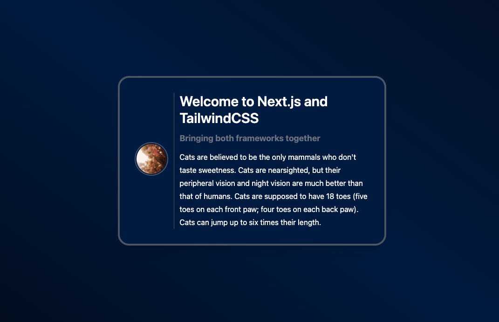

## Introduction

This tutorial shows how to install Next.js in combination with TailwindCSS to create a basic setup for various frontend projects.

Next.js is a ReactJS frontend framework that provides a lot of useful features. It not only can serve as a static site generator, but also has advanced strategies to fetch data from different sources to display dynamic content.

TailwindCSS is a CSS framework that adopts a utility-first approach to apply CSS class names. This provides an efficient way to create modern layouts & designs without creating to much hassle around naming conventions.

**Prerequisites**

- Node.js 12.13.0 or later
- npm 6.12 or higher
- MacOS, Windows or Linux

## Step 1 - Install Next.js

To automatically setup Next.js we can use:

`npx create-next-app my-project [--use-npm]`

If we want to install manually use:

`npm install next react react-dom`

If we chose to install manually, we need to add these scripts to our `package.json`:

```json
{
  "scripts": {
    "dev": "next dev",
    "build": "next build",
    "start": "next start"
  }
}
```

## Step 2 - Install TailwindCSS

TailwindCSS uses PostCSS as a preprocessor and autoprefixer as additional dependencies. This is optional but recommended, because Tailwind offers some nice features when using these plugins E.g. applying non-standard keywords like `@apply`, `@theme` or `theme()` that can then be used in our custom CSS file.

`npm install -D tailwindcss@latest postcss@latest autoprefixer@latest`

After that we can create a config file for TailwindCSS:

`npx tailwindcss init -p`

This will create a `tailwind.config.js` and a `postcss.config.js` file in our project root directory.

## Step 3 - Configure Next.js

To define routes for our application we can just add additional JavaScript files to the `pages` directory, that Next.js generates by default. In this tutorial we will focus on pages that are not dynamically generated. Because in a lot of cases it is also necessary to generate routes by dynamic data, e.g creating routes depending on an `id`. You can find an excellent guide on how to achieve this in the [Next.js documentation](https://nextjs.org/docs/basic-features/pages).

Next.js creates an `index.js` file per default in the the `pages` directory. We will re-use this file later and alter it's content, as Next.js adds some styles per default to this component we don't want to use:

```javascript
// ./pages/index.js

const Home = () => (
  <div className="p-4 shadow rounded bg-white">
    <h1 className="text-purple-500 leading-normal">Next.js and Tailwind CSS</h1>
    <p className="text-gray-500">with Tailwind CSS</p>
  </div>
)

export default Home
```

### Variant 1: Adding TailwindCSS via Javascript

To include Tailwind CSS in our project, we're adding the following import statement at the start of the `pages/_app.js`
file and will remove all references to Next's default styles:

```javascript
// ./pages/_app.js

import 'tailwindcss/tailwind.css'

function MyApp ({ Component, pageProps }) {
  return <Component {...pageProps} />
}

export default MyApp
```

This is a convenient way of adding TailwindCSS without having to write any other stylesheet.

### Variant 2: Adding TailwindCSS via CSS

Another possibility is to add Tailwind's styles by CSS. To achieve this, we will keep the global stylesheet in
the `_app.js` file

```javascript
 // ./pages/_app.js
import '../styles/globals.css'

function MyApp ({ Component, pageProps }) {
  return <Component {...pageProps} />
}

export default MyApp
```

and apply Tailwind by adding the directives in the `global.css` file:

```css
/* ./styles/globals.css */
@tailwind base;
@tailwind components;
@tailwind utilities;
```

Unfortunately Tailwind does not offer an in-depth explanation of what the `@tailwind` directive does in detail, other than injecting generated styles (based on the configuration of Tailwind) into the stylesheet at build-time.

## Step 4 - Configure TailwindCSS

The next step is to create the configuration files for Tailwind and PostCSS.

`
npx tailwindcss init
`

By running `npx tailwindcss init -p` we have already created two configuration files, `tailwind.config.js` and `postcss.config.js`. If we want to use PostCSS as preprocessor we can use the `postcss.config.js` for additional functions, like adding vendor prefixes, adding global CSS reset or generating `@font-face` rules. The way Tailwind creates utility-classes it would leave us with a huge CSS file when building the application without any further action. To prevent this we will tree-shake our CSS file. In short this means we're removing classes we do not use in our React components from our CSS file. To achieve this change your `tailwind.config.js` to this:

```javascript
// ./tailwind.config.js
module.exports = {
  purge: ['./pages/**/*.{js,ts,jsx,tsx}', './components/**/*.{js,ts,jsx,tsx}'],
  darkMode: false, // or 'media' or 'class'
  theme: {
    extend: {},
  },
  variants: {
    extend: {},
  },
  plugins: [],
}
```

Another great feature in TailwindCSS is that the default theme that is provided can be easily customized to our needs. By changing the `theme` property in the `tailwind.config.js` we can customize, e.g. custom breakpoints, colors, fonts or more detailed characteristics, like spacings, border radiuses or box shadows. By changing the `colors` key it is possible to add our own custom color palette to the existing theme:

```javascript
// ./tailwind.config.js
const defaultTheme = require('tailwindcss/defaultTheme')

module.exports = {
  theme: {
    colors: {
      ...defaultTheme.colors,
      black: '#242424',
      midnight: {
        100: '#03060a',
        200: '#001a40',
        300: '#060b17',
        // add more color variants if you want to
      }
      // ...
    }
  }
}
```

Additionally, we're spreading the default color schema, so we're still able to use Tailwind's default color palette. Note that we can now apply our colors on multiple utility classes by using the defined color and the corresponding variant, `bg-{color}-{variant}`. E.g.:

```javascript
<div className="bg-midnight-300">
  ...
</div>
```

## Step 5 - Create components and apply styling

Often we want to create a basic layout that we can reuse throughout your entire application. Therefore, we're creating a layout component that functions as a wrapper for other components. We're creating a `layout.js` file in `/components`:

```javascript
// ./components/layout.js

import Head from 'next/head'

const Layout = ({ children }) => {
  return (
    <>
      <Head>
        <title>Next.js and TailwindCSS</title>
        <link rel="icon" href="/favicon.ico"/>
      </Head>
      <main
        className="min-h-screen bg-gradient-to-tr from-midnight-100 via-midnight-200 to-midnight-300 flex flex-col justify-center">
        {children}
      </main>
    </>
  )
}

export default Layout
```

And wrap the application with the component:

```javascript
// ./pages/_app.js

// ...
import Layout from './components/layout'

function MyApp ({ Component, pageProps }) {
  return (
    <Layout>
      <Component {...pageProps} />
    </Layout>
  )
}

//... 
```

Additionally, we want to create a component that we want to display on our start page. To achieve this, we are creating another file named `FancyCard.js`:

```javascript
// ./components/FancyCard.js

import React from 'react'

const FancyCard = ({ children }) => {
  return (
    <div className="max-w-xl mx-auto">
      <div className="p-8 bg-midnight-200 shadow-xl rounded-3xl border-4 border-gray-600">
        <div className="grid grid-cols-6 gap-0 divide-x divide-gray-600">
          {children}
        </div>
      </div>
    </div>
  )
}

export default FancyCard
```

After that we're replacing the output of the `index.js` with our newly created component:

```javascript
// ./pages/index.js

import FancyCard from '../components/FancyCard'

export default function Home () {
  return (
    <FancyCard>
      <div className="flex flex-col place-content-center items-center col-span-1 pr-3">
        <div className="border-2 rounded-full p-0.5 border-gray-600 mb-2">
          
        </div>
      </div>
      <div className="col-span-5 pl-3">
        <h2 className="text-white text-3xl font-semibold mb-3">Welcome to Next.js and TailwindCSS</h2>
        <span className="text-gray-500 text-lg font-bold block mb-3">Bringing both frameworks together</span>
        <p className="text-white leading-7">
          Cats are believed to be the only mammals who don't taste sweetness. Cats are nearsighted, but their peripheral
          vision and night vision are much better than that of humans. Cats are supposed to have 18 toes (five toes on
          each front paw; four toes on each back paw). Cats can jump up to six times their length.
        </p>
      </div>
    </FancyCard>
  )
}
```

Now we can run `npm run dev`  to view our result. This should look like the following:



## Conclusion

We successfully set up a Next.js application that uses Tailwind as a CSS framework.

The usage of utility-first CSS frameworks creates a lot of variance in opinion and as usual there is no universal verdict. Some say that it's messy and hard to read, that there's no difference to inline-styles or that it violates separation of concerns. I personally think that all these points can be contradicted and recommend the following two articles to get an impression from both sides. This way you get a feeling if it is the right framework for your next project.

- [TailwindCSS: Adds complexity, does nothing. by Brian Boyoko](https://dev.to/brianboyko/tailwindcss-adds-complexity-does-nothing-3hpn)
- [In Defense of Utility-First CSS by Sarah Dayan](https://frontstuff.io/in-defense-of-utility-first-css)

##### License: MIT

<!--

Contributor's Certificate of Origin

By making a contribution to this project, I certify that:

(a) The contribution was created in whole or in part by me and I have
    the right to submit it under the license indicated in the file; or

(b) The contribution is based upon previous work that, to the best of my
    knowledge, is covered under an appropriate license and I have the
    right under that license to submit that work with modifications,
    whether created in whole or in part by me, under the same license
    (unless I am permitted to submit under a different license), as
    indicated in the file; or

(c) The contribution was provided directly to me by some other person
    who certified (a), (b) or (c) and I have not modified it.

(d) I understand and agree that this project and the contribution are
    public and that a record of the contribution (including all personal
    information I submit with it, including my sign-off) is maintained
    indefinitely and may be redistributed consistent with this project
    or the license(s) involved.

Signed-off-by: Fabian Huth, f.huth@headtrip.eu

-->
