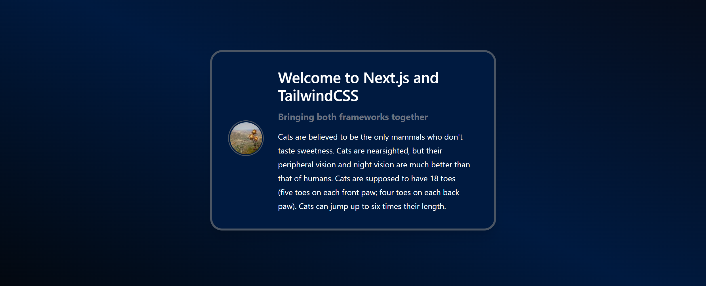

## Introduction

This tutorial shows how to install Next.js in combination with TailwindCSS to create a basic setup for various frontend projects.

Next.js is a ReactJS frontend framework that provides a lot of useful features. It not only can serve as a static site generator, but also has advanced strategies to fetch data from different sources to display dynamic content.

TailwindCSS is a CSS framework that adopts a utility-first approach to apply CSS class names. This provides an efficient way to create modern layouts & designs without creating to much hassle around naming conventions.

**Prerequisites**

- System with MacOS, Windows or Linux
- Latest version of [Node.js](https://nodejs.org/en/download/package-manager/current) and npm installed
  > You can install them with [brew](https://brew.sh/):
  > ```bash
  > brew install node@22
  > node -v &&  npm -v
  > ```

## Step 1 - Install Next.js

You can install Next.js either automatically or manually.

* Automatically:
  ```bash
  npx create-next-app my-project [--use-npm]
  ```

* Manually:
  ```bash
  mkdir ~/my-project && cd ~/my-project
  npm install next react react-dom
  ```
  After you installed Next.js, edit the new file `~/my-project/package.json` and add the section "scripts" as shown here:
  ```json
  {
    "dependencies": {
      <your_dependencies>
    },
    "scripts": {
      "dev": "next dev",
      "build": "next build",
      "start": "next start",
      "lint": "next lint"
    }
  }
  ```

## Step 2 - Install TailwindCSS

TailwindCSS uses PostCSS as a preprocessor and autoprefixer as additional dependencies. This is optional but recommended, because Tailwind offers some nice features when using these plugins, e.g. applying non-standard keywords like `@apply`, `@theme` or `theme()` that can then be used in our custom CSS file.

```bash
cd ~/my-project
npm install -D tailwindcss postcss autoprefixer
```

After that, we can create a config file for TailwindCSS:

```bash
npx tailwindcss init -p
```

This will create `tailwind.config.js` and `postcss.config.js`.

## Step 3 - Configure Next.js

To define routes for our application we can just add additional JavaScript files to the `app` directory. In this tutorial we will focus on pages that are not dynamically generated. Because in a lot of cases it is also necessary to generate routes by dynamic data, e.g creating routes depending on an `id`. You can find an excellent guide on how to achieve this in the [Next.js documentation](https://nextjs.org/docs/basic-features/pages) (make sure the menu is set to "Using App Router").

### Add Pages

To create pages, you need a subdirectory called `app`. Within `app`, you need two files:

| File                  | Description |
| --------------------- | ----------- |
| <kbd>app/layout.tsx</kbd> | This file contains information about the layout that is automacially applied to all pages including the main page and all subpages. |
| <kbd>app/page.tsx</kbd>   | This contains the content for the main page. |

Additionally, you can add as many subdirectories as you want. Each subdirectory with a `page.tsx` file, represents a subpage for your application.

In this tutorial, we will use the following example:

```bash
app/
├── layout.tsx          # layout of main page and all subpages
├── page.tsx            # content main page
└── example-subpage/
    ├── layout.tsx      # additional layout requirements for example-subpage
    └── page.tsx        # content example-subpage
```

This example will give us two pages:

```http
http://<ip-address>:3000                   # main page
http://<ip-address>:3000/example-subpage   # subpage
```

If you installed Next.js manually, create the directory for the application files:

```bash
mkdir ~/my-project/app
```

<br>

Now, you can add the content for your pages:

* **Main page**
  
  ```bash
  nano ~/my-project/app/page.tsx
  ```

  Use this content for the main page:
  
  ```tsx
  // ~/my-project/app/page.tsx
  
  export default function Page() {
    return <h1 className="text-white text-3xl font-bold pl-5">Welcome to Next.js and TailwindCSS</h1>
  }
  ```

<br>

* **Subpage**
  
  Add a new subdirectory for the subpage and create `page.tsx`:
  
  ```bash
  mkdir ~/my-project/app/example-subpage
  nano ~/my-project/app/example-subpage/page.tsx
  ```

  Use this content for the subpage:
  
  ```javascript
  // ~/my-project/app/example-subpage/page.tsx
  
  export default function Page () {
    return (
      <>
      <div className="flex flex-col place-content-center items-center col-span-1 pr-3">
        <div className="border-2 rounded-full p-0.5 border-gray-600 mb-2">
          
        </div>
      </div>
      <div className="col-span-5 pr-3">
        <h2 className="text-white text-3xl font-semibold pl-4 mb-3">Welcome to Next.js and TailwindCSS</h2>
        <span className="text-gray-500 text-lg font-bold block pl-4 mb-3">Bringing both frameworks together</span>
        <p className="text-white pl-4 leading-7">
          Cats are believed to be the only mammals who don't taste sweetness. Cats are nearsighted, but their peripheral
          vision and night vision are much better than that of humans. Cats are supposed to have 18 toes (five toes on
          each front paw; four toes on each back paw). Cats can jump up to six times their length.
        </p>
      </div>
      </>
   )
  }
  ```

### Add the layout (TailwindCSS)

Now that we have the content for our pages, we can add the layout in which the pages should be displayed.

* **General layout for main page and all subpages**
  
  As mentioned before, the layout defined in `app/layout.js` is automatically applied to the main page and all subpages.

  Choose one of those two alternatives to include TailwindCSS:
  
  * **Alternative 1:** Via Javascript
    
    This is a convenient way of adding TailwindCSS without having to write any other stylesheet.
    
    ```bash
    nano ~/my-project/app/layout.tsx
    ```    
    Use this content:
    ```javascript
    // ~/my-project/app/layout.tsx
    
    import 'tailwindcss/tailwind.css'
    
    export default function RootLayout({
      children,
    }: {
      children: React.ReactNode
    }) {
      return (
        <>
        <html lang="en">
          <head>
            <title>Next.js and TailwindCSS</title>
            <link rel="icon" href="/favicon.ico"/>
          </head>
          <body className="min-h-screen bg-gradient-to-tr from-midnight-100 via-midnight-200 to-midnight-300 flex flex-col justify-center">{children}</body>
        </html>
        </>
      )
    }
    ```
    
    <br>
    
  * **Alternative 2:** Via CSS
    
    Another possibility is to add Tailwind's styles by CSS. To achieve this, we will import the global stylesheet in the `app/layout.tsx` file.

    Create `app/layout.tsx`:
    ```bash
    nano ~/my-project/app/layout.tsx
    ``` 
    Use this content:
    ```javascript
    // ~/my-project/app/layout.tsx
    import './globals.css'
    
    export default function RootLayout({
      children,
    }: {
      children: React.ReactNode
    }) {
      return (
        <>
        <html lang="en">
          <head>
            <title>Next.js and TailwindCSS</title>
            <link rel="icon" href="/favicon.ico"/>
          </head>
          <body className="min-h-screen bg-gradient-to-tr from-midnight-100 via-midnight-200 to-midnight-300 flex flex-col justify-center">{children}</body>
        </html>
        </>
      )
    }
    ```

    Create the global stylesheet `app/global.css`:
    
    ```css
    /* ~/my-project/app/globals.css */
    @tailwind base;
    @tailwind components;
    @tailwind utilities;
    ```
    
    Unfortunately Tailwind does not offer an in-depth explanation of what the `@tailwind` directive does in detail, other than injecting generated styles (based on the configuration of Tailwind) into the stylesheet at build-time.

<br><br>

* **Custom layout for subpages**
  
  Each subpage has its own layout file. When you have additional layout requirements, you can either save them directly in the layout file of the subpage or save them in a dedicated directory and import this into the layout file of the subpage. Saving additional layout specifications in a dedicated directory makes it easier to reuse the layout on several different subpages. So this makes sense if you need the same layout for several different subpages.

  Create the directory for additional layouts:

  ```bash
  mkdir ~/my-project/components
  ```
  
  Create the additional layout:
  ```
  nano ~/my-project/components/FancyCard.js
  ```
  Add this content:
  ```javascript
  // ~/my-project/components/FancyCard.js
  'use client'
  
  import React from 'react'
  
  const FancyCard = ({ children }) => {
    return (
      <div className="max-w-xl mx-auto">
        <div className="p-8 bg-midnight-200 shadow-xl rounded-3xl border-4 border-gray-600">
          <div className="grid grid-cols-6 gap-0 divide-x divide-gray-600">
            {children}
          </div>
        </div>
      </div>
    )
  }
  
  export default FancyCard
  ```

  Now create the `layout.tsx` file for your subpage and apply the additional layout specifications:
  ```bash
  nano ~/my-project/app/example-subpage/layout.tsx
  ```
  ```tsx
  // ~/my-project/app/example-subpage/layout.tsx
  
  import FancyCard from '../../components/FancyCard'
  
  export default function Layout({ children }) {
    return <FancyCard>{children}</FancyCard>
  }
  ```
  
  As mentioned before, you can add more layouts in `components` as needed and import them as shown above in the `layout.tsx` file of any subpage that should use that particular layout. If you plan to use a layout only once, you can add it directly in the `layout.tsx` file of that subpage.

## Step 4 - Configure TailwindCSS

The final step is to customize the configuration files for Tailwind and PostCSS.

By running `npx tailwindcss init -p` we have already created two configuration files:

* `tailwind.config.js`
* `postcss.config.js`

If we want to use PostCSS as preprocessor, we can use the `postcss.config.js` for additional functions, like adding vendor prefixes, adding global CSS reset or generating `@font-face` rules.

Another great feature in TailwindCSS is that you can easily customize the default theme. By changing the `theme` property in the `tailwind.config.js`, we can customize, e.g. custom breakpoints, colors, fonts or more detailed characteristics, like spacings, border radiuses or box shadows. By changing the `colors` key, it is possible to add our own custom color palette to the existing theme:

```bash
nano ~/my-project/tailwind.config.js
```
Add the following content:
```javascript
// ~/my-project/tailwind.config.js
const defaultTheme = require('tailwindcss/defaultTheme')

module.exports = {
  content: [
    './app/**/*.{js,ts,jsx,tsx,mdx}',
    './components/**/*.{js,ts,jsx,tsx,mdx}',
  ],
  theme: {
    colors: {
      ...defaultTheme.colors,
      'white': '#ffffff',
      'black': '#242424',
      'midnight': {
        '100': '#03060a',
        '200': '#001a40',
        '300': '#060b17',
        // add more color variants if you want to
        },
      'gray': {
        '500': '#6b7280',
        '600': '#4b5563',
        },
      'purple': {
        '500': '#6d28d9',
        },
      // add more colors if you want to
    },
  },
  plugins: [],
}
```

Additionally, we're spreading the default color schema, so we're still able to use Tailwind's default color palette. Note that we can now apply our colors on multiple utility classes by using the defined color and the corresponding variant, `bg-{color}-{variant}`. E.g.:

```javascript
<div className="bg-midnight-300">
  ...
</div>
```

## Step 5 - Start the application

Now that everything is set, we can start the application to view our result:

* To access via private IP (localhost):
  ```bash
  npm run dev
  ```

* To access via public IP:
  ```bash
  npm run dev -- -H 0.0.0.0
  ```

Open both pages in a webbrowser:

```http
http://<ip-address>:3000
http://<ip-address>:3000/example-subpage
```

This should look like the following:



## Conclusion

We successfully set up a Next.js application that uses Tailwind as a CSS framework.

The usage of utility-first CSS frameworks creates a lot of variance in opinion and as usual there is no universal verdict. Some say that it's messy and hard to read, that there's no difference to inline-styles or that it violates separation of concerns. I personally think that all these points can be contradicted and recommend the following two articles to get an impression from both sides. This way you get a feeling if it is the right framework for your next project.

- [TailwindCSS: Adds complexity, does nothing. by Brian Boyoko](https://dev.to/brianboyko/tailwindcss-adds-complexity-does-nothing-3hpn)
- [In Defense of Utility-First CSS by Sarah Dayan](https://frontstuff.io/in-defense-of-utility-first-css)

##### License: MIT

<!--

Contributor's Certificate of Origin

By making a contribution to this project, I certify that:

(a) The contribution was created in whole or in part by me and I have
    the right to submit it under the license indicated in the file; or

(b) The contribution is based upon previous work that, to the best of my
    knowledge, is covered under an appropriate license and I have the
    right under that license to submit that work with modifications,
    whether created in whole or in part by me, under the same license
    (unless I am permitted to submit under a different license), as
    indicated in the file; or

(c) The contribution was provided directly to me by some other person
    who certified (a), (b) or (c) and I have not modified it.

(d) I understand and agree that this project and the contribution are
    public and that a record of the contribution (including all personal
    information I submit with it, including my sign-off) is maintained
    indefinitely and may be redistributed consistent with this project
    or the license(s) involved.

Signed-off-by: Fabian Huth, f.huth@headtrip.eu

-->
