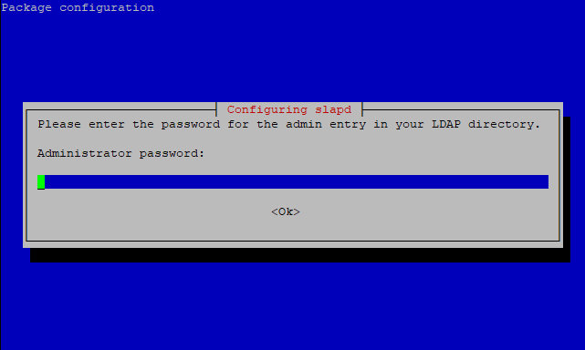
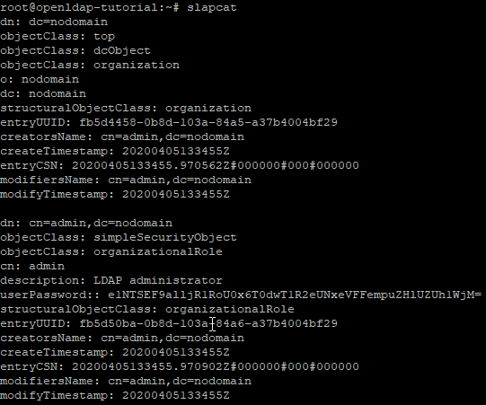
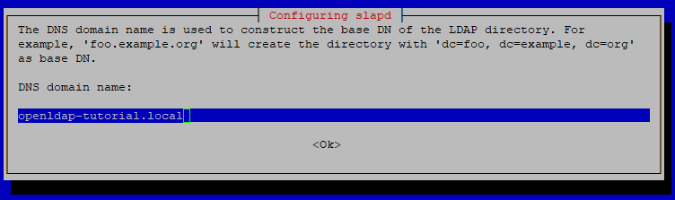
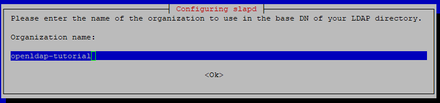
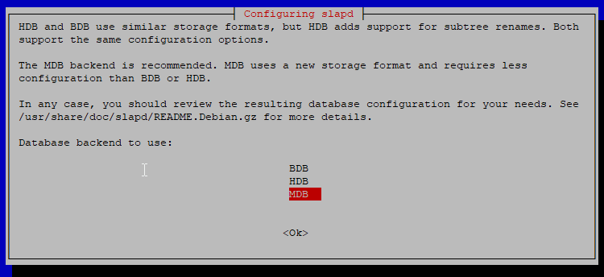
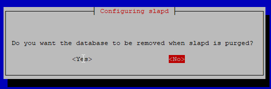
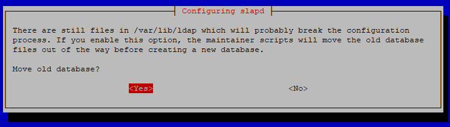
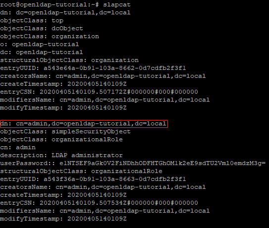

## Introduction

In this tutorial we cover how to install OpenLDAP server on Debian 10.
This tutorial should be more or less compatible with all Linux distros.

OpenLDAP is a Lightweight Directory Access Protocol (LDAP) server which can be used to authenticate users against a centralized authority server.

## Step 1 - Update all packages

First we want to make sure that our server is fully updated and upgraded. This can be achieved with:

 ```bash
 apt update && apt upgrade -y
 ```

## Step 2 - Install OpenLDAP package

OpenLDAP requires two packages to function:
slapd - LDAP standalone daemon
ldap-utils - Useful tools for local LDAP management

To install these packages type

```bash
apt install slapd ldap-utils -y
```

## Step 3 - Set password for slapd

After you have installed required packages an install prompt will appear:



Here you need to type your new LDAP admin password.
It's always recommended to use strong and complex passwords.

## Step 4 - Verify install of slapd

Now we can verify if the installation was successful:

```bash
slapcat
```

This command outputs current domain structure.



## Step 5 - Edit directory domain

You need edit ldap.conf to fit your needs.

```bash
nano /etc/ldap/ldap.conf
```

```
#
# LDAP Defaults
#

# See ldap.conf(5) for details
# This file should be world readable but not world writable.

#BASE    dc=example,dc=com
#URI     ldap://ldap.example.com ldap://ldap-master.example.com:666

#SIZELIMIT      12
#TIMELIMIT      15
#DEREF          never

# TLS certificates (needed for GnuTLS)
TLS_CACERT      /etc/ssl/certs/ca-certificates.crt
```

```
Uncomment:  

#BASE    dc=example,dc=com  
#URI     ldap://ldap.example.com ldap://ldap-master.example.com:666  

and modify BASE to fit your needs.
I'm using openldap-tutorial.local in my config.
```

```
# LDAP Defaults
#

# See ldap.conf(5) for details
# This file should be world readable but not world writable.

BASE    dc=openldap-tutorial,dc=local
URI     ldap://ldap.example.com ldap://ldap-master.example.com:666

#SIZELIMIT      12
#TIMELIMIT      15
#DEREF          never

# TLS certificates (needed for GnuTLS)
TLS_CACERT      /etc/ssl/certs/ca-certificates.crt
```

## Step 6 - Configure OpenLDAP

Now we can configure OpenLDAP:

```bash
dpkg-reconfigure slapd
```

Now enter same base name which you configured on previous step.



Then you need enter organization name:



Then enter your LDAP admin password configured on step 3.

When installer ask which database to use for backend, select MDB as it's most modern.



Select no when installer ask if database should be removed when slapd is purged.



Allow installer to move old database.



## Step 7 - Verify changed domain structure

```bash
slapcat
```

We can now notice that our distinguished name (dn) is changed.



## Conclusion

Now your OpenLDAP server is successfully configured and is ready to use. You can use shell or GUI to manage it.

A couple of good GUI options are:
phpLDAPadmin
Apache Directory Studio

##### License: MIT

<!--

Contributor's Certificate of Origin

By making a contribution to this project, I certify that:

(a) The contribution was created in whole or in part by me and I have
    the right to submit it under the license indicated in the file; or

(b) The contribution is based upon previous work that, to the best of my
    knowledge, is covered under an appropriate license and I have the
    right under that license to submit that work with modifications,
    whether created in whole or in part by me, under the same license
    (unless I am permitted to submit under a different license), as
    indicated in the file; or

(c) The contribution was provided directly to me by some other person
    who certified (a), (b) or (c) and I have not modified it.

(d) I understand and agree that this project and the contribution are
    public and that a record of the contribution (including all personal
    information I submit with it, including my sign-off) is maintained
    indefinitely and may be redistributed consistent with this project
    or the license(s) involved.

Signed-off-by: Matias Haapaniemi matias.haapaniemi@outlook.com

-->
