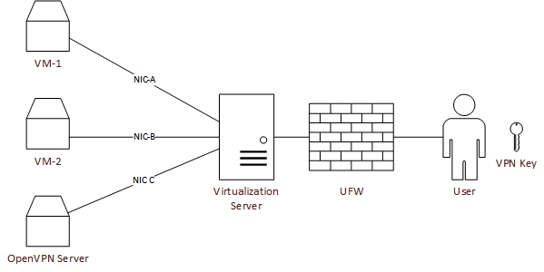
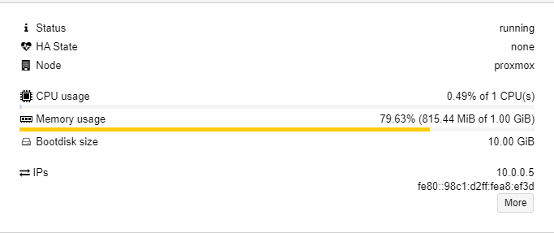
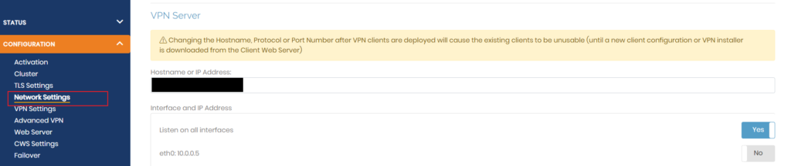
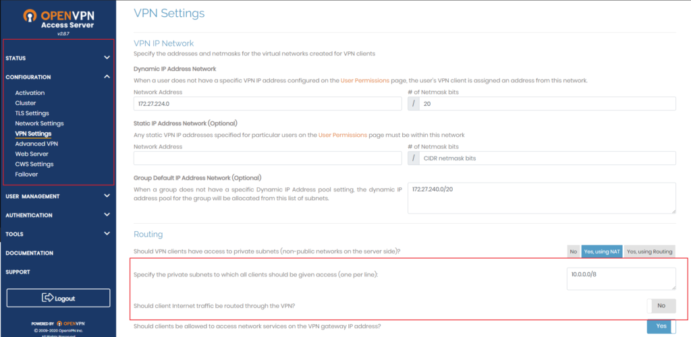
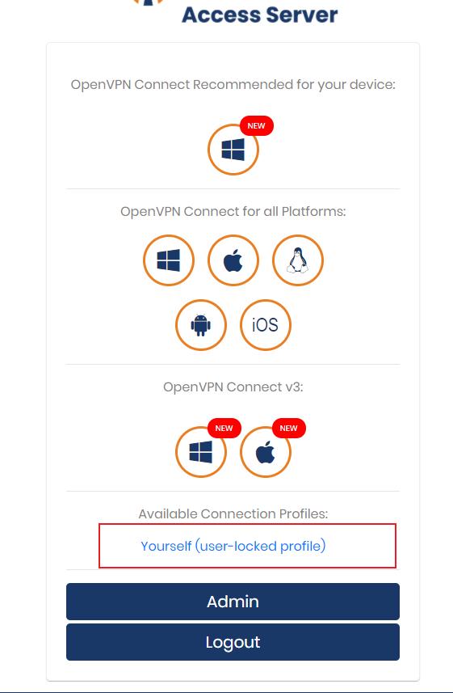

## Introduction

Having a personal lab to practice, deploy, and destroy stuff is an amazing experience. However, it is not a good feeling that the lab we have set up is goes to waste because we have not put security measures in place. Thus one of the things that one could do to ensure that only authorized people have access to the systems running in LAN is, setting up a VPN gateway.



So as shown in the diagram above, this is what my current setup looks like. I have an OpenVPN Server in one of the VMs, whose connection port is forwarded to the primary virtualization server to be available from the internet. I use OpenVPN client on my desktop to connect to this port and access the VPN connection. Now let's move on to the part where we set these things up.

## Step 1 - VM creation

Create a new VM in your virtualization software. Choose any OS of your preference. I will use a RHEL machine with 1 CPU and 1 GB Ram. 



As evident it barely uses 1 GB ram even after everything is set up.

## Step 2 - Installation

Once we have the target machine up and running, we will set up the OpenVPN server. As I am the only one who connects to this machine, I choose "OpenVPN Access Server" as my preferred solution. Its free license allows 2 concurrent sessions, which was more than enough for my use case.

To setup OpenVPN AS, follow the steps provided [here](https://openvpn.net/download-open-vpn/). Look for "Access Server Software packages" and follow the steps as defined for the operating system of your choice.

## Step 3 - Login

SSH into the OpenVPN machine and reset the password for the openvpn user. This step is necessary, otherwise you won't be able to login to the console.

```bash
$ sudo passwd openvpn
```

Now go to the OpenVPN server URL with a VM with UI (Windows machine or Linux with DE) i.e. `https://IP_ADDRESS:943/admin` and login with the `openvpn` account and the password set in the previous step.

## Step 4 - Routing

Let's set things up to ensure that we have access to the LAN, but all traffic from our machine doesn't go through the server.

First, go to the "Network Settings" under "Configuration" and change "Hostname or IP Address." The value in that textbox should be the public IP address of the virtualization server.



Next, we'll change the settings to access the LAN and disable our internet traffic traveling through this VPN.



We'll go to the VPN settings under the same configuration menu and put in the private IP address space we need access to. For me, it was `10.0.0.0/8`, yours could be different. Make sure that the "Should client Internet traffic be routed through the VPN?" switch is set to "NO". This will ensure that only our LAN access is routed, but the internet traffic goes through the normal gateway.

## Step 5 - Connection keys

Go to `https://IP_ADDRESS:943/`, log in with the OpenVPN credentials and download the `client.ovpn` file to your machine from which you want to connect to this VPN server. Ideally, it would be your personal desktop, but it can be any machine. Even a mobile phone.




## Step 6 - Port forwarding

Forward the LAN OpenVPN port to the virtualization server's public IP address. This can be done using `socat` and `tmux`.

Launch a new tmux session with "tmux". If not present, install tmux for your distro. In the tmux window, run the following port forwarding command.

```bash
$ sudo socat TCP-LISTEN:$$INTERNET_PORT_NUMBER$$,fork,reuseaddr TCP:$$OPENVPN_SERVER_IP$$:$$SERVER_PORT$$
```

The OpenVPN server port is 1194 by default but it can be reconfigured to any other port.

## Step 7 - Client connection

Once this setup is complete, use the previously downloaded OVPN file and the OpenVPN Connect Client, which can be downloaded from [here](https://openvpn.net/download-open-vpn/) to connect to the OpenVPN server.

## Conclusion

This completes the setup of the OpenVPN Access Server.

Note:  
If you have multiple NICs running different IP address ranges, attach them to the OpenVPN server. In my case, I have 5 NICs running on 10.X.0.0/24; thus, I attached all of them to the OpenVPN server to get access to all the machines.

If you have questions or need help setting things up, feel free to reach out to me [@jtnydv](https://twitter.com/jtnydv)


##### License: MIT

<!--

Contributor's Certificate of Origin

By making a contribution to this project, I certify that:

(a) The contribution was created in whole or in part by me and I have
    the right to submit it under the license indicated in the file; or

(b) The contribution is based upon previous work that, to the best of my
    knowledge, is covered under an appropriate license and I have the
    right under that license to submit that work with modifications,
    whether created in whole or in part by me, under the same license
    (unless I am permitted to submit under a different license), as
    indicated in the file; or

(c) The contribution was provided directly to me by some other person
    who certified (a), (b) or (c) and I have not modified it.

(d) I understand and agree that this project and the contribution are
    public and that a record of the contribution (including all personal
    information I submit with it, including my sign-off) is maintained
    indefinitely and may be redistributed consistent with this project
    or the license(s) involved.

Signed-off-by: Jatin Yadav <jtnydv@protonmail.com>

-->
