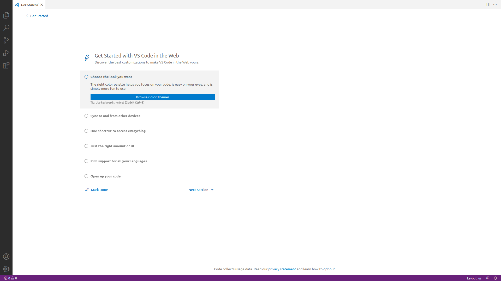

## Introduction

In this tutorial you will learn how to setup Visual Studio Code Server on a Hetzner instance, which will allow you to get a fresh IDE whenever, and in whatever device you would like to use it at.

**Prerequisites**

As of september 2022, VSCode Server is on private beta. In order to enroll, you will have to fill out [this form](https://aka.ms/vscode-server-signup).

You will need an x86 Ubuntu 22.04 server for completing this tutorial, however VSCode Server supports other architectures and OSs as described [here](https://code.visualstudio.com/docs/remote/linux.

## Step 1 - `Login to your server`

Login as the root user into your Ubuntu server:

```shell
ssh root@10.0.0.1
```

Or, if using an SSH key:

```shell
ssh -i /path/to/key root@10.0.0.1
```

## Step 2 - `Install VSCode Server`

Start by downloading the setup script:

```shell
wget -O- https://aka.ms/install-vscode-server/setup.sh | sh
```

Then, start the server:

```shell
code-server
```
Read and accept the ToS when asked.

At this point, you will see a message similar to:

```console
To grant access to the server, please log into https://github.com/login/device and use code A1B2-3C4D
```
Open the URL in a local browser, login into GitHub, and authorize GitHub for VS Code to access your information. Before attempting to login, ensure you are whitelisted for the beta as described in this tutorial's prerequisites.

Back into your server's terminal, choose a descriptive name for your server, or use the provided.

After choosing one, your server will create a tunnel to vscode.dev, which will allow you to connect to your IDE without requiring you to modify your inbound firewall rules.

Copy the provided URL, paste it into your preferred browser into any device (mobile included!) and you are finished! Congratulations!



## Conclusion

You have a remote development machine, with a prime editor in it. If you face any issue, please report it at their [repo](https://github.com/microsoft/vscode-remote-release/issues).

##### License: MIT

<!--

Contributor's Certificate of Origin

By making a contribution to this project, I certify that:

(a) The contribution was created in whole or in part by me and I have
    the right to submit it under the license indicated in the file; or

(b) The contribution is based upon previous work that, to the best of my
    knowledge, is covered under an appropriate license and I have the
    right under that license to submit that work with modifications,
    whether created in whole or in part by me, under the same license
    (unless I am permitted to submit under a different license), as
    indicated in the file; or

(c) The contribution was provided directly to me by some other person
    who certified (a), (b) or (c) and I have not modified it.

(d) I understand and agree that this project and the contribution are
    public and that a record of the contribution (including all personal
    information I submit with it, including my sign-off) is maintained
    indefinitely and may be redistributed consistent with this project
    or the license(s) involved.

Signed-off-by: [Hibot12 jpperezrocha@gmail.com]

-->
