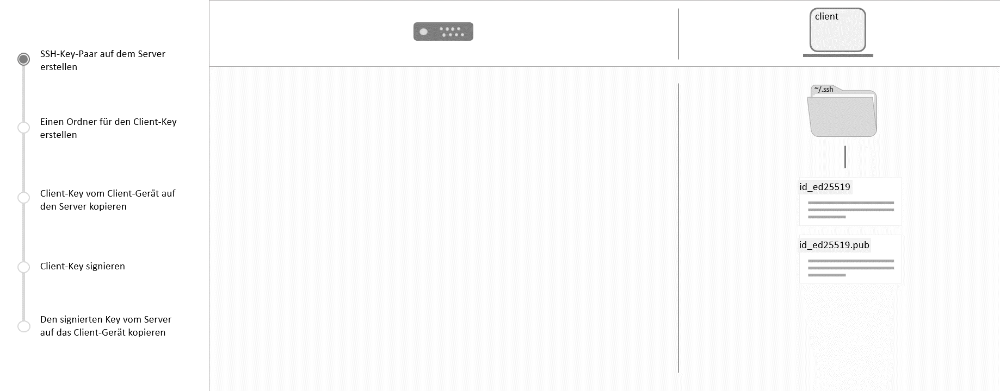

## Einleitung

In dem Tutorial "[SSH-Key einrichten](/tutorials/howto-ssh-key/de)" wird genau erklärt, wie man SSH-Keys in der `~/.ssh/authorized_keys`-Datei einrichtet.

In diesem Tutorial wird erklärt, wie man den SSH-Login weiter absichern kann, indem man den Client-Key über eine zentrale Zertifizierungsstelle (CA) prüfen lässt.
Damit ist es möglich sich auf den Server via SSH-Key zu verbinden, ohne diesen zuerst auf dem gewünschten Server in die `~/.ssh/authorized_keys`-Datei einzutragen.

Somit können die ausgestellten Zertifikate zeitlich begrenzt, oder vorzeitig ungültig gemacht werden.
Dieses Verfahren ist vor allem nützlich, wenn mehrere Benutzer viele Server betreuen.



In diesem Tutorial wird dies nur für einen Server durchgeführt.
Für größere Setups sollte ein passendes Namensschema für die Client-Keys/Zertifikate vorhanden sein.

Dieses Tutorial wurde mit Ubuntu 22.04 und OpenSSH 8.9 getestet.

**Voraussetzungen**

* Root-Zugriff auf den Server
* `sshd` auf dem Server installiert
* `ssh` client auf dem Client-Gerät installiert
* SSH-Key auf dem Client-Gerät
* `ssh-keygen` auf dem Client-Gerät und auf dem Server (im Grunde im `ssh` client enthalten)

**Beispiel-Benennungen**

* Client-Key: `id_ed25519` & `id_ed25519-cert.pub`
* CA-Key: `ca_user_key` & `ca_user_key.pub`

## Schritt 1 - CA erstellen

Dieser Schritt enthält zwei Unterschritte.
Beide Schritte müssen auf dem **Server** ausgeführt werden.

### Schritt 1.1 - Erstellung eines neuen Key-Paares

Für die Zertifizierungsstelle (CA) wird ein separates Key-Paar genutzt.
Mit diesem Key-Paar wird nur der öffentliche Client-Key signiert.

Neues Key-Paar erstellen:

```console
ssh-keygen -f ~/.ssh/ca_user_key -t ed25519
```

> Das Key-Paar wurde nun unter `~/.ssh/` hinzugefügt.

### Schritt 1.2 - SSH-Server-Einstellungen bearbeiten

Um die Standard `sshd` Konfiguration möglichst übersichtlich zu belassen, wird eine zusätzliche Konfiguration `/etc/ssh/sshd_config.d/certificate.conf` angelegt.
In diese Datei muss folgende Zeile hinzugefügt werden:

```text
TrustedUserCAKeys /root/.ssh/ca_user_key.pub
```

Zudem sollte `/etc/ssh/sshd_config.d` folgende Zeile enthalten:

```text
Include /etc/ssh/sshd_config.d/*.conf
```

### Schritt 1.3 - Neue Einstellungen anwenden

Sobald die `sshd`-Konfiguration geändert wurde, kann es mit diesem Befehl bestätigt werden:

```console
sshd -t
```

Wenn die Konfiguration keine Fehler enthält, wird kein Output angezeigt.
Ansonsten erscheint eine Fehlermeldung.

Die `sshd`-Konfiguration kann jetzt mit systemctl neu geladen werden:

```console
systemctl reload sshd
```

## Schritt 2 - Signierung des Client-Keys

Jetzt muss der öffentliche SSH-User-Key vom Client signiert werden.

In diesem Tutorial werden die Client-Keys auf dem **Server** im `~/.ssh/clients/`-Ordner gespeichert.
Erst muss der Ordner erstellt werden:

```console
mkdir -v ~/.ssh/clients/
```

Anschließend kann der Key vom Client in diesen Ordner kopiert werden.
Angenommen der Key wurde in der `~/.ssh/clients/id_ed25519.pub`-Datei gespeichert.

Um diesen Key zu signieren, kann folgender Befehl genutzt werden:

```console
ssh-keygen \
  -s ~/.ssh/ca_user_key \
  -I example_client \
  -n holu,root \
  -V +10h \
  ~/.ssh/clients/id_ed25519.pub
```

* `-s ~/.ssh/ca_user_key` — Der signierende CA-Key.
* `-I example_client` — Key-ID für das Client-Zertifikat.
* `-n holu,root` — Die Benutzernamen (mit Komma getrennte Liste), über die man sich vom Client aus mit dem Server verbinden kann.
* `-V +10h` — Gültigkeit des ausgestellten Zertifikats (optional). In diesem Beispiel sind es 10 Stunden ab jetzt.
* `~/.ssh/clients/id_ed25519.pub` — Pfad zum Key, der signiert werden soll.

Wenn dies erfolgreich war, ist das dazugehörige Zertifikat nun unter `~/.ssh/clients/id_ed25519-cert.pub` auffindbar.

## Schritt 3 - Einrichtung des Client-Zertifikats beim Client

Nun muss das im letzten Schritt erstellte Client-Zertifikat zum Client kopiert werden.

Im Tutorial befindet sich dies nun unter folgendem Pfad: `/home/client/.ssh/id_ed25519-cert.pub`

Gegebenenfalls ist es notwendig die Besitzrechte des Zertifikats anzupassen.
Dies kann mit folgendem Befehl geschehen:

```bash
chown -v client:client /home/client/.ssh/id_ed25519-cert.pub
```

Der Client kann sich jetzt mit dem Server verbinden:

```bash
ssh -l holu <server address>
```

## Schritt 4 - Zertifikate vorzeitig ungültig machen (optional)

Zertifikate können über die "Key Revocation List (KRL)"-Datei ungültig gemacht werden.

Um Zertifikate ungültig zu machen, muss eine `revoked_keys`-Datei erstellt und in der `sshd` Konfiguration des Servers eingetragen werden.

In diesem Tutorial wurde diese Datei im Verzeichnis `/etc/ssh/revoked_keys.d/` erstellt.
Ein Ordner und eine leere Datei können mit folgenden Befehlen erstellt werden:

```bash
mkdir -v /etc/ssh/revoked_keys.d
touch /etc/ssh/revoked_keys.d/revoked_keys
```

In der `/etc/ssh/sshd_config.d/ca.conf`-Datei muss folgende Zeile hinzugefügt werden:

```text
RevokedKeys /etc/ssh/revoked_keys.d/revoked_keys
```

**Die `sshd` Konfiguration sollte wie bereits in "[Schritt 1.3 - Neue Einstellungen anwenden](#schritt-13---neue-einstellungen-anwenden)" erneut getestet und neu geladen werden.**

Mit folgendem Befehl kann das **erste** ungültige Zertifikat in die KRL-Datei hinzugefügt werden:

```bash
ssh-keygen -k -f /etc/ssh/revoked_keys.d/revoked_keys ~/.ssh/clients/id_ed25519.pub
```

* `-k` — Teilt `ssh-keygen` mit, dass es im KRL-Dateiformat arbeitet.
* `-f <path>` — Pfad zur KRL-Datei.
* `<path>` — Öffentlicher Key, der ungültig werden soll.

Um **weitere** Zertifikate hinzuzufügen, muss man zusätzlich das `-u`-Argument angeben:

```bash
ssh-keygen -k -u -f /etc/ssh/revoked_keys.d/revoked_keys ~/.ssh/clients/id_ed25519.pub
```

## Fazit

Nun ist die Standardkonfiguration abgeschlossen und der Client kann sich mit dem erstellten Zertifikat und seinem SSH-Key am Server anmelden.

Um die oben aufgeführten Schritte bei vielen Servern nicht manuell durchführen zu müssen, wäre es ratsam diese Konfigurationen via Ansible oder Puppet zu automatisieren.

##### License: MIT

<!--

Contributor's Certificate of Origin

By making a contribution to this project, I certify that:

(a) The contribution was created in whole or in part by me and I have
    the right to submit it under the license indicated in the file; or

(b) The contribution is based upon previous work that, to the best of my
    knowledge, is covered under an appropriate license and I have the
    right under that license to submit that work with modifications,
    whether created in whole or in part by me, under the same license
    (unless I am permitted to submit under a different license), as
    indicated in the file; or

(c) The contribution was provided directly to me by some other person
    who certified (a), (b) or (c) and I have not modified it.

(d) I understand and agree that this project and the contribution are
    public and that a record of the contribution (including all personal
    information I submit with it, including my sign-off) is maintained
    indefinitely and may be redistributed consistent with this project
    or the license(s) involved.

Signed-off-by: ["paulelu@gmx.de Paul Ludwig"]

-->
