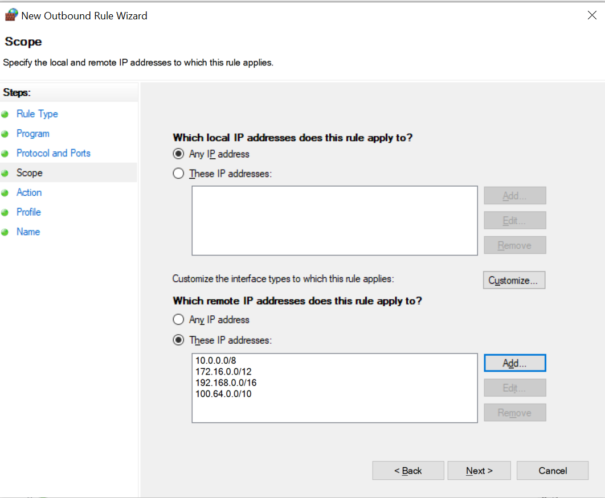

## Introduction

This tutorial aims to cover some configurations to perform in your Windows firewall to prevent network abuse. This tutorial covers two important things:

* Blocking Teredo* ports to prevent sending packets to the Internet
* Blocking private networks

There are various reasons you may want to do this. In my case, I got an email from the abuse team of my provider, regarding a server of mine performing a big amount of net scans. It is worth noting that Hetzner's ToS does not allow performing port/network scans. The logs had a lot of events that looked like this:

```c
> time             protocol  src_ip src_port              dest_ip dest_port
> ---------------------------------------------------------------------------

> [DATE and time]  UDP       [Your Server IP] 59300 =>    [some destination IP 1]  3544
> [DATE and time]  UDP       [Your Server IP] 59300 =>    [some destination IP 2]  3544
> [DATE and time]  UDP       [Your Server IP] 59300 =>    [some destination IP 3]  3544
> [DATE and time]  UDP       [Your Server IP] 59300 =>    [some destination IP 4]  3544
> [DATE and time]  TCP       [Your Server IP] 59762 =>    10.0.0.138[a private IP] 10983
```

The source port here is `59300`, which is normal and this port SHOULD NOT BE blocked as other services use it too.

> For more information about the dynamic port range (49152-65535), see this article: [Service overview and network port requirements for Windows](https://learn.microsoft.com/en-us/troubleshoot/windows-server/networking/service-overview-and-network-port-requirements#:~:text=you%20must%20enable,65535)

There are 2 issues in this log:

1. The port `3544` is the port used by Teredo to listen (at the destination server), so your server sends requests to other servers on their `3544` port.
2. Additionally, you may notice private IPs in the list.

It is better to block them as well. So we are going to deal with the 2 possible culprits for network abuse issues.

**Teredo***: "Teredo is an IPv6 transition technology that provides address assignment and host-to-host automatic tunneling for unicast IPv6 traffic when IPv6/IPv4 hosts are located behind one or multiple IPv4 network address translators (NATs)."  
Source: [Microsoft](https://learn.microsoft.com/en-us/windows/win32/teredo/portal#:~:text=Teredo%20is%20an%20IPv6%20transition,network%20address%20translators%20%28NATs%29.)

**Prerequisites**

- The steps are simple to follow. You only need to know how to login to an account with administrator privileges.

## Step 0: Learning to open firewall configurations panel on Windows server

There are several ways to open the Windows Defender Firewall settings:

* **Method 1:** Press the Windows key + `R` to open the "Run" dialog box. Type `wf.msc` and press `Enter`.
* **Method 2:** Go to the Start menu, type "Windows Defender Firewall with Advanced Security" and select the wanted result.

--------

For "Step 1" and "Step 2" below, we will add new outbound rules as follows:

In the "Windows Defender Firewall with Advanced Security" window:

* **Method 1:** Click on "Outbound Rules" on the left. In the right **Actions pane**, click on "New Rule..." to create a new outbound rule.
* **Method 2:** Right-click on "Outbound Rules" and select "New Rule..."
  
  

## Step 1 - Blocking the destination port (Teredo port 3544)

The idea here is to prevent connections headed to external servers on their port `3544`, which is the port they use for Teredo.

> **Notes:**
> * If you have another software that is performing network scans, then change the destination port to the port you see in the log as you see fit for your needs.
> * It is also possible to simply disable the software or the service causing the issue (i.e. Teredo) instead of blocking its firewall ports, especially if you need the port open for other reasons.

**To block the port** `3544`**, follow "Step 0", then:**

1. In the "New Outbound Rule" wizard, select the "Port" radio button and click "Next."
2. In the log above, we see the connection type was UDP, so under "Does this rule apply to TCP or UDP", select the radio button for **UDP**. In the same step under "Does this rule apply to all remote ports or specific remote ports", pick specific remote ports and enter `3544` in the white field next to it, then click "Next".
3. Make sure the “Block the connection” radio button is selected, and click "Next."
4. Leave settings for "When does this rule apply?" on defaults and click "Next".
5. Give your rule a name (mandatory) and a description (optional). Click "Finish" to create the rule.

And now, all connections going to remote destinations on their `3544` port will be dropped locally by your firewall before reaching the network.

## Step 2 - Blocking traffic to private networks

In this section, we will add firewall rules to block outgoing traffic to the following [private networks](https://en.wikipedia.org/wiki/Private_network):

-   `10.0.0.0/8`
-   `172.16.0.0/12`
-   `192.168.0.0/16`
-   `100.64.0.0/10`

In a nutshell, these are not public IPs, but reserved for internal/private usage. If you have an application that is misconfigured, it may try to connect to some of these. 
An example of a private network is the IP you visit to configure your router (usually starts with `192`), or the internal IP at the office for your printer (commonly it starts with `192` or `172`).

<details>

<summary>Click here for an example of unintentional abuse of these ports</summary>

You are developing an app (or using an app) that is designed for internal use in a company, and it connects to some locally hosted server on a private port. If you copy this app on your Hetzner server for deployment, it won't make sense to visit a private IP since it is no longer the same network at your office.

----------

</details>

**To block those private IP ranges, follow "Step 0", then:**

1. In the "New Outbound Rule" wizard, select the "Custom" radio button and click "Next."
2. Leave program on "All programs", then click "Next". Leave the protocol and port settings as the default and click "Next."
3. Under the "Which remote IP addresses does this rule apply to?" section, select the "These IP addresses" radio button.
4. Click on "Add..." to specify the IP address range or addresses you want to block.
5. In the "This IP address or subnet" field, enter the first IP address range you want to block. So in our case for private networks, enter the first of the 4 ranges, so let's add `10.0.0.0/8` then press "ok"
6. Repeat step 5 for the remaining ranges:
   - `172.16.0.0/12`
   - `192.168.0.0/16`
   - `100.64.0.0/10`<br>
   After adding the 4 ranges, your settings will look like this:<br>
   
7. Click "Next"
8. Make sure the "Block the connection" radio button is selected, and click "Next."
9. Leave settings for "When does this rule apply?" on defaults and click "Next"
10. Give your rule a name (mandatory), and a description (optional). Click "Finish" to create the rule.

Now, the outbound rule should be in effect. Any outgoing traffic to the specified IP address ranges will be blocked by Windows Firewall and you won't get any abuse emails about it from your provider.

Now you have prevented your server from sending outgoing requests to private networks. They will be dropped by your firewall before reaching the network level.

## Step 3 - Enabling IPv6 (Optional)

As we explained above, Teredo is useful for tunneling IPv6 but in this tutorial we have just blocked it! What if you need IPv6? The good news is, if you have a server with Hetzner, you can still use IPv6 without it since all Hetzner servers do have native IPv6. In fact, Teredo should be disabled when native IPv6 connectivity is available.

> For more information on this, you may check the docs.hetzner.com article "[The basics of IPv4 and IPv6](https://docs.hetzner.com/robot/dedicated-server/ip/ip-basics/)" and the section "**IPv6 configuration**" from "[Windows on Cloud](https://docs.hetzner.com/cloud/servers/windows-on-cloud/#ipv6-configuration)".

## Step 4 - Identifying culprits (Optional)

In case your log differs and your server is performing netscans on different source/destination ports, here are a few hints to find out what is using the port, then you can deal with it accordingly by following the steps above or addressing it on the application level.

### Hint 1

If the log shows source port `59244`, for example:

* **Fire up a PowerShell window as an administrator**<br>
   * `Start menu` » `Type: powershell`
   * `Right click on it` » `Run as administrator`

* **Enter:**<br>
   ```bash
   Get-Process -Id (Get-NetUDPEndpoint -LocalPort 59244).OwningProcess
   ```
  > In the command above, replace `59244` accordingly and press enter.

### Hint 2

If the above is not enough and you have the destination port being abused, you can identify the process ID of the culprit by:

* **Open CMD**<br>
  * `Start menu` » `Type: CMD`

* **Enter:**
  ```bash
  netstat -ano | findStr "XXXX"
  ```
  > Replace `XXXX` with the port number you want (keep the `""`).

This will give you the process ID in the last column. You can identify the process from its ID using [Process Explorer ](https://learn.microsoft.com/en-us/sysinternals/downloads/process-explorer).

---------------------------------------

Finally, you may also consider using [Process Explorer ](https://learn.microsoft.com/en-us/sysinternals/downloads/process-explorer) to observe the culprit process once identified using one of the 2 previous hints.

## Conclusion

In this tutorial, you have seen a few tips on hardening your Windows firewall to prevent abusing the public network. We have seen an example with Teredo, but the technique seen above is useful and can be reused for other apps if needed. For example, if you are developing or testing experimental apps, that are not production ready, the app might be throwing random packets to the network due to any bugs, this will prevent you from doing any harm and you can do your testing peacefully.

If you have been brought here because of netscan abuse emails, and your server continues to have the issue, consider monitoring what software is the culprit with process explorer and `netstat` command like explained in the bonus section.

##### License: MIT

<!--

Contributor's Certificate of Origin

By making a contribution to this project, I certify that:

(a) The contribution was created in whole or in part by me and I have
    the right to submit it under the license indicated in the file; or

(b) The contribution is based upon previous work that, to the best of my
    knowledge, is covered under an appropriate license and I have the
    right under that license to submit that work with modifications,
    whether created in whole or in part by me, under the same license
    (unless I am permitted to submit under a different license), as
    indicated in the file; or

(c) The contribution was provided directly to me by some other person
    who certified (a), (b) or (c) and I have not modified it.

(d) I understand and agree that this project and the contribution are
    public and that a record of the contribution (including all personal
    information I submit with it, including my sign-off) is maintained
    indefinitely and may be redistributed consistent with this project
    or the license(s) involved.

Signed-off-by: [Mohamed Bassiouny]

-->
