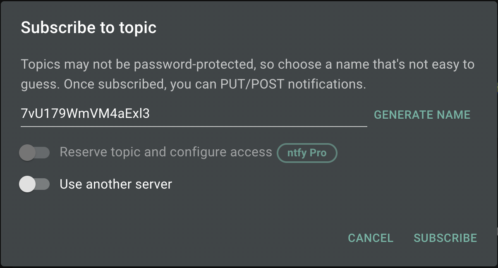
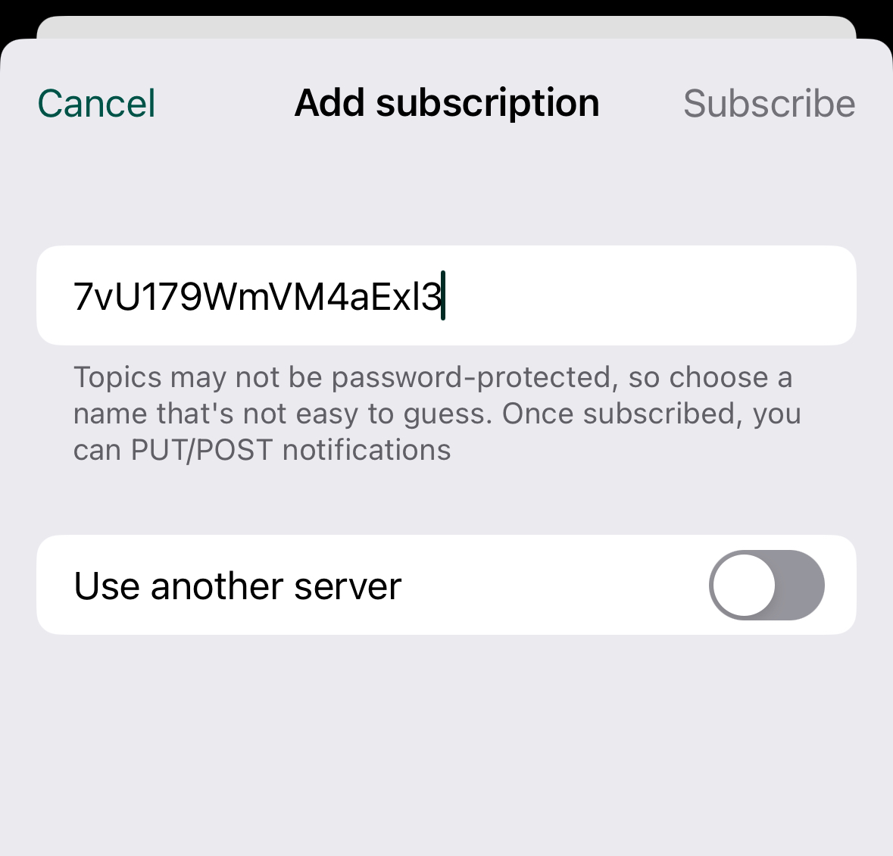
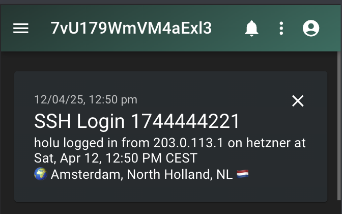

## Introduction

SSH hardening is the first step in setting up a server but often times we underestimate the importance of monitoring the SSH logins. This is especially important if the server is accessed by multiple developers or by a service like GitHub that logs into the server via SSH to deploy your app. Monitoring SSH logins can be useful for keeping track of who is accessing your server and when. It can also help you flag any unauthorized access attempts.

The tutorial contains instructions to use the open-source notification service [ntfy](https://github.com/binwiederhier/ntfy) to send notifications to your phone and desktop whenever a user or a service logs into your server via SSH along with their IP address and geolocation by taking advantage of [Pluggable Authentication Modules (PAM)](https://en.wikipedia.org/wiki/Linux_PAM) in Linux. For geolocation we will use [IP info](https://ipinfo.io/) API, this step is completely optional.

In this tutorial, we will be using the hosted and free version of the [ntfy](https://ntfy.sh/app) service. If you wish to self-host the service, you can follow the instructions [here](https://docs.ntfy.sh/install/#docker). It is a free service that allows you to send notifications to your phone or desktop via a simple HTTP API. You can also use other notification services like Gotify, Pushover, or even email if you prefer.

**Prerequisites**

On the server that should be monitored:

- This tutorial was tested on a server with Ubuntu 24.04 but it should also work on other Linux distributions.
- [SSH key](https://community.hetzner.com/tutorials/howto-ssh-key)
- [jq](https://jqlang.org/), install with:
  ```bash
  sudo apt update && sudo apt install jq -y
  ```

## Step 1 - Create a topic on ntfy.sh

* Sign up
  
  Sign up on [Ntfy app](https://ntfy.sh/app). In the left menu bar, select `+ Subscribe to topic`.  Note down the randomly generated topic name. Keep it safe like a secret token, as this token name will be used to send notifications.
  
  

<br>

* Set up notificationss
  
  Download and install ntfy.sh on your phone. You can find links to ntfy in app stores [here](https://ntfy.sh/). Once installed, add the topic to your phone and subscribe to it.
  
  

## Step 2 - Testing the topic

Before integrating the topic into your scripts, you can perform a quick test to ensure it is working correctly. Use the following curl command to send a test notification:

> Replace `7vU179WmVM4aExl3` with your own token name.

```bash
export NTFY_TOPIC=7vU179WmVM4aExl3
curl -s -d "Hetzner is ✨" https://ntfy.sh/$NTFY_TOPIC | jq
# {
#   "id": "uWimBFI2ritm",
#   "time": 1744145059,
#   "expires": 1744188259,
#   "event": "message",
#   "topic": "7vU179WmVM4aExl3",
#   "message": "Hetzner is ✨"
# }
```

If the topic is working, you should receive a notification on your subscribed devices. This step ensures that the topic is functional before proceeding with further configurations.


## Step 3 - Echoing the IP address on login

To display the IP address upon login, connect to the server who's SSH access you plan to monitor, and create a new script called `ssh-login-notify.sh` in the `/etc/profile.d/` directory. Make the script executable using this command:

```bash
sudo touch /etc/profile.d/ssh-login-notify.sh
sudo chmod +x /etc/profile.d/ssh-login-notify.sh
```

Now add the content:

> Replace `7vU179WmVM4aExl3` with your own token name.

```bash
#!/bin/bash

USER_NAME=$(whoami)
HOST_NAME=$(hostname)
TIME_NOW=$(TZ=Europe/Amsterdam date "+%a, %b %d, %I:%M %p CEST")
NTFY_TOPIC="7vU179WmVM4aExl3"

IP_ADDRESS=$(who | awk '{print $5}' | tr -d '()' | head -n 1)

if [ -z "$IP_ADDRESS" ]; then
    IP_ADDRESS=${SSH_CONNECTION%% \*}
fi

[ -z "$IP_ADDRESS" ] && IP_ADDRESS="unknown"

MESSAGE="🚨 $USER_NAME logged in from $IP_ADDRESS on $HOST_NAME at $TIME_NOW"

echo "$MESSAGE"
```

Once set up, this script will automatically display a notification in the terminal with the IP address of the user that connected to the server. This notification is shown each time a user logs in via SSH.

```bash
Last login: Sun Apr 6 20:25:14 2025 from 203.0.113.1
🚨 holu logged in from 203.0.113.1 on hetzner at Mon, Apr 07, 10:45 AM CEST
```

## Step 4 - IP geolocation - Where is the login coming from? (Optional)

To get the geolocation of the IP address, we will use a third party API as show below. This step is optional, and you can skip it if you don't want to use geolocation.

Edit `/etc/profile.d/ssh-login-notify.sh` and add the following content right above `MESSAGE=`:

```bash
GEO_INFO=""

if [[ "$IP_ADDRESS" != "unknown" && "$IP_ADDRESS" != "127.0.0.1" && "$IP_ADDRESS" != ::1 ]]; then
  GEO_JSON=$(curl -s "https://ipinfo.io/$IP_ADDRESS/json")
  CITY=$(echo "$GEO_JSON" | jq -r '.city')
  REGION=$(echo "$GEO_JSON" | jq -r '.region')
  COUNTRY=$(echo "$GEO_JSON" | jq -r '.country')
  ORG=$(echo "$GEO_JSON" | jq -r '.org')

  GEO_INFO="🌍 Location: $CITY, $REGION, $COUNTRY"
fi
```

## Step 5 - Sending the notification on login

To send the notification via ntfy.sh, we will use `curl`. 

Edit `/etc/profile.d/ssh-login-notify.sh` and remove these two lines at the very bottom of the file:

```bash
MESSAGE="🚨 $USER_NAME logged in from $IP_ADDRESS on $HOST_NAME at $TIME_NOW"

echo "$MESSAGE"
```

Now replace them with the following lines:

```bash
MESSAGE="$USER_NAME logged in from $IP_ADDRESS on $HOST_NAME at $TIME_NOW
$GEO_INFO"

curl -s -o /dev/null \
      -X POST -H "Title: SSH Login" \
      -d "$MESSAGE" \
      https://ntfy.sh/$NTFY_TOPIC
```

Next time you login, you should receive a notification via ntfy.

## Step 6 - PAM configuration for Non-interactive logins (Optional)

The script we have written till now will work on interactive sessions. But if you want notifications for non-interactive logins as well, such as `scp` or running a remote command via SSH like `ssh hetzner "cat /etc/issue"`, there is one additional step.

Instead of placing the file in `/etc/profile.d/`, where it runs for all interactive sessions, we need to move it to the `/usr/local/bin/` directory that contains all the user defined scripts:

```bash
sudo mv /etc/profile.d/ssh-login-notify.sh /usr/local/bin/
```

After moving the script to the `/usr/local/bin/` directory, add the following line at the end of `/etc/pam.d/sshd`. You need to add the file to the `pam.d` configuration for it to run for system-wide SSH notifications.

```bash
session optional pam_exec.so /usr/local/bin/ssh-login-notify.sh
```

This line tells PAM to execute the script every time a user logs in via SSH. The `session` keyword indicates that this is a session management module, and `optional` means that the login will still succeed even if the script fails.

After this, don't forget to restart the SSH service.

```bash
sudo systemctl restart sshd
```



## Complete Script with non-interactive logins

Now update the script. This will execute the script every time a user logs in via SSH, including non-interactive logins. The script will send a notification to the ntfy topic with the user's name, IP address, hostname, and geolocation information.

We use `$PAM_USER` instead of `whoami` to get the username of the user logging in. `whoami` would return the user who is executing the script, which will always be `root`. We also include early exit condition based on `$PAM_TYPE` to check if the session is closing or opening. Without the check, it would send a notification every login as well as logout.

> Replace `7vU179WmVM4aExl3` with your own token name.

```bash
#!/bin/bash

USER_NAME=$PAM_USER
HOST_NAME=$(hostname)
TIME_NOW=$(TZ=Europe/Amsterdam date "+%a, %b %d, %I:%M %p CEST")
NTFY_TOPIC="7vU179WmVM4aExl3"

# Get IP address
IP_ADDRESS=$(who | awk '{print $5}' | tr -d '()' | head -n 1)

# Fallback to SSH_CONNECTION if IP is empty
if [ -z "$IP_ADDRESS" ]; then
  IP_ADDRESS=${SSH_CONNECTION%% *}
fi

[ -z "$IP_ADDRESS" ] && IP_ADDRESS="unknown"

# echo "🚨 $USER_NAME logged ($close_session) from $IP_ADDRESS on $HOST_NAME at $TIME_NOW"

# Function to convert country code to flag emoji
flag() {
  local code="${1^^}"
  local first=$(( $(printf "%d" "'${code:0:1}") - 65 + 0x1F1E6 ))
  local second=$(( $(printf "%d" "'${code:1:1}") - 65 + 0x1F1E6 ))
  printf '%b' "$(printf '\\U%08X\\U%08X' "$first" "$second")"
}

if [[ $PAM_TYPE == 'close_session' ]]; then
  exit 0
fi
# Get geolocation information
GEO_INFO=""
if [[ "$IP_ADDRESS" != "unknown" && "$IP_ADDRESS" != "127.0.0.1" && "$IP_ADDRESS" != ::1 ]]; then
  GEO_JSON=$(curl -s "https://ipinfo.io/$IP_ADDRESS/json")
  CITY=$(echo "$GEO_JSON" | jq -r '.city')
  REGION=$(echo "$GEO_JSON" | jq -r '.region')
  COUNTRY=$(echo "$GEO_JSON" | jq -r '.country')
  ORG=$(echo "$GEO_JSON" | jq -r '.org')

  GEO_INFO="🌍 $CITY, $REGION, $COUNTRY $(flag $COUNTRY)"
fi

MESSAGE="$USER_NAME logged in from $IP_ADDRESS on $HOST_NAME at $TIME_NOW
$GEO_INFO"

if [ -n "$SSH_CONNECTION" ]; then
  curl -s -o /dev/null \
	  -X POST -H "Title: SSH Login $(date +%s)" \
	  -d "$MESSAGE" \
	  -H "Markdown: yes" \
	  https://ntfy.sh/$NTFY_TOPIC
fi
```

## Conclusion

With this script, you can build a lightweight audit trail for all logins on your server or across the entire fleet. You can also customise notifications for different channels distinguishing between a deploy script and a developer. Since the login IP is available, you can flag logins from outside trusted regions (e.g., outside the Netherlands) or maintain a whitelist of trusted IPs that bypass notifications entirely. The possibilities are endless and this can be extended to notify services like email, Slack, Telegram or even a custom webhook.

Knowing these basics, opens the door to all kinds of monitoring; whether it’s tracking login origins, highlighting unexpected locations, or just staying informed. Not too dissimilar to the smart bell we all have at home, but for your server.

##### License: MIT

<!--

Contributor's Certificate of Origin

By making a contribution to this project, I certify that:

(a) The contribution was created in whole or in part by me and I have
    the right to submit it under the license indicated in the file; or

(b) The contribution is based upon previous work that, to the best of my
    knowledge, is covered under an appropriate license and I have the
    right under that license to submit that work with modifications,
    whether created in whole or in part by me, under the same license
    (unless I am permitted to submit under a different license), as
    indicated in the file; or

(c) The contribution was provided directly to me by some other person
    who certified (a), (b) or (c) and I have not modified it.

(d) I understand and agree that this project and the contribution are
    public and that a record of the contribution (including all personal
    information I submit with it, including my sign-off) is maintained
    indefinitely and may be redistributed consistent with this project
    or the license(s) involved.

Signed-off-by: [Kshitij Purwar and hi@therookie.pro here]

-->
