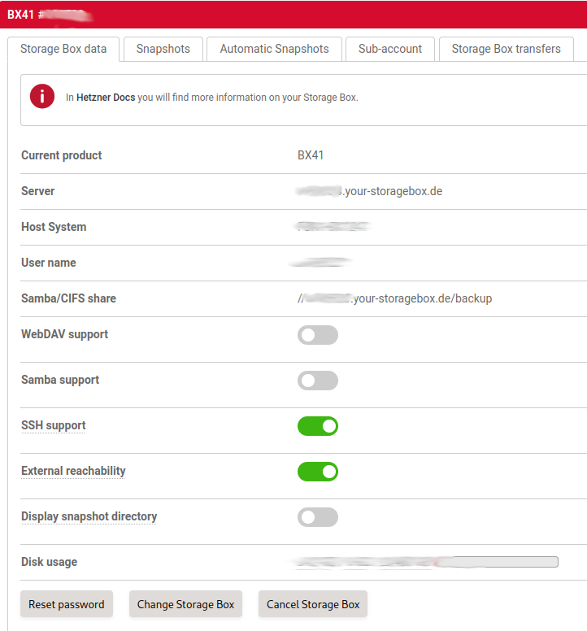
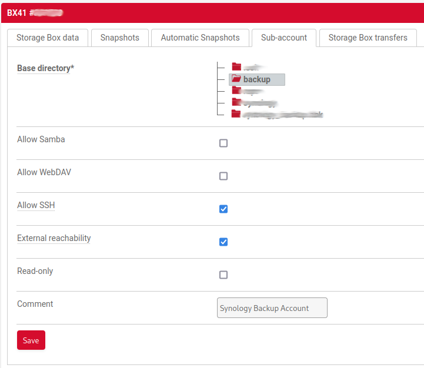
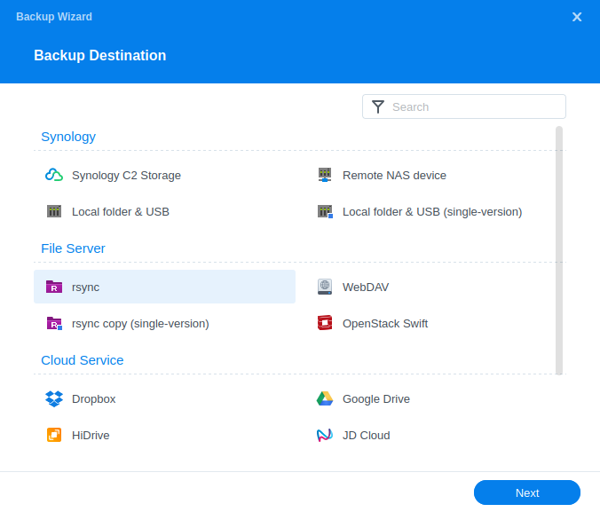
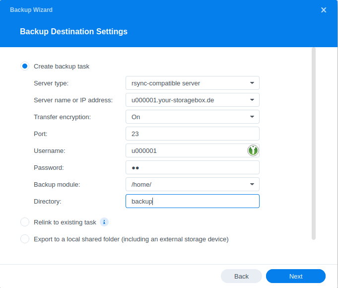
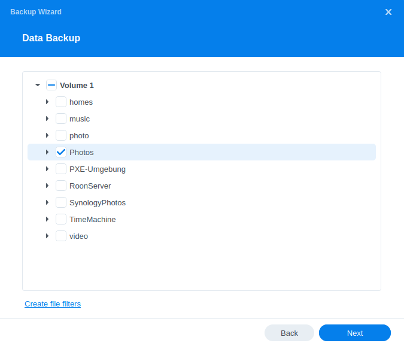
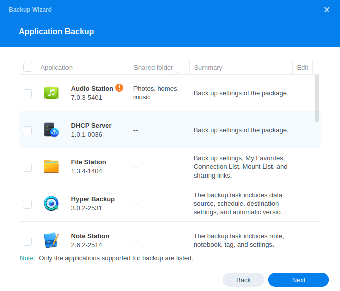
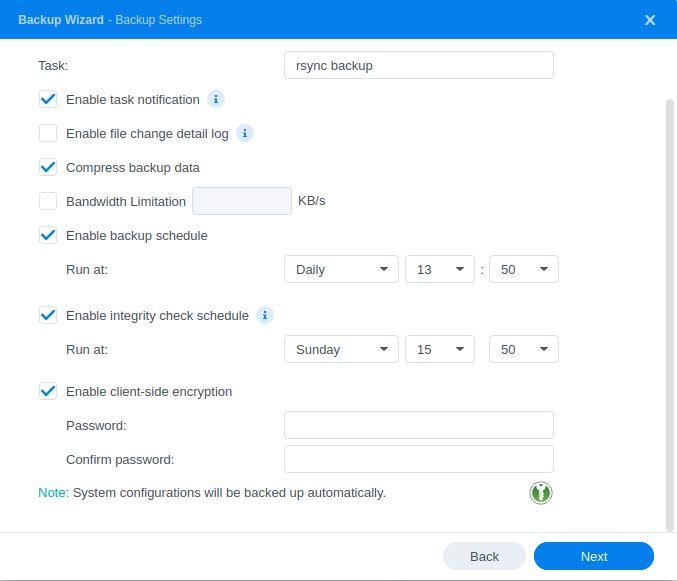

## Introduction

In this tutorial we are configuring Hyper Backup on a Synology NAS to create a backup on a Hetzner Storage Box via rsync.

## Step 1 - Configure access to Storage Box

First, we have to make sure that the Storage Box is externally reachable and SSH support is activated. We need to head to the Storage Box administration page in Hetzner Robot and select our Storage Box for the backup. Here, we have to activate "SSH support" and "External reachability".

### Step 1.1 - Optional sub-account creation

Optionally, we can create a sub-account for the backup task. In this case, we have to make sure this sub-account has "External reachability" and "SSH support" active as well.

For the rest of the tutorial, we will have to replace the username with the sub-account username in the URL and user authentication (replacing u000001).

## Step 2 - Create new backup task in Synology Hyper Backup

We start the Hyper Backup backup wizard in DSM and create a new rsync backup task.

## Step 3 - Configure backup destination

Now, we configure the rsync backup task to connect to our Storage Box, which is a rsync-compatible server.

- **Server name or IP address / Username** 
  Please keep in mind that we have to change the user ID in the "Server name or IP address" and "Username" fields, in case we created a sub-account for the backup in the Storage Box admin interface.

- **Transfer encryption** 
  "Transfer encryption" needs to be active.
  
- **Port** 
  We need to change the port to `23`.

- **Backup module** 
  The "Backup module" always needs to point to `/home/`, even when using a sub-account with a different base directory. When clicking on the dropdown, we will receive an error message, which we can ignore. Instead, we type in `/home/` directly in the field.

- **Directory** 
  The "Directory" field should contain the name of the to-be-created backup folder. It will be created in the base directory of the user.

We can now click on "Next".

## Step 4 - Finish configuration of Hyper Backup

In the last step, we finish the configuration of our backup task.

### Step 4.1 - Folder selection

First, we select the folders we want to backup:

### Step 4.2 - Application selection

In the next screen, we can select if we want to backup application settings of our Synology applications:

### Step 4.3 - Task settings

In our last step, we can configure our backup task to be automatically scheduled. The most important part on this screen is the client-side encryption, which is recommended to be activated. Please carefully read the pop-up warning about the encryption key and store it in a safe location.

In case we have enabled a scheduled backup, we can also configure a custom retention for backup files in the next and last screen of the wizard.

Now we can start our first backup.

## Conclusion

We have created an easy-to-use backup solution for our Synology NAS by using a Storage Box as an off-site backup location. We can now go even further and enable automatic snapshots on our Storage Box for further safety of our backup. Compared to a backup with Borg Backup (installable from the Synology Community repository), this uses standard tools delivered with a Synology NAS and does not require any console access or `.yml` file for configuration and execution.

##### License: MIT

<!--

Contributor's Certificate of Origin

By making a contribution to this project, I certify that:

(a) The contribution was created in whole or in part by me and I have
    the right to submit it under the license indicated in the file; or

(b) The contribution is based upon previous work that, to the best of my
    knowledge, is covered under an appropriate license and I have the
    right under that license to submit that work with modifications,
    whether created in whole or in part by me, under the same license
    (unless I am permitted to submit under a different license), as
    indicated in the file; or

(c) The contribution was provided directly to me by some other person
    who certified (a), (b) or (c) and I have not modified it.

(d) I understand and agree that this project and the contribution are
    public and that a record of the contribution (including all personal
    information I submit with it, including my sign-off) is maintained
    indefinitely and may be redistributed consistent with this project
    or the license(s) involved.

Signed-off-by: Stefan Weiberg

-->
