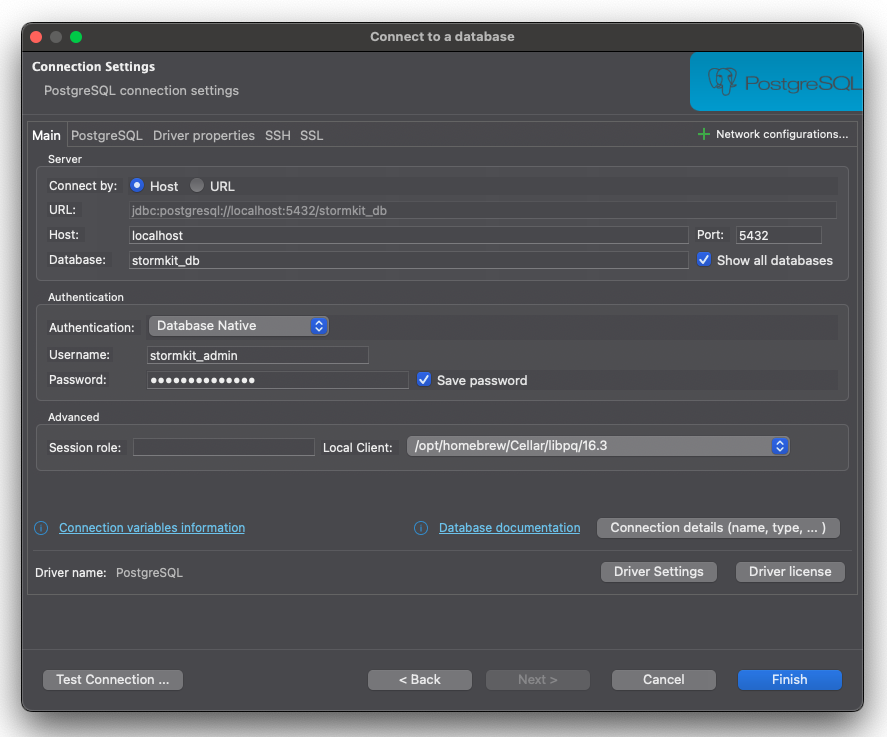
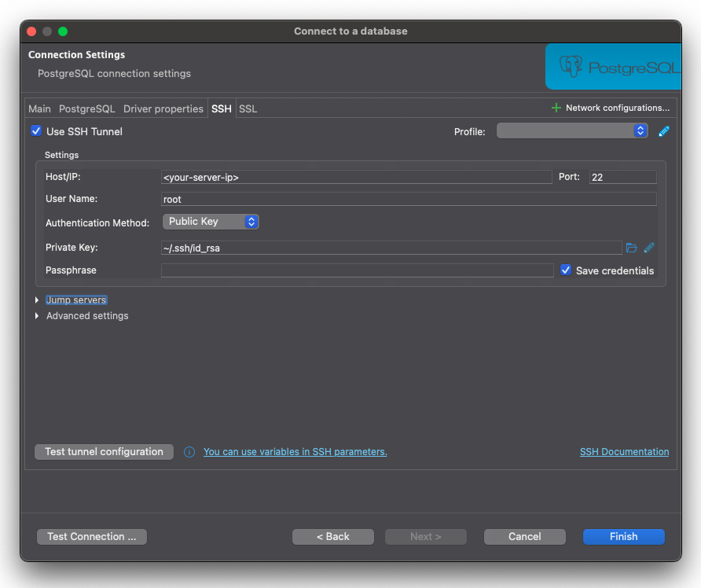
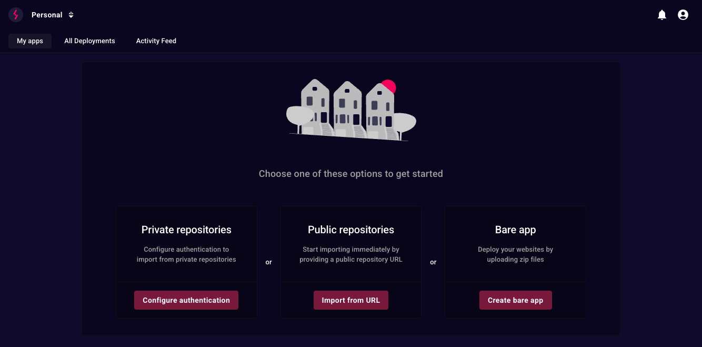

## Einführung

Willkommen zu diesem Tutorial über die Verwandlung Ihres Hetzner VPS in eine Deployment- und Hosting-Plattform mit Stormkit! Ich bin Savas, der Gründer von [Stormkit](https://www.stormkit.io), und heute werden wir einen VPS einrichten, Stormkit installieren und zwei Anwendungen deployen: eine Go-basierte API und eine hybride TanStack-Anwendung, die sowohl Pre-Rendering als auch dynamische Dateibereitstellung unterstützt. Wir werden auch unsere Go-basierte API mit der in Stormkit enthaltenen Datenbank verbinden. Lassen Sie uns beginnen!

**Geschätzte Zeit**

Die geschätzte Zeit für die Durchführung dieses Tutorials beträgt 10 Minuten.

**Terminologie**

- `your-server-ip`: Die öffentliche IP-Adresse Ihres VPS, die in Schritt 1 erstellt wird.

**Voraussetzungen**

- [SSH-Schlüssel](https://community.hetzner.com/tutorials/howto-ssh-key)

## Schritt 1 - Einrichten Ihres VPS

- Folgen Sie [diesem Tutorial](https://community.hetzner.com/tutorials/howto-initial-setup-ubuntu), um einen Ubuntu Server zu erstellen.
- Stellen Sie sicher, dass Sie eine Maschine mit mindestens 4GB RAM und 2vCPU für optimale Leistung auswählen (z.B. CX22, falls verfügbar).
- Kopieren Sie die öffentliche IP-Adresse


## Schritt 2 - Zugang zum VPS

Öffnen Sie Ihr Terminal und Führen Sie aus:

```bash
ssh root@your-server-ip
```

> Ersetzen Sie your-server-ip mit der IP von Hetzner.

Sie sind jetzt im VPS eingeloggt und können fortfahren.

## Schritt 3 - System aktualisieren

Bevor wir Stormkit installieren, aktualisieren wir schnell das System.

```bash
sudo apt update && sudo apt upgrade -y
```

Dies stellt sicher, dass Ihr VPS die neuesten Pakete für eine sichere Einrichtung hat.

## Schritt 4 - Stormkit installieren

Stormkit wird über ein Skript installiert, das Docker einrichtet und die Plattform vorbereitet.

```bash
curl -sSL https://www.stormkit.io/install.sh | sh
```

Sie werden einige Fragen gestellt bekommen, beantworten Sie sie wie folgt:

- **Which docker mode are you going to use?**: 2 (Docker Compose)
- **Enter the top-level domain (e.g. example.org)**: Leer lassen, um eine automatisch generierte URL zu verwenden (Enter drücken)
- Holen Sie sich einen Kaffee, bis die Installation abgeschlossen ist.


## Schritt 5 - Zugang zur Stormkit-Konsole

Sobald die Installation abgeschlossen ist, sehen Sie einen Link zur Stormkit-UI in Ihrem Terminal.

- Klicken Sie auf den in Ihrem Terminal bereitgestellten Link.
- Erstellen Sie ein Administrator-Konto.
- Melden Sie sich mit diesen Anmeldedaten an.

Hinweis: Stormkit hat 3 Subdomains für sich selbst reserviert:

- stormkit.&lt;your-top-level-domain&gt;: Ermöglicht Ihnen den Zugang zur UI
- api.&lt;your-top-level-domain&gt;: Ermöglicht Ihnen den programmatischen Zugang zu Stormkit
- health.&lt;your-top-level-domain&gt;: Ein Endpunkt zur Überwachung Ihrer Stormkit-Instanz

Die TLS-Zertifikate für jeden Endpunkt, die von Stormkit verwaltet werden, einschließlich Ihrer Anwendungen, werden automatisch bei der ersten Anfrage an diesen Endpunkt generiert. Dieser Prozess dauert normalerweise einige Sekunden.

## Schritt 6 - Datenbank für die Go-basierte API einrichten

Die Stormkit-Installation umfasst eine PostgreSQL-Datenbank, die Stormkit selbst zur Verwaltung der Plattform verwendet.
Wir können uns damit verbinden und eine separate Datenbank für unsere Go-basierte API erstellen.

- Kehren Sie zu Ihrem Terminal zurück und verbinden Sie sich per SSH mit Ihrem VPS.
- Geben Sie `cat ~/.profile` ein, um Ihre Umgebungsvariablen auf dem Bildschirm anzuzeigen.
- Lokalisieren und kopieren Sie die folgenden Variablen: `POSTGRES_DB`, `POSTGRES_USER` und `POSTGRES_PASSWORD`

Sie können entweder auf Ihren Datenbankcontainer zugreifen und ihn mit `psql` erstellen oder einen Datenbankmanager verwenden. Für dieses
Tutorial verwenden wir [DBeaver](https://dbeaver.io/), einen kostenlosen universellen Datenbankmanager.

- Öffnen Sie DBeaver.
- Klicken Sie auf das `+`-Symbol in der oberen linken Leiste, um eine neue Verbindung zu erstellen.
- Wählen Sie PostgreSQL und klicken Sie auf Weiter.
- Füllen Sie im Hauptbereich die folgenden Felder aus:

| Feldname           | Wert           | Beschreibung                                            |
| ------------------ | -------------- | ------------------------------------------------------- |
| Host               | localhost      | Wir verwenden einen SSH-Tunnel, lassen Sie dies also so |
| Database           | stormkit_db    | Oder der Wert der `POSTGRES_DB` Umgebungsvariable       |
| Username           | stormkit_admin | Oder der Wert der `POSTGRES_USER` Umgebungsvariable     |
| Show all databased | True           | Stellen Sie sicher, dass Sie diesen Wert überprüfen     |



- Wechseln Sie dann zum `SSH`-Tab und füllen Sie die folgenden Felder aus:

| Feldname              | Wert                                  | Beschreibung                                                                     |
| --------------------- | ------------------------------------- | -------------------------------------------------------------------------------- |
| Host/IP               | &lt;your-server-ip&gt;                | Die öffentliche IP-Adresse Ihres VPS                                             |
| Username              | root                                  | Der Name des SSH-Benutzers                                                       |
| Authentication Method | Public Key                            | -                                                                                |
| Private Key           | /&lt;your-home-folder&gt;/.ssh/id_rsa | Oder der Pfad zum SSH-Schlüssel, den Sie für den Zugriff auf Ihren VPS verwenden |
| Passphrase            | &lt;your-ssh-key-passphrase&gt;       | Leer lassen, wenn Sie keine haben                                                |



- Klicken Sie auf Verbindung testen und überprüfen Sie, ob es funktioniert.
- Wenn Sie eine Erfolgsmeldung sehen, klicken Sie auf Speichern und schließen Sie das Modal.
- Erweitern Sie in der linken Navigationsleiste die gerade erstellte Verbindung.
- Klicken Sie mit der rechten Maustaste auf das Databases-Element.
- Klicken Sie auf Neue Datenbank erstellen.
- Füllen Sie die Felder aus und klicken Sie auf OK.

## Schritt 7 - Go-basierte API auf Stormkit konfigurieren

Wenn Sie noch nicht eingeloggt sind, folgen Sie Schritt 5, um auf die Stormkit-UI zuzugreifen. Sie sollten einen Startbildschirm
mit mehreren Optionen sehen:



Standardmäßig arbeitet Stormkit mit öffentlichen Repositories. Wenn Sie auf private Repositories zugreifen müssen, können Sie
[dieser Dokumentation](https://www.stormkit.io/docs/self-hosting/authentication) folgen. Für dieses Tutorial verwenden wir
ein Beispiel-Repository.

- Klicken Sie auf Import from URL.
- Fügen Sie `https://github.com/stormkit-io/stormkit-examples` ein und klicken Sie auf Import repo.
- Klicken Sie auf Production environment.
- Klicken Sie im linken Menü auf Build, um auf die Build-Einstellungen zuzugreifen und Ihre App zu konfigurieren:

| Feldname        | Wert                        | Beschreibung                                                                              |
| --------------- | --------------------------- | ----------------------------------------------------------------------------------------- |
| Install command | `go get .`                  | Abhängigkeiten installieren                                                               |
| Build command   | `go build -o dist/server .` | Die Anwendung in einem dist-Ordner erstellen                                              |
| Output folder   | `./dist`                    | Wir möchten nur den dist-Ordner hochladen                                                 |
| Build root      | `./go-api`                  | Da sich unsere Anwendung im Top-Level go-api-Ordner befindet, wechseln wir das Build-Root |

- Klicken Sie auf Speichern
- Scrollen Sie als nächstes nach unten zu den Servereinstellungen und konfigurieren Sie Ihre Servereinstellungen:

| Feldname      | Wert            |
| ------------- | --------------- |
| Start command | `./dist/server` |

- Klicken Sie abschließend auf Deploy


- Sobald das Deployment abgeschlossen ist, klicken Sie auf Preview.

### Optional: Anzeigenamen konfigurieren

Sie können den Anzeigenamen Ihrer Anwendung konfigurieren, um eine einprägsamere URL-Struktur für Ihre Entwicklungsendpunkte zu haben.

- Klicken Sie nach dem Erstellen Ihrer Anwendung auf Settings.
- Ändern Sie den Display name zu etwas Aussagekräftigerem: Zum Beispiel go-api.
- Klicken Sie auf Update.

### Optional: Go-Version verwalten

Zur Verwaltung Ihrer Go-Version empfehlen wir die Verwendung von `.go-version`, `mise.toml` oder `.tool-versions` Dateien. Stormkit wird automatisch
die in diesen Dateien angegebenen Abhängigkeiten installieren.

## Schritt 8 - TanStack-Hybridanwendung konfigurieren

- Klicken Sie auf Import from URL.
- Fügen Sie `https://github.com/stormkit-io/stormkit-examples` ein und klicken Sie auf Import repo.
- Klicken Sie auf Production environment.
- Aktualisieren Sie das Build root, um auf den TanStack-Ordner zu zeigen: `./tanstack-ssr`.
- Klicken Sie auf Speichern.
- Klicken Sie auf Deploy

Stormkit wird zwei Artefakte aus diesem Deployment erstellen:

- Statische Dateien: Diese Dateien werden statisch bereitgestellt, ohne eine Serveraktion aufzurufen. Sie können die hochgeladenen Dateien überprüfen, indem Sie das Build-Manifest überprüfen.
- Serverdateien: Diese Dateien werden on-demand aufgerufen. Denken Sie daran wie an Lambda-Funktionen.

## Fazit

Herzlichen Glückwunsch! Sie haben erfolgreich Ihren Hetzner VPS in eine leistungsstarke Deployment- und Hosting-Plattform mit Stormkit verwandelt. In diesem Tutorial haben Sie mehrere wichtige Ziele erreicht:

- Einen VPS mit optimalen Spezifikationen eingerichtet und konfiguriert
- Stormkit mit Docker Compose für containerisierte Deployments installiert
- Sich mit der integrierten PostgreSQL-Datenbank für Datenpersistenz verbunden
- Eine Go-basierte API mit benutzerdefinierten Build-Konfigurationen deployed
- Eine TanStack-Hybridanwendung deployed, die sowohl statisches als auch serverseitiges Rendering unterstützt

Ihr VPS dient nun als vollständige Deployment-Plattform, die mehrere Anwendungen gleichzeitig verarbeiten kann. Die automatische TLS-Zertifikatsgenerierung stellt sicher, dass Ihre Anwendungen sicher sind, während die intuitive Stormkit-Benutzeroberfläche die laufende Verwaltung unkompliziert macht.

Mit dieser Einrichtung können Sie weiterhin zusätzliche Anwendungen deployen, Ihre Infrastruktur nach Bedarf skalieren und die Vorteile einer eigenen selbst gehosteten Deployment-Plattform voll ausschöpfen. Ob Sie an persönlichen Projekten arbeiten oder Anwendungen für Kunden verwalten, Sie haben jetzt die Grundlage für eine robuste Hosting-Lösung.

Viel Spaß beim Deployen!

##### License: MIT

<!--

Contributor's Certificate of Origin

By making a contribution to this project, I certify that:

(a) The contribution was created in whole or in part by me and I have
    the right to submit it under the license indicated in the file; or

(b) The contribution is based upon previous work that, to the best of my
    knowledge, is covered under an appropriate license and I have the
    right under that license to submit that work with modifications,
    whether created in whole or in part by me, under the same license
    (unless I am permitted to submit under a different license), as
    indicated in the file; or

(c) The contribution was provided directly to me by some other person
    who certified (a), (b) or (c) and I have not modified it.

(d) I understand and agree that this project and the contribution are
    public and that a record of the contribution (including all personal
    information I submit with it, including my sign-off) is maintained
    indefinitely and may be redistributed consistent with this project
    or the license(s) involved.

Signed-off-by: [submitter's name and email address here]

-->
