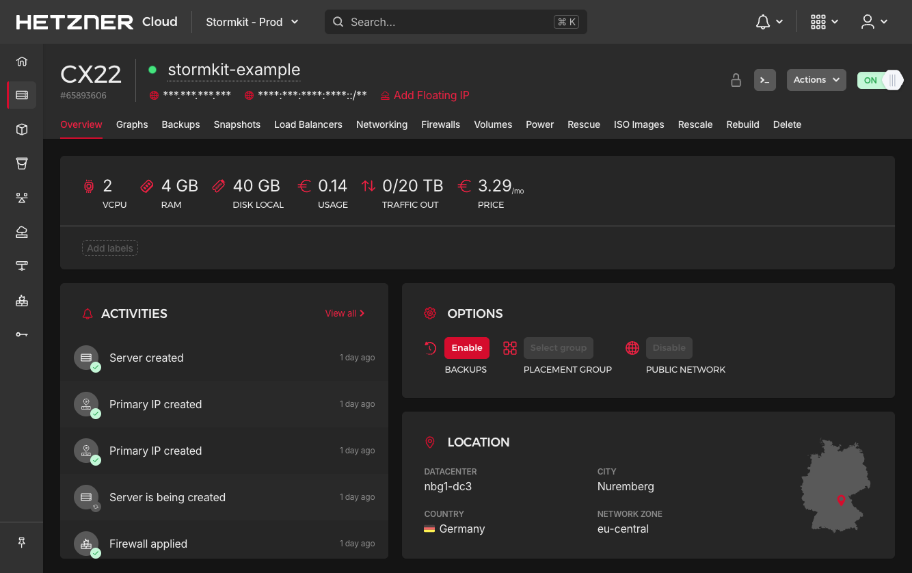
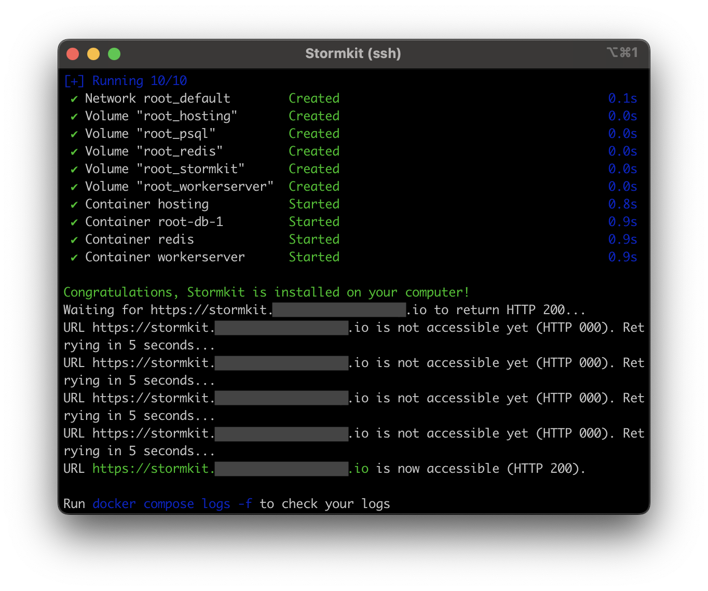
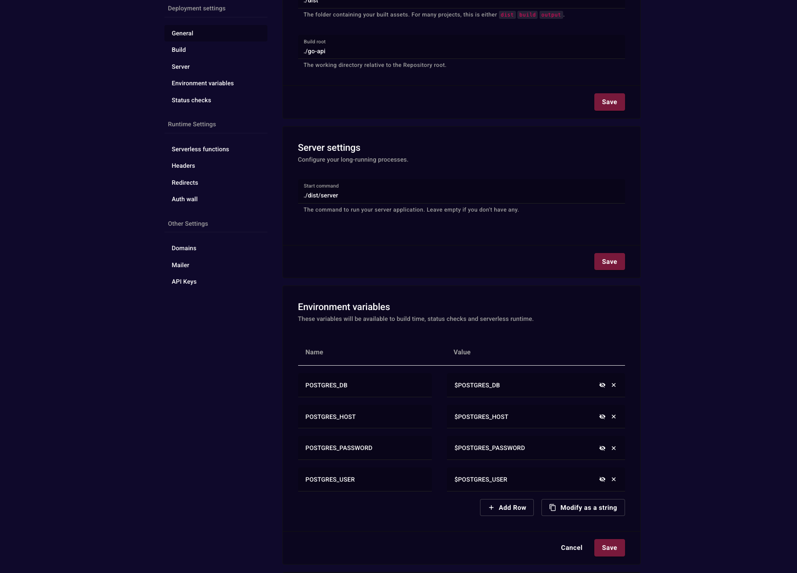

## Introduction

Welcome to this tutorial on turning your VPS into a deployment and hosting platform using Stormkit! I’m Savas, the founder of [Stormkit](https://www.stormkit.io), and today, we’ll set up a VPS, install Stormkit, and deploy two applications: a Go-based API, and a hybrid TanStack application that is capable of prerendering and serving dynamic files at the same time. We’ll also connect our Go-based API to the database included with Stormkit. Let’s dive in!

**Estimated time**

The estimated time to complete this tutorial is 10 minutes.

**Terminology**

- `203.0.113.1`: The public IP address of your VPS that will be created on Step 1.

**Prerequisites**

- [SSH key](https://community.hetzner.com/tutorials/howto-ssh-key)

## Step 1 - Setting Up and Accessing Your VPS

- Follow [this tutorial](https://community.hetzner.com/tutorials/howto-initial-setup-ubuntu) to create a Ubuntu Server.
- Make sure to select a machine with minimum 4GB RAM and 2vCPU to have optimal performance (for instance CX22 if available).
- Copy the public IP address



Open your terminal and run the following command:

> Replace `203.0.113.1` with the IP of your server.

```bash
ssh root@203.0.113.1
```

You're now logged into the VPS, ready to proceed.

## Step 2 - Installing Stormkit

Before installing Stormkit, let's quickly update the system. This ensures your VPS has the latest packages for a secure setup.

Stormkit is installed via a script that sets up Docker and prepares the platform.

```bash
sudo apt update && sudo apt upgrade -y
curl -sSL https://www.stormkit.io/install.sh | sh
```

The script will install Docker, configure environment variables and install
Stormkit containers on your VPS.

Now, Grab a coffee until the installation is complete.



## Step 3 - Accessing the Stormkit Console

Once the installation is complete, you will see a link to the Stormkit Console printed on your terminal.

- Click on the link provided in your terminal.
- Create an administrator account.
- Login using these credentials.

Note: Stormkit has 3 subdomains reserved for itself:

- `stormkit.<your-top-level-domain>`: Allows you to access the UI
- `api.<your-top-level-domain>`: Allows you to access Stormkit programmatically
- `health.<your-top-level-domain>`: An endpoint to monitor your Stormkit instance

The TLS certificates for each endpoint managed by Stormkit, including your applications, are going to be generated automatically on the first request to that endpoint. This process usually takes a few seconds.

## Step 4 - Setting up the Database for the Go-based API

Stormkit's installation includes a PostgreSQL database, which Stormkit uses itself to manage the platform. We can connect to it, and create a separate database for our Go-based API.

- Go back to your terminal and SSH into your VPS.
- Type `cat ~/.profile` to print your environment variables to the screen.
- Locate and copy the following variables: `POSTGRES_DB`, `POSTGRES_USER` and `POSTGRES_PASSWORD`

You can either access your database container and create it using `psql`, or use a Database Manager. For this
tutorial, we will be using [DBeaver](https://dbeaver.io/) which is a free universal database manager.

- Open DBeaver.
- Click the `+` icon on the top-left bar to create a new connection.
- Choose PostgreSQL and click Next.
- Under the Main section, fill in the following fields:

  | Field name         | Value          | Description                                           |
  | ------------------ | -------------- | ----------------------------------------------------- |
  | Host               | localhost      | We will use an SSH tunnel, so leave this as is        |
  | Database           | stormkit_db    | Or the value of `POSTGRES_DB` environment variable    |
  | Username           | stormkit_admin | Or the value of `POSTGRES_USER` environment variable  |
  | Password           |                | The value of `POSTGRES_PASSWORD` environment variable |
  | Show all databased | True           | Make sure to check this value                         |

  

- Then, switch to `SSH` tab and fill in the following fields:

  | Field name            | Value                                 | Description                                           |
  | --------------------- | ------------------------------------- | ----------------------------------------------------- |
  | Host/IP               | &lt;203.0.113.1&gt;                   | The public IP address of your VPS                     |
  | Username              | root                                  | The name of the SSH user                              |
  | Authentication Method | Public Key                            | -                                                     |
  | Private Key           | /&lt;your-home-folder&gt;/.ssh/id_rsa | Or the path to the SSH key you use to access your VPS |
  | Passphrase            | &lt;your-ssh-key-passphrase&gt;       | Leave empty if you don't have one                     |

  

- Click Test connection and verify it works.
- If you see a success message, click save and close modal.
- On the left navigation bar, expand the connection we just created.
- Click right on the Databases item.
- Click Create New Database.
- Fill the fields and click OK.

## Step 5 - Configure Go-based API on Stormkit

If you are not yet logged in, follow Step 3 to access the Stormkit UI. You should see an initial screen
with several options:


By default, Stormkit works with public repositories. If you need to access private repositories, you can follow
[this documentation](https://www.stormkit.io/docs/self-hosting/authentication). For this tutorial, we'll be using
an example repository.

- Click "Import from URL".
- Paste `https://github.com/stormkit-io/stormkit-examples` and click Import repo.
- Click on Production environment.
- On the left menu, click on "Build" to access build settings and configure your app:

  | Field name      | Value                       | Description                                                                           |
  | --------------- | --------------------------- | ------------------------------------------------------------------------------------- |
  | Install command | `go get .`                  | Install dependencies                                                                  |
  | Build command   | `go build -o dist/server .` | Build the application, inside a dist folder                                           |
  | Output folder   | `./dist`                    | We want to upload only the dist folder                                                |
  | Build root      | `./go-api`                  | Since our application is inside the top-level go-api folder, we switch the build root |

- Click "Save".
- Next, scroll down to Server settings and configure your server settings:

  | Field name    | Value           |
  | ------------- | --------------- |
  | Start command | `./dist/server` |

- Click "Save" again.
- Then, scroll down to Environment variables and add these variables:

| Variable name       | Value                |
| ------------------- | -------------------- |
| `POSTGRES_DB`       | `$POSTGRES_DB`       |
| `POSTGRES_USER`     | `$POSTGRES_USER`     |
| `POSTGRES_PASSWORD` | `$POSTGRES_PASSWORD` |
| `POSTGRES_HOST`     | `$POSTGRES_HOST`     |

The `$` prefix tells Stormkit to interpolate environment variables, allowing you to reuse existing variables available to the platform. While you can specify hardcoded values, interpolating existing environment variables is recommended for simplified variable management.



- Click save and scroll back to the top
- Click on Deploy
- Once the deployment is complete and it says `published` at the top, click on "Preview".


#### Optional: Configure the display name

You can configure the display name of your application to have a more rememberable URL structure for your development endpoints.

- After you created your application, click on Settings.
- Change the Display name to something more meaningful: For instance go-api.
- Click Update.

#### Optional: Managing Go Version

To manage your Go version, we recommend using `.go-version`, `mise.toml` or `.tool-versions` file. Stormkit will automatically
install the dependencies specified in these files.

## Step 6 - Configure Tanstack hybrid application

- Go to "My apps", select "Create new app", and click "Import from URL".
- Paste `https://github.com/stormkit-io/stormkit-examples` and click Import repo.
- Click on Production environment.
- Update the Build root to point the TanStack folder: `./tanstack-ssr`.
- Click Save.
- Click Deploy

Stormkit will create two artifacts from this deployment:

- Static files: These files will be served statically, without invoking any server action. You can verify the uploaded files by checking the build manifest.
- Server files: These files will be invoked on-demand. Think of it like Lambda functions.

## Conclusion

Congratulations! You've successfully transformed your VPS into a powerful deployment and hosting platform using Stormkit. Throughout this tutorial, you've accomplished several key objectives:

- Set up and configured a VPS with optimal specifications
- Installed Stormkit with Docker Compose for containerized deployments
- Connected to the built-in PostgreSQL database for data persistence
- Deployed a Go-based API with custom build configurations
- Deployed a TanStack hybrid application capable of both static and server-side rendering

Your VPS now serves as a complete deployment platform that can handle multiple applications simultaneously. The automatic TLS certificate generation ensures your applications are secure, while the intuitive Stormkit interface makes ongoing management straightforward.

With this setup, you can continue to deploy additional applications, scale your infrastructure as needed, and take full advantage of having your own self-hosted deployment platform. Whether you're working on personal projects or managing applications for clients, you now have the foundation for a robust hosting solution.

Happy deploying!

##### License: MIT

<!--

Contributor's Certificate of Origin

By making a contribution to this project, I certify that:

(a) The contribution was created in whole or in part by me and I have
    the right to submit it under the license indicated in the file; or

(b) The contribution is based upon previous work that, to the best of my
    knowledge, is covered under an appropriate license and I have the
    right under that license to submit that work with modifications,
    whether created in whole or in part by me, under the same license
    (unless I am permitted to submit under a different license), as
    indicated in the file; or

(c) The contribution was provided directly to me by some other person
    who certified (a), (b) or (c) and I have not modified it.

(d) I understand and agree that this project and the contribution are
    public and that a record of the contribution (including all personal
    information I submit with it, including my sign-off) is maintained
    indefinitely and may be redistributed consistent with this project
    or the license(s) involved.

Signed-off-by: [submitter's name and email address here]

-->
