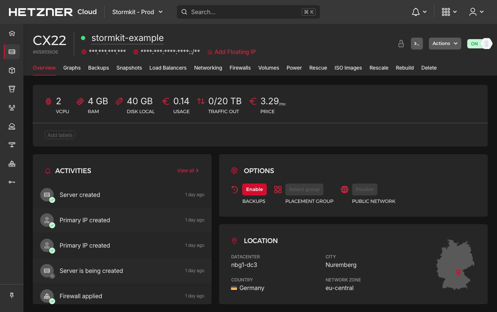
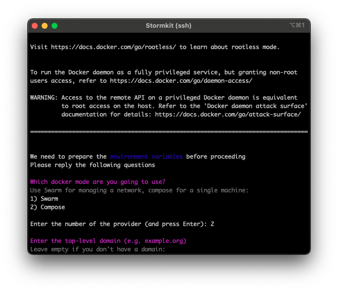
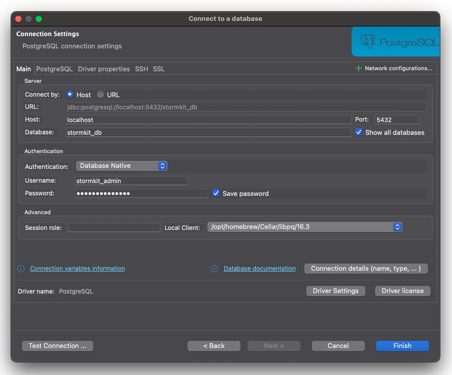
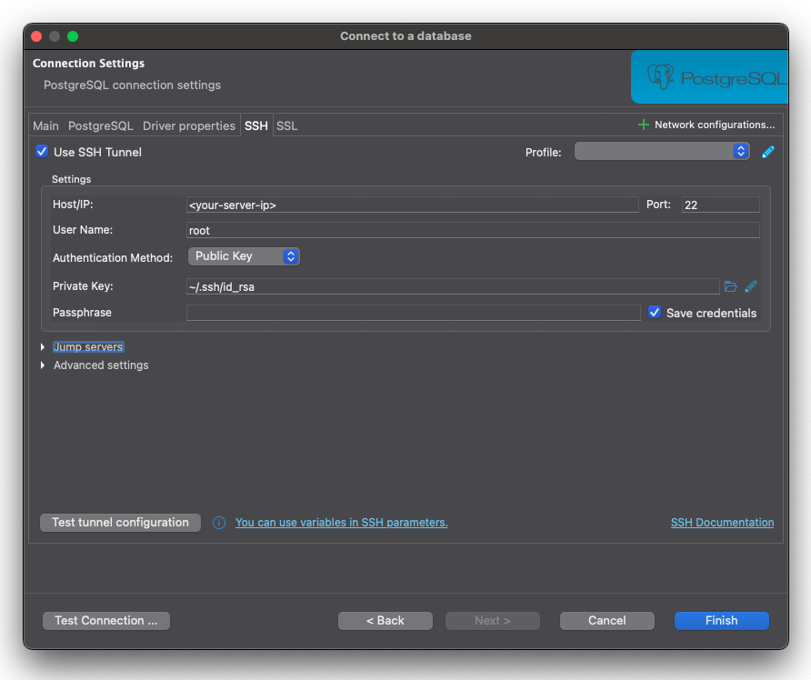
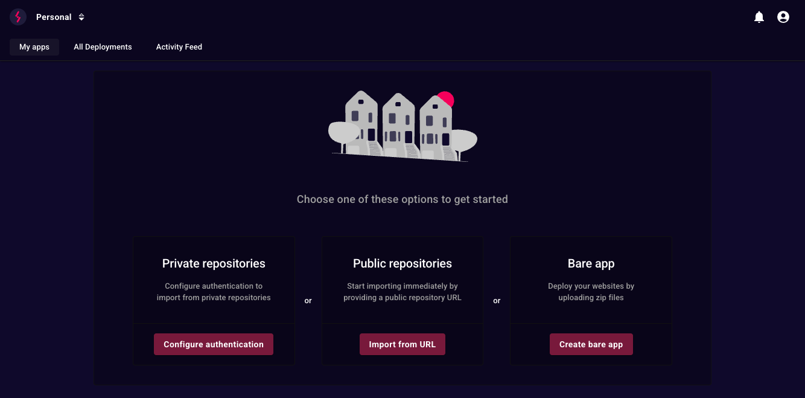
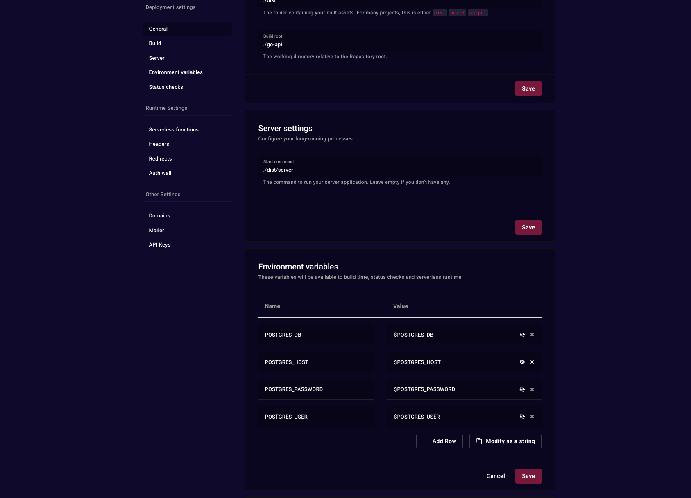
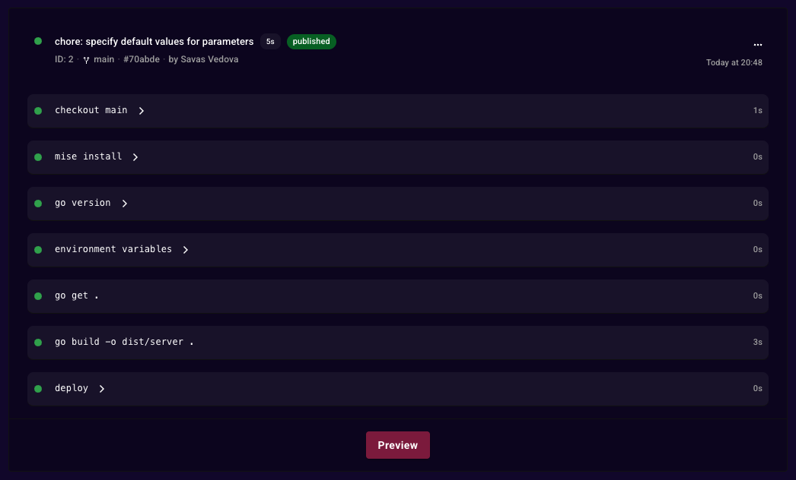

## Introduzione

Benvenuti a questo tutorial su come trasformare il vostro VPS in una piattaforma di deployment e hosting usando Stormkit! Sono Savas, il fondatore di [Stormkit](https://www.stormkit.io), e oggi configureremo un VPS, installeremo Stormkit e distribuiremo due applicazioni: un'API basata su Go e un'applicazione ibrida TanStack capace di pre-rendering e servire file dinamici allo stesso tempo. Collegheremo anche la nostra API basata su Go al database incluso con Stormkit. Iniziamo!

**Tempo stimato**

Il tempo stimato per completare questo tutorial è circa 10 minuti.

**Terminologia**

- `203.0.113.1`: L'indirizzo IP pubblico del vostro VPS che verrà creato nel Passo 1.

**Prerequisiti**

- [Chiave SSH](https://community.hetzner.com/tutorials/howto-ssh-key)

## Passo 1 - Configurazione e Accesso al VPS

- Seguite [questo tutorial](https://community.hetzner.com/tutorials/howto-initial-setup-ubuntu) per creare un Ubuntu Server.
- Assicuratevi di selezionare una macchina con minimo 4GB di RAM e 2vCPU per prestazioni ottimali (ad esempio CX22 se disponibile).
- Copiate l'indirizzo IP pubblico



Aprite il terminale e eseguite:

> Sostituete `203.0.113.1` con l'IP da Hetzner.

```bash
ssh root@203.0.113.1
```

Ora siete collegati al VPS, pronti per procedere.

## Passo 2 - Installazione di Stormkit

Prima di installare Stormkit, aggiorniamo rapidamente il sistema. Questo assicura che il vostro VPS abbia i pacchetti più recenti per una configurazione sicura.

Stormkit viene installato tramite uno script che configura Docker e prepara la piattaforma.

```bash
sudo apt update && sudo apt upgrade -y
curl -sSL https://www.stormkit.io/install.sh | sh
```

Lo script installerà Docker, configurerà le variabili d'ambiente e installerà i container Stormkit sul vostro VPS.

Ora, godetevi un caffè mentre l'installazione si completa.



## Passo 3 - Accesso alla Console Stormkit

Una volta completata l'installazione, vedrete un link all'interfaccia utente Stormkit stampato sul vostro terminale.

- Cliccate sul link fornito nel vostro terminale.
- Create un account amministratore.
- Accedete usando queste credenziali.

Nota: Stormkit ha 3 sottodomini riservati per se stesso:

- `stormkit.<your-top-level-domain>`: Vi permette di accedere all'interfaccia utente
- `api.<your-top-level-domain>`: Vi permette di accedere a Stormkit programmaticamente
- `health.<your-top-level-domain>`: Un endpoint per monitorare la vostra istanza Stormkit

I certificati TLS per ogni endpoint gestito da Stormkit, incluse le vostre applicazioni, verranno
generati automaticamente alla prima richiesta a quell'endpoint. Questo processo di solito richiede alcuni secondi.

## Passo 4 - Configurazione del database per l'API basata su Go

L'installazione di Stormkit include un database PostgreSQL, che Stormkit stesso usa per gestire la piattaforma.
Possiamo connetterci ad esso e creare un database separato per la nostra API basata su Go.

- Tornate al vostro terminale e collegatevi al VPS tramite SSH.
- Digitate `cat ~/.profile` per stampare le vostre variabili d'ambiente sullo schermo.
- Localizzate e copiate le seguenti variabili: `POSTGRES_DB`, `POSTGRES_USER` e `POSTGRES_PASSWORD`

Potete accedere al vostro container database e crearlo usando `psql` oppure usare un Database Manager. Per questo
tutorial, useremo [DBeaver](https://dbeaver.io/) che è un gestore di database universale gratuito.

- Aprite DBeaver.
- Cliccate l'icona `+` nella barra in alto a sinistra per creare una nuova connessione.
- Scegliete PostgreSQL e cliccate Avanti.
- Nella sezione Principale, compilate i seguenti campi:

  | Nome campo         | Valore         | Descrizione                                              |
  | ------------------ | -------------- | -------------------------------------------------------- |
  | Host               | localhost      | Useremo un tunnel SSH, quindi lasciate così com'è        |
  | Database           | stormkit_db    | O il valore della variabile d'ambiente `POSTGRES_DB`     |
  | Username           | stormkit_admin | O il valore della variabile d'ambiente `POSTGRES_USER`   |
  | Password           |                | Il valore della variabile d'ambiente `POSTGRES_PASSWORD` |
  | Show all databased | True           | Assicuratevi di spuntare questo valore                   |

  

- Poi, passate al tab `SSH` e compilate i seguenti campi:

  | Nome campo            | Valore                                | Descrizione                                                        |
  | --------------------- | ------------------------------------- | ------------------------------------------------------------------ |
  | Host/IP               | &lt;203.0.113.1&gt;                   | L'indirizzo IP pubblico del vostro VPS                             |
  | Username              | root                                  | Il nome dell'utente SSH                                            |
  | Authentication Method | Public Key                            | -                                                                  |
  | Private Key           | /&lt;your-home-folder&gt;/.ssh/id_rsa | O il percorso alla chiave SSH che usate per accedere al vostro VPS |
  | Passphrase            | &lt;your-ssh-key-passphrase&gt;       | Lasciate vuoto se non ne avete una                                 |

  

- Cliccate Test connection e verificate che funzioni.
- Se vedete un messaggio di successo, cliccate save e chiudete il modal.
- Nella barra di navigazione sinistra, espandete la connessione appena creata.
- Cliccate col tasto destro sull'elemento Databases.
- Cliccate Create New Database.
- Compilate i campi e cliccate OK.

## Passo 5 - Configurare l'API basata su Go su Stormkit

Se non siete ancora collegati, seguite il Passo 3 per accedere all'interfaccia utente Stormkit. Dovreste vedere una schermata iniziale
con diverse opzioni:



Per impostazione predefinita, Stormkit funziona con repository pubblici, se dovete accedere a repository privati, potete seguire
[questa documentazione](https://www.stormkit.io/docs/self-hosting/authentication). Per questo tutorial, useremo
un repository di esempio.

- Cliccate "Import from URL".
- Incollate `https://github.com/stormkit-io/stormkit-examples` e cliccate Import repo.
- Cliccate su Production environment.
- Nel menu di sinistra, cliccate su "Build" per accedere alle impostazioni di build e configurare la vostra app:

  | Nome campo      | Valore                      | Descrizione                                                                                          |
  | --------------- | --------------------------- | ---------------------------------------------------------------------------------------------------- |
  | Install command | `go get .`                  | Installare le dipendenze                                                                             |
  | Build command   | `go build -o dist/server .` | Costruire l'applicazione, dentro una cartella dist                                                   |
  | Output folder   | `./dist`                    | Vogliamo caricare solo la cartella dist                                                              |
  | Build root      | `./go-api`                  | Dato che la nostra applicazione è dentro la cartella go-api di primo livello, cambiamo il build root |

- Cliccate Save
- Successivamente, scorrete verso il basso alle impostazioni Server e configurate le vostre impostazioni server:

  | Nome campo    | Valore          |
  | ------------- | --------------- |
  | Start command | `./dist/server` |

- Poi, scorrete verso il basso fino a Environment variables e aggiungete queste variabili:

| Nome variabile      | Valore               |
| ------------------- | -------------------- |
| `POSTGRES_DB`       | `$POSTGRES_DB`       |
| `POSTGRES_USER`     | `$POSTGRES_USER`     |
| `POSTGRES_PASSWORD` | `$POSTGRES_PASSWORD` |
| `POSTGRES_HOST`     | `$POSTGRES_HOST`     |

Il prefisso `$` dice a Stormkit di interpolare le variabili d'ambiente, permettendovi di riutilizzare le variabili esistenti disponibili alla piattaforma. Mentre potete specificare valori hardcoded, l'interpolazione delle variabili d'ambiente esistenti è raccomandata per una gestione semplificata delle variabili.



- Cliccate save e scorrete di nuovo verso l'alto
- Cliccate su Deploy
- Una volta completato il deployment cliccate su "Preview".



- Una volta completato il deployment, cliccate su Preview.

#### Opzionale: Configurare il nome visualizzato

Potete configurare il nome visualizzato della vostra applicazione per avere una struttura URL più memorabile per i vostri endpoint di sviluppo.

- Una volta creata la vostra applicazione, cliccate su Settings.
- Cambiate il Display name in qualcosa di più significativo: Ad esempio go-api.
- Cliccate Update.

#### Opzionale: Gestire la versione Go

Per gestire la vostra versione Go, raccomandiamo di usare file `.go-version`, `mise.toml` o `.tool-versions`. Stormkit installerà automaticamente
le dipendenze specificate in questi file.

## Passo 6 - Configurare l'applicazione ibrida TanStack

- Navighi su "My apps", clicchi su "Create new app" e poi clicchi su "Import from URL".
- Incollate `https://github.com/stormkit-io/stormkit-examples` e cliccate Import repo.
- Cliccate su Production environment.
- Aggiornate il Build root per puntare alla cartella TanStack: `./tanstack-ssr`.
- Cliccate Save.
- Cliccate Deploy

Stormkit creerà due artefatti da questo deployment:

- File statici: Questi file verranno serviti staticamente, senza invocare alcuna azione server. Potete verificare i file caricati controllando il manifest di build.
- File server: Questi file verranno invocati su richiesta. Pensateli come funzioni Lambda.

## Conclusione

Congratulazioni! Avete trasformato con successo il vostro VPS in una potente piattaforma di deployment e hosting usando Stormkit. Durante questo tutorial, avete raggiunto diversi obiettivi chiave:

- Configurato un VPS con specifiche ottimali
- Installato Stormkit con Docker Compose per deployment containerizzati
- Connesso al database PostgreSQL integrato per la persistenza dei dati
- Distribuito un'API basata su Go con configurazioni di build personalizzate
- Distribuito un'applicazione ibrida TanStack capace sia di rendering statico che lato server

Il vostro VPS ora funge da piattaforma di deployment completa che può gestire più applicazioni simultaneamente. La generazione automatica di certificati TLS assicura che le vostre applicazioni siano sicure, mentre l'interfaccia intuitiva di Stormkit rende semplice la gestione continua.

Con questa configurazione, potete continuare a distribuire applicazioni aggiuntive, scalare la vostra infrastruttura secondo necessità e sfruttare appieno i vantaggi di avere la vostra piattaforma di deployment auto-ospitata. Che stiate lavorando su progetti personali o gestendo applicazioni per clienti, ora avete le fondamenta per una soluzione di hosting robusta.

Buon deployment!

##### License: MIT

<!--

Contributor's Certificate of Origin

By making a contribution to this project, I certify that:

(a) The contribution was created in whole or in part by me and I have
    the right to submit it under the license indicated in the file; or

(b) The contribution is based upon previous work that, to the best of my
    knowledge, is covered under an appropriate license and I have the
    right under that license to submit that work with modifications,
    whether created in whole or in part by me, under the same license
    (unless I am permitted to submit under a different license), as
    indicated in the file; or

(c) The contribution was provided directly to me by some other person
    who certified (a), (b) or (c) and I have not modified it.

(d) I understand and agree that this project and the contribution are
    public and that a record of the contribution (including all personal
    information I submit with it, including my sign-off) is maintained
    indefinitely and may be redistributed consistent with this project
    or the license(s) involved.

Signed-off-by: [submitter's name and email address here]

-->
