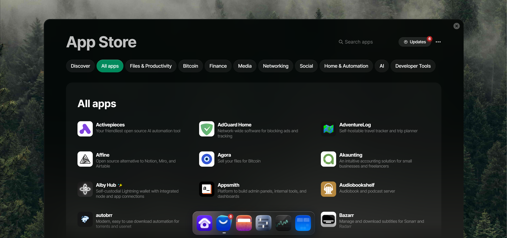
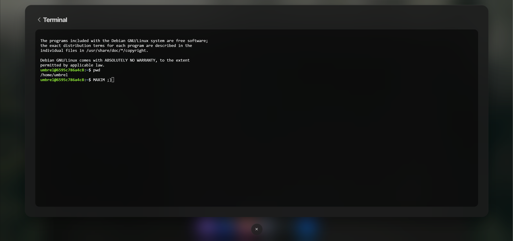
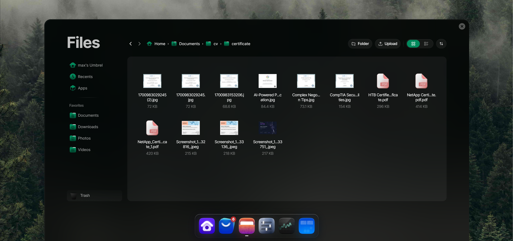
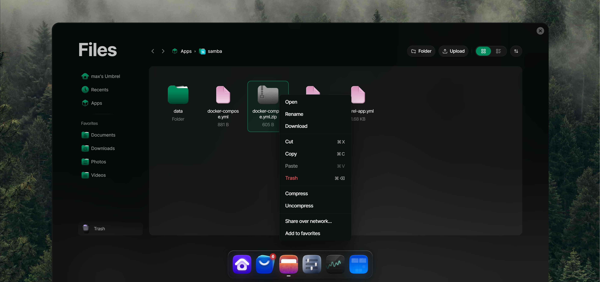
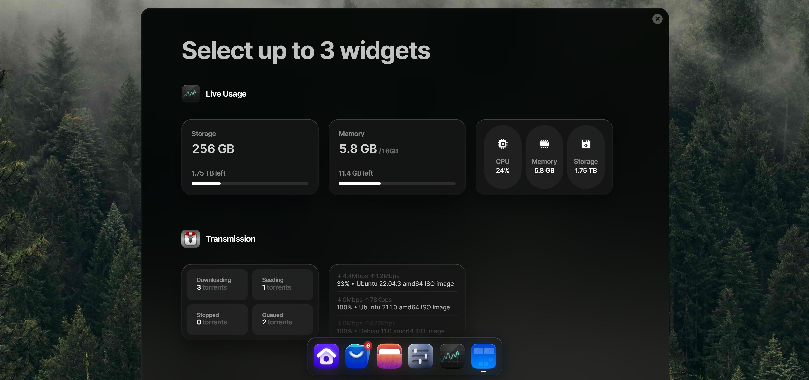
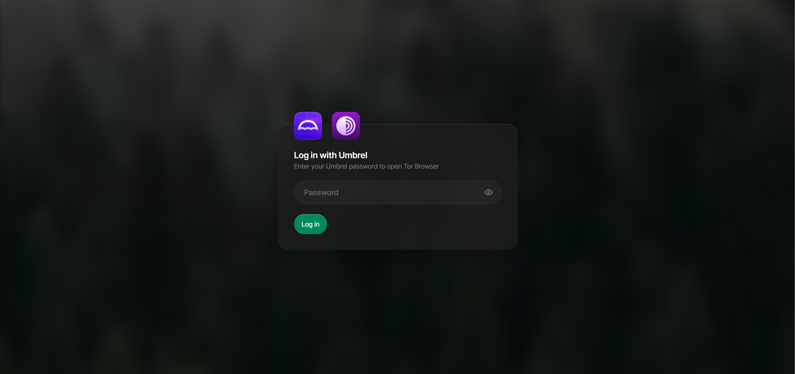

## Introduction

> Umbrel is a lightweight personal server that allows you to run self-hosted apps like Nextcloud, Bitcoin node, Vaultwarden, and more.
This guide explains how to install Umbrel on Hetzner Cloud, explore available apps, and customize your setup.


**Prerequisites**


# How to Install Umbrel on a Hetzner Cloud Server

## Introduction
Umbrel is a lightweight personal server for self-hosted apps such as Nextcloud, Vaultwarden, Pi-hole, and Bitcoin/Lightning nodes.  
This guide explains how to install Umbrel on Hetzner Cloud, explore apps, and customize your setup.

## Requirements
- Hetzner Cloud server (required docker)  
- 2+ GB RAM 


---

## Preview Images

### **Home Dashboard**


### **Umbrel App Store(2)**



### **you will have terminall access**


### **i use file manager to store files**


### **even zip/unzip supported**



### **optionally you can add widget**



### **it uses SAML , i opened app from other pc and asking pass for security**



---
# installation is easy:


> **before you begin:** make sure **docker** and **compose** installed.

   Create a git branch for your tutorial:
   
   ```bash
   curl -L https://umbrel.sh | bash
   ```


   
   > in **next article** i will show you advanced configs from change app ports to expose them on domain and even add custom app to umbrel... **stay tune** with `hetzner`


links:
[https://umbrel.com](https://umbrel.com)
2: [apps store](https://apps.umbrel.com/)

##### License: MIT

<!--

Contributor's Certificate of Origin

By making a contribution to this project, I certify that:

(a) The contribution was created in whole or in part by me and I have
    the right to submit it under the license indicated in the file; or

(b) The contribution is based upon previous work that, to the best of my
    knowledge, is covered under an appropriate license and I have the
    right under that license to submit that work with modifications,
    whether created in whole or in part by me, under the same license
    (unless I am permitted to submit under a different license), as
    indicated in the file; or

(c) The contribution was provided directly to me by some other person
    who certified (a), (b) or (c) and I have not modified it.

(d) I understand and agree that this project and the contribution are
    public and that a record of the contribution (including all personal
    information I submit with it, including my sign-off) is maintained
    indefinitely and may be redistributed consistent with this project
    or the license(s) involved.

Signed-off-by: [submitter's name and email address here]

-->
