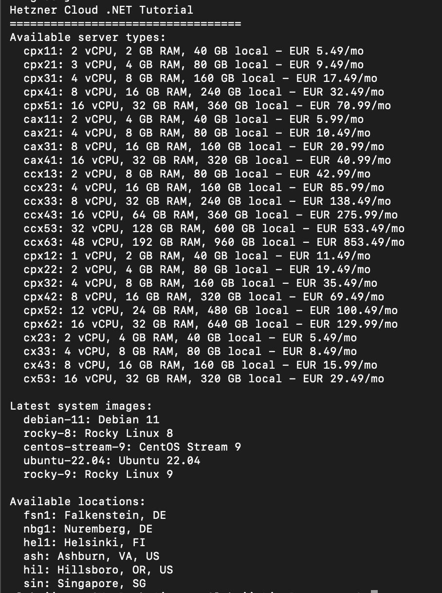

## Introduction

If you build stuff for [Hetzner Cloud](https://docs.hetzner.cloud) in .NET, you know the deal: there's an official library for Go and one for Python, but for C# you're stuck writing raw `HttpClient` calls over and over. Same headers, same error handling, every single time.

So I kinda got fed up with it and wrote my own — the **HetznerCloud .NET** library. It's free and open source, fully asynchronous, strongly typed, and it just slots into a normal .NET project: drop it in a DI container, it handles retries for you, and if you're into OpenTelemetry it can log traces and metrics too.

Here I'll show you the basics of driving it: grab a token, list what's available (server types, images, locations), then take a server through its whole life — create it, wait until it's actually up, switch it off and on, and finally delete it so you're not paying for something you're not using. I'll assume you've never touched the library before.

## Prerequisites

Here is what you need before we start:

- The [.NET SDK 8.0 or 9.0](https://dotnet.microsoft.com/download) on your machine
- A [Hetzner Cloud account](https://www.hetzner.com/cloud) with a project
- A [Hetzner Cloud API token](https://console.hetzner.cloud/#/api-tokens) with read and write permissions
- Any text editor or IDE — Visual Studio Code works fine

We will keep the token in an environment variable the whole way through, so it never ends up hard-coded in the source file.

## Step 1 - Retrieve Your API Token

Alright, first we need a token so the API lets us in.

1. Log in to the [Hetzner Cloud Console](https://console.hetzner.cloud/).
2. Pick your project from the project list. If you do not have one yet, create it.
3. Open **Access** → **API Tokens** in the sidebar.
4. Press **Generate API Token**.
5. Give it a name you will recognize later, like `dotnet-tutorial`.
6. Choose the **Read & Write** permission. We need write access later because we are going to create and delete servers.
7. Press **Generate API Token**. Copy the value right away — it is only shown this one time, and there is no way to see it again later.

Now put the token into an environment variable. On Linux or macOS:

```bash
export HCLOUD_TOKEN="your-api-token-here"
```

On Windows PowerShell:

```powershell
$env:HCLOUD_TOKEN = "your-api-token-here"
```

## Step 2 - Create a New Console Project

Open a terminal and create a fresh console application.

```bash
dotnet new console -n HetznerTutorial
cd HetznerTutorial
```

The template gives you a folder named `HetznerTutorial` with a plain `Program.cs` and a project file.

Next, add the library package:

```bash
dotnet add package HetznerCloud
```

This pulls the latest version from NuGet and writes it into your project file as a dependency.

## Step 3 - Configure the Client

Open `Program.cs` and replace everything in it with the code below. It sets up a dependency injection (DI) container and registers the HetznerCloud client using your token.

```csharp
using HetznerCloud;
using HetznerCloud.Exceptions;
using HetznerCloud.Extensions;
using HetznerCloud.Models;
using Microsoft.Extensions.DependencyInjection;
using System.Globalization;
using System.Linq;

var apiToken = Environment.GetEnvironmentVariable("HCLOUD_TOKEN")
    ?? throw new InvalidOperationException("Set the HCLOUD_TOKEN environment variable.");

var services = new ServiceCollection();
services.AddHetznerCloud(options =>
{
    options.ApiToken = apiToken;
    options.ApplicationName = "hetzner-tutorial";
    options.ApplicationVersion = "1.0.0";
});

var provider = services.BuildServiceProvider();
var client = provider.GetRequiredService<HetznerCloudClient>();

Console.WriteLine("Hetzner Cloud .NET Tutorial");
```

The `AddHetznerCloud` call registers `HetznerCloudClient` in DI. I also set `ApplicationName` and `ApplicationVersion` — they get sent with every request, so later on it's way easier to spot your own calls in the Hetzner API logs.

## Step 4 - List Resources

The library splits the API into one client per resource type — `client.Servers`, `client.ServerTypes`, `client.Images`, `client.Locations`, and so on. Before we create anything, it helps to look at what we have to choose from. Paste this below the `Console.WriteLine` line.

```csharp
var serverTypes = await client.ServerTypes.GetAllAsync();
Console.WriteLine("Available server types:");
foreach (var type in serverTypes.ServerTypes.Where(t => !t.Deprecated))
{
    var price = type.Prices.FirstOrDefault(p => p.Location == "fsn1");
    var monthly = price?.PriceMonthly.Net ?? 0;
    Console.WriteLine($"  {type.Name}: {type.Cores} vCPU, {type.Memory} GB RAM, " +
                      $"{type.Disk} GB {type.StorageType} - EUR {monthly.ToString("F2", CultureInfo.InvariantCulture)}/mo");
}

var images = await client.Images.GetAllAsync(new ImageListOptions { Type = "system", PerPage = 20 });
Console.WriteLine("\nLatest system images:");
foreach (var image in images.Images)
{
    Console.WriteLine($"  {image.Name}: {image.Description}");
}

var locations = await client.Locations.GetAllAsync();
Console.WriteLine("\nAvailable locations:");
foreach (var location in locations.Locations)
{
    Console.WriteLine($"  {location.Name}: {location.City}, {location.Country}");
}
```

Quick rundown of what that does:

- It lists the server types that are still on sale (anything deprecated gets skipped), with their vCPU, RAM, disk, and the monthly price at the `fsn1` location.
- It pulls a bunch of the newest system images — Ubuntu and friends — that you can boot a server from.
- It lists the data center locations where you'd even put your stuff.

I hard-code the `fsn1` price lookup here just to keep the output tidy, and I format it with the invariant culture so it doesn't randomly switch between comma and dot depending on where you run it.

Run it:

```bash
dotnet run
```

You should get something like the listing below. The exact names and prices will change over time as Hetzner updates its catalog.

```text
Hetzner Cloud .NET Tutorial
Available server types:
  cpx11: 2 vCPU, 2 GB RAM, 40 GB local - EUR 5.49/mo
  cpx21: 3 vCPU, 4 GB RAM, 80 GB local - EUR 9.49/mo
  cx23: 2 vCPU, 4 GB RAM, 40 GB local - EUR 5.49/mo
  cx33: 4 vCPU, 8 GB RAM, 80 GB local - EUR 8.49/mo
  ...
```



One thing I learned the hard way: just because a server type shows up in the list above does not mean you can actually order it wherever you want. Some of the ARM-based types (`cpx*`, `cax*`) show a price, but the API flat-out rejects new servers for them in most locations. So when we actually create a server later, I stick with `cx33`, which I know works everywhere.

## Step 5 - Create a Server Programmatically

Alright, time to actually create a server. Instead of hard-coding names everywhere, I look up a server type, an image, and a location from the lists we already loaded — that way the code still works if the names change. I use `cx33` because it's sold in every location; if you swap in another type, double-check it's actually available where you're creating it.

```csharp
var serverType = serverTypes.ServerTypes.First(t => t.Name == "cx33" && !t.Deprecated);
var ubuntu = images.Images.First(i => i.Name.StartsWith("ubuntu-24.04"));
var selectedLocation = locations.Locations.First(l => l.Name == "fsn1");

Console.WriteLine("\nCreating server...");

var createResponse = await client.Servers.CreateAsync(new ServerCreateRequest
{
    Name = "tutorial-server",
    ServerType = serverType.Name,
    Image = ubuntu.Name,
    Location = selectedLocation.Name,
    StartAfterCreate = true,
    Labels = new Dictionary<string, string>
    {
        ["environment"] = "tutorial",
        ["managed-by"] = "hetznercloud-dotnet"
    }
});

Console.WriteLine($"Server created: {createResponse.Server.Name} (ID: {createResponse.Server.Id})");
```

A couple of details here. The `Labels` dictionary is just a free-form bag of key/value pairs you can throw on a resource to keep it organized and filter on it later. And `CreateAsync` does not block until the box is ready — Hetzner accepts the request, hands back the new server object plus one or more *actions*, then does the heavy lifting in the background.

## Step 6 - Wait for the Server to Become Ready

Because Step 5 returns right away, your shiny new server isn't usable yet. That's what `WaitForActionAsync` is for — it just keeps polling the API until the creation action finishes. Add this right below the `CreateAsync` call.

```csharp
Console.WriteLine("Waiting for the server to become ready...");
await client.Servers.WaitForActionAsync(createResponse.Action.Id);

var server = await client.Servers.GetByIdAsync(createResponse.Server.Id);
Console.WriteLine($"Server is ready: {server.Server.Name} - Status: {server.Server.Status}");
Console.WriteLine($"IPv4: {server.Server.PublicNet.Ipv4.Ip}");
Console.WriteLine($"IPv6: {server.Server.PublicNet.Ipv6.Ip}");
```

Once the action wraps up, I pull the server again to read its public IPs. Those only show up once provisioning is done, so checking too early gets you nothing.

## Step 7 - Perform Power Operations

The same pattern — start an operation, then wait on its action — covers things like powering a server off and on.

```csharp
Console.WriteLine("\nPowering off the server...");
var powerOff = await client.Servers.PowerOffAsync(server.Server.Id);
await client.Servers.WaitForActionAsync(powerOff.Action.Id);
Console.WriteLine("Server powered off.");

Console.WriteLine("Powering on the server...");
var powerOn = await client.Servers.PowerOnAsync(server.Server.Id);
await client.Servers.WaitForActionAsync(powerOn.Action.Id);
Console.WriteLine("Server powered on.");
```

If you squint, most of the library is just hiding this same two-step dance for you: call something, get an action back, then wait for the action to finish.

## Step 8 - Handle Errors Gracefully

Real programs blow up sometimes — wrong token, a resource that doesn't exist, rate limiting, whatever. Instead of making you dig through raw error JSON, the library throws typed exceptions so you can react to each case on its own.

Wrap your code in a try/catch block:

```csharp
try
{
    // ... the code from the previous steps ...
}
catch (UnauthorizedException)
{
    Console.WriteLine("Your API token is invalid.");
}
catch (NotFoundException ex)
{
    Console.WriteLine($"Resource not found: {ex.Message}");
}
catch (RateLimitExceededException ex)
{
    Console.WriteLine($"Rate limit exceeded. Retry after {ex.RetryAfter} seconds.");
}
catch (ValidationException ex)
{
    foreach (var error in ex.ValidationErrors)
        Console.WriteLine($"  {error.Field}: {error.Message}");
}
catch (HetznerCloudException ex)
{
    Console.WriteLine($"API error ({(int)ex.StatusCode}): {ex.Message}");
}
```

One thing I threw in because it bugged me way too often in real use: transient failures get retried automatically with exponential backoff, and if Hetzner starts rate-limiting you, the client just sits out the `Retry-After` period for you instead of dying in your face.

## Step 9 - Clean Up the Server

Servers cost money, so once you're done messing around, delete it. Stick this at the end of your `try` block, after the power stuff.

```csharp
Console.WriteLine("\nDeleting the server...");
await client.Servers.DeleteAsync(server.Server.Id);
Console.WriteLine("Server deleted.");
```

Deleting stops the billing right away, so there's zero reason to leave random test boxes hanging around.

## Conclusion

That was the whole server lifecycle from a .NET console app: configure the client with a token, list what's around, create a box with labels, wait for it to boot, flip it off and on, handle errors nicely, and finally tear it down.

There's a lot more to the library than what we touched here — volumes, networks, floating IPs, firewalls, DNS zones and so on — but the idea is always the same. Since it's built around DI, retries, and async/await, it drops into a bigger app without much fuss. Honestly, I wrote it to save myself the pain, but if it saves you a couple of headaches too, great.

## License

##### License: MIT

<!--

Contributor's Certificate of Origin

By making a contribution to this project, I certify that:

(a) The contribution was created in whole or in part by me and I have
    the right to submit it under the license indicated in the file; or

(b) The contribution is based upon previous work that, to the best of my
    knowledge, is covered under an appropriate license and I have the
    right under that license to submit that work with modifications,
    whether created in whole or in part by me, under the same license
    (unless I am permitted to submit under a different license), as
    indicated in the file; or

(c) The contribution was provided directly to me by some other person
    who certified (a), (b) or (c) and I have not modified it.

(d) I understand and agree that this project and the contribution are
    public and that a record of the contribution (including all personal
    information I submit with it, including my sign-off) is maintained
    indefinitely and may be redistributed consistent with this project
    or the license(s) involved.

Signed-off-by: Oleksii Zotov <oleksiizotov06@gmail.com>

-->

