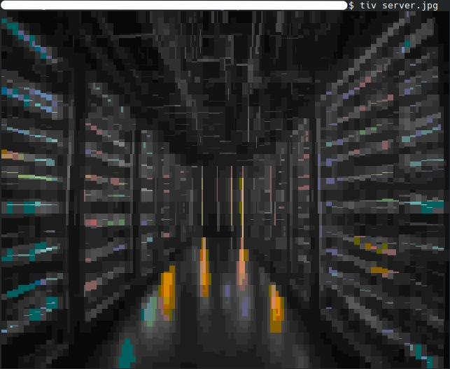
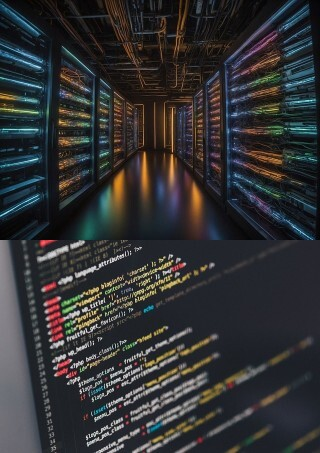
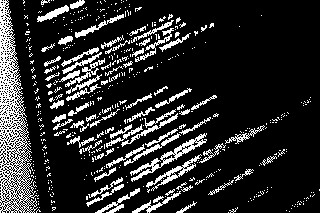
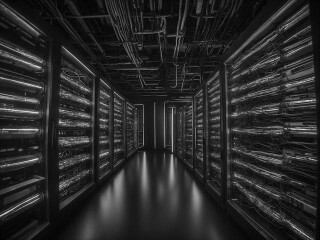
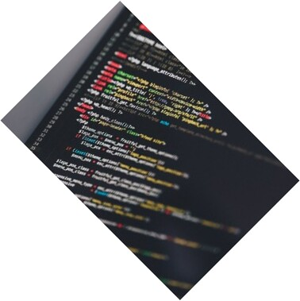

## Edit / preview images in the terminal
In this tutorial I will talk a little about images in the terminal. Probably everyone has had a problem at some point... when he was designing a page and wanted to see if a particular image was that particular image.... had to upload it to apache or download it. Or he wanted to make the image smaller or crop it. What if I tell you that it is possible to do all this from a terminal? Only two things are enough for this: the ``imagemagick`` library and the ``tiv`` program.

I will be using two images throughout this tutorial. <br>
 

### Installing packages
To begin with, we will check if we have installed the ``make`` and ``g++`` we need. To do this, type ``make --version`` - if we get a response about the version - it means that ``make`` is installed. We do the same with: ``g++ --version`` - if we get a version then we have this package installed. Below I will attach commands to install all packages - as if any of them is not installed.

#### Ubuntu
```bash
sudo apt install g++
sudo apt install make
sudo apt install imagemagick
```

#### Fedora
```bash
sudo dnf install gcc-c++
sudo dnf install make
sudo dnf install ImageMagick
```

#### CentOS/RHEL
```bash
# epel-releases are additional packages that are not in the standard repositories. necessary to install ImageMagick

sudo yum install gcc-c++
sudo yum install make
sudo yum install epel-release
sudo yum install ImageMagick
```

#### Arch Linux
```bash
sudo pacman -S gcc
sudo pacman -S make
sudo pacman -S imagemagick
```

#### openSUSE
```bash
sudo zypper install gcc-c++
sudo zypper install make
sudo zypper install ImageMagick
```

### View images in the terminal
Once we have gone through the installation of all the required packages, we can start by installing the ``tiv`` tool - TerminalImageViewer. With it we will be able to preview the image without leaving the terminal window.

How does it work? The image that we point to ``tiv`` is divided into small segments. The color of these segments is averaged. Then these segments are displayed to us in the terminal as ▎▖ characters with previously taken colors. In practice, what comes out is a block of text that looks a bit like pixel-art. Below is a picture:
 <br>
As you can see in the image above - you can easily see what the graphic shows.

#### Installing TerminalImageViewer
To install ``tiv``, we need to type these commands in the terminal - one by one:
```bash
git clone https://github.com/stefanhaustein/TerminalImageViewer.git
cd TerminalImageViewer/src
make
sudo make install
```
Now we already have a preview of the images from the terminal.

### Editing images in the terminal using imagemagick
Below I will describe the main commands for ``imagemagick`` and show what they do.

#### Percentage reduction/enlargement of images
To increase or decrease the size of an image by a given percentage we will use:
```bash
convert INPUT_IMAGE.jpg -resize XX% OUTPUT_IMAGE.jpg
```
In the place where ``XX%`` is, we specify the resize percentage. For example, ``50%`` or ``150%``. <br>


#### Changing the image to a specific dimension
Here we will also use the -resize flag only we will give specific dimensions:
```bash
convert INPUT_IMAGE.jpg -resize WWWxHHH! OUTPUT_IMAGE.jpg
```
In the place of ``WWWxHHH!`` we specify the dimensions to which the image should be scaled. For example: ``100x120!`` or ``800x600!`` (remember the exclamation point at the end). <br>


#### Resize the image by specifying only one of the parameters
We can also in the -resize flag specify only one of the parameters (e.g. height) then the other parameter (e.g. width) will be calculated and the aspect ratio will be preserved.
```bash
convert INPUT_IMAGE.jpg -resize xHHH OUTPUT_IMAGE.jpg
```
In the place of ``xHHH`` we specify the height of the image so that the width is adjusted proportionally - for example: ``x500``. We can do it analogously with the height of the image - for example: ``200x``. <br>


#### Adding a border around an image
To add an outline to an image, use this command:
```bash
convert INPUT_IMAGE.jpg -bordercolor COLOR -border SSxDD OUTPUT_IMAGE.jpg
```
In the place where we see ``COLOR`` we specify a color in words - for example ``red`` or ``black`` (to display a list of available colors we use the ``convert -list color`` command). In place of ``SSxDD`` we specify the dimensions of the frame. The first size corresponds to the left and right sides. The second size corresponds to the top and bottom sides. For example, we can specify ``20x10`` or ``0x10``. Our whole command can look like this:
```bash
convert INPUT_IMAGE.jpg -bordercolor red -border 10x20 OUTPUT_IMAGE.jpg
```


#### Crop image in the middle
To crop the image to a specific size in the middle we use the command:
```bash
convert INPUT_IMAGE.jpg -gravity center -crop WWxHH+0+0 +repage OUTPUT_IMAGE.jpg
```
In this command we change ``WWxHH`` to the size we are interested in - for example: ``100x150``. We remember that the additions to the dimension ``+0+0`` must remain. That is, the whole command will look like:
```bash
convert INPUT_IMAGE.jpg -gravity center -crop 100x150+0+0 +repage OUTPUT_IMAGE.jpg
```


#### Trim image from a specific point (x,y)
To crop the image to the required dimension from a specific point in the image (x,y coordinates) we use the command:
```bash
convert INPUT_IMAGE.jpg -crop WWxHH+XX+YY OUTPUT_IMAGE.jpg
```
In this command, as in the one above, we set the size of the crop using ``WWxHH``. In addition, the next parameters are ``+XX+YY``. These are the coordinates from which the image will be cropped - for example: ``+34+100``. The whole to complete in this command looks like this: ``100x150+34+100``. <br>


#### Invert X-axis image
To invert the image in the X axis, use the command:
```bash
convert INPUT_IMAGE.jpg -flop OUTPUT_IMAGE.jpg
```


#### Y-axis image inversion
To invert the image in the Y axis, use the command:
```bash
convert INPUT_IMAGE.jpg -flip OUTPUT_IMAGE.jpg
```


#### Combining multiple images into one horizontal
``Convert`` also allows us to combine images into one. With this procedure we can merge any number of images into one. This will be an X-axis (horizontal) merge.
```bash
convert INPUT_IMAGE_1.jpg INPUT_IMAGE_2.jpg INPUT_IMAGE_n.jpg +append OUTPUT_IMAGE.jpg
```


#### Merging multiple images into one vertical
Merging Y-axis (vertical) images should be done with the command:
```bash
convert INPUT_IMAGE_1.jpg INPUT_IMAGE_2.jpg INPUT_IMAGE_n.jpg -append OUTPUT_IMAGE.jpg
```


#### Changing image colors to black and white
``Convert`` also allows us to perform color-based operations. Here we have a command to change the image to black and white colors:
```bash
convert INPUT_IMAGE.jpg -monochrome OUTPUT_IMAGE.jpg
```


#### Change image colors to shades of gray
To change the image color palette to shades of gray we will use the command:
```bash
convert INPUT_IMAGE.jpg -colorspace Gray OUTPUT_IMAGE.jpg
```


#### Increase/decrease contrast and brightness
Increasing or decreasing the contrast and brightness is done with one command. The first value we specify in the command will be brightness the second will be contrast. I point out that we can specify negative numbers in these values. The command itself looks like this:
```bash
convert INPUT_IMAGE.jpg -brightness-contrast BBxCC OUTPUT_IMAGE.jpg
```
Where we have ``BB`` we specify the brightness, and where ``CC`` we specify the contrast. E.g. ``10x12``, ``-5x10`` or ``-10x-10``.


#### Adding blur
Adding blur in a photo is possible and is controlled by a single value. The command looks like this:
```bash
convert INPUT_IMAGE.jpg -blur 0xBB OUTPUT_IMAGE.jpg
```
In the place where we have ``0xBB`` we specify the blur value. For a strong blur we specify ``0x10`` and for a light blur we specify ``0x2``.


#### Rotate the image by a given angle
To rotate the image by a given angle we will use the command:
```bash
convert INPUT_IMAGE.jpg -rotate XX OUTPUT_IMAGE.jpg
```
In the place where there is ``XX`` we specify the angle by which we want to rotate the image - for example ``45`` or ``90``.


#### Convert image to PNG with transparency settings
To convert a JPG file to a PNG file with settings to make a given color transparent we will use the command:
```bash
convert INPUT_IMAGE.jpg -fuzz PP% -transparent CCCC OUTPUT_IMAGE.png
```
In the place where we have ``CCCC`` we specify what color is to be transparent - for example ``white``, ``black`` or ``red`` etc. In the place where we have ``PP%`` we specify what tolerance we want the given color to change to transparent - for example, ``10%`` or ``5%``.


## Conclusion
As you can see imagemagick is a very powerful library for image processing. There are many more such commands, which allow you to make, for example, a collage or insert text.... but I decided that here I will discuss the basic ones. I hope that now the processing of images on your server will be more pleasant!


##### License: MIT

<!--

Contributor's Certificate of Origin

By making a contribution to this project, I certify that:

(a) The contribution was created in whole or in part by me and I have
    the right to submit it under the license indicated in the file; or

(b) The contribution is based upon previous work that, to the best of my
    knowledge, is covered under an appropriate license and I have the
    right under that license to submit that work with modifications,
    whether created in whole or in part by me, under the same license
    (unless I am permitted to submit under a different license), as
    indicated in the file; or

(c) The contribution was provided directly to me by some other person
    who certified (a), (b) or (c) and I have not modified it.

(d) I understand and agree that this project and the contribution are
    public and that a record of the contribution (including all personal
    information I submit with it, including my sign-off) is maintained
    indefinitely and may be redistributed consistent with this project
    or the license(s) involved.

Signed-off-by: 1129032p10@gmail.com

-->
