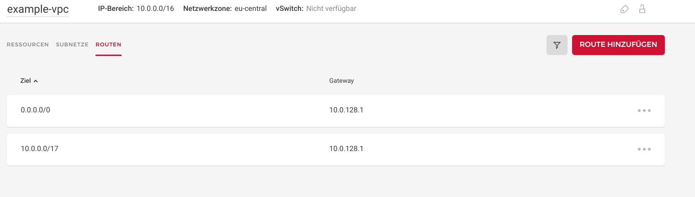
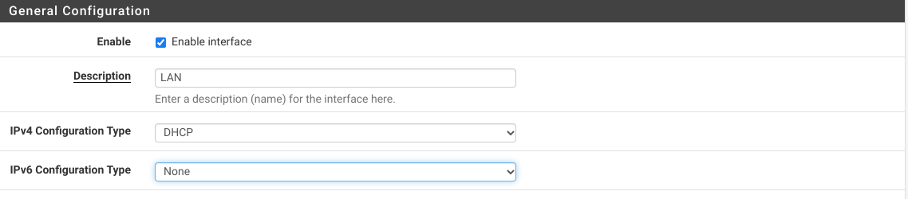

## Introduction

### Audience

Network administrators of a medium sized company tasked with integrating Hetzner Cloud with their existing (aka *legacy*) on-premises infra. As such you should have a grasp on networking basics like address ranges, segments, prefixes, and most importantly, [routing tables](https://en.wikipedia.org/wiki/Routing_table). Further, you should know your way around in Netgate pfSense.

### Abstract

This tutorial describes how to set up a [Virtual Private Cloud](https://en.wikipedia.org/wiki/Virtual_private_cloud) (VPC for short) in [Hetzner Cloud](https://www.hetzner.com/cloud) and connecting it to your on-premises network via a site-to-site [WireGuard](https://www.wireguard.com/) VPN.
Once set up, (virtual) machines in your office and the Cloud behave (mostly) like they are in the same location - the side-to-site VPN will be transparent for all your clients.

Currently, Hetzner's offering lacks a separate router product, which means you have to set up your own with a little bit more legwork. However, once set up, you will have a lot more freedom and customizability. This guide does intentionally use browser GUI instead the [`hcloud` CLI](https://github.com/hetznercloud/cli) / APIs (as most of pfSense's config has to be done in a browser anyway).

### Scope

- Planning our network segments, since we want to connect a medium / large network from *Example Corp* to Hetzner Cloud
- Setup and configure a pfSense instance in Hetzner Clound
- Connect both via a WireGuard tunnel
- Add all the necessary IPv4 routes and handle NAT
- Setting up firewall rules
- Configure cloud instances to use the default route
- Recommended packages in pfSense (Bind, Iperf)

### Outside the scope

- Other firewall distros like Sophos, OPNsense, etc. However, adapting for them should be pretty straight forward.
- IPv6, since it is currently not supported in Hetzner's local networks. Once it works, I will update this guide.
- Dynamic routing (BGP, OSPF, etc.)
- Client setup apart from default route (non-persistent)
- Your local network segmentation and name resolution (DNS). For this guide, it is assumed your network is a larger block internally routed and leaves your network at your on-premises pfSense box.
- I try to link to existing official guides as often as possible since there is no reason for duplicating already good content.
- Integrating Hetzner physical machines. However, you should be able to easily do this by using their [vSwitch product](https://docs.hetzner.com/cloud/networks/connect-dedi-vswitch).

### Prerequisites

This guide assumes you already have some experience with pfSense as well as a basic grasp on networking concepts like routes, network segments, prefixes, etc. Further you should have:

- Symmetric, high speed internet connection
- Static public IP addresses/prefixes on *Example Corp* location
- Existing, working pfSense installation acting as your "default" external route
- Working name resolution (DNS)
- You need a [Hetzner Cloud account](https://accounts.hetzner.com/login) (obviously) with full access or access to an empty project
- pfSense release 2.6 (for WireGuard to work)

### Terminology

Terminology used in this tutorial:

- Domain: `<example.com>`
- Subdomain: `<int.example.com>`
- On-prem public addresses: `198.51.100.82/32` and `2001:db8:100::1/128`
- Hetzner Cloud public addresses: `203.0.113.1` and `2001:db8:1234::/64`
- IP networks (IPv4 only):
   - Internal: `<10.0.0.0/16>` - *The full network segment used for internal traffic of Example Corp*
     - Internal on-prem: `<10.0.0.0/17>` *The network segment used on location (on premises) for Example Corp*
     - Internal VPC (Hetzner): `<10.0.128.0/17>` *The network segment used for VPC (Hetzner Cloud) of Example Corp*

## Step 1 - Planning

Let's assume you are in charge of the network of *Example Corp*, and your main local IPv4 network segment is `<10.0.0.0/16>`. For this example, we will cut it in two equal segments:

- `<10.0.0.0/17>` will be our local, on-prem network part
- `<10.0.128.0/17>` will be used by the VPC

### Resulting concept


### Routing

#### On-prem
- Our existing internal router `<10.0.127.254>` routes VPC and other traffic (`default`) via local pfSense `<192.168.0.1>`
- On-prem pfSense `<192.168.0.1>` routes internet traffic like normal through its WAN interface while traffic to the VPC is routed via the WireGuard peer `<10.6.210.1.>`

#### VPC

- Hetzner's SDN router `<10.0.0.1>` routes VPC and other traffic (`default`) via VPC pfSense `<10.0.168.1>`
- VPC pfSense `<10.0.168.1>` routes internet traffic like normal through its WAN interface while traffic to on-prem is routed via the WireGuard peer `<10.6.210.0>`

#### Things to consider / Caveats

- *Example Corp* network `<10.0.0.0/16>` has to be large enough to cover both segments, on-prem and VPC. This is more important for Hetzner Cloud - as their router can only route inside the segment you choose.
- You can just as well use smaller/larger segments depending on your need. Just replace it in all the routes and rules you set up.
- Hetzner Cloud networks are L3 only (so no broadcasts, arp, ect) and therefore require an upstream gateway for every connection. This should pose no limitation in practice - but keep this in mind while testing your network. Using DHCPv4 is strongly recommended for all your VPC machines.
- MAC addresses in Hetzner Cloud cannot be changed / cloned / spoofed.

## Step 2 - Setting up Hetzner Cloud

This part will get our pfSense VPC instance up and running.`

1. [Create a new project](https://docs.hetzner.com/cloud/general/faq#what-are-projects-and-how-can-i-use-them) called `example-vpc`

2. Go to the [network tap](https://docs.hetzner.com/cloud/networks/getting-started/creating-a-network) and create your primary network segment `example-vpc` - `<10.0.0.0/16>`</br>
   
   
   
   - Make sure to select the *Network Zone* you want as all your future VPC machines need to be in this region. At the time of writing this, you can choose between `us-east`, `us-west`. and `eu-central` here.
   - Note that the first address of the network will be your internal gateway: `<10.0.0.1>`

3. Create the required subnets.
   
   - Delete the default one (`<10.0.0.0/24>`) as it overlaps with our on-prem segment
   - Create the segment `<10.0.128.0/30>` for our pfSense VPC instance as well as any number of subnets you need for your machines later on. We start with one here (`<10.0.129.0/24>`) ; just for testing.</br>
   
   

4. Setup your static routes
   
   - Add our main route to our on-prem network. Since our future pfSense VPC instance will handle this, it needs to be the nexthop: `<10.0.0.0/17 via <10.0.128.1>`
   - Add the default route as well: `<0.0.0.0/0 via <10.0.128.1>` as we want to use the VPC pfSense for "internet" traffic inside the VPC. Note the warning you get here: You need to add the default route manually to every client later (it saves a lot of money since you can get away without pricy public IPv4 addresses).

   

5. Spin up [your server](https://docs.hetzner.com/cloud/servers/getting-started/creating-a-server)
   
   - Make sure to select public and private networking
   - The OS does not matter as we will erase it later
   - **Note on instance sizing:** Since routing gigabit traffic and WireGuard crypto are no trivial task you should *at least* choose a 2-Core instance here - `CPX11` is recommended and can handle 1 Gbit/s. You can switch between instance plans later on.</br>
     
   - *Optionally* you might want to assign [Floating IPs](https://docs.hetzner.com/cloud/floating-ips/getting-started/adding-a-floating-ip) to get additional persistence
   - Order the server. It will boot up automatically
   - Head back to the Networking/Subnets tab and make sure the VPC pfSense instance is connected to the desired segment: `<10.0.128.0/30>`</br>
     
   
6. Attach the latest [pfSense ISO image](https://docs.hetzner.com/cloud/servers/iso-installation-gateway) Hetzner provides. Then, restart the VPC pfSense instance and connect to it via the [VNC console](https://docs.hetzner.com/cloud/servers/getting-started/vnc-console) on your Cloud Console. Leave the browser window open since you need to detach the ISO in a few minutes.
   
   

## Step 3 - Setting up VPC pfSense instance

In this step we will set up pfSense in Hetzner Cloud and install and configure WireGuard.

### In your Cloud Console session (see above)

1. Follow the text based installer to [install pfSense](https://docs.netgate.com/pfsense/en/latest/install/install-pfsense.html)

2. Remove the ISO when the VPC pfSense instance reboots (see above)

3. Follow the initial wizard to set your pfSense WAN and LAN interfaces. `vtnet0` should be your WAN interface, `vtnet1` the LAN interface. Do not set up any VLANs and keep the default LAN IP:
   
   

4. You should now be greeted by the main console menu. Note the DHCP WAN address you are getting.
   
   

5. Select `8` for the console and use `easyrule` to open port 443/tcp on the WAN interface form your current locations public IPv4:
   
   ```shell
   easyrule pass WAN tcp <your_current_ip> any 443 tcp
   ```

   > You can use https://2ip.io/, for example, to get your IP address.

*Remember to delete this rule when the site-to-side tunnel is up and running!*

### Continue in your web browser

1. Open `https://203.0.113.1/` in your browser and log in using `admin` with password `pfsense`

2. Complete the [setup wizard](https://docs.netgate.com/pfsense/en/latest/config/setup-wizard.html)

3. In `System` / `Routing` / `Gateways`, set WAN_DHCP and WANGWv6 as default. Note the IPv4 gateway address<br>
   
   

4. In `Services` / `DHCP Server`, disble "DHCP server on LAN interface". In `Services` / `DHCPv6 Server & RA`, disable "DHCPv6 server on interface LAN" under the `DHCPv6 Server` tab, and set the "Router Mode" to "disabled" under the `Router Advertisements` tab (the services are not needed anyway). In `Interfaces` / `LAN`, set the LAN interface to DHCP:<br>
   
   
   
   - *Optional:* Set the IPv4 address *static* to your floating IPv4 address WAN interface and create a new gateway with the address from step (3)

5. It is a good practice to add aliases for later use in rules. Add them in `Firewall` / `Aliases` for our network segments and addresses. You can also [import them form here](https://github.com/hetzneronline/community-content/tree/master/tutorials/vpc-with-wireguard-pfsense/configs/aliases-config-vpc-gw.example.com.xml).
   
   **Tip:** You can also add these aliases directly to your on-prem pfSense instance, export all aliases there and import them in your VPC pfSense instance<br>
   
   

6. *Optional:* Add a static IPv6 address from your public prefix to your WAN interface (the gateway is `fe80::1`):<br>
   
   

### Further recommended pfSense settings

- In `System` / `Advanced` / `Miscellaneous` enable `AES-NI CPU based acceleration` in the "Cryptographic Hardware" section
- It is *highly recommended* to set up proper public DNS records for the IP addresses of the WAN interface
- Add a [floating quick rule](https://docs.netgate.com/pfsense/en/latest/firewall/floating-rules.html?highlight=quick%20rule#quick) *ICMP pass any* rule for your all interfaces
- [Set up OpenVPN](https://docs.netgate.com/pfsense/en/latest/recipes/openvpn-ra.html) for the admin user

## Step 4 - Setting up WireGuard site-to-site connection

In this step, we will install WireGuard on both of the pfSense instances - on-prem as well as VPC. [WireGuard](https://www.wireguard.com/) is a kernel module and it aims to be a modern, secure, high performance yet leaner VPN compared to OpenVPN, IPSec, etc.

**Please note** that there has been [some controversy](https://www.netgate.com/blog/painful-lessons-learned-in-security-and-community) around Netgate's WireGuard implementation in the past. The current kmod-plugin for FreeBSD (what the [pfSense](https://github.com/pfsense/FreeBSD-ports/tree/devel/net/pfSense-pkg-WireGuard) uses in turn) is developed by the [same guy](https://git.zx2c4.com/wireguard-freebsd/) who maintains the Linux kmod. At the time of writing this, *wireguard-freebsd* is marked as *experimental* and has yet to see a 1.0 release. That said, in it's current state it already works well and I presume it only gets better with time.

### Overview

1. Install the wireguard package on both pfSense instances
2. Set up the server on both instances
3. Add firewall rules to allow traffic on the wireguard interface
4. Set up a peer (client) witch on each instance "dials" into the other pfSense
5. Add interfaces and gateways - this should bring up the tunnel
6. Set up static routes
7. Disable NAT translation
8. Deploy a test VM, setup the default route, install `iperf3` and test the tunnel's performance

To install WireGuard, go to `System` / `Package Manager`  in your pfSense web interface and select the "Available Packages" tab. Search for "WireGuard" and click on `+ Install`. To set everything up, follow the [official guide](https://docs.netgate.com/pfsense/en/latest/recipes/wireguard-s2s.html); you will see the same addresses there. It is recommended to use an address segment outside our *Example Corp* network. Further, it is recommended to set up a [Pre Shared Key](https://docs.netgate.com/pfsense/en/latest/vpn/wireguard/settings.html#wireguard-tunnel-settings).

### Remarks

To clarify the guide from pfSense, make sure to follow all steps on both of your pfSense instances. The following only shows the steps on VPC but they are essentially the same on your on-prem pfSense instance.

- Allow inbound traffic on port `51820/udp` on all of your WAN interfaces.
  Should you use another port, ensure to follow through with it!
- Make sure to actually *enable* the WireGuard service in the settings and set *Interface Group Membership* to *Unassigned Tunnels*.
  This will give you more control over the tunnel rules.<br>
  
- Remember to set the allowed IP networks in the peer. These are the same on both ends of the tunnel. Further, generate a PSK here and copy it to the peer of the other instance. Since we create a site-to-site connection, it is recommended to have static peer addresses. It is highly recommended to use *publicly resolvable DNS entries here* instead of the IP addresses.</br>
  
- Ensure to assign the interface in `Interfaces` / `Interface Assignments`</br>
  
- and set up the gateway correctly. The gateway is the address of the other instance (see [diagram](https://github.com/hetzneronline/community-content/tree/master/tutorials/vpc-with-wireguard-pfsense/images/vpc-network.png)). **Very important:** Set the [MTU](https://en.wikipedia.org/wiki/Maximum_transmission_unit) on both sides to a smaller value, [it is a good idea](https://keremerkan.net/posts/wireguard-mtu-fixes/) to start out as low as **1300** bytes. Set the same MTU on both ends of the tunnel.</br>
  
- When everything is set correctly on both ends, the tunnel should come up with a green handshake icon in the status page and a handshake time. Check if the tunnel is up on both instances.</br>
  
- **The crucial part** is to add our routes. You have to add the OnPrem segment via the OnPrem WireGuard Gateway on the VPC pfSense instance; and the route to the VPC segment via the VPC WireGuard Gateway on the OnPrem instance. Below the entry for our VPC pfSense instance</br>
  

### Optimizations

- To optimize the performance, make our site-to-site VPN truly transparent, disable outbound NAT for the VPC tunnel and the segments on the LAN gateway on both instances. Enable *Hybrid Nat* and add these *Do Not NAT* rules:
  
  
  

- Remove both MTU values on the WG interfaces to reset them to default (1500 bytes) and test the path MTU (`traceroute --mtu <target>`) from both ends since it will be specific to your setup. Once you have a value, change the interface settings accordingly (as larger packages are more efficient)

## Step 5 - Setup clients and test the tunnel

At this point, your site-to-site-vpn should be up and running. To demonstrate it and test the performance, let's set up a network test VM in Hetzner Cloud. The steps below are an example and *not* permanent as this is outside the scope.

1. Spin up a new server in our VPC project using the "default" Ubuntu distro (or any other you are comfortable with) . **Do not** attach a public network but only a private network.</br>
   
   

2. Make sure the correct network is attached (since the pfSense network is so small, it should be automatically)</br>
   
   

3. [Log into the machine](https://docs.hetzner.com/cloud/servers/getting-started/connecting-via-private-ip) using `ssh root@10.0.129.1`
   
   1. Look at your routes, note we get the route to our VPC network automatically via DHCP but a default route is missing. Let's fix that and add a nameserver:
      ```bash
      root@10.0.129.1:~# ip route
      10.0.0.0/16 via 10.0.0.1 dev ens10
      10.0.0.1 dev ens10 scope link
      169.254.169.254 via 10.11.0.1 dev ens10
      ```
      ```bash
      root@10.0.129.1:~# ip route add default via 10.0.0.1
      ```
      ```bash
      root@10.0.129.1:~# ping -c 3 8.8.8.8
      PING 8.8.8.8 (8.8.8.8) 56(84) bytes of data.
      64 bytes from 8.8.8.8: icmp_seq=1 ttl=115 time=6.08 ms
      64 bytes from 8.8.8.8: icmp_seq=2 ttl=115 time=5.58 ms
      64 bytes from 8.8.8.8: icmp_seq=3 ttl=115 time=5.62 ms
      ```
      ```bash
      root@10.0.129.1:~# echo nameserver 8.8.8.8 > /etc/resolv.conf
      ```
      ```bash
      root@10.0.129.1:~# ping -c 3 google.com
      PING google.com (216.58.212.174) 56(84) bytes of data.
      64 bytes from fra24s01-in-f14.1e100.net (216.58.212.174): icmp_seq=1 ttl=115 time=6.08 ms
      64 bytes from fra24s01-in-f14.1e100.net (216.58.212.174): icmp_seq=2 ttl=115 time=5.59 ms
      64 bytes from fra24s01-in-f14.1e100.net (216.58.212.174): icmp_seq=3 ttl=115 time=5.57 ms
      ```
   
   2. Now we have "internet" via our VPC pfSense instance and name resolution working. To test our network, install the `iperf3` package and run the server
      ```bash
      root@10.0.129.1:~# apt update && apt install iperf3
      # # (...)
      ```
      ```bash
      root@10.0.129.1:~# iperf3 -s
      -----------------------------------------------------------
      Server listening on 5201
      -----------------------------------------------------------
      ```
   
   3. Test the performance with any machine inside your on-prem network. Assuming your uplink is not too congested, you should see the nominal speed of your internet connection
      ```bash
      # iperf3 --format M -c 10.0.129.1
      Connecting to host 10.0.129.1, port 5201
      [  5] local 100.115.92.203 port 32904 connected to 10.0.129.1 port 5201
      [ ID] Interval           Transfer     Bitrate         Retr  Cwnd
      [  5]   0.00-1.00   sec  87.9 MBytes  87.9 MBytes/sec  322   2.18 MBytes
      [  5]   1.00-2.00   sec   105 MBytes   105 MBytes/sec    0   2.37 MBytes
      [  5]   2.00-3.00   sec   105 MBytes   105 MBytes/sec    0   2.53 MBytes
      [  5]   3.00-4.00   sec   104 MBytes   104 MBytes/sec    0   2.66 MBytes
      [  5]   4.00-5.00   sec   104 MBytes   104 MBytes/sec    0   2.77 MBytes
      [  5]   5.00-6.00   sec   105 MBytes   105 MBytes/sec    0   2.85 MBytes
      [  5]   6.00-7.00   sec  97.5 MBytes  97.5 MBytes/sec   57   2.09 MBytes
      [  5]   7.00-8.00   sec   101 MBytes   101 MBytes/sec    0   2.19 MBytes
      [  5]   8.00-9.00   sec   101 MBytes   101 MBytes/sec    0   2.28 MBytes
      [  5]   9.00-10.00  sec   104 MBytes   104 MBytes/sec    0   2.34 MBytes
      - - - - - - - - - - - - - - - - - - - - - - - - -
      [ ID] Interval           Transfer     Bitrate         Retr
      [  5]   0.00-10.00  sec  1014 MBytes   101 MBytes/sec  379             sender
      [  5]   0.00-10.00  sec  1014 MBytes   101 MBytes/sec                  receiver
      
      iperf Done.
      ```

### Hints

- If you do not reach the nominal speed if your connection then you might need to upgrade your VPC pfSense - instance tier (more CPU-cores) or even your local on-prem pfSense.
- Should you have trouble with network persistence when using `NetworkManager`, remove the `hc-utils` package.

## Conclusion

You should have a working site-to-site VPN. All clients in these network segments should see each other transparently. Your Hetzner Cloud pfSense instance is acting as the firewall and routes general "internet" traffic for your VPC machines while traffic to your on-prem machines is routed through the WireGuard tunnel.

### Next steps

To make more use of your new VPC pfSense instance, you should look into:

- Set up better filtering rules for WireGuard and VPC pfSense to limit outbound traffic
- Set up valid certificates for the web UI
- Set up the `Bind` package with slave zones for all your local DNS zones and use VPC pfSense as nameserver for your VPC machines
- Enable the delete protection (padlock icon) for the network resource and the VPC pfSense instance
- Integrate everything into your IT monitoring solution

##### License: MIT

<!--

Contributor's Certificate of Origin

By making a contribution to this project, I certify that:

(a) The contribution was created in whole or in part by me and I have
    the right to submit it under the license indicated in the file; or

(b) The contribution is based upon previous work that, to the best of my
    knowledge, is covered under an appropriate license and I have the
    right under that license to submit that work with modifications,
    whether created in whole or in part by me, under the same license
    (unless I am permitted to submit under a different license), as
    indicated in the file; or

(c) The contribution was provided directly to me by some other person
    who certified (a), (b) or (c) and I have not modified it.

(d) I understand and agree that this project and the contribution are
    public and that a record of the contribution (including all personal
    information I submit with it, including my sign-off) is maintained
    indefinitely and may be redistributed consistent with this project
    or the license(s) involved.

Signed-off-by: Daniel Helgenberger <daniel.helgenberger@m-box.de>

-->
