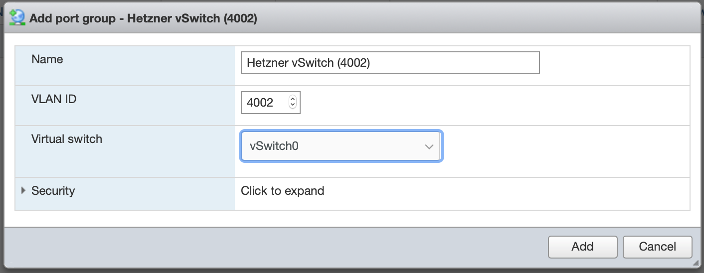

## Introduction

Using a Hetzner vSwitch in a virtualized environment has several advantages.
 
1. You can always keep your IPs. If you switch or upgrade servers, you usually lose your IP addresses. With vSwitches, you just connect it to the new server and can continue using your IPs.
2. IPs routed to a vSwitch can be used on all your servers. This means you can also live-migrate (vMotion) your VMs to another host while the guest is running. Useful when hosts need maintenance, a host failed or for load balancing purpose.
3. You don't need a router VM. While it can be an advantage using a VM as dedicated firewall, it can make networking more complicated and is another single point of failure.

This tutorial will explain how to configure VMware ESXi on a dedicated server to use Hetzner's vSwitches with a public subnet for virtual machines.

_This tutorial also works with the free version of ESXi._

**Prerequisites**

Obviously, you need a dedicated server that is capable of running ESXi. Officially, only the Dell Servers (DX-Line) are suppported, but ESXi may run on other servers as well (see [Install and configure VMware vSphere](https://community.hetzner.com/tutorials/install-and-configure-vmware-vsphere#compatibility)). 

This tutorial assumes that you have a basic understanding of ESXi.
It also assumes that you have already installed ESXi on your server.
If not, there is an [installation tutorial](https://community.hetzner.com/tutorials/install-and-configure-vmware-vsphere) that explains the process.

## Step 1 - Order and setup a vSwitch

For this tutorial, you will need a vSwitch with a publicly routed subnet. If you already have one that you want to use, you may omit (parts of) step 1.

### Step 1.1 - Create a vSwitch

First, go into Robot and create a vSwitch. To do so, go to ```Servers``` and click on ```vSwitches```.


Enter a name and a VLAN ID. If you do not have any vSwitches right now, just use ```4000```. You can use anything between ```4000``` and ```4095``` but every ID can only be used once by you. For this tutorial we will use ```4002``` as our VLAN ID.

The name can be anything and is only for you to know what the vSwitch is used for. 

Click on ```Create vSwitch``` and wait for it to complete.


### Step 1.2 - Connect the vSwitch to your server

You have to connect the vSwitch to your server in order to use it. Therefore, click on the newly created vSwitch in the list and click on the text field ```Search Servers```. A drop-down will appear that contains all your servers. Click on the server you run ESXi on and click on ```Add Servers```. This will take between 30 and 60 seconds to complete.

If you want to use the vSwitch on multiple servers, you have to add them all here.


Once done, it should look similar to this.


### Step 1.3 - Order Public IP Subnet

Now you need public IP Addresses that are routed to your vSwitch. 

For this, click on the ```IPs``` tab of your vSwitch.

Select the subnet size you would like to use, enter a technical reason why you need these IP Adresses (here: virtualization) and click on ```Apply for subnet in obligation```. You may also want to (optionally) order an additional IPv6 network if you want your VMs to use IPv6 networking.

IPv4 and IPv6 can be used simultaneously on the vSwitch.

## Step 2 - Configure ESXi

Open the vSphere Host Client in your web browser. Head to ```Networking``` and then ```Port Groups```. Click on ```Add Portgroup``` on the top and you will see this window.



Enter a descriptive name into the ```Name ``` textbox and enter the same VLAN ID you entered in Step 1. Here we used ```4002```. You may also want to append the VLAN ID in paranthesis to the name. This is not necessary but may help you identify the network when using multiple Hetzner vSwitches. You can always change the name later.

For ```Virtual Switch``` choose the one that is connected to the server's uplink. By default it's called ```vSwitch0```

Finally, click on ```Add``` to save the port group.

## Step 3 - Create a Virtual Machine

Create a new virtual machine and select your guest operating system as usual. When asked to configure the virtual hardware, make sure the vm's network adapter connects to the newly created port group. In this tutorial we named it ```Hetzner vSwitch (4002)```.


You can also connect already existing virtual machines to the network. Just edit their virtual hardware and change the network adapter's port group.

## Step 4 - Configure Guest Network Settings

Hetzner's vSwitches do not feature a DHCP. This means you have to assign IP addresses manually to your virtual machines. Please refer to your operating system in order to do that.

Keep in mind that you cannot use every IP address, as some of them are reserved for gateway and broadcast.

Assuming our network is `10.0.0.0/29`, we would have the following situation:

| IP       | State 				|
|:--------:|--------------------|
| 10.0.0.0 | Network Address	|
| 10.0.0.1 | Gateway			|
| 10.0.0.2 | Usable IP Address	|
| 10.0.0.3 | Usable IP Address	|
| 10.0.0.4 | Usable IP Address	|
| 10.0.0.5 | Usable IP Address	|
| 10.0.0.6 | Usable IP Address	|
| 10.0.0.7 | Broadcast Address  |

For IPv6 it's a bit different. The gateway is always `fe80::1` and the first usable IP address of the network `2001:db8:1234::/64` would be `2001:db8:1234::1`.

You also have to setup DNS manually. You can use [Hetzner's DNS Servers](https://docs.hetzner.com/dns-console/dns/general/recursive-name-servers/) or any other ones you like.

## Conclusion

You learned how to setup a Hetzner vSwitch with public subnets in VMware vSphere and how to connect virtual machines to it.

You can now easily setup a cluster of vSphere Hosts and live-migrate (vMotion) your VMs between hosts without loosing network connectivity.

##### License: MIT

<!--

Contributor's Certificate of Origin

By making a contribution to this project, I certify that:

(a) The contribution was created in whole or in part by me and I have
    the right to submit it under the license indicated in the file; or

(b) The contribution is based upon previous work that, to the best of my
    knowledge, is covered under an appropriate license and I have the
    right under that license to submit that work with modifications,
    whether created in whole or in part by me, under the same license
    (unless I am permitted to submit under a different license), as
    indicated in the file; or

(c) The contribution was provided directly to me by some other person
    who certified (a), (b) or (c) and I have not modified it.

(d) I understand and agree that this project and the contribution are
    public and that a record of the contribution (including all personal
    information I submit with it, including my sign-off) is maintained
    indefinitely and may be redistributed consistent with this project
    or the license(s) involved.

Signed-off-by: Carsten Braun <info@braun-software-solutions.de>

-->
