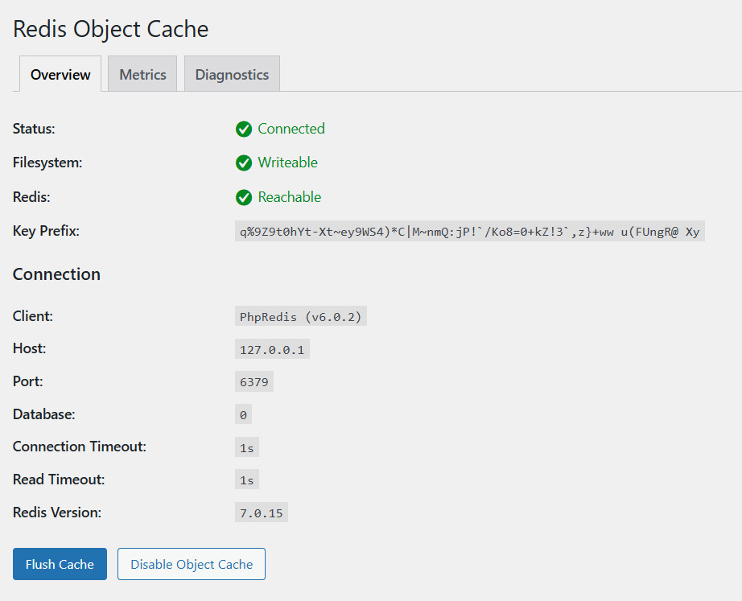
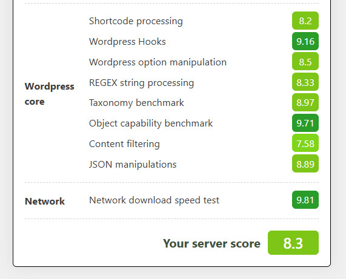

## Introduction

**[WP Hosting Benchmark](https://wordpress.org/plugins/wpbenchmark/)** is a WordPress plugin designed to measure **server-side performance** from inside a WordPress installation.

Unlike front-end tools such as Lighthouse or PageSpeed Insights, this plugin focuses on the **hosting environment itself**, not theme design or network latency. It answers a simple question: "How fast can this server actually run WordPress?"

### What the Plugin Measures

WP Hosting Benchmark runs several server-side tests to evaluate how well a hosting environment executes WordPress workloads.

Each category focuses on a different subsystem:

|                  | Description |
| ---------------- | ----------- |
| **CPU & Memory performance** | Measures raw PHP execution speed, including loops, mathematical operations, string processing, and memory usage behavior. |
| **File System**  | Measures disk read/write speed and temporary file handling, reflecting storage and filesystem performance. |
| **Database**     | Measures database query performance using INSERT, SELECT, UPDATE, and DELETE operations. |
| **Object Cache** | Measures object allocation, reuse, and cleanup efficiency inside PHP memory (without requiring an external cache backend).    |
| **WordPress Core** | Measures how efficiently the server executes internal WordPress logic, including shortcode processing, hooks, option handling, taxonomy operations, content filtering, and common data manipulations such as REGEX and JSON. |
| **Network**      | Measures basic network-related operations inside PHP, such as socket handling and internal data transfer overhead. |

These tests provide a practical view of CPU scheduling quality, memory behavior, storage I/O, and overall execution efficiency.

**Prerequisites**

* [WordPress](https://docs.hetzner.com/cloud/apps/list/wordpress) already installed
* [Redis](https://redis.io/docs/latest/operate/oss_and_stack/install/archive/install-redis/) already installed and enabled

To ensure fair and comparable results, all tests use the **same configuration**, except for the server type.

#### Fixed Software Stack

* OS: Ubuntu 24.04 LTS
* Web Server: Nginx
* PHP: 8.4 (PHP-FPM)
* PHP `memory_limit`: 512M
* Database: MariaDB 11
* Cache: Redis 7
* Theme: Twenty Twenty-Four
* Plugins: Redis Object Cache, WP Hosting Benchmark

#### Fixed Hardware Profile

| Resource | Value                   |
| -------- | ----------------------- |
| vCPU     | 4 cores                 |
| RAM      | 8 GB (16 GB for Dedicated) |
| Storage  | Default Hetzner storage |
| Location | Same data center        |

## Step 1 - Install and Run WP Hosting Benchmark in WordPress

* Log in to WordPress Admin
  
  Access the WordPress dashboard as an administrator at `example.com/wp-admin`.

 

* Install the Plugin
  
  1. Go to **Plugins → Add New Plugin**
  2. Search for **WP Hosting Benchmark**
  3. Click **Install Now**
  4. Click **Activate**
  5. Repeat above process for **Redis Object Cache** plugin

 

* Enable Redis Caching
  
  After the plugins are installed, enable caching to make it work. To enable Redis object caching:
  
  1. In the WordPress admin dashboard, go to **Settings -> Redis**.
  2. Click the **Enable Object Cache** button.
     
     
  
  If you see a green indicator or a message like "Object cache enabled," then Redis is working. Once Redis is enabled and object caching is active, WordPress can store frequently accessed data in memory, which speeds up performance and provides a fair environment for benchmarking.
  
  

 

* Open the Benchmark Tool
  
  After Redis object caching is enabled, open WP Hosting Benchmark.
  
  * Tools » WP Benchmark tool
  
  Read and accept the terms, then click the "Run Benchmark" button. 
  
  
  
  Wait for the process to complete. Note that this can take a while. After the benchmark process completed, you will get results like this:
  
  

## Step 2 - Comparing Benchmark Results Between Hetzner Cloud Servers

Hetzner Cloud offers several different cloud server plans: Cost Optimized VPS, Shared Regular Performance, and Dedicated General Purpose. Each plan tailored to meet different needs and budgets and has its own infrastructure characteristics, pricing, and performance profile.

Benchmarking all three types is important because it allows us to objectively compare their performance before choosing the one that best fits our WordPress website needs. By running the same test on each plan, we can understand the trade-offs between cost and performance, ensuring we select the most suitable and cost-effective option for our workload. These results provide an overview of how each server performed under identical test conditions.

| Server Type                | Total Score | Performance Profile         |
| -------------------------- | --------------------- | --------------------------- |
| Cost Optimized VPS         | 6.8       | Lowest       |
| Shared Regular Performance | 8.2             | Balanced |
| Dedicated General Purpose  | 8.3             | Fastest    |

> ⚠️ **Note**
> Scores are shown as relative values for comparison. Absolute numbers may vary depending on the PHP version, kernel, storage backend, and data center location when the test is performed at a later time.

## Step 3 - Understanding Hetzner Cloud Server Type Tested

All benchmarks are performed on cloud servers provided by Hetzner with the same vCPU and RAM (except dedicated), but different infrastructure characteristics.

<table border="1">
<tr style="vertical-align: top;">
    <th></th>
    <th>Shared Cost Optimized</th>
    <th>Shared Regular Performance</th>
    <th>Dedicated General Purpose</th>
</tr>
<tr style="vertical-align: top;">
    <td><strong>Characteristics</strong></td>
    <td>
        <ul>
        <li>Low-cost</li>
        <li>Suitable for testing and development</li>
        <li>Running on shared CPU and shared storage</li>
        </ul>
        
    </td>
    <td>
        <ul>
        <li>Shared CPU cores and storage I/O</li>
        <li>Cost-efficient</li>
        <li>Less predictable performance</li>
        </ul>
        
    </td>
    <td>
        <ul>
        <li>Fully dedicated CPU cores</li>
        <li>No noisy neighbors</li>
        <li>Highly predictable performance</li>
        </ul>
        
    </td>
</tr>
<tr style="vertical-align: top;">
    <td><strong>When to Choose</strong></td>
    <td>
        Choose this option if:
        <ul>
        <li>The environment is non-production</li>
        <li>You need a cheap WordPress instance for testing</li>
        <li>Performance consistency is not critical</li>
        </ul>
    </td>
    <td>
        Choose this option if:
        <ul>
        <li>Cost is the primary concern</li>
        <li>Traffic and performance requirements are low</li>
        <li>Occasional slowdowns are acceptable</li>
        </ul>
    </td>
    <td>
        Choose this option if:
        <ul>
        <li>Performance consistency is critical</li>
        <li>WordPress directly generates revenue</li>
        <li>You run WooCommerce, LMS, or high-concurrency workloads</li>
        </ul>
    </td>
</tr>
<tr style="vertical-align: top;">
    <td><strong>Best for</strong></td>
    <td>Growing business websites, SaaS dashboards, internal tools, medium-traffic WordPress.</td>
    <td>Personal blogs, development environments, staging sites.</td>
    <td>High-traffic WordPress sites, WooCommerce stores, membership platforms, enterprise workloads.</td>
</tr>
</table>

Summary:

| Server Type                | Recommended Use Case             |
| -------------------------- | -------------------------------- |
| Shared Cost Optimized      | Low-cost, non-critical workloads |
| Shared Regular Performance | Balanced performance and cost    |
| Dedicated General Purpose  | Mission-critical WordPress       |

## Conclusion

Benchmarks like WP Hosting Benchmark don’t exist to chase high scores. They help set realistic expectations and make infrastructure choices based on behavior, not assumptions. If your WordPress site is:

* experimental » don’t overpay
* growing » don’t under-provision
* revenue-critical » don’t gamble

Same specs. Different realities.
Benchmark first, choose deliberately.

##### License: MIT

<!--

Contributor's Certificate of Origin

By making a contribution to this project, I certify that:

(a) The contribution was created in whole or in part by me and I have
    the right to submit it under the license indicated in the file; or

(b) The contribution is based upon previous work that, to the best of my
    knowledge, is covered under an appropriate license and I have the
    right under that license to submit that work with modifications,
    whether created in whole or in part by me, under the same license
    (unless I am permitted to submit under a different license), as
    indicated in the file; or

(c) The contribution was provided directly to me by some other person
    who certified (a), (b) or (c) and I have not modified it.

(d) I understand and agree that this project and the contribution are
    public and that a record of the contribution (including all personal
    information I submit with it, including my sign-off) is maintained
    indefinitely and may be redistributed consistent with this project
    or the license(s) involved.

Signed-off-by: Faleddo, faleddo@gmail.com

-->
